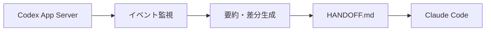

# CodexからClaudeへの引き継ぎ

- 作成日時 (UTC): 2026-07-13T06:05:36.0000000Z
- 更新日時 (UTC): 2026-07-13T06:06:27.0000000Z
- 注記: 本文は公開用に秘密形式・メールアドレス・電話番号のみ不可逆に伏せ字化。

## user / 2026-07-13T06:04:11.0000000Z

```
Codexの最新の会話履歴をリアルタイムでClaudeに引き継ぐ方法は無いですか
```

## assistant / 2026-07-13T06:05:37.0000000Z

```
null
```

## assistant / 2026-07-13T06:05:39.0000000Z

```
現行仕様を公式情報で確認します。Codex側の履歴保存範囲と、Claudeへ渡せる実用的な連携経路を分けて整理します。なお、OpenAI製品の質問なので openai-docs の手順を使います。
```

## assistant / 2026-07-13T06:06:02.0000000Z

```
null
```

## assistant / 2026-07-13T06:06:03.0000000Z

```
null
```

## assistant / 2026-07-13T06:06:03.0000000Z

```
null
```

## assistant / 2026-07-13T06:06:03.0000000Z

````
結論として、**Codexの会話履歴そのものをリアルタイムでClaudeへ自動同期する公式機能は、現時点ではありません**。

ただし、「会話全文」ではなく「最新の作業状態」を共有ファイル経由で引き継ぐ方法なら、かなり実用的に実現できます。

## 最も現実的な方法

同じGitリポジトリをCodexとClaude Codeの両方で開き、次の共有ファイルを置きます。

```text
project/
├─ AGENTS.md
├─ CLAUDE.md
└─ docs/
   ├─ PROJECT_CONTEXT.md
   ├─ DECISIONS.md
   ├─ CURRENT_TASK.md
   └─ HANDOFF.md
```

役割は次のとおりです。

| ファイル | 内容 |
|---|---|
| `PROJECT_CONTEXT.md` | 事業・製品・技術構成など長期情報 |
| `DECISIONS.md` | 採用した仕様と却下した案、その理由 |
| `CURRENT_TASK.md` | 現在の目的、進捗、残作業 |
| `HANDOFF.md` | 直近の作業・変更ファイル・次の指示 |
| `AGENTS.md` | Codex向けの恒久的指示 |
| `CLAUDE.md` | Claude Code向けの恒久的指示 |

Codexには毎回こう指示します。

```text
作業終了前に、docs/CURRENT_TASK.md と docs/HANDOFF.md を最新状態へ更新してください。
重要な意思決定は docs/DECISIONS.md に追記してください。
```

Claude Codeにはこう指示します。

```text
作業開始時に AGENTS.md、CLAUDE.md、docs/PROJECT_CONTEXT.md、
docs/DECISIONS.md、docs/CURRENT_TASK.md、docs/HANDOFF.md を読み、
Codexの続きから作業してください。
```

これならClaudeが次回起動したとき、ほぼそのまま続行できます。Claude Codeにはプロジェクト情報を保持するメモリ機能もありますが、マシンやクラウド環境をまたいで自動共有されるわけではありません。[Claude Codeのメモリ仕様](https://docs.anthropic.com/en/docs/claude-code/memory)

## リアルタイムに近づける方法

さらに自動化するなら、Codex App Serverのイベントを監視する中継プログラムを作ります。



Codex App Serverにはスレッドの開始・再開・分岐を扱うAPIがあります。[Codex App Server](https://developers.openai.com/codex/app-server)

ただし、ここで注意すべきなのは、**Claudeへ会話全文を流し続ける設計は悪手**だということです。

- トークンを大量消費する
- 古い方針や途中の誤解まで引き継ぐ
- Claudeが重要情報を見失う
- Codex内部の履歴形式に依存する
- 認証情報や機密情報を誤って転送する危険がある

同期すべきなのは会話ではなく、以下の構造化された状態です。

```yaml
goal:
completed:
current_status:
decisions:
changed_files:
known_issues:
next_actions:
verification:
```

## 私の推奨構成

のりあきさんのEnterpriseOSやBrandForgeのような長期プロジェクトなら、

1. Gitリポジトリを唯一の共有状態にする
2. CodexとClaude Codeの両方に同じリポジトリを開かせる
3. `docs/HANDOFF.md`を作業終了時に自動更新
4. 重要な決定だけ`DECISIONS.md`へ蓄積
5. 必要ならGit hookやCodex App Serverで更新を半自動化

この構成が最も壊れにくいです。

Codex自身は`codex resume`で保存済み会話を再開できますが、これはCodex内のセッション再開であって、Claudeへの共有機能ではありません。[Codex CLIのセッション再開](https://developers.openai.com/codex/cli/features)

要するに、**Codexの頭の中をClaudeへ転送するのではなく、両者が読む「外部記憶」をリポジトリ内に作る**のが正解です。
````
