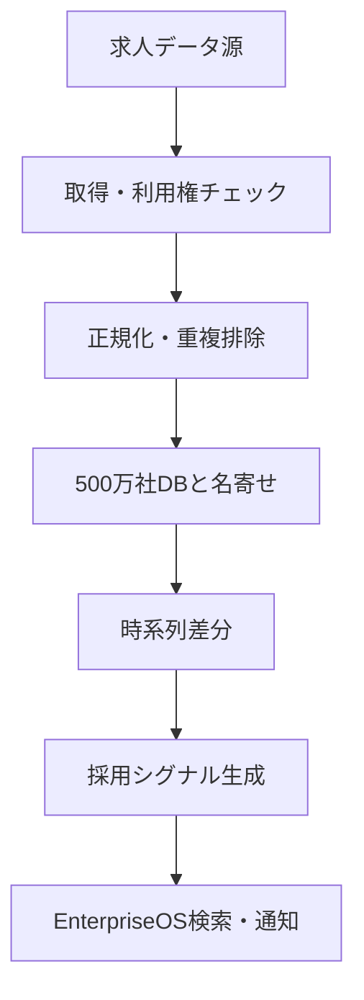

# Indeed スクレイピングの問題

- 作成日時 (UTC): 2026-07-22T01:35:59.0000000Z
- 更新日時 (UTC): 2026-07-22T01:41:52.0000000Z
- 注記: 本文は公開用に秘密形式・メールアドレス・電話番号のみ不可逆に伏せ字化。

## user / 2026-07-22T01:35:56.0000000Z

```
indeedのスクレイピングに必要なものをdeepresearchしてください。
```

## assistant / 2026-07-22T01:36:00.0000000Z

```
null
```

## assistant / 2026-07-22T01:36:10.0000000Z

```
Indeed日本版を対象に、①利用規約・robots.txt、②日本法上の論点、③技術的な取得方法とブロック対策、④公式API・代替データ源、⑤EnterpriseOSで運用する場合の構成と費用まで調べます。まず「可能か」ではなく、「継続運用して事業利用できるか」を基準に評価します。
```

## assistant / 2026-07-22T01:36:44.0000000Z

```
null
```

## assistant / 2026-07-22T01:36:44.0000000Z

```
初期調査の時点で重要な結論が出ています。Indeedの現行規約（2026年7月17日更新）は、書面許可なしのbot・scraper・AIによる一括取得、複製・販売・再利用を明示的に禁止しています。さらに求人検索・求人詳細はrobots.txtでも広く制限されています。したがって、プロキシやCAPTCHA回避を前提にした直スクレイピングは、技術課題より先に契約・事業継続性で失格です。公式MCPが7月に公開されているため、その利用条件と事業利用可否も詰めています。
```

## assistant / 2026-07-22T01:40:39.0000000Z

```
null
```

## assistant / 2026-07-22T01:40:39.0000000Z

```
null
```

## assistant / 2026-07-22T01:40:39.0000000Z

````
## 結論

EnterpriseOSの「企業別・採用シグナル」を作る目的なら、Indeedを直接スクレイピングする設計は採用すべきではありません。

理由は技術難易度ではなく、次の3点です。

- Indeedの現行規約は、書面許可のないbot・scraper・AIによる自動取得、データベース化、複製、販売、商用利用を明示的に禁止している。
- robots.txtも求人検索・求人詳細・GraphQLなど主要経路を広く制限している。
- 仮に取得できても、重複求人、再掲載、掲載日の更新、検索順位・取得件数制限があり、「企業の採用熱」を測る原データとして品質が低い。

最適解は、短期的には求人データをライセンス購入し、中長期的には企業公式採用ページを取得する自社パイプラインを構築するハイブリッド方式です。

以下、EnterpriseOSで使う前提で整理します。

---

## 1. Indeedを直接スクレイピングできるか

### 規約上は実質的に不可

2026年7月17日更新のIndeed利用規約では、以下が明示的に禁止されています。

- 許可なく自動手段でデータへアクセスする
- bot、scraper、spider、AI、Agentic AIで一括取得する
- クロール、スクレイピング、抽出、複製、販売、再販売する
- Indeedのデータを自社の商業的利益に利用する
- セキュリティ対策・利用制限を回避する

日本からの利用には日本法が適用され、紛争管轄は東京と規定されています。[Indeed Terms of Service](https://www.indeed.com/legal)

robots.txtでも、`/viewjob`、`/job`、`/jobs`、`/graphql`、日本語求人ページなどが制限されています。[Indeed robots.txt](https://www.indeed.com/robots.txt)

robots.txt自体はアクセス制御装置ではありませんが、Indeed規約はクロール許可をrobots.txtの範囲に限定しています。したがって、Indeedの場合は単なるマナーではなく契約上の判断材料になります。

### 日本法上の論点

スクレイピングが常に違法という意味ではありません。求人の会社名、職種、勤務地、給与額などの「事実」そのものは、一般に著作権で保護されにくい面があります。

一方で、次の問題は残ります。

- 創作性のある求人本文の複製
- 求人データベース全体の体系的取得
- 利用規約違反
- アクセス制限回避
- 不正競争、防止措置回避、民法上の不法行為
- 担当者名・メールアドレスなどの個人情報
- 取得データの販売、API提供、RAG・AI学習利用

著作権法30条の4は、一定の非享受目的の情報解析を許容しますが、著作権者の利益を不当に害する場合は対象外です。また、アクセス許可や契約違反まで正当化する規定ではありません。[文化庁「AIと著作権」](https://www.bunka.go.jp/seisaku/chosakuken/aiandcopyright.html)

公開済みの担当者名なども個人情報保護法の対象です。[個人情報保護委員会](https://www.ppc.go.jp/all_faq_index/faq1-q1-5)

したがって、「求人本文は保存せず件数だけ集計するから問題ない」とは言い切れません。取得行為自体がIndeed規約に抵触します。

---

## 2. Indeed公式の利用手段

| 手段 | 取得できるもの | EnterpriseOSでの適性 |
|---|---|---|
| Job Sync API | 自社・契約企業の求人投稿、更新、終了 | 他社求人の収集には使えない |
| Job Update API | ATSから投稿した自社管理求人 | 他社求人の検索には使えない |
| Publisher JS Plugin | 自社サイト上にIndeed求人を最大20件表示 | 保存・分析・データベース化不可 |
| Indeed MCP | 求人検索、詳細、企業情報 | Claude Connector限定のβ版。大量取得・バックエンド利用不可 |
| Hiring Lab API | 国・地域・業種別の求人指数、賃金、リモート比率 | マクロ分析には有効。企業別求人は取れない |
| 書面による個別許可 | 許諾された範囲 | 唯一の正式な大量取得ルートだが、承認可能性は低い |

Indeed MCPは求人検索・詳細・企業情報を扱えますが、現状はClaude Connector限定です。EnterpriseOSの定期収集バックエンドとして利用できるものではありません。[Indeed MCP](https://docs.indeed.com/mcp/)

Publisher PluginはIndeedパートナー限定で、表示用のフロントエンド部品です。コンテンツのコピー、再配布、販売、スクレイピングデータとの混合も禁止されています。[Publisher Plugin](https://docs.indeed.com/indeed-plus/publisher-js-plugin)／[Plugin Terms](https://docs.indeed.com/legal-terms/plugin-terms)

Hiring Lab APIはAPIキーをメールで申請でき、求人指数、リモート比率、賃金上昇率、AI求人比率を取得できます。ただし企業別求人ではありません。[Hiring Lab API](https://docs.indeed.com/hiring-lab-api)

---

## 3. 最も現実的な代替手段

### 第一候補：HRogからライセンス購入

株式会社フロッグのHRogリストは、Indeedを含む250以上の求人関連サイトを対象にしています。

公開情報では以下の仕様です。

- 毎週取得
- 過去10億件以上
- Indeed、Wantedly、Airワーク、エンゲージ、Green、ビズリーチ、ハローワーク等を収録
- 企業名、法人名、勤務地、電話番号、職種、仕事内容、給与、掲載媒体、掲載終了日、求人URL
- 新規掲載、掲載終了、前年出稿、採用職種などで抽出可能
- 初期費用10万円、月額4万円から
- 6か月以上で初期費用無料

[HRogリスト公式](https://list.hrog.net/)

これは自前でIndeed対策を開発するより圧倒的に安いです。ただし、通常契約でEnterpriseOSの顧客に再提供できるとは限りません。

契約時には次を明示的に交渉する必要があります。

- EnterpriseOSの企業DBとの名寄せを許可するか
- 「採用シグナル」への加工・派生データ作成を許可するか
- 顧客画面で件数や職種を表示できるか
- CSV・API・MCP経由で顧客へ提供できるか
- 求人本文ではなく集計値だけなら再提供可能か
- 過去データを保持できるか
- 契約終了後も派生シグナルを保持できるか
- AI分類・RAG・モデル学習に使えるか
- 元媒体とのデータ利用許諾を保証できるか
- 権利侵害時の補償・免責範囲

必要なのは通常の「HRogリスト利用契約」ではなく、データOEM・二次利用・派生データ提供契約です。

### 第二候補：企業公式採用ページ

長期的な自社資産としてはこちらが本命です。

企業の採用ページでは、Googleしごと検索向けに`JobPosting`形式のJSON-LDを実装している場合があります。これはHTML解析より安定して、職種、勤務地、雇用形態、給与、掲載日、終了日などを取得できます。[Google JobPosting仕様](https://developers.google.com/search/docs/appearance/structured-data/job-posting)

ただし、機械可読だから自由に再販売できるという意味ではありません。各サイトの規約・robots.txtを確認し、求人本文の転載を避け、事実情報と派生シグナルを中心に扱うべきです。

### ハローワークAPIは営業シグナルに使えない

ハローワークにはCSV/APIによる正式な求人情報提供サービスがあります。[ハローワーク求人情報提供サービス](https://www.hellowork.mhlw.go.jp/provide/online02.html)

しかし、利用対象は職業紹介事業者等です。利用規約では、

- 職業紹介と関係がない目的で利用しない
- 対象団体以外の第三者へ提供しない
- 不特定多数へ公開しない

と定めています。[ハローワーク利用規約](https://www.hellowork.mhlw.go.jp/info/terms_regist01.html)

したがって、EnterpriseOSの営業シグナルや企業データ商品への転用には向きません。

---

## 4. 推奨するEnterpriseOSの構成



データ源は次の順にします。

1. ライセンス済み求人データ
2. 企業公式採用ページ
3. ATSの公開求人ページ
4. Indeed Hiring Labのマクロ指数
5. Indeed自体はリンク確認・人間による検証用途のみ

### 現在のインフラへの追加

既存のCoolify、Redis、PostgreSQLをそのまま活用できます。

- Redis/BullMQ：クロール・解析ジョブキュー
- Node.js/TypeScript：HTTP取得ワーカー
- Cheerio：通常HTML解析
- Playwright：JavaScript必須サイトだけに限定
- PostgreSQL：正規化求人、履歴、シグナル
- S3互換ストレージ：許可された場合のみ原文・HTMLを短期保管
- Astro：EnterpriseOSの検索・企業詳細画面
- 監視：取得成功率、解析成功率、重複率、403/429、鮮度

住宅プロキシ、CAPTCHA代行、Cookie共有、偽装アカウントは組み込みません。これらは取得成功率を上げても、事業の法的・継続的リスクを悪化させます。

---

## 5. 必要なデータテーブル

最低限、次のテーブルが必要です。

### `job_sources`

- `company_id`
- `source_type`
- `source_url`
- `robots_status`
- `terms_status`
- `permission_basis`
- `crawl_interval`
- `last_success_at`
- `parser_type`

### `job_postings`

- `external_job_id`
- `company_id`
- `source_id`
- `title`
- `employment_type`
- `location`
- `remote_type`
- `salary_min`
- `salary_max`
- `salary_unit`
- `posted_at`
- `expires_at`
- `first_seen_at`
- `last_seen_at`
- `status`
- `canonical_url`
- `content_hash`

### `job_versions`

求人内容変更を追跡します。

- `job_id`
- `observed_at`
- `field_diff`
- `content_hash`

### `hiring_signals`

- `active_job_count`
- `new_jobs_7d`
- `new_jobs_30d`
- `closed_jobs_30d`
- `hiring_velocity`
- `new_role_detected`
- `new_location_detected`
- `management_hiring`
- `engineering_hiring`
- `sales_hiring`
- `salary_increase`
- `reopened_job_count`
- `signal_score`
- `confidence`
- `generated_at`

---

## 6. Indeedデータを使う際の品質上の盲点

Indeedの求人数をそのまま採用意欲と解釈すると誤ります。

- 同じ求人がIndeed、Airワーク、企業採用サイトなどから重複する
- 複数拠点求人が別求人として掲載される
- 再掲載で投稿日が新しく見える
- 掲載終了と採用完了は同じではない
- 人材紹介会社の求人では実際の雇用企業が分からない
- 検索結果の総件数は推定値の場合がある
- 検索順位、地域、Cookie、スポンサー枠で結果が変わる
- Indeedにない求人も大量に存在する

必要なのは「掲載件数」ではなく、時系列差分と重複排除です。

例えば、価値の高いシグナルは次です。

- 30日以内の純増求人が5件以上
- それまで存在しなかった職種の募集開始
- 新しい都道府県・拠点での採用
- 部長・責任者クラスの募集
- 営業職とCS職を同時に増員
- エンジニア採用の急増
- 同一職種を90日以上継続募集
- 給与レンジの上昇
- 一度終了した求人の再募集

---

## 7. 推奨ロードマップ

### 直近2週間

1. HRogにサンプルデータとOEM条件を問い合わせる
2. 1,000社を対象に企業公式採用ページのPoCを実施
3. 法人名・住所・ドメインによる名寄せ精度を測定
4. 求人重複排除と時系列履歴を実装
5. EnterpriseOSの企業詳細画面に採用シグナルを追加

### 1〜3か月

- 企業公式ページを1万〜5万社へ拡大
- HRogデータと公式採用ページを照合
- 媒体掲載ではなく企業単位の採用スコアを生成
- 新規求人、管理職採用、拠点進出をRedis経由で通知
- 顧客の成約実績からシグナルの重みを学習

### 合格基準

- 法人名寄せ精度：99%以上
- 求人重複率：5%未満
- 公式採用ページ解析成功率：90%以上
- 主要企業のデータ鮮度：48時間以内
- 出典URL保有率：100%
- 利用権が不明な求人本文の顧客表示：0件

---

## 最終判断

Indeedスクレイパーを開発すること自体は技術的には可能です。しかし、それをEnterpriseOSの中核データ源にするのは悪い経営判断です。ブロック対応に時間を使い続け、データ品質も法的安定性も得られません。

推奨順位は次のとおりです。

1. HRogのライセンスデータでMVPを最短構築
2. 同時に企業公式採用ページの自社収集基盤を作る
3. Indeed Hiring Lab APIをマクロ指標として加える
4. Indeedの直接スクレイピングは行わない
5. Indeedデータが絶対に必要なら、書面による個別許諾を取得する

月額4万円程度のライセンス候補がある状況で、Indeedのブロック回避基盤を自作する合理性はありません。EnterpriseOSの差別化は「求人を取ること」ではなく、500万社DBと名寄せし、採用変化を営業機会へ変換する部分に置くべきです。
````
