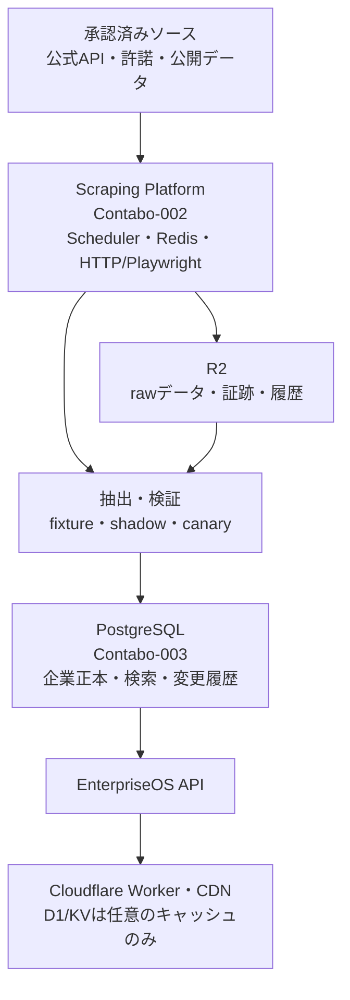

# アドバイスの提供

- 作成日時 (UTC): 2026-07-23T10:35:58.0000000Z
- 更新日時 (UTC): 2026-09-01T15:35:43.0000000Z
- 注記: 本文は公開用に秘密形式・メールアドレス・電話番号のみ不可逆に伏せ字化。

## user / 2026-07-23T10:35:47.0000000Z

```
https://docs.google.com/document/d/1qxWH7zkkoLDcdeow_wyQJDSiRkAYXGRI67GqlgPmQTw/edit?usp=drivesdk
アドバイスを下さい
```

## assistant / 2026-07-23T10:36:02.0000000Z

```
null
```

## assistant / 2026-07-23T10:36:09.0000000Z

```
Googleドキュメントの内容を確認し、事業性・論理・実行可能性・伝わりやすさの4点から率直にレビューします。Google Drive／Docsのスキルを使い、原文を崩さず読み取ってから改善案を出します。
```

## assistant / 2026-07-23T10:36:57.0000000Z

```
null
```

## assistant / 2026-07-23T10:37:16.0000000Z

```
null
```

## assistant / 2026-07-23T10:37:16.0000000Z

```
文書は確認できました。先に結論を言うと、発想は筋が良い一方で、現状の数値と「ほぼ完全自動・突破率100%」という前提は楽観的すぎます。特にD1の役割、700万JSONの保存単位、自己修復の自動反映、WAF回避、月2,000円運用の5点を重点的に検証します。

また、これはEnterpriseOSのこれまでの設計判断と連続する内容なので、過去の前提も照合して評価します。
```

## assistant / 2026-07-23T10:37:25.0000000Z

```
null
```

## assistant / 2026-07-23T10:37:53.0000000Z

```
null
```

## assistant / 2026-07-23T10:41:13.0000000Z

```
null
```

## assistant / 2026-07-23T10:41:13.0000000Z

```
現時点で最大の矛盾が判明しました。既存のEnterpriseOSにはすでに約577万社の中央PostgreSQLがあり、別途Redis・PgBouncer・Crawler/Browser Workerまで設計済みです。今回の「D1＋R2を主DBにする案」は、改善ではなく、確立済みの基盤を別方式で作り直す二重投資になります。

Cloudflareはフロント・キャッシュ・配信・一部キューには向きますが、企業DBの正本とスクレイピング制御面まで移すべきではありません。コスト試算と安全な修正版を詰めています。
```

## assistant / 2026-07-23T10:45:47.0000000Z

```
null
```

## assistant / 2026-07-23T10:45:47.0000000Z

````
結論から言うと、[この文書](https://docs.google.com/document/d/1qxWH7zkkoLDcdeow_wyQJDSiRkAYXGRI67GqlgPmQTw/edit)の構成をそのまま採用すべきではありません。

700万件の保存は難しくありません。本当の難所は、1,800サイトの規約・取得制限・抽出ルール・品質・個人情報を、一人で継続管理することです。現状は技術仕様というより、「低コストで全自動化できる」というGemini案を別のLLMに肯定させやすい誘導文になっています。

## 致命的な問題

| 現在の記述 | 評価 | 修正方針 |
|---|---|---|
| D1に約15GBのメタデータ | 不成立 | D1は1DB最大10GBで、各DBは実質的に逐次処理です。既存PostgreSQLを正本にする。[D1制限](https://developers.cloudflare.com/d1/platform/limits/) |
| R2に700万社のJSONを正本として保存 | 非効率 | R2はraw HTML・取得証跡・履歴・バックアップ用。検索・現在値・重複排除はPostgreSQL。 |
| KVにCookie・セッション・トークン | 不適切 | KVは反映に60秒以上かかる場合があります。既存Redisを使う。[KVの整合性](https://developers.cloudflare.com/kv/concepts/how-kv-works/) |
| Queuesでサイト別レート制御 | 不十分 | Queuesは全体並列度を制御できますが、ドメイン別RPS制御ではありません。Redisのtoken bucketが必要。 |
| Queueは一度だけ処理される前提 | 誤り | Queuesはat-least-once配信なので重複します。冪等性キー・UPSERT・DLQが必須。[配信保証](https://developers.cloudflare.com/queues/reference/delivery-guarantees/) |
| 3回失敗後にLLMが抽出ルールを上書き | 危険 | 一時障害を構造変更と誤認し、数百万件を壊す可能性があります。 |
| Browser RunでWAF突破率100% | 明確に誤り | Cloudflare自身が「常にBotとして識別される」「IPローテーション不可」と明記しています。[Browser Run FAQ](https://developers.cloudflare.com/browser-run/faq/) |
| 月額2,000円以下 | 総原価として不成立 | Cloudflareの一部増分だけなら近づけますが、VPS・Proxy・監視・バックアップ・人手を含めると無理です。 |

最大の矛盾は、EnterpriseOSにはすでに約577万社の中央PostgreSQL、専用Redis、PgBouncer、ContaboのCrawler・Browser Workerが存在することです。D1＋R2へ作り直す理由がありません。

## 推奨構成



役割は次のように固定してください。

- PostgreSQL：企業正本、法人番号、検索項目、出典、変更履歴、重複統合
- Redis：ジョブ、サイト別レート制御、短期Cookie、ロック、サーキットブレーカー
- R2：圧縮raw HTML/JSON、スクリーンショット、再処理用証跡、バックアップ
- Cloudflare：フロント、CDN、WAF、公開API、必要な場合のみHyperdrive
- D1/KV：正本にせず、公開用サブセットやキャッシュに限定

## 月2,000円試算は修正が必要

文書どおり、140GB・700万R2オブジェクト・15GB D1・700万Queueメッセージで計算すると、Cloudflareだけでも概算は以下です。

| 項目 | 概算 |
|---|---:|
| Workers Paid | $5/月 |
| R2 140GB保存 | $1.95/月 |
| D1 15GB保存 | $7.50/月 |
| 700万Queue処理 | 約$8/回 |
| R2へ700万PUT | 約$27/回 |

保存だけで最低約$14.45/月、初回取得または全件書き換え時は約$49.45です。ここにCPU、再試行、Browser Run、Proxy、LLM、Contabo、監視が加わります。[Workers料金](https://developers.cloudflare.com/workers/platform/pricing/)、[R2料金](https://developers.cloudflare.com/r2/pricing/)、[Queues料金](https://developers.cloudflare.com/queues/platform/pricing/)、[D1料金](https://developers.cloudflare.com/d1/platform/pricing/)

さらに、140GBが「完成後のJSON容量」なら、Proxy課金対象の通信量とは別です。仮に実通信140GBの30%を住宅Proxyに流すだけでも約$42です。[DataImpulse料金](https://dataimpulse.com/residential-proxies/)

したがって、以前決めた「月額5万円以下」は現実的ですが、「総原価2,000円以下」は事業計画に使ってはいけません。

## 自己修復は「自動上書き」させない

正しい状態遷移はこれです。

`HEALTHY → SUSPECT → DIAGNOSE → DRAFT_RULE → FIXTURE_REPLAY → CANARY → ACTIVE / ROLLBACK`

最低限、以下を実装します。

- 429・5xx・認証切れ・WAF・HTML変更・正常な0件を別の障害として分類
- 過去HTMLの正解fixtureで新旧ルールを比較
- 必須項目null率、件数急落、型、文字数分布、大量変更率を検証
- LLMは候補ルールを作るだけ
- 1% canaryから段階展開
- 法人番号抽出、大量削除、Entity統合変更は人間承認
- すべてのルールをバージョン化し即時rollback可能にする

「自己修復」より「Human-Governed Assisted Repair」と呼ぶ方が実態に合っています。

## WAF回避路線は全面削除すべき

以下の表現は削除してください。

- ヘッダー／Cookie偽装
- トークン奪取
- アクセス制限回避
- WAF突破
- 突破率100%

401・403・CAPTCHAは「次の回避手段へ進む条件」ではなく、停止してAPI・利用規約・許諾を確認する条件です。429は`Retry-After`に従います。

公開済み情報でも個人情報保護法の対象です。[個人情報保護委員会](https://www.ppc.go.jp/all_faq_index/faq1-q1-5/) また、著作権法上の情報解析例外は、求人本文・記事・口コミ・写真などを再販売できる包括的許可ではありません。[文化庁の解説](https://www.bunka.go.jp/seisaku/chosakuken/hokaisei/h30_hokaisei/)

認証トークンの取得やアクセス制御の迂回は、公開ページの通常クロールとは別の法的リスクになります。[警察庁の不正アクセス対策](https://www.npa.go.jp/bureau/cyber/countermeasures/unauthorized-access.html)

EnterpriseOSで以前決めた「証拠優先・ダークスクレイピング禁止・外部送信は人間承認」という方針とも衝突しています。コンタクトフォーム営業もMVPでは「候補抽出＋文面作成＋送信承認」までに留めるべきです。

## 実装順序

優先順位は次です。

1. 既存577万社DBの重複率・欠損率・容量・バックアップ復元を確認
2. 国税庁・Gビズインフォ等の公式データを企業マスターの基礎にする
3. 顧客価値が高い10〜20ソースだけで営業シグナルを実証
4. 出典URL・取得日時・raw hash・parser version・confidenceを全フィールドに紐付ける
5. 10万件でProxy率・Browser率・失敗率・1件当たり原価を実測
6. 売上が確認できてから50、100、300ソースへ増やす

率直に言えば、今はインフラ費を数千円削ることより、1,800サイトを抱える運用負債を避ける方が重要です。EnterpriseOSの競争力は「700万行あること」ではなく、「出典付きで信頼でき、行動につながる営業シグナル」です。今回の文書は、その目的に合わせて全面的に書き直すべきです。
````

## user / 2026-07-23T11:06:24.0000000Z

```
{"asset_pointer":"sediment://file_00000000df788209be91f05b81bd5ec1","content_type":"image_asset_pointer","fovea":null,"height":1334,"metadata":{"asset_pointer_link":null,"container_pixel_height":null,"container_pixel_width":null,"dalle":null,"emu_omit_glimpse_image":null,"emu_patches_override":null,"generation":null,"gizmo":null,"is_no_auth_placeholder":null,"lpe_delta_encoding_channel":null,"lpe_keep_patch_ijhw":null,"sanitized":true,"segmentation":null,"watermarked_asset_pointer":null},"size_bytes":260007,"width":750}
{"asset_pointer":"sediment://file_00000000c3708209893ead5c8b67a6e6","content_type":"image_asset_pointer","fovea":null,"height":1334,"metadata":{"asset_pointer_link":null,"container_pixel_height":null,"container_pixel_width":null,"dalle":null,"emu_omit_glimpse_image":null,"emu_patches_override":null,"generation":null,"gizmo":null,"is_no_auth_placeholder":null,"lpe_delta_encoding_channel":null,"lpe_keep_patch_ijhw":null,"sanitized":true,"segmentation":null,"watermarked_asset_pointer":null},"size_bytes":245417,"width":750}
{"asset_pointer":"sediment://file_000000008a708209bf212f1fe2629095","content_type":"image_asset_pointer","fovea":null,"height":1334,"metadata":{"asset_pointer_link":null,"container_pixel_height":null,"container_pixel_width":null,"dalle":null,"emu_omit_glimpse_image":null,"emu_patches_override":null,"generation":null,"gizmo":null,"is_no_auth_placeholder":null,"lpe_delta_encoding_channel":null,"lpe_keep_patch_ijhw":null,"sanitized":true,"segmentation":null,"watermarked_asset_pointer":null},"size_bytes":224528,"width":750}
{"asset_pointer":"sediment://file_0000000006848209aa6c3cb61531a4c9","content_type":"image_asset_pointer","fovea":null,"height":1334,"metadata":{"asset_pointer_link":null,"container_pixel_height":null,"container_pixel_width":null,"dalle":null,"emu_omit_glimpse_image":null,"emu_patches_override":null,"generation":null,"gizmo":null,"is_no_auth_placeholder":null,"lpe_delta_encoding_channel":null,"lpe_keep_patch_ijhw":null,"sanitized":true,"segmentation":null,"watermarked_asset_pointer":null},"size_bytes":278853,"width":750}
{"asset_pointer":"sediment://file_000000007f008209afa4f6a9287c97a4","content_type":"image_asset_pointer","fovea":null,"height":1334,"metadata":{"asset_pointer_link":null,"container_pixel_height":null,"container_pixel_width":null,"dalle":null,"emu_omit_glimpse_image":null,"emu_patches_override":null,"generation":null,"gizmo":null,"is_no_auth_placeholder":null,"lpe_delta_encoding_channel":null,"lpe_keep_patch_ijhw":null,"sanitized":true,"segmentation":null,"watermarked_asset_pointer":null},"size_bytes":236035,"width":750}
{"asset_pointer":"sediment://file_00000000eed88206bff51b228586ca64","content_type":"image_asset_pointer","fovea":null,"height":1334,"metadata":{"asset_pointer_link":null,"container_pixel_height":null,"container_pixel_width":null,"dalle":null,"emu_omit_glimpse_image":null,"emu_patches_override":null,"generation":null,"gizmo":null,"is_no_auth_placeholder":null,"lpe_delta_encoding_channel":null,"lpe_keep_patch_ijhw":null,"sanitized":true,"segmentation":null,"watermarked_asset_pointer":null},"size_bytes":163249,"width":750}
Codexで求人サイトクローラーを作成してたらぐちゃぐちゃになってしまい一からプロジェクトをやり直した方が良いと思いました。
実際クールファイのDockerは安定せず商用には使えません、だからVPSは
一カ月で解約しようかと思います。また開発したクローラーがアクセス制限食らいまくりDB接続エラーや同時起動出来るnot 数が1VPSでHTTP6browser4で10bot位でした、クラウドフレアworkerの同時1000botと比較したらコスパと安定性、拡張性でクラウドフレアにしようかと思いました。
だから開発が一時頓挫しています。
法人500万件DBはまだあるからChatGPTも法人DBがローカルにあるだけと言うゼロベースで Geminiの提案を見直して欲しいです。

また写真はXに法人、求人DBを集めて同じような事をして月1.5万で提供してる人間がいます。結構集まっているみたいです。500bot運用してるみたい、どんな仕組みか推測出来ますか？またこの人の存在は私のビジネスにとって明るい光？それとも闇？

```

## assistant / 2026-07-23T11:06:30.0000000Z

```
null
```

## assistant / 2026-07-23T11:06:52.0000000Z

```
前提を完全に更新します。今後は「稼働中のVPS基盤がある」ではなく、次だけを事実として扱います。

- 手元に約500万件の法人DBがある
- Coolify／VPS版クローラーは商用運用に耐えず、解約候補
- 実測上限はHTTP 6＋Browser 4程度、アクセス制限・DB接続障害も多発
- Cloudflare中心で、求人クローラーをゼロから再設計する

添付のX投稿も確認し、競合の500 bot構成を「断定」ではなく、技術的にあり得る方式と確度に分けて推定します。過去のEnterpriseOS前提は、今回の明示的な訂正で上書きします。
```

## assistant / 2026-07-23T11:08:42.0000000Z

```
null
```

## assistant / 2026-07-23T11:08:42.0000000Z

```
前回の前提は捨てます。今回は「ローカルに法人約500万件DBだけが残っている」状態から、①Gemini案のCloudflare再評価、②競合の500 botの実像、③やり直す範囲と撤退条件、の3点で切り分けます。Google Docsの内容も現在の文面を基準に確認します。
```

## assistant / 2026-07-23T11:09:27.0000000Z

```
Google Driveのレビュー手順を使い、リンク先の現行提案を読み直します。ここでは旧VPSやPostgreSQLを前提にせず、文書内のCloudflare構成そのものを採点します。
```

## assistant / 2026-07-23T11:09:45.0000000Z

```
null
```

## assistant / 2026-07-23T11:09:54.0000000Z

```
null
```

## assistant / 2026-07-23T11:09:54.0000000Z

```
文書は確認できました。結論の芯が見えています。「Cloudflareへ移す」は妥当ですが、「1000 bot＝1000ブラウザ」「Cloudflareならブロックを解決」「D1 1個で検索DB」という3点は別問題です。ここから公式上限と費用を突き合わせます。
```

## assistant / 2026-07-23T11:14:32.0000000Z

```
null
```

## assistant / 2026-07-23T11:14:32.0000000Z

```
競合の投稿はWeb上でも確認できました。ただし確認できるのは運営者の自己申告までで、顧客数・MRR・重複率・鮮度・SLAを裏付ける公開資料は見当たりません。したがって「500 bot」は事実として丸のみせず、仕組みと販売力を分けて評価します。
```

## assistant / 2026-07-23T11:19:03.0000000Z

```
null
```

## assistant / 2026-07-23T11:19:03.0000000Z

```

```

## assistant / 2026-07-23T11:20:03.0000000Z

```
結論から言うと、取得基盤は新規プロジェクトとして作り直す判断で正しいです。ただし「全部廃棄」ではなく、法人DBと失敗から得た知識は残します。

また、Cloudflare-firstへの転換も合理的です。ただし「Cloudflareなら1000 botでアクセス制限も解決する」は誤りです。Cloudflareが解決するのはサーバー管理・DB接続集中・水平拡張であって、相手サイトの拒否ではありません。

## 今回の判断

- 旧クローラー：凍結して参照専用
- ローカル法人DB約500万件：最重要資産として移行
- VPS/Coolify：バックアップ復元確認後に解約でよい
- 新基盤：Cloudflare中心で2週間PoC
- 競合：総合的には「光7：闇3」
- ただし同じ「件数×安さ」で戦うなら「闇8：光2」

DockerやCoolify自体が商用不可能というより、1台のVPSにDB・HTTPクローラー・ブラウザを同居させた構成が、今回の用途に合わなかった可能性が高いです。それでも一人運営でインフラ管理を避けたいなら、撤退判断は妥当です。

## Gemini案の再評価

| Gemini案 | 再評価 |
|---|---|
| Workers＋Queues | 採用。軽量HTTP取得には非常に適する |
| D1に法人・求人インデックス全量 | 修正。D1は制御・現在値・小型索引だけ |
| 700万件を1件1JSONでR2保存 | 修正。Parquet/Icebergへまとめる |
| KVにセッション・状態 | 原則不採用。即時整合性が必要な状態はD1/DO |
| Browser Runをブロック回避に使用 | 不採用。JSレンダリング専用 |
| 403後に住宅IPへ自動切替 | 不採用。403/CAPTCHAは隔離・利用条件確認 |
| LLMが抽出ルールを直接上書き | 不採用。下書き→fixtureテスト→canary→承認 |
| 維持費月2,000円 | 条件付きで可能だが、事業計画上の保証値にはできない |
| 1000 bot同時起動 | 「1000 HTTP処理枠」なら可能。「1000ブラウザ」ではない |

D1は1DB最大10GBで、各DBがクエリを一度に1つずつ処理します。大量書き込みの中心には向きません。[D1の公式制限](https://developers.cloudflare.com/d1/platform/limits/)

また、Browser Runは標準で最大120ブラウザ、起動は毎秒1ブラウザです。しかもCloudflare自身が「常にbotとして識別され、IPローテーション不可」と説明しています。[Browser Run制限](https://developers.cloudflare.com/browser-run/limits/)、[Browser Run FAQ](https://developers.cloudflare.com/browser-run/faq/)

## ゼロベースの推奨構成

1. ローカル法人DBをParquet化し、件数・チェックサム・スキーマ情報と一緒にR2へ保存。
2. Scheduled WorkerからQueuesへ、1URLではなく「ドメイン・範囲・カーソル単位」の仕事を投入。
3. ドメインごとのDurable ObjectでRPS、待機時間、停止状態を管理。
4. 通常ページはWorkers fetch、許可されたJS必須ページだけBrowser Run。
5. raw HTML/JSONはR2、構造化結果はPipelines経由でIceberg/Parquetへ。
6. D1はジョブ状態、URL、抽出ルール、最新状態、冪等キーだけ。
7. 大量絞り込みはR2 SQLによる非同期リスト作成。法人番号の完全一致やUI表示はD1キャッシュ。
8. 自然言語はLLMがDB全件を読むのではなく、検証済みの検索DSL・SQLへ変換。
9. SaaSとMCPは同じ検索APIを呼ぶ。

Cloudflare PipelinesはParquet/Icebergへ直接書き込めます。[PipelinesのR2 Data Catalog連携](https://developers.cloudflare.com/pipelines/sinks/available-sinks/r2-data-catalog/)  
ただしR2 SQLはまだBetaで、重いクエリはタイムアウトし得ます。同期APIの唯一の依存先にはせず、Iceberg形式を使って将来別エンジンへ切り替えられるようにします。[R2 SQLの制限](https://developers.cloudflare.com/r2-sql/reference/limitations-best-practices/)

## 1000 botは必要ない

700万ページを1か月で取得する場合、必要な平均速度は次の程度です。

- 24時間運転：2.7ページ/秒
- 8時間/日：8.1ページ/秒
- 4時間/日：16.2ページ/秒

平均応答2秒でも、余裕を持たせて全体20〜100並列程度で足ります。

Workersは1リクエスト内で同時待機できる外部接続が6本、Queuesのpush consumerは標準250並列です。[Workers制限](https://developers.cloudflare.com/workers/platform/limits/)、[Queues制限](https://developers.cloudflare.com/queues/platform/limits/)

つまり「1000 logical HTTP lanes」は理論上作れますが、同じ求人サイトへ1000並列すると取得速度よりブロック率が上がります。管理すべき数字はbot数ではなく、ドメイン別RPS・成功率・費用/成功件数です。

7百万URLを1URL＝1 Queueメッセージ、1URL＝1 R2オブジェクトで処理すると、概算でQueue約$8、R2 PUT約$27、140GB保存約$1.95/月、Workers基本料$5などが発生します。バッチ化すれば大幅に下げられます。[Queues料金](https://developers.cloudflare.com/queues/platform/pricing/)、[R2料金](https://developers.cloudflare.com/r2/pricing/)

したがって月2,000円は「ほぼHTTP取得・差分更新・バッチ保存・外部プロキシほぼゼロ」なら狙えますが、通常原価として保証する数字ではありません。

## 競合の500 botはこう推測します

| 確度 | 推測 |
|---|---|
| 高い | 法人マスターの土台は国税庁法人番号などの公開データである可能性が高い |
| 高い | 自然言語をSQL/検索条件へ変換し、SaaSとMCPから同一APIを利用 |
| 中程度 | 500 botは500台のサーバーではなく、非同期ジョブ・worker slot・proxy session等の総称 |
| 中程度 | 大部分はHTTPクライアントで、ブラウザは一部だけ |
| 中程度 | 45媒体ごとのadapter、または共通ATS単位のadapterをAIで量産 |
| 不明 | PostgreSQL、ClickHouse等の具体的DB |
| 不明 | 求人700万件の重複率・終了求人率・有効求人件数 |
| 不明 | 有料顧客数、MRR、解約率、SLA、取得権限 |

法人番号・名称・住所の基本情報は国税庁がダウンロード/APIで提供し、法人番号は自由に利用できます。[国税庁法人番号公表サイト](https://www.houjin-bangou.nta.go.jp/)、[法人番号の利用](https://www.houjin-bangou.nta.go.jp/setsumei/index.html)

したがって「460万法人」そのものは強い参入障壁ではありません。競合の強みは、データ件数より、製品化速度・Xでの集客・低価格・検索から営業までの一体化です。

競合投稿の内容自体は確認できますが、すべて運営者の自己申告です。[価格投稿](https://x.com/zenoudg/status/2068609069611696417)、[500 bot投稿](https://x.com/zenoudg/status/2078823773013434638)、[DB件数投稿](https://x.com/zenoudg/status/2079905737409728677)、[MCP投稿](https://x.com/zenoudg/status/2070183687032132047)

スクリーンショットの20万表示・多数のブックマークは強い需要シグナルですが、売上や継続利用の証明ではありません。

## 光か闇か

光である理由：

- 法人DB＋自然言語検索に市場の反応がある
- 月1.5万円という購入可能な価格帯が見えた
- 一人でも販売開始まで到達できることが示された
- 顧客が欲しい項目や訴求文句を公開してくれている

闇である理由：

- 「法人件数」だけでは完全にコモディティ化する
- 月1.5万円が市場の価格基準になる可能性がある
- 競合は開発だけでなく、X集客と販売が速い
- 同じ45媒体・同じ項目を追い掛けると後追いになる

勝ち筋は「安い法人DB」ではなく、次のような商品です。

> 500万法人DB＋根拠付きの採用変化シグナル

各データに「出典URL・取得日時・信頼度」を付け、求人700万件ではなく「現在有効な求人」「30日間の採用増減」「初回・最終確認日」「法人番号への名寄せ精度」を売るべきです。件数ではなく、営業する理由とタイミングを提供します。

なお、担当者名などはネット公開済みでも個人情報保護法の対象になり得ます。[個人情報保護委員会FAQ](https://www.ppc.go.jp/all_faq_index/faq1-q1-5/)  
Gemini文書の「トークン奪取」「WAF回避」「突破率100%」は削除し、403/CAPTCHAは停止、429は`Retry-After`に従う設計へ変更すべきです。

## 直近の進め方

- 旧repoを削除せず、タグを付けて凍結
- DB、DDL、出典、HTML fixture、失敗ログ、既存selectorを回収
- 別環境でDB復元と件数チェック後、VPSを7〜14日読み取り専用にして解約
- 新repoで10〜20の許可済み代表ソース、10万〜25万URLのPoC
- 24時間3RPS、短時間15RPS、job消失ゼロ、抽出精度98.5%以上、ブラウザ依存5%以下を合格目安にする
- 競合を正規契約で1か月利用し、業種別1,000社を自社DBと比較する

最後の競合比較は、15,000円で得られる市場調査として非常に安いです。その結果を見てから、同じ市場へ入るか、採用変化シグナルに特化するかを決めるのが最も確実です。
```
