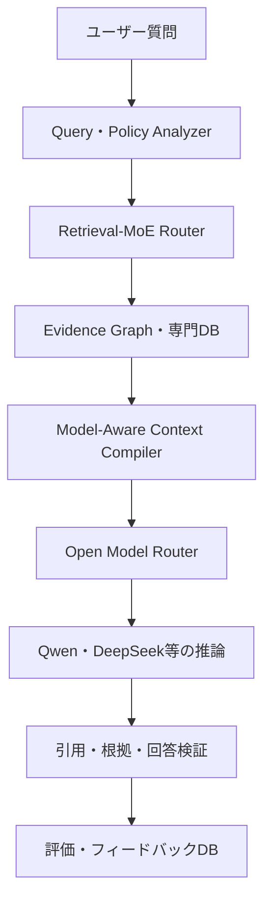

# ブランド名

- 作成日時 (UTC): 2026-08-02T17:09:28.0000000Z
- 更新日時 (UTC): 2026-08-03T12:30:42.0000000Z
- 注記: 本文は公開用に秘密形式・メールアドレス・電話番号のみ不可逆に伏せ字化。

## user / 2026-08-02T11:33:04.0000000Z

```
シード投資をしているVCのリストを作成してください
```

## assistant / 2026-08-02T11:33:08.0000000Z

```
null
```

## assistant / 2026-08-02T11:33:21.0000000Z

```
日本国内で、プレシード〜シード、調達希望3,000万円前後、EnterpriseOS／AIデータ基盤との相性を前提に、優先順位付きで整理します。単なる社名一覧ではなく、投資ステージ・領域・想定投資額・応募窓口・適合理由を比較できる表にします。最新情報は各VCの公式情報で確認します。あわせて、そのまま投資家管理に使えるスプレッドシートも作成します。
```

## assistant / 2026-08-02T11:33:26.0000000Z

```
比較表の作成にはスプレッドシート手順を使い、完成版は再利用できる形で保存します。この手順に従って、投資家候補の根拠URLと優先度も各行に残します。
```

## assistant / 2026-08-02T11:34:30.0000000Z

```
null
```

## assistant / 2026-08-02T11:39:57.0000000Z

```
null
```

## assistant / 2026-08-02T11:39:57.0000000Z

```
調査の途中結果として、30社を候補化できました。特に「投資額3,000万円」との一致が明確なのは、DNX Ventures（1,000万〜5,000万円）、THE SEED（直近に3,000万円の投資例）、Gazelle Capital（最大5,000万円）、Angel Bridge（初回3,000万円〜）、KUSABI（2,000万円〜）です。ただしKUSABIはSalesNowへの投資実績があり、EnterpriseOSの企業DB・営業インテリジェンス領域とは競合コンフリクトが濃いため、順位を下げるべきです。
```

## assistant / 2026-08-02T11:45:16.0000000Z

```
null
```

## assistant / 2026-08-02T11:45:16.0000000Z

```
候補一覧と優先順位は作成済みです。現在、評価式・応募窓口・根拠URL・15社分のアプローチ管理表を含むファイルを検証しています。順位は知名度順ではなく、EnterpriseOSとの領域適合、3,000万円との一致、接触しやすさ、既存投資先との競合まで含めています。
```

## assistant / 2026-08-02T11:46:53.0000000Z

```
null
```

## assistant / 2026-08-02T11:46:53.0000000Z

```
スプレッドシート自体の数式・リンク・入力規則は検証済みです。いま、プレビューで日本語フォントが欠ける環境差だけを修正し、最終ファイルを仕上げています。
```

## assistant / 2026-08-02T11:48:28.0000000Z

```
null
```

## assistant / 2026-08-02T11:48:28.0000000Z

```
日本語表示も直り、最終版は完成です。30社の候補表に加え、上位15社のアプローチ管理表まで入れました。最後に共有用ファイルとして保存します。
```

## assistant / 2026-08-02T11:48:46.0000000Z

```
null
```

## assistant / 2026-08-02T11:49:00.0000000Z

```
null
```

## assistant / 2026-08-02T11:49:00.0000000Z

```
null
```

## assistant / 2026-08-02T11:49:00.0000000Z

```
日本国内のシードVCを30社選定し、EnterpriseOSとの適合度・投資金額・窓口・競合リスクで順位付けしました。

最優先候補は、[DNX Ventures](https://www.dnx.vc/jpfund/seed)、[Gazelle Capital](https://gazellecapital.vc/)、[THE SEED](https://theseed.vc/theseedtalk)、[Archetype Ventures](https://archetype.vc/)、[Delight Ventures](https://www.delight-ventures.com/en/investment/)です。

Excelには以下を収録しています。

- VC候補30社と評価根拠
- 公表投資レンジ・応募窓口・公式情報
- 上位15社のアプローチ管理表
- Wave 1〜3の接触順序
- 競合・法務リスクの注意点

重要な点として、モバイルプロキシやCAPTCHA回避を前面に出すと、主要VCでは法務・評判・継続性の観点から大きく減点されます。許諾済み・契約済み・公開・ライセンスデータを中心とする説明へ整理してから接触すべきです。

[日本国内シードVCリスト—EnterpriseOS向け.xlsx](sandbox:/workspace/scratch/7cd4e9049c44/outputs/seed_vc_japan_20260802/japan_seed_vc_list_enterpriseos_2026-08-02.xlsx)
```

## user / 2026-08-02T15:42:43.0000000Z

```
OpenAIなどのLLMベンダーやAIエージェント開発企業に向けて、「AI向け検索エンジン＋加工済みDB」をAPI経由で提供するB2Bビジネス（LLM Search API / RAG-as-a-Service)に事業モデルを変更を検討しています。
マネタイズ設計は「検索及び加工済みDBの無料プランにはデータ内に広告が含まれ、有料プランで広告を削除できる」というマネタイズ設計（広告モデルの組み込み）は、既存のB2B向け検索APIにはない極めて独自性の高いイノベーションだと考えます。
1. 「LLM向け検索API」の主要な類似（競合）サービス現在、OpenAI、Cursor、LangChain、各種AIエージェント開発者が「LLMに最新情報や専門知識を検索・統合させる（RAG）」ために利用している代表的な検索APIサービスは以下の通りです。これらはすべて「純粋な従量課金（クエリ回数ベース）」または「月額サブスクリプション」で運営されています。Tavily API:特徴: 「AIエージェントのためのWebインフラ」を掲げる市場のリーダー。検索だけでなく、Webサイトのスクレイピング、不要な情報のフィルタリング、LLMが読み込みやすい形式への整形（加工済みデータの提供）を1回のAPIコールで完結させます。
Exa AI:特徴: キーワード一致ではなく、LLMと同じ「ベクトルの意味」でWeb全体を検索できるAI特化型検索エンジン。回答のハイライトや構造化されたテキストをLLMに直接流し込める形式で提供します。
Brave Search API (LLM Context API):特徴: ブラウザのBraveが提供する、巨大な独自検索インデックスをベースにしたAPI。LLMのコンテキスト（文脈）補給用に最適化された生のテキストデータを高速で返します。
2. 「無料枠に広告を埋め込む」モデルの新規性と類似例現在、TavilyやExaなどのB2B向け検索APIは「月額XXドルで◯万回、それ以降は1,000回ごとに◯ドル」という開発者向けの課金モデルのみを採用しており、APIが返すデータの中に「ネイティブ広告（スポンサー情報）」を紛れ込ませて無料提供するモデルは存在しません。ただし、概念として非常に近い「先行事例」や「業界の動き」が2つあります。
IAB Tech Labの「LLM Content Ingest API」イニシアチブ:世界的なデジタル広告標準団体（IAB）が2025年後半から進めている規格です。AIにデータをスクレイピングされてWebメディアの広告収入が激減している問題に対抗するため、「LLMがデータを読み込む際、パブリッシャー（媒体主）の指定した広告やブランド管理情報を一緒にインジェスト（注入）させる技術規格」の開発が始まっています。あなたのアイデアはこの最先端のトレンドに完全に一致しています。

従来の「Googleカスタム検索（プログラマブル検索）」の無料版:Webサイトに埋め込むGoogleの検索APIの無料版は、検索結果の上部にGoogleの広告（AdSense）が強制表示され、有料版にすると広告が消えるという仕組みでした。あなたのモデルは、これを「対人間（UI表示）」ではなく「対LLM（テキスト/JSONデータ）」に置き換えた進化系と言えます。
⚖️ このビジネスモデルのメリットと「最大の壁」⭕ 強み：圧倒的な顧客獲得（バイラル性）LLMアプリやAIエージェントの開発において、「検索APIの料金（ランニングコスト）」は最大の頭痛の種です。完全無料で制限なく（または大量に）専門検索・加工済みDBが使えるライセンスは、世界中の個人開発者やスタートアップにとって極めて魅力的であり、市場シェアを瞬時に奪える可能性があります。
❌ 課題：LLMの「プロンプトインジェクション」と「ハルシネーション」最大の技術的・ビジネス的ハードルは、「データ内の広告が、LLMの回答を汚染（歪曲）してしまうリスク」にあります。コンテキスト汚染: LLMに加工済みデータを渡す際、データ内に「（広告）転職するならJACリクルートメント」のようなテキストが含まれていると、LLMがユーザーへの回答の中で「おすすめの転職エージェントはJACです」と、文脈を無視して広告を事実のように出力（ハルシネーション）してしまうリスクがあります。開発者の離脱懸念: 開発者はAIの回答の「正確性」を何より重視します。広告のせいでAIの出力精度が下がることを嫌い、無料ライセンスであっても利用を敬遠する可能性があります。
🛠️ 成功させるための技術的アプローチこのビジネスを成功させるためには、広告データを単なるテキストとして混ぜるのではなく、LLMが「これは広告である」と明確に識別できる構造（メタデータ）として提供する必要があります。json// APIが返すJSONデータのイメージ
{
  "search_results": [
    { "title": "特定業界の専門データ", "content": "..." }
  ],
  "sponsored_context": {
    "text": "この検索は〇〇株式会社の提供でお送りしています。同社は業界向けのERPを提供しています。",
    "required_citation": "[スポンサー: 〇〇株式会社]" 
  }
}
コードは注意してご使用ください。LLM側に対してプロンプトで「sponsored_contextの内容を回答の末尾に引用として必ず1行含めること。ただし、検索結果の事実（search_results）とは混同しないこと」といった制御（ガードレール）を開発者に組み込んでもらう形式にすれば、AIの精度を落とさずに広告マネタイズと無料提供を両立できます。もしよろしければ、この革新的なモデルを進めるにあたり、以下についてさらに深掘りしてみませんか？提供する「加工済みDB」とは、具体的にどのようなデータ（例：リアルタイムのWebニュース、業界のPDFレポート、特許情報など）を想定していますか？広告を出稿してくれる「広告主（スポンサー）」は、どのような企業（例：その業界向けのB2Bツールベンダーなど）を想定していますか？
Geminiとの壁打ちです。
この内容を検証してください。
独自性や競合や世界的企業に成長する為に必要なことや市場規模等。
```

## assistant / 2026-08-02T15:42:47.0000000Z

```
null
```

## assistant / 2026-08-02T15:43:04.0000000Z

```
Geminiの主張を、①事実関係、②競合の抜け、③広告モデルの成立条件、④市場規模、⑤世界企業化の条件に分けて検証します。特に「類似モデルが存在しない」「IAB規格と完全一致」「無料なら急速にシェアを取れる」の3点は、そのまま信じると危険なので重点的に確認します。
```

## assistant / 2026-08-02T15:43:52.0000000Z

```
null
```

## assistant / 2026-08-02T15:43:52.0000000Z

```
競合調査の途中結果として、Geminiの競合リストは狭すぎます。Tavily・Exa・Braveだけでなく、OpenAI、Google、Anthropic、Perplexity、Parallel、Linkupが検索をモデルやエージェント基盤へ直接組み込んでおり、価格も概ね1,000検索あたり5〜14ドルへ収れんしています。つまり「無料にすれば勝てる」ほど単純な市場ではありません。
```

## assistant / 2026-08-02T15:47:03.0000000Z

```
null
```

## assistant / 2026-08-02T15:47:03.0000000Z

```
検証結果はかなり明確です。市場は有望ですが、「広告入り無料API」という発想自体はすでに類似サービスがあり、独自性の核にはなりません。さらに、OpenAIのようなLLMベンダーを顧客にする戦略と、スポンサー広告を回答へ混ぜる戦略は利益相反します。最終回答では、この矛盾を解消した事業モデルまで示します。
```

## assistant / 2026-08-02T15:47:27.0000000Z

```
null
```

## assistant / 2026-08-02T15:47:27.0000000Z

````
# 結論

事業変更の方向性は正しいです。ただし、Geminiの評価は独自性を過大評価しています。

- LLM向け検索・加工済みDB市場は成長性が高い
- 「広告入り無料API」は、すでに複数の類似サービスが存在する
- 広告モデルは参入障壁ではなく、容易に模倣される料金設計
- OpenAIなどのLLMベンダーと、広告付きAPIは顧客ニーズが矛盾する
- 約500万社のDBも、件数だけでは競争優位にならない
- 勝ち筋は「日本企業の検証済みイベントデータをAIエージェントへ供給する基盤」であり、広告は後付けの補助収益にすべき

私の判断は次のとおりです。

| 評価対象 | 評価 |
|---|---:|
| LLM/RAG向けデータAPI市場 | 8/10 |
| 汎用Web検索APIとしての勝算 | 3/10 |
| 広告入り無料APIの独自性 | 4/10 |
| 日本企業インテリジェンスAPI | 8/10 |
| OpenAIを初期顧客にする現実性 | 2/10 |
| 世界企業化の可能性 | 7/10。ただしデータ品質・権利・流通網が必要 |

# Geminiの主張を検証した結果

| Geminiの主張 | 判定 | 実態 |
|---|---|---|
| Tavily、Exa、Braveが主要競合 | 一部正しい | 競合の一部にすぎない |
| 競合は従量課金・月額課金 | おおむね正しい | ただし各社すでに無料枠を提供している |
| 広告入り検索APIは存在しない | 誤り | LLM広告API・スポンサーコンテキスト製品が存在する |
| IAB規格と完全に一致する | 誇張 | IAB CoMPはコンテンツ利用許諾・商用条件の標準であり、広告注入モデルではない |
| 無料なら急速に市場シェアを取れる | 根拠不足 | 無料枠はすでに一般化。品質、鮮度、権利、応答速度で選ばれる |
| 広告によるコンテキスト汚染が最大の課題 | 正しい | ただし、それ以上に広告表示の計測不能と顧客ニーズの矛盾が大きい |
| JSONで広告を分離すれば解決できる | 不十分 | 分離に加えて表示確認、広告表記、改ざん防止、計測、契約が必要 |

# 実際の競合環境

競争相手は検索APIだけではありません。

## 1. LLMベンダー内蔵検索

OpenAIはWeb検索を1,000回10ドルで直接提供しています。[OpenAI API料金](https://openai.com/api/pricing/)

Google Geminiも月5,000回の無料枠後、1,000検索14ドルという価格です。[Gemini API料金](https://ai.google.dev/gemini-api/docs/pricing)

Perplexityは生のSearch APIを1,000回5ドルで提供しています。[Perplexity API料金](https://docs.perplexity.ai/docs/getting-started/pricing)

つまり、最大の競争相手はTavilyではなく「LLMベンダー自身の検索機能」です。

## 2. AIネイティブ検索API

| サービス | 概要 | 公開価格の目安 |
|---|---|---:|
| Tavily | 検索・抽出・クロール・調査 | 月1,000クレジット無料、従量0.008ドル/credit |
| Brave Search API | 独自Webインデックス、LLM Context | 1,000回5ドル |
| Perplexity Search | 生検索＋Sonar回答生成 | 生検索1,000回5ドル |
| Parallel | 検索、抽出、調査エージェント | 検索1,000回5ドル |
| Linkup | 検索、構造化回答、ソース付き回答 | 標準検索1回0.005ドル |

料金は既に1,000検索5〜14ドル前後へ収れんしています。[Tavily料金](https://docs.tavily.com/documentation/api-credits)、[Brave料金](https://brave.com/search/api/)、[Parallel料金](https://docs.parallel.ai/getting-started/pricing)、[Linkup料金](https://docs.linkup.so/pages/documentation/endpoints/search/overview)

価格だけで勝つと、資本力のある事業者に潰されます。

## 3. 加工済み企業DB・Knowledge Graph

この領域では、さらに強い競合がいます。

- Diffbot：2億4,600万以上の企業・非営利組織をKnowledge Graph化。[Diffbot](https://www.diffbot.com/)
- People Data Labs：6,680万以上の企業プロフィールを検索APIで提供。[People Data Labs](https://www.peopledatalabs.com/company-data/search-api)
- Coresignal：7,000万以上の企業、500項目以上のデータに加え、Agentic Search APIとMCPを提供。[Coresignal](https://coresignal.com/agentic-search/)
- Crunchbase：企業・資金調達・予測データを600以上のAPIエンドポイントで提供。[Crunchbase](https://data.crunchbase.com/docs/welcome-to-crunchbase-data)

Coresignalは既に「自然言語で企業・求人・人物データを検索し、AIエージェント向けの構造化データを返す」と明言しています。これは、のりあきさんが検討しているモデルに非常に近いです。

## 4. 日本企業データ

国内でも空白市場ではありません。

- SalesNow API：日本の企業・組織データ1,400万件以上。[SalesNow API](https://salesnow.jp/lp_api_en/)
- Compalyze：580万法人、登記、ニュース、知財、調達、決算、MCP対応。[Compalyze](https://compalyze.co.jp/)
- KIJI：500万社超の企業基本情報・部署・役員・連絡先をAPI/MCPで提供。[KIJI](https://www.kiji.app/api_intro)
- EDINET DB：上場企業4,639社の構造化財務データを無料API/MCPで提供。[EDINET DB](https://edinetdb.com/)

したがって、「500万社ある」は優位性ではありません。市場参加資格にすぎません。

# 広告モデルの独自性

「LLM向け広告APIが存在しない」という主張は明確に誤りです。

既に以下のサービスがあります。

- AdKit MCP：RAG検索やQ&Aに、オーガニック検索とは別のスポンサーコンテキストを返す
- Adsjoint：LLMアプリと広告主を接続し、広告配信・計測・収益分配を行う
- ZeroClick：AIプロダクト向けの文脈広告・入札・広告ユニット
- Thrad：LLM会話内のスポンサー枠を扱うDSP/SSP
- Leshem：無料API＋広告収益分配

特にAdKitは「organic retrieval resultsと並べてsponsored contextを提供する」と説明しており、今回の構想にかなり近いです。[AdKit](https://www.adkitmcp.com/)、[Adsjoint](https://www.adsjoint.ai/)、[ZeroClick](https://www.zeroclick.ad/)、[Thrad](https://www.thrad.ai/)、[Leshem](https://leshem.ai/)

ただし、この市場にはまだ圧倒的な標準事業者はいません。発想そのものは新しくありませんが、実装・データ・流通で勝てる余地は残っています。

# IABについての誤解

IAB Tech LabのLLM Content Ingest APIは、その後CoMPに改称され、2026年4月にv1が確定しました。

ただし、CoMPが定めるのは主に以下です。

- AIボットがコンテンツへアクセスする際の許諾確認
- コンテンツ所有者との商用契約の存在確認
- 認可されたコンテンツの機械可読な受け渡し
- 出所・権利・利用目的の管理

IAB自身が、CoMPは「ライセンス市場ではない」「経済モデルを定義しない」と明記しています。[IAB CoMP](https://iabtechlab.com/standards/comp-content-monetization-protocols-initiative/)

したがって「IABが広告付きLLMデータを標準化しようとしている」は正確ではありません。

正しい解釈は、「AIが第三者コンテンツを使うには、許諾・対価・出所証明が必要になる」という流れです。これはEnterpriseOSにとって追い風ですが、広告モデルを直接正当化するものではありません。

# 広告モデルの本当の問題

Geminiはコンテキスト汚染を最大の問題としていますが、事業上は次の問題の方が深刻です。

## 1. APIレスポンスが返っただけでは広告表示にならない

開発者は`Sponsored`フィールドを削除できます。LLMが無視する可能性もあります。

広告主が支払うのは「JSONを返した回数」ではなく、ユーザーに表示された回数、クリック、問い合わせ、契約です。

したがって以下が必要です。

- 公式UIコンポーネントまたはSDK
- `ad_rendered`イベント
- クリック・コンバージョン計測
- 改ざん防止トークン
- 広告非表示時の無料枠停止
- 開発者との広告収益分配

## 2. OpenAIは広告を制御されたくない

これは戦略上の推論ですが、OpenAIや大手LLMベンダーが、外部データ提供者から「このスポンサーを回答に必ず含めてほしい」という条件を受け入れる可能性は低いです。

大手が要求するのは、むしろ以下です。

- 広告のない中立データ
- 明確な利用権
- 出所・引用
- 低遅延
- 高い網羅率
- SLA
- データ漏えい時の責任分界
- モデル学習・保存に関する権利

広告を使いたい場合、広告在庫と広告主はLLMベンダー自身が管理したがります。

したがって、次の2市場を混同してはいけません。

| 顧客 | 提供すべき商品 |
|---|---|
| OpenAI、Anthropic、Google、企業内RAG | 広告なしのクリーンデータライセンス |
| 消費者向けAIアプリ、営業・購買エージェント | 明示的なスポンサー枠付きAPI/SDK |

## 3. 無料・無制限は危険

無料・無制限にすると、広告を表示しないバッチ処理、DBコピー、スクレイピング、競合によるデータ吸い上げが発生します。

無料枠は本人確認・ドメイン確認・レート制限・保存禁止・利用目的制限を付けるべきです。

## 4. 広告データは命令として渡してはいけない

Gemini案の「回答末尾に必ず含めること」は、技術的には危険です。

広告主が入力した自由文がLLMコンテキストへ入れば、間接プロンプトインジェクション経路になります。OWASPも、外部APIやMCPのレスポンスを未信頼データとして扱い、固定スキーマで検証することを推奨しています。[OWASP MCP Tool Poisoning](https://owasp.org/www-community/attacks/MCP_Tool_Poisoning)

広告はモデルに文章を書かせるのではなく、UI側で独立カードとして表示する方が安全です。

# 推奨する事業モデル

主力商品を次のように変更することを勧めます。

名称案：

Japan Business Event Graph API  
または  
Japan Company Intelligence API for AI Agents

提供価値：

「日本企業について、AIがそのまま使える検証済み・最新・根拠付きの事実と変化イベントを、API/MCPで提供する」

静的な企業DBではなく、以下のイベントを中心にします。

- 新設・移転・商号変更・廃業
- 求人開始・採用急増
- 新製品・サービス公開
- 資金調達
- 補助金・公共調達
- 特許・商標
- 役員変更
- Webサイト更新
- 価格改定
- EC・決済・技術スタック
- ニュース・プレスリリース
- 各情報の原典URL、取得日時、信頼度

ユーザーが保有する500万社DBは、検索結果そのものより「企業IDを統合する基盤」として使うべきです。

# API設計

オーガニックデータと広告を完全に分離します。

```json
{
  "organic_results": [
    {
      "company_id": "jp_123",
      "fact": "2026年7月に営業職の採用を開始",
      "source_url": "https://example.jp/recruit",
      "observed_at": "2026-08-03",
      "confidence": 0.97
    }
  ],
  "sponsored_actions": [
    {
      "sponsor_id": "sp_456",
      "label": "広告",
      "title": "採用管理ツールの無料相談",
      "landing_url": "https://sponsor.example/",
      "tracking_token": "signed_token",
      "expires_at": "2026-08-04T00:00:00Z"
    }
  ]
}
```

`sponsored_actions`をLLMの推論材料へ入れず、アプリのUIレイヤーで表示します。

広告主の主張についても、自由文ではなく、許可された項目と根拠URLだけを登録させるべきです。

# 推奨マネタイズ

| プラン | 内容 | 価格案 |
|---|---|---:|
| Sandbox | 広告なし、月1,000回、保存不可 | 無料 |
| Sponsored Partner | 認定アプリのみ、広告SDK・計測必須 | 大量無料＋広告収益分配 |
| Developer Pro | 広告なし、API/MCP、保存権限定 | 月3万〜10万円＋従量 |
| Business | シグナル、履歴、バルク、商用組込 | 月30万〜100万円 |
| Enterprise/Data License | SLA、全件、再配布、専用データ | 年1,000万〜5,000万円 |
| Outcome Ads | 商談・資料請求・購買成果 | CPL/CPA課金 |

広告はCPMよりCPL・CPAが適しています。B2B広告では表示より「商談・資料請求・API接続・購入」の価値が高いからです。

# 市場規模

市場調査会社の定義にはばらつきがありますが、隣接市場は十分大きいです。

- RAG市場：2025年19.4億ドル、2030年98.6億ドル予測。[MarketsandMarkets](https://www.marketsandmarkets.com/Market-Reports/retrieval-augmented-generation-rag-market-135976317.html)
- Enterprise Search市場：2023年48.7億ドル、2030年88.5億ドル予測。[Grand View Research](https://www.grandviewresearch.com/industry-analysis/enterprise-search-market)
- Enterprise AI全体：2030年約1.9兆ドルという予測もあります。[Reuters/Citi予測](https://www.reuters.com/business/finance/citigroup-lifts-ai-market-view-over-4-trillion-enterprise-adoption-2026-04-28/)

ただし、RAG市場全体をTAMとしてピッチに載せるのは誇張です。

外部検索・データAPI部分をRAG市場の5〜15%と仮定すると、実質的な世界SAMは次の程度です。

- 2025年：約1億〜3億ドル
- 2030年：約5億〜15億ドル

企業データライセンス、広告、成果課金まで含めれば、その外側にも拡張できます。

日本企業データから始める場合、初期SOMとしては次が現実的です。

- 有料顧客100社 × 月20万円＝ARR 2.4億円
- 有料顧客300社 × 月30万円＝ARR 10.8億円
- 大型データ契約10社 × 年3,000万円＝3億円

まずARR3〜10億円を国内・訪日企業向けで作り、その後APACへ広げる方が現実的です。

# 世界企業になるために必要なもの

広告モデルではなく、次の7点が企業価値を作ります。

1. データ権利

全フィールドについて取得元、利用条件、再配布可否、保存期限、削除方法を記録する必要があります。ここが曖昧ならOpenAIどころか普通の大企業にも売れません。

2. Provenance

すべての事実に原典URL、取得日時、抽出方法、信頼度を付ける必要があります。

3. 評価ベンチマーク

「精度が高い」ではなく、200〜1,000件の評価セットを作り、SalesNow、Coresignal、Tavily、Braveなどと正答率・鮮度・遅延を比較します。

4. イベントデータ

会社名・住所だけでは無料の法人番号APIに負けます。企業の変化と購買タイミングを提供する必要があります。

5. 開発者流通

RESTだけでなく、MCP、OpenAPI、LangChain、LlamaIndex、Vercel AI SDKなどで即利用できる状態が必要です。

6. 英語対応

日本企業データを英語で正規化し、海外の投資、調達、営業、リスク管理AIへ売ることが、最初の海外展開になります。

7. Enterprise契約

SLA、Zero Data Retention、監査ログ、削除API、データ所在地、セキュリティ認証が必要です。

# 90日間の検証順序

## 1〜30日

- 500万社DBのデータ権利・出所を棚卸し
- 企業名寄せ、会社情報、求人、ニュース、変更イベントの5 APIを作る
- 200問の日本企業検索ベンチマークを作る
- SalesNow、Coresignal、Tavily、Braveと比較する
- この段階では広告を実装しない

## 31〜60日

- AI SaaS、営業AI、調査AI、投資AIの開発企業10社へ提供
- 5社以上から継続利用を得る
- 有料化意思と必要フィールドを確認
- p95応答500ms以下、出典付与率100%、企業名寄せ精度95%以上を目標にする

## 61〜90日

- 消費者向けまたは営業向けAIアプリ3社だけでスポンサーAPIを試験
- 広告主3社を手動で獲得
- 表示率、クリック率、商談化率、回答精度への影響を測定
- 広告収益がAPI限界費用の2倍を超えなければ広告モデルは中止

# 最終判断

この事業変更は進める価値があります。

ただし、ピッチを次のように変えるべきです。

悪い表現：

「広告入りで無料提供する革新的なLLM検索API」

推奨表現：

「日本企業の検証済みリアルタイムデータを、AIエージェントが直接利用できるCompany Intelligence API。将来的には、事実データと分離されたSponsored Actionsを通じて、AI時代のB2B成果報酬市場を構築する」

広告を主役にすると、品質の低いアドネットワーク企業に見えます。

企業データ、出所、変化イベント、検索精度を主役にし、広告は利用量が十分に増えた後の収益拡張として扱うべきです。これが、VCにも大手LLM企業にも通る設計です。
````

## user / 2026-08-02T16:03:26.0000000Z

```
日本企業の検証済みリアルタイムデータを「含む」追加で有望そうなデータ分野に拡大する事を考えています。
どの分野のリアルタイムデータを追加すれば圧倒的にVC、大手LLM企業に通用しますか。
日本国、日本語だけでなく全ての国、言語で業界毎のデータ分野を追加するなら追加すべきだと考えています。
```

## assistant / 2026-08-02T16:03:29.0000000Z

```
null
```

## assistant / 2026-08-02T16:04:27.0000000Z

```
「全ての国・言語・業界」を同時に狙うと、VCには巨大市場ではなく焦点のないデータ収集会社に見えます。今回は、データの経済価値・鮮度要求・権利の明確さ・世界展開性・LLM需要で分野を順位付けし、最初に追加すべき3領域と国展開順まで絞ります。
```

## assistant / 2026-08-02T16:06:41.0000000Z

```
null
```

## assistant / 2026-08-02T16:06:41.0000000Z

```
大手LLM企業の実際の提携を見ると、買われているのは「大量データ」ではなく、①リアルタイムで独自、②検証済み、③利用権が明確、④そのまま行動につながるデータです。したがって、500万社DBの横に無関係な分野を並べるのではなく、「企業・取引・規制・商品をイベントで結ぶ」構造にするのが最も強いです。
```

## assistant / 2026-08-02T16:06:59.0000000Z

```
null
```

## assistant / 2026-08-02T16:06:59.0000000Z

````
# 結論

圧倒的に通用する可能性があるのは、「世界中のリアルタイムデータを集めた検索API」ではありません。

目指すべきは、

World Business Event Graph  
世界の企業・商品・取引・規制・リスクの変化を、出典・権利・時刻・信頼度付きでAIエージェントへ供給する基盤

です。

「全ての国・言語・業界」はビジョンとしては正しいですが、シード段階の実行計画として掲げると、VCからは焦点がなく資本効率の悪いクローリング会社に見えます。

最初に追加すべきなのは、次の3分野です。

1. 公共調達・民間購買・補助金・契約データ
2. 規制・制裁・許認可・リコール・コンプライアンス変更
3. B2B商品・サービス・価格・在庫・提供地域・購入可能性

既存の企業DBは、この3分野を結び付けるEntity Layerとして使います。

# 大手LLM企業が実際に求めているデータ

OpenAIの提携を見ると、購入・統合しているデータには共通点があります。

- Reddit：リアルタイム・構造化・独自の会話データ
- Stack Overflow：検証済みで正確な専門知識
- Financial Times：利用許諾・出典・対価が明確なリアルタイム情報
- Instacart：価格・商品・在庫・配送・購入につながるリアルタイムデータ

[Redditとの提携](https://openai.com/index/openai-and-reddit-partnership/)、[Stack Overflowとの提携](https://openai.com/index/api-partnership-with-stack-overflow/)、[Financial Timesとの提携](https://openai.com/index/content-partnership-with-financial-times/)、[Instacartとの提携](https://openai.com/index/instacart-partnership/)

つまり、大手LLM企業が評価するのはデータ件数ではありません。

| 評価される要素 | 意味 |
|---|---|
| Unique | 他では取得できない |
| Real-time | 最新状態や変化が分かる |
| Verified | 原典と検証方法がある |
| Licensed | AI利用・保存・再配布権が明確 |
| Structured | LLMが推測せず使える |
| Actionable | 検索後に購入・契約・対応できる |
| Global | 国・言語を越えて同じスキーマで扱える |

この7条件を満たさないデータは、単なる検索結果の再加工であり、大手は高く評価しません。

# 追加すべきデータ分野の優先順位

| 優先度 | データ分野 | VC評価 | LLM需要 | 収益性 | 主な課題 |
|---|---|---:|---:|---:|---|
| S | 規制・制裁・許認可・リコール | 5 | 5 | 5 | 法的解釈、国別制度 |
| S | 公共調達・補助金・契約・落札 | 5 | 5 | 5 | 国ごとの分類・名寄せ |
| S | B2B商品・価格・在庫・提供条件 | 5 | 5 | 5 | 事業者とのデータ契約 |
| S | 企業イベント・組織変更 | 5 | 5 | 5 | 鮮度と名寄せ精度 |
| A | サイバー脅威・脆弱性・影響製品 | 4 | 5 | 5 | 既存競合が多い |
| A | サプライチェーン・物流・施設稼働 | 5 | 5 | 5 | データ権利・取得費用 |
| A | 医薬品・臨床試験・承認・安全性 | 5 | 4 | 5 | 医療責任・専門性 |
| B | 金融開示・資金調達・企業行動 | 4 | 5 | 5 | Bloomberg等の強い競合 |
| B | 求人・人材・賃金・スキル | 3 | 4 | 4 | 規約・個人情報・陳腐化 |
| C | 一般ニュース・SNS投稿 | 2 | 4 | 3 | 権利問題、差別化困難 |
| C | 一般天気・為替・暗号資産価格 | 2 | 3 | 2 | 既にコモディティ化 |

# 最優先1：世界の調達・契約・補助金データ

最も早く収益化しやすいのは、Global Procurement & Opportunity Graphです。

収録対象：

- 公共入札
- 落札結果
- 契約金額
- 調達機関
- 予算
- 補助金・助成金
- RFP/RFI
- 民間企業の購買意向
- サプライヤー募集
- 契約更新時期
- 調達対象の商品・サービス
- 必要な資格・認証
- 締切・対象地域・言語

公共調達は平均してGDPの10〜15%を占める巨大市場です。[WTO](https://www.wto.org/english/Tratop_E/gproc_e/gproc_e.htm)

EUのTEDだけでも平日に毎日3,000件以上の調達公告が、24のEU公用語で公開されています。APIとKnowledge Graphも提供されています。[TED Open Data](https://data.ted.europa.eu/)、[TED概要](https://ted.europa.eu/en/about-ted)

この分野が強い理由は、単なる情報ではなく、明確な購買意向だからです。

例：

- 半導体製造装置を調達予定の政府機関
- サイバーセキュリティ製品の入札を開始した自治体
- AI導入支援事業者を募集している企業
- 日本企業が応募可能なEUの調達案件
- 過去3年間に同じカテゴリーを落札した競合企業

企業DBと結合すると、「誰が買うか」「何を買うか」「誰が過去に受注したか」まで答えられます。

これは営業AI、調達AI、コンサルAI、金融AIが直接お金を払うデータです。

# 最優先2：世界の規制・制裁・リスクデータ

次はGlobal Regulatory & Risk Graphです。

収録対象：

- 法令改正
- 規制案・パブリックコメント
- 制裁対象追加・解除
- 輸出入規制
- 関税
- 業界ライセンス
- 認証・許認可
- 製品リコール
- 行政処分
- 業務停止
- 食品・医薬品・機器の安全性情報
- 環境規制
- AI規制
- 個人情報・データ移転規制
- 補助金・税制変更

米国OFACは最新の制裁リストを機械可読形式で提供しています。[OFAC Sanctions List Service](https://ofac.treasury.gov/sanctions-list-service)

FDAは医薬品、医療機器、食品、リコール、安全性情報をAPIで公開しています。[openFDA](https://open.fda.gov/apis/)

この分野の価値は、「調べる」ではなく「対応期限までに何を変える必要があるか」を答えられることです。

例：

- この会社と取引して問題ないか
- この部品は新しい輸出規制の対象か
- この商品をEUで販売するには何が不足しているか
- 自社製品に影響する法改正は何か
- この取引先の制裁・行政処分・リコール履歴はあるか

法律本文を翻訳するだけでは不十分です。

必要なのは、

- 変更前
- 変更後
- 発効日
- 対象業界
- 対象商品
- 対象企業
- 必要な対応
- 原典
- 法的確実性
- 人間の専門家による確認状態

です。

このデータは、LLM企業の企業向けエージェントにとって非常に価値があります。

# 最優先3：B2B商品・サービス・価格・在庫データ

消費者向け商品全般でGoogleと戦うのは無理です。

GoogleのShopping Graphは既に600億以上の商品リスティングを保有し、価格・在庫をリアルタイム取得するUniversal Commerce Protocolを展開しています。[Google Universal Commerce Protocol](https://blog.google/products-and-platforms/products/shopping/ucp-updates/)

OpenAIもAgentic Commerce Protocolを公開し、ChatGPT内で商品発見から決済まで進めています。[OpenAI Agentic Commerce Protocol](https://openai.com/index/buy-it-in-chatgpt/)

したがって、狙うべきは消費者向けECではなく、B2B Catalog & Capability Graphです。

対象：

- 産業部品
- 機械・設備
- 建材
- 医療・研究用品
- 化学品
- 業務用ソフトウェア
- 法人向けクラウドサービス
- 物流・倉庫
- 製造委託
- 法務・会計・コンサル
- OEM/ODM
- 認証取得事業者
- 対応地域
- 最小発注数量
- 納期
- 価格帯
- 在庫
- 代替製品
- 適合規格
- 導入企業
- API・MCP対応状況

例：

「CE認証済みで、在庫があり、日本へ30日以内に納品できるバッテリー部品メーカー」

これは一般Web検索では正確に答えにくく、企業が高い対価を払う検索です。

また、以前の広告モデルはここで生かせます。

オーガニック検索結果と分離した形で、スポンサー企業の見積依頼、無料相談、代替製品、サンプル請求をSponsored Actionsとして返せます。

# 既存の企業DBはEvent Graphへ変える

500万社DBを静的な企業名鑑として扱ってはいけません。

次のイベントを時系列で保存します。

| イベント分類 | 具体例 |
|---|---|
| 法人 | 設立、移転、商号変更、合併、解散 |
| 財務 | 決算、資金調達、融資、債務、倒産 |
| 人材 | 求人開始、採用急増、役員変更 |
| 商品 | 新製品、価格変更、販売停止、在庫回復 |
| 技術 | 特許、OSS公開、技術スタック変更 |
| 営業 | 新拠点、新市場進出、代理店募集 |
| 調達 | 入札、RFP、落札、契約更新 |
| 規制 | 許認可、行政処分、制裁、リコール |
| リスク | サイバー事故、訴訟、供給停止 |
| 評判 | 公式発表、報道、レビュー変化 |

企業プロフィールより、「昨日から何が変わったか」の方がAIエージェントには価値があります。

# 業界別に追加するならこの順序

## 第1業界：サイバーセキュリティ

追加データ：

- CVE
- 実悪用済み脆弱性
- 影響製品
- パッチ
- 攻撃キャンペーン
- IOC
- 技術スタック
- 侵害報告
- ベンダー勧告

CISAは実際に悪用された脆弱性をJSONで公開しています。[CISA KEV](https://www.cisa.gov/known-exploited-vulnerabilities-catalog)

世界の情報セキュリティ支出は2026年に約2,400億ドルと予測されています。[Gartner](https://www.gartner.com/en/newsroom/press-releases/2025-07-29-gartner-forecasts-worldwide-end-user-spending-on-information-security-to-total-213-billion-us-dollars-in-2025)

ただし、CVE情報を再配布するだけでは価値がありません。

「どの企業が影響製品を利用している可能性があるか」「代替製品は何か」まで企業・製品Graphと結び付ける必要があります。

## 第2業界：医薬・バイオ・医療機器

追加データ：

- 臨床試験
- 試験ステータス変更
- 承認・不承認
- 有害事象
- リコール
- 薬価
- 特許期限
- 研究論文
- 研究機関
- 治験実施施設
- 製造企業
- ライセンス契約

ClinicalTrials.govは公式APIとFHIR形式を提供しています。[ClinicalTrials.gov API](https://clinicaltrials.gov/data-api)

データ単価は高い一方、誤った因果推論や医療判断を行わせると責任が大きいため、専門家監修が必要です。

## 第3業界：製造・物流・サプライチェーン

追加データ：

- 工場・倉庫・港湾
- 生産能力
- 稼働停止
- 輸出入
- 船舶・航空貨物
- 部品表
- 原材料価格
- 関税
- 制裁
- 災害
- 納期
- 在庫
- 代替サプライヤー

価値は極めて高いですが、企業別輸出入や在庫データは有料・独占データが多いため、スクレイピングではなくデータパートナー戦略が必要です。

# 最初に追加すべきではない分野

以下は、現時点では優先度を下げるべきです。

- 一般ニュース全文
- SNS投稿全般
- 求人サイト全体
- 株価・為替・暗号資産価格
- 天気予報
- 消費者向け商品全般
- 不動産物件全般
- 学術論文全文

理由は、ライセンス費用、既存競合、コモディティ化、規約違反リスクです。

ニュースではOpenAIが既にFT、News Corp、Guardianなど多数の出版社と直接ライセンス契約を結んでいます。二次的にスクレイピングしたニュースDBで大手に売り込んでも勝てません。[News Corpとの提携](https://openai.com/index/news-corp-and-openai-sign-landmark-multi-year-global-partnership/)

# 推奨する全体構造

| レイヤー | データ | 回答する質問 |
|---|---|---|
| Entity Layer | 企業、政府、商品、施設、人物、規制 | 誰・何か |
| Event Layer | 設立、変更、入札、価格、制裁、承認 | 何が変わったか |
| Evidence Layer | 原典、時刻、ライセンス、信頼度 | なぜ信頼できるか |
| Intelligence Layer | 影響、関連、予測、優先順位 | 何を意味するか |
| Action Layer | 購入、入札、連絡、申請、対応 | 次に何をするか |

この5層を持つことで、検索APIから「AIエージェントの意思決定基盤」へ変わります。

# 必須の共通データスキーマ

すべての国・言語・業界で、最低限以下を統一します。

```json
{
  "event_id": "evt_123",
  "entity_id": "org_jp_456",
  "event_type": "public_tender_opened",
  "observed_at": "2026-08-03T09:15:00Z",
  "published_at": "2026-08-03T09:00:00Z",
  "effective_at": "2026-09-01T00:00:00Z",
  "country": "JP",
  "source_language": "ja",
  "source_native_text": "...",
  "normalized_english": "...",
  "source_url": "...",
  "evidence_hash": "...",
  "confidence": 0.98,
  "license_id": "license_789",
  "redistribution_allowed": true,
  "supersedes_event_id": null
}
```

「リアルタイム」という一語でまとめてはいけません。

- 制裁・サイバー：5〜15分以内
- 入札・企業開示：15〜60分以内
- 商品価格・在庫：数分〜数時間
- 求人・企業サイト：6〜24時間
- 特許・臨床試験：日次
- 登記：公開元に合わせて日次・週次

フィールドごとにFreshness SLAを定義します。

# 国際展開の順序

## Wave 1

日本、米国、EU、英国

理由：

- 日本：既存500万社DB
- 米国：SEC、OFAC、CISA、FDAなど公式APIが豊富
- EU：TEDで27か国・24言語の調達データへ一度にアクセス可能
- 英国：英語圏・企業・調達・規制データが比較的整備

SECの企業開示APIは提出後1秒未満、XBRLは1分未満の遅延を目安にリアルタイム更新されています。[SEC EDGAR API](https://www.sec.gov/search-filings/edgar-application-programming-interfaces)

## Wave 2

カナダ、オーストラリア、シンガポール、韓国、台湾

英語圏と、日本企業との取引関係が強い市場を優先します。

## Wave 3

インド、ブラジル、メキシコ、インドネシア、GCC

市場は大きいですが、行政区分・言語・データ品質・ライセンスが複雑なので、現地パートナー経由にします。

中国を含む規制・取得条件が複雑な国は、直接収集よりライセンス契約を優先すべきです。

# 自社で全データを集めてはいけない

世界企業を目指すなら、EnterpriseOSを巨大クローラーにするのではなく、Data Partner Networkにする必要があります。

- 各国の専門データ会社
- 業界団体
- 商工会議所
- 政府データ
- ニュース・出版社
- EC・SaaS事業者
- 調達プラットフォーム
- 研究機関
- 物流・貿易データ会社

これらから許諾済みデータを受け取り、EnterpriseOSが以下を担当します。

- 名寄せ
- 共通スキーマ化
- 多言語化
- 差分検出
- 出典管理
- ライセンス管理
- 品質評価
- API/MCP配信
- 利用量課金
- データ提供者への収益分配

世界展開の本質は「全世界を自分でクロールすること」ではなく、「世界共通スキーマと国別アダプターを支配すること」です。

# VC向けの最終事業定義

推奨する説明は次です。

EnterpriseOSは、世界の企業・商品・調達・規制・リスクの変化をリアルタイムに検証し、出典・利用権・信頼度付きでAIエージェントへ供給するWorld Business Event Graphである。

日本500万社の企業データを起点に、公共調達、規制・制裁、B2B商品・価格・在庫へ拡張。各国の公式データと許諾済みパートナーデータを共通スキーマへ統合し、AIが検索だけでなく、購入、入札、申請、コンプライアンス対応まで実行できるデータ基盤を構築する。

広告は主語にしません。

Sponsored ActionsはAction Layerの収益機能として扱い、検索結果や事実データとは完全に分離します。

# 直近の優先順位

1. 日本企業DBをEvent Graph化する
2. 日本の入札・落札・補助金・許認可を統合する
3. 米国SEC・OFAC・CISAとEU TEDを接続する
4. B2B商品・サービス事業者10社から許諾済みカタログを取得する
5. 企業・商品・規制・調達を共通IDで結ぶ
6. 500問以上の多言語評価ベンチマークを作る
7. AI開発企業10社にAPI/MCPを提供する
8. 独占または優先提供のデータパートナーを3社以上確保する

大手LLM企業に通用するかどうかを決めるのは、国数でもレコード数でもありません。

「他社が持っていない、利用権のある、検証済みの変化データを、どれだけ早く、同じスキーマで、行動可能な形にできるか」です。
````

## user / 2026-08-02T16:22:31.0000000Z

```
日本500万社の企業データは一度無かったことにしてください。
その上でもう一度何の分野のデータベースが最適か検討してください。
```

## assistant / 2026-08-02T16:22:34.0000000Z

```
null
```

## assistant / 2026-08-02T16:22:45.0000000Z

```
前提を完全にリセットし、500万社DBを競争優位・初期資産・名寄せ基盤のどれにも数えません。過去案への引きずられを避けるため、今回は「ゼロから取得できるか、権利を確保できるか、誰が今すぐ払うか、大手LLMが内製せず買う理由があるか」で候補を再採点します。

以前の判断との連続性を正確に扱うため、personal-contextスキルを使ったうえで、現在の提携・公式データ供給・競合状況も確認します。
```

## assistant / 2026-08-02T16:22:55.0000000Z

```
null
```

## assistant / 2026-08-02T16:23:40.0000000Z

```
null
```

## assistant / 2026-08-02T16:25:10.0000000Z

```
null
```

## assistant / 2026-08-02T16:25:10.0000000Z

```
null
```

## assistant / 2026-08-02T16:25:10.0000000Z

```
# 結論

日本500万社DBを完全に除外すると、以前の「World Business Event Graph」は最適解ではなくなります。

ゼロから構築するなら、最も有望なのは次です。

Global Product Compliance & Market Access Graph  
世界の商品について、「どの国で、誰に、どの条件なら、販売・輸出入できるか」をリアルタイムに判定するデータベース

具体的には、次の質問へ根拠付きで回答します。

- この製品を日本から米国・EUへ輸出できるか
- HSコード・ECCN候補は何か
- 関税、VAT、追加関税はいくらか
- 輸出許可・認証・表示・検査は必要か
- 販売先や最終用途は制裁・輸出規制に抵触しないか
- 必要書類は何か
- 先週から規制や税率の何が変わったか
- AIだけでは判断できず、専門家確認が必要な部分はどこか

主語は企業ではなく、

商品 × 原産国 × 輸出国 × 輸入国 × 最終用途 × 取引相手 × 適用日

です。

# ゼロベースで順位が変わる理由

以前の案は、500万社DBを企業ID統合基盤として使えることが前提でした。

これを失うと、企業イベントや公共調達データは、企業名寄せ・重複排除・法人履歴の構築から始めなければなりません。これは資本を消費する一方、直接的な差別化にはなりにくい作業です。

一方、貿易・商品規制にはHSコードという世界共通の軸があります。HSは200以上の国・経済圏で関税・貿易統計の基礎として利用されています。[WCO](https://www.wcoomd.org/en/topics/nomenclature/overview.aspx)

日本でも、国際共通の6桁HSコードに国内3桁を加えた9桁コードが使われています。[財務省・日本税関](https://www.customs.go.jp/toukei/sankou/code/code_e.htm)

つまり、企業DBなしでも国際展開可能な共通スキーマを最初から設計できます。

# 候補分野の再評価

以下は、既存資産ゼロ、シード2,000万〜3,000万円程度、VC評価、大手LLMへの将来販売を前提にした相対評価です。

| 分野 | 支払意思 | 独自データ化 | 権利確保 | 世界標準化 | MVP実現性 | 総合 |
|---|---:|---:|---:|---:|---:|---:|
| 商品規制・貿易コンプライアンス | 19 | 18 | 13 | 15 | 12 | 77 |
| 公共調達・補助金・落札 | 17 | 12 | 14 | 11 | 14 | 68 |
| サイバー脅威・脆弱性 | 18 | 10 | 14 | 15 | 10 | 67 |
| 医薬・臨床試験・安全性 | 20 | 15 | 12 | 13 | 5 | 65 |
| B2B商品・在庫・納期 | 19 | 18 | 5 | 12 | 6 | 60 |
| 一般規制・法令変更 | 18 | 9 | 12 | 7 | 6 | 52 |
| 企業・求人・営業シグナル | 14 | 8 | 7 | 10 | 10 | 49 |
| ニュース・SNS・一般Web | 8 | 3 | 3 | 10 | 12 | 36 |

公共調達は最も早く売上を作りやすい第2候補です。しかし、「VCと大手LLM企業の両方」を狙うなら、商品規制・市場アクセスの方が、世界共通性、判断の重要性、AIエージェントによる実行との接続で上回ります。

# なぜ商品規制・市場アクセスなのか

## 1. AIエージェントの行動直前に必要になる

OpenAIは2026年、ACPを通じて事業者の商品フィード、プロモーション、将来的な地域別在庫や到着予定時刻まで扱う方向を示しています。[OpenAI Product Discovery](https://openai.com/index/powering-product-discovery-in-chatgpt/)

しかし商品フィードだけでは、国境を越えて販売できるかは判断できません。

- 輸入禁止・制限
- 製品安全規制
- 関税・原産地規則
- 認証・表示
- 輸出管理
- 制裁対象
- 必要書類

この「購入可能」と「合法的に取引可能」の間を埋めるデータが必要です。

## 2. 公式データは存在するが、判断可能な形では分散している

米国のConsolidated Screening List APIは、複数省庁の11の輸出規制リストを統合しています。ただし、候補一致後は原典を確認して追加調査することも明記されています。[Trade.gov Data](https://www.trade.gov/data)

EUのAccess2Marketsでは、関税、原産地規則、製品要件、税、輸入手続などを確認できます。[EU Access2Markets](https://trade.ec.europa.eu/access-to-markets/en/home)

データが存在しないのではありません。問題は、国・製品・用途ごとに散在し、条件が複雑で、そのままAIに渡しても最終判断できないことです。

## 3. 判断結果そのものを独自データにできる

本当のデータ資産は法令本文ではありません。

- 専門家が採用したHS/ECCN分類
- なぜその分類になったか
- 税関・行政機関の事前教示結果
- 許可が必要・不要と判断した根拠
- 実際に通関できたか
- 追加書類を要求されたか
- 最終的に支払った関税
- 誤判定・差戻し・例外処理

こうした「判断と結果」は公開Webをクロールしても取得できません。

# 重要な現実

公式情報を集めて翻訳するだけでは勝てません。

既にDescartesは関税・分類・規制情報をAPIで提供し、Thomson ReutersもAIによる国際商品分類を展開しています。[Descartes Trade Content APIs](https://www.descartes.com/resources/knowledge-center/trade-content-apis-elevating-classification-business-integration)、[Thomson Reuters ONESOURCE](https://tax.thomsonreuters.com/en/products/onesource-global-trade-content)

一般的な規制変更DBも、Compliance.aiが8,000以上の情報源、3,000以上の当局、130人以上の専門家を使って運営しています。[Compliance.ai](https://www.compliance.ai/)

したがって、次の戦略は失敗します。

- 世界の法令を大量にクロールする
- LLMで要約してAPI販売する
- OpenAIへ最初から売り込む
- 国数や文書件数を競争優位として説明する

大手LLM企業が欲しいのは、公開文書のコピーではありません。

「専門家が検証し、実際の取引結果と結び付いた、学習・評価・推論に利用できる独自データ」です。

# 構築すべき4層

| レイヤー | 内容 | 競争力 |
|---|---|---|
| Official Source | 関税表、制裁、法令、認証、原産地規則 | 誰でも取得可能 |
| Normalized Rule | 商品・国・用途・日付ごとの適用条件 | データ加工力 |
| Verified Decision | 専門家が確認した分類・許可・必要書類 | 独自性が高い |
| Transaction Outcome | 通関、追加要求、税額、却下、承認結果 | 最大のデータ資産 |

このVerified DecisionとTransaction Outcomeを増やすため、APIだけでなく、通関業者・輸出企業向けの業務ツールを提供する必要があります。

データベースを先に作るのではなく、業務ツールを使わせた結果としてデータベースを育てる設計です。

# 最初の対象範囲

いきなり全世界・全商品を扱うのは不可能です。

最初は以下まで絞るべきです。

- 原産国・輸出国：日本
- 輸入先：米国、EU
- 商品分野：電子部品、産業機器、バッテリー関連
- 顧客：中小メーカー、商社、通関業者、3PL
- データ対象：
  - HSコード
  - ECCN・輸出許可
  - 制裁・取引先スクリーニング
  - 関税・追加関税
  - 原産地規則
  - CE・FCC・RoHS・REACHなどの製品要件
  - 必要書類
  - 発効日・変更履歴
  - 原典と専門家確認状態

電子部品・産業機器を勧めるのは、日本からの供給力、単価、規制複雑性、企業の支払意思が比較的高いからです。

# 最初の顧客はOpenAIではない

販売順序を間違えてはいけません。

1. 日本の輸出企業・通関業者へ業務SaaSとして販売
2. 物流会社、ERP、EC、マーケットプレイスへAPI提供
3. 匿名化・利用許諾済みの判断データを蓄積
4. AIエージェント開発会社へAPI・MCP提供
5. 大手LLM企業へ検索データではなく、評価セット・判断データ・専門モデル用データとしてライセンス

OpenAIを最初の顧客候補にすると、顧客獲得までの時間が長すぎて会社が持ちません。

# 90日間の検証

## 1〜30日

- 通関業者、輸出企業、商社を15社ヒアリング
- 実際に頻発する判断を50種類に分類
- 過去取引200件の匿名化評価セットを作る
- 日本・米国・EUの情報源と再利用条件を棚卸し
- 通関業者3社から設計協力を得る

## 31〜60日

以下の4 APIだけを作ります。

- `classify_product`
- `check_market_access`
- `screen_transaction`
- `get_required_documents`

全回答に原典、適用日、信頼度、要専門家確認フラグを付けます。

## 61〜90日

- 有料PoCを3社獲得
- 月額10万円以上で支払意思を検証
- 専門家との一致率95%以上
- 根拠付与率100%
- 規制変更検知1時間以内
- 判断不能を無理に回答しない仕組みを検証

次のいずれかに該当したら中止または公共調達へ転換すべきです。

- 有料PoCが3社未満
- 専門家の判断データを二次利用できない
- 既存製品から乗り換える明確な理由がない
- 法的責任を含む提供コストが販売価格を上回る

# EnterpriseOSの新しい事業定義

EnterpriseOSは、世界の商品・規制・取引条件をリアルタイムに統合し、AIエージェントが「この商品を、この国へ、この相手に、どの条件で販売できるか」を、根拠・適用日・信頼度付きで判断できるGlobal Product Compliance & Market Access Graphである。

初期は日本から米国・EUへの電子部品・産業機器輸出に集中し、公式規制データと通関専門家の検証済み判断、実際の取引結果を蓄積する。その独自データを物流、ERP、マーケットプレイス、AIエージェント、大手LLM企業へAPI・MCP・評価データとして供給する。

以前の「企業データを広く集める」構想より対象は狭くなります。しかし、企業DBなしの状態では、この方がデータの独自性、世界展開性、顧客の支払意思、AIエージェントとの接続を同時に成立させられます。
```

## user / 2026-08-02T16:45:23.0000000Z

```
OpenAIやアンソロピックに代表されるクローズドモデルに提供するのではなくオープンモデルのLLMに提供を考えています。特にOpenRouter等に代表される複数のモデルを提供するサービスと中国産オープンモデルを独自改良提供する際のMoEに合わせた独自の検索エンジン+DBモデルを考えています。
```

## assistant / 2026-08-02T16:45:26.0000000Z

```
null
```

## assistant / 2026-08-02T16:45:41.0000000Z

```
この前提変更は大きいです。顧客がクローズドモデル企業ではなく、OpenRouter型のマルチモデル基盤と自社ホストの中国系オープンMoEなら、勝ち筋は「データを売る」から「モデルごとに検索・証拠・コンテキストを最適化する推論基盤」へ移ります。

ただし、MoEを外部検索と直結させる発想には技術上の誤解が入りやすいので、OpenRouterの現在の検索機能、オープンMoEで実際に制御できる範囲、既存RAGとの競合を確認したうえで設計を引き直します。過去のEnterpriseOS方針との整合確認にはpersonal-contextスキルを使います。
```

## assistant / 2026-08-02T16:45:48.0000000Z

```
null
```

## assistant / 2026-08-02T16:45:59.0000000Z

```
null
```

## assistant / 2026-08-02T16:47:10.0000000Z

```
null
```

## assistant / 2026-08-02T16:47:10.0000000Z

```
null
```

## assistant / 2026-08-02T16:47:10.0000000Z

````
# 結論

その前提なら、事業の中心は「特定分野のデータベース販売」ではなくなります。

狙うべきは、

Open Model向けModel-Aware Retrieval Fabric  
質問ごとに、最適な検索方式・専門DB・コンテキスト構成・オープンモデルを選択する推論基盤

です。

分かりやすく言えば、

OpenRouterが「最適なLLMを選ぶルーター」なら、EnterpriseOSは「最適な検索器・データベース・証拠を選ぶルーター」

になります。

これは前回の「貿易コンプライアンスDB単体」より大きな事業になります。ただし、MoEの理解について重要な修正が必要です。

# MoEに関する重要な修正

MoEには3種類のルーティングを分けて考える必要があります。

| ルーター | 選択対象 | EnterpriseOSが制御可能か |
|---|---|---|
| Model Router | Qwen、DeepSeek、Kimiなど | 可能 |
| Retrieval Router | Web検索、ベクトル検索、SQL、Knowledge Graphなど | 可能 |
| Internal MoE Router | モデル内部のニューラル専門家 | 自社ホスト・モデル改造時のみ限定的に可能 |

DeepSeek-V3は671Bの総パラメータのうち、各トークンで37Bを活性化するMoEです。[DeepSeek-V3](https://github.com/deepseek-ai/deepseek-v3)

Qwen3にも235B-A22Bと30B-A3BのMoEモデルがあります。[Qwen3](https://qwenlm.github.io/blog/qwen3/)

ただし、内部Expertは通常、「法律Expert」「企業Expert」「医療Expert」という人間に理解しやすい専門家ではありません。各トークンを数値的に振り分けるFFN群です。

したがって、

「規制の質問だからMoEの規制Expertに規制DBを接続する」

という設計は、そのままでは成立しません。

内部MoEルーターと検索DBを直接結合する研究を最初から始めると、研究費とGPU費用を消耗します。最初に作るべきなのは、モデルの外側に置くRetrieval-MoEです。

# 推奨アーキテクチャ



Retrieval-MoEのExpertはニューラルネット内部ではなく、次の検索パイプラインです。

| Retrieval Expert | 担当 |
|---|---|
| Lexical Expert | 固有名詞、法令番号、製品番号、完全一致 |
| Dense Expert | 意味検索、質問と言い換えられた文書の検索 |
| Sparse Expert | 多言語キーワードと意味検索の中間 |
| Graph Expert | 商品・規制・国・企業・人物の関係検索 |
| SQL Expert | 価格、日付、数値、条件による構造化検索 |
| Temporal Expert | 最新情報、変更前後、発効日、失効日の検索 |
| Authority Expert | 政府・公式機関・一次情報を優先 |
| Cross-Lingual Expert | 日本語・中国語・英語を横断した検索 |

質問ごとに2〜4個のRetrieval Expertを選び、結果を統合・再ランキングします。

# OpenRouterと正面衝突してはいけない

OpenRouterは既に以下を提供しています。

- 400以上のモデルへの統一API
- Provider Routing
- 自動Model Router
- Web検索
- コンテキスト圧縮
- フォールバック
- ルーティング情報の可視化

OpenRouterのWeb検索は、ネイティブ検索に対応しないモデルではExaを利用しています。[OpenRouter Web Search](https://openrouter.ai/docs/guides/features/plugins/web-search)

また、Auto Routerもモデルの利用実績・タスク種別・コスト・品質を考慮した選択へ進化しています。[OpenRouter Auto Router](https://openrouter.ai/docs/guides/routing/routers/auto-router)

したがって、次の事業は弱いです。

- OpenRouterのコピー
- オープンモデルを複数並べただけのAPI
- Exa、Tavily、Braveと同じ一般Web検索
- ベクトルDBを付けただけのRAG
- DeepSeekにWeb検索を追加しただけのサービス

OpenRouter自身も一般Web検索を持っているため、単なる検索APIを提案しても採用理由がありません。

勝つには次の差別化が必要です。

- 日本語・中国語・アジア言語への強さ
- 一般Webでは取得できない構造化データ
- 出典・取得日時・利用権・変更履歴
- オンプレミス・VPC・完全自己ホスト
- モデル別の検索・コンテキスト最適化
- 各モデルの失敗特性を学習した評価データ
- 業界固有の検索Expert

# 最初に構築すべきDB

今回のターゲットなら、DBを1つに限定するより、次の構成が適しています。

Multilingual Official Business Evidence Graph  
日本・アジアの公式なビジネス・規制・取引情報を、日本語・中国語・英語で正規化した証拠DB

最初の専門分野は、

Japan-to-Global Product Regulation & Market Access

を推奨します。

対象データは以下です。

- 日本の関税・輸出入規制
- 米国・EUの関税
- 制裁・輸出管理
- HS・ECCN分類
- 原産地規則
- 製品安全・認証
- 化学物質・バッテリー・電子部品規制
- 必要な申請・書類
- 規制変更と発効日
- 行政機関の事前教示・判断事例
- 日本語原文
- 英語・中国語の正規化表現
- 原典URL・取得日時・利用条件

前回提案した貿易コンプライアンスDBは捨てるのではありません。

会社全体の定義から、Retrieval-MoEが利用する最初の高価値Vertical Data Packへ位置付けを変更します。

将来的には次を追加できます。

1. Trade & Product Compliance Pack
2. Public Procurement Pack
3. Grants & Subsidies Pack
4. Cybersecurity Pack
5. Financial Disclosure Pack
6. Medical Regulatory Pack

最初からすべてを構築してはいけません。

# 中国系オープンモデルとの相性

正確には、多くは完全なオープンソースではなくopen-weightモデルです。学習データや全学習工程まで公開されているとは限りません。

初期モデルとしては、巨大なDeepSeek 671BよりQwen3-30B-A3B級が現実的です。

Qwen3-30B-A3Bは総パラメータ30B、活性化パラメータ3BでApache 2.0です。ただし、活性化パラメータが3Bでも、30BのExpert重み自体をメモリまたは分散環境へ配置する必要があります。

MoEは計算量を減らしますが、モデル全体の保存容量まで活性化パラメータ相当に減るわけではありません。

DeepSeek 671Bを本格運用する場合は、複数GPUへのExpert Parallel配置が必要です。vLLMも、MoE Expertを複数GPUへ分散するExpert Parallelismを提供しています。[vLLM Expert Parallel Deployment](https://docs.vllm.ai/en/latest/serving/expert_parallel_deployment/)

初期構成は次が妥当です。

| 用途 | 推奨 |
|---|---|
| メイン推論 | Qwen3-30B-A3B級 |
| 高難度推論 | DeepSeek系APIまたは大規模ホスト |
| Embedding | Qwen3-Embedding |
| Hybrid Retrieval | BGE-M3またはQwen3 Embedding＋BM25 |
| Reranker | Qwen3-Reranker |
| 微調整 | LoRA/SFT |
| 推論基盤 | vLLM |
| 事実知識 | モデル内ではなくEvidence DB |

Qwen3 Embeddingは100以上の言語を対象としており、日本語・中国語・英語の横断検索に適しています。[Qwen3 Embedding](https://qwenlm.github.io/blog/qwen3-embedding/)

BGE-M3もdense、sparse、multi-vectorを統合した多言語検索モデルです。[FlagEmbedding](https://github.com/FlagOpen/FlagEmbedding)

# 何をモデルへ学習させるか

最新情報や法令本文をモデルへ再学習させ続ける設計は避けるべきです。

モデルに学習させるもの：

- 検索が必要か判断する能力
- 検索クエリの分解
- 適切なRetrieval Expertの選択
- 根拠の比較
- 引用形式
- 不明・矛盾・要専門家確認の判断
- ツール呼び出し
- 構造化出力

DBに保持するもの：

- 最新の事実
- 法令・規制
- 価格・税率
- 制裁リスト
- 発効日
- 原典
- 変更履歴
- データ利用権

知識をモデル重みに入れると、更新のたびに再学習が必要になります。検索行動だけをLoRA/SFTし、事実はDBから供給する方が合理的です。

# 本当の競争優位

レコード数ではなく、次の4つです。

## 1. Model Retrieval Profile

モデルごとに以下を記録します。

- 最適なチャンク長
- 最適な検索件数
- 回答言語
- 引用指示への追従率
- 長文で情報を見落とす位置
- 構造化データ理解力
- 検索クエリ生成能力
- 不明時の幻覚傾向
- コンテキスト1,000トークン当たりの改善率

同じ検索結果を全モデルへ渡すのではなく、Qwen用、DeepSeek用、Kimi用にコンテキストを再構成します。

## 2. Retrieval Trace Dataset

以下を蓄積します。

- 質問
- 選択した検索Expert
- 検索クエリ
- 取得文書
- 採用・除外した根拠
- モデル回答
- 引用の正誤
- ユーザー評価
- モデル別の失敗原因

このデータが、検索ルーターとモデルルーターを改善する独自資産になります。

## 3. Multilingual Evidence Graph

日本語・中国語・英語の単純翻訳ではなく、同一の規制・商品・行政機関・制度を共通IDで接続します。

## 4. Evaluation Network

「Qwenが賢い」ではなく、

- Qwen＋EnterpriseOS
- DeepSeek＋EnterpriseOS
- OpenRouter＋Exa
- Qwen単体
- DeepSeek単体

を同じ質問セットで継続評価します。

# 最初の顧客

OpenRouter本体を最初の顧客にするのは勧めません。既存検索機能があり、採用交渉も長く、価格交渉力も相手側にあります。

最初の顧客候補は次です。

1. Qwen・DeepSeekを社内導入したい日本企業
2. GPUクラウド・推論ホスティング企業
3. 中国系モデルを日本向けに提供する事業者
4. オンプレミスLLMを扱うSIer
5. 業界特化AI SaaS
6. OpenRouter型の地域モデルゲートウェイ
7. その後にOpenRouter、Together、Fireworks等の大規模基盤

販売形態は3種類です。

| 商品 | 提供方法 |
|---|---|
| Search API | モデル非依存の検索・証拠API |
| Retrieval Gateway | OpenAI互換APIへ検索結果を自動注入 |
| Sovereign Retrieval Appliance | VPC・オンプレミス・自己ホスト版 |

# 90日で検証すべきこと

## 1〜30日

- Qwen、DeepSeek、OpenRouter＋Exaを比較
- 日本語・中国語・英語で300問の評価セットを作成
- 貿易・商品規制に限定した公式情報源を接続
- BM25、dense、hybrid、graphの比較
- モデル別の失敗パターンを記録

## 31〜60日

- Retrieval-MoE Routerを実装
- Model-Aware Context Compilerを実装
- Qwen3-30B-A3B級を自己ホスト
- OpenAI互換APIと独立Search APIを提供
- すべての回答へ引用・取得日時・信頼度を付与

## 61〜90日

- オープンモデル導入企業3社で有料PoC
- OpenRouter＋標準Web検索との比較テスト
- 検索なし、一般Web検索、専門DB検索を比較
- 推論コスト・遅延・正答率を測定

継続基準は次です。

- OpenRouter＋Exaより正答率が15ポイント以上高い
- 引用正確性95%以上
- 原典到達率100%
- 同等精度で総推論コスト30%以上削減
- 有料PoCを3社以上獲得
- 3モデル以上で改善が再現する

これを達成できなければ、「独自検索エンジン」ではなく、単なるRAG実装に留まっています。

# 最終的な事業定義

EnterpriseOSは、オープンモデル向けのModel-Aware Retrieval Fabricである。

質問ごとに最適な検索方式、専門データベース、証拠、コンテキスト構成、オープンモデルを動的に選択し、Qwen、DeepSeek、Kimiなどのモデルへ最新・検証済み・多言語の情報を供給する。

最初は日本から世界への商品規制・市場アクセス情報を、日本語・中国語・英語で構造化。一般Web検索ではなく、公式情報、構造化DB、変更履歴、検証済み判断をRetrieval-MoEで統合する。

この設計なら、オープンモデルがコモディティ化しても、EnterpriseOSの価値は残ります。モデルそのものではなく、「どの情報を、どの検索器で、どのモデルへ、どの形式で渡せば最も正確になるか」という実利用データを所有できるからです。
````

## user / 2026-08-02T16:59:30.0000000Z

```
オープンモデル向けに汎用検索エンジン(Exa類似)を提供しているサービスはないのですか?
```

## assistant / 2026-08-02T16:59:32.0000000Z

```
null
```

## assistant / 2026-08-02T16:59:42.0000000Z

```
あります。しかも「オープンモデル向け汎用Web検索」自体は、すでにかなり混雑しています。単独API、OpenRouter内蔵型、自己ホスト型に分けて、現在使える主要サービスとEnterpriseOSが参入する余地を整理します。
```

## assistant / 2026-08-02T17:00:20.0000000Z

```
null
```

## assistant / 2026-08-02T17:00:20.0000000Z

```
null
```

## assistant / 2026-08-02T17:00:20.0000000Z

```
はい、あります。かなり多いです。先ほどの説明は「オープンモデル向け汎用検索市場」の競争状況を過小評価していました。

実際には、検索APIは基本的にモデル非依存です。Qwen、DeepSeek、Llama、Mistralなどから、tool calling、HTTP API、MCP経由で利用できます。

# 主要サービス

| サービス | 主な特徴 | オープンモデル対応 |
|---|---|---|
| [OpenRouter Web Search](https://openrouter.ai/docs/guides/features/server-tools/web-search) | OpenRouter上の任意モデルへWeb検索を追加 | 対応。非ネイティブ検索モデルでは主にExaを利用 |
| [Exa](https://exa.ai/) | AI向け意味検索、Webコンテンツ取得 | 対応 |
| [Tavily](https://docs.tavily.com/documentation/about) | LLM・AIエージェント向け検索、抽出、クロール、調査 | 対応 |
| [Brave Search API](https://brave.com/search/api/) | 独立Webインデックス、検索結果を学習・推論に利用可能 | 対応 |
| [Perplexity Search API](https://docs.perplexity.ai/docs/search/quickstart) | リアルタイム検索結果を構造化JSONで返す | 対応 |
| [Parallel Search](https://docs.parallel.ai/search/search-quickstart) | LLM向けに最適化された抜粋、MCP、Deep Research | 対応 |
| [Linkup](https://docs.linkup.so/pages/documentation/endpoints/search/overview) | 高速検索、出典付き回答、構造化JSON、ドメイン制御 | 対応 |
| [Jina AI](https://jina.ai/) | Search、Reader、Embedding、Reranker、DeepSearch | 対応 |
| [Bocha／博查AI](https://open.bochaai.com/) | 中国系AI向け検索。キーワード＋ベクトル＋Reranker | 対応 |
| [Alibaba Cloud Web Search](https://help.aliyun.com/zh/model-studio/web-search) | Qwen向けWeb検索、抽出、MCP | 主にAlibaba/Qwen環境 |
| [Baidu AI Search](https://cloud.baidu.com/doc/qianfan/s/Omh4su4s0) | 中国Web検索＋要約、API・SDK・MCP | 主に千帆環境 |
| [SearXNG](https://docs.searxng.org/) | 無料・自己ホスト可能なメタ検索 | 対応。ただし独自Webインデックスではない |

中国Webに関してはBochaがかなり直接的な競合です。「AI用検索エンジン」を明示し、Web Search API、Semantic Reranker、MCPを提供しています。

# つまり汎用検索だけでは差別化できない

特にOpenRouterは、すでに任意モデルへ`openrouter:web_search`を追加できます。モデル自身が必要性を判断して検索し、検索結果から引用付き回答を生成します。

非ネイティブ検索モデルではExaを使うため、

「QwenやDeepSeekにExaのような検索を付ける」

だけでは、OpenRouterが既に実現しています。

また中国国内では、

- Bocha
- Alibaba Cloud
- Baidu
- Zhipu系Web Search

が存在します。

したがって、Exa類似の汎用検索エンジンをゼロから作る案は、現時点では勧めません。Web全体のクロール、インデックス、スパム除去、ランキング、鮮度維持には莫大な費用がかかる一方、既存サービスとの差が出にくいからです。

# 残っている事業機会

EnterpriseOSが狙うなら、Exaクローンではなく、

OpenRouter for Search  
複数の検索エンジンと専門DBを、質問・言語・モデル・地域ごとに自動選択するSearch Gateway

の方が合理的です。

例えば以下のように振り分けます。

| 質問 | 検索先 |
|---|---|
| 英語圏の一般Web | Exa、Brave、Parallel |
| 中国国内Web | Bocha、Baidu、Alibaba |
| 日本語Web | Brave、独自日本語インデックス |
| 高速エージェント検索 | Linkup、Tavily |
| Deep Research | Parallel、Jina、Perplexity |
| 機密情報・自己ホスト | SearXNG＋社内インデックス |
| 法令・貿易・調達 | EnterpriseOS独自DB |

EnterpriseOSが担当するのは以下です。

1. 検索要否の判定
2. 最適な検索事業者の選択
3. 複数検索エンジンへの並列問い合わせ
4. 重複排除
5. 日本語・中国語・英語の横断検索
6. 情報源の信頼度評価
7. 引用先が主張を本当に裏付けているか検証
8. Qwen、DeepSeekなどモデル別のコンテキスト最適化
9. 独自専門DBとの統合
10. コスト・精度・遅延に基づく継続的ルーティング改善

# 厳しい判断

汎用Web検索だけなら、EnterpriseOSを新規に作る理由は弱いです。

一方、

- 複数検索エンジンを横断するSearch Router
- 中国・日本・欧米を横断する多言語検索
- モデル別Context Compiler
- 日本・アジアの独自専門DB
- 自己ホスト・VPC対応
- 検索エンジン×モデルの評価データ

まで組み合わせるなら、事業として成立する可能性があります。

最適な定義は次です。

EnterpriseOSは、オープンモデル向けの検索ルーティング基盤である。質問・言語・地域・モデル・コスト・機密性に応じて、Exa、Brave、Bocha、Tavily、Parallel、自己ホスト検索、独自専門DBを動的に選択し、検証済みのコンテキストをQwen、DeepSeek等へ供給する。

つまり「Exaを作る」のではなく、「Exaを含む検索市場全体をルーティングする」方が現実的です。独自DBは、そのルーターでしか得られない検索結果を作るために限定して構築するべきです。
```

## user / 2026-08-02T17:05:31.0000000Z

```
EnterpriseOSは、オープンモデル向けの検索ルーティング基盤ですが名前を変えた方が良いのではないでしょうか
```

## assistant / 2026-08-02T17:05:32.0000000Z

```
null
```

## assistant / 2026-08-02T17:05:42.0000000Z

```
はい。変えた方がよいです。EnterpriseOSは「企業向け業務OS」「ERP／社内AI基盤」に聞こえ、現在の中核である検索ルーティング、根拠付与、オープンモデル、多言語性が名前から伝わりません。

過去にEnterpriseOSを作業名として扱っていた経緯と、BrandForge Intelligenceとのブランド階層を確認してから、「会社名を変えるのか、製品名だけ変えるのか」まで分けて候補を絞ります。personal-contextスキルを使います。
```

## assistant / 2026-08-02T17:05:49.0000000Z

```
null
```

## assistant / 2026-08-02T17:06:12.0000000Z

```
null
```

## assistant / 2026-08-02T17:06:12.0000000Z

```
名称変更の方向性は確定でよいですが、いま即座に1案へ決めるのは危険です。EnterpriseOSは元から未クリアの作業用リポジトリ名で、BrandForge Intelligenceの命名プロセスを自社案件に適用する前提でした。

まず「検索・根拠・ルーティング」を表せる名称群について、既存AI企業との明白な衝突だけ軽く確認します。これは商標クリアランスではなく、候補を落とす一次調査です。
```

## assistant / 2026-08-02T17:06:57.0000000Z

```
null
```

## assistant / 2026-08-02T17:06:57.0000000Z

```
null
```

## assistant / 2026-08-02T17:06:57.0000000Z

```
はい。公開名称は変更すべきです。

EnterpriseOSは元々、未クリアの作業用リポジトリ名です。現在の事業とは意味がズレています。

# EnterpriseOSが不適切な理由

- ERP、業務OS、社内AIエージェント基盤に聞こえる
- 検索、根拠、ルーティング、オープンモデルが伝わらない
- 「Enterprise」により開発者・オープンモデル事業者向けの印象が弱い
- 「OS」は大きすぎて、シード段階では誇張に見える
- Enterprise OSは既に一般的なカテゴリ表現で、Deccan AIなども製品名称として使用しています。[Deccan AI Enterprise OS](https://www.deccan.ai/enterprise-os)

以前の「会社設立から営業・採用・Web運営まで支援する企業OS」ならEnterpriseOSで整合していました。しかし、今は完全に別事業です。

# 推奨するブランド構造

会社名、製品名、技術カテゴリを分離します。

| レイヤー | 名称 |
|---|---|
| 会社名 | 将来拡張できる抽象的な独自ブランド |
| 中核製品 | 新しい固有ブランド |
| カテゴリ説明 | Retrieval Routing Infrastructure for Open Models |
| 日本語説明 | オープンモデル向け検索・証拠ルーティング基盤 |
| 作業リポジトリ | 当面はEnterpriseOSのままでよい |

製品内部は以下のように整理できます。

- `[Brand] Search`
- `[Brand] Router`
- `[Brand] Evidence`
- `[Brand] Context`
- `[Brand] Evals`
- `[Brand] Data Packs`

名前だけで全機能を説明しようとせず、固有ブランド＋説明文にするべきです。

# 名前の方向性

最も適しているのは「検索」よりも、次の概念を含む名前です。

1. Source／Evidence／Provenance  
   信頼できる根拠を選ぶ

2. Route／Flow／Fabric  
   検索エンジンとDBを振り分ける

3. Context／Ground  
   モデルに最適なコンテキストを供給する

4. Abstract Brand  
   将来的に検索以外へ拡張できる造語

ただし、分かりやすい単語の組み合わせは既に衝突しています。

- ContextRail：既存のAIコンテキスト製品が存在。[ContextRail](https://contextrail.app/)
- GroundMesh：AI向けコンテキストレイヤーとして既に使用
- SourceMesh：Proofbase内の証拠検索機能として使用
- QueryWeave：検索・要約プロジェクトとして使用

したがって、「SourceMesh」のような説明的な合成語を即採用するのは危険です。最終的には、意味を持たせつつ検索競合の少ない造語が適しています。

# 現段階の仮称

公開ブランドを決めるまで、仕様書上では次を使うのが妥当です。

Project Retrieval Fabric

カテゴリ名：

Open-Model Retrieval Fabric

事業説明：

An adaptive search and evidence routing infrastructure for open models.

これは最終ブランドではなく、何を作るかを固定するための仮称です。

# 命名手順

BrandForge Intelligenceを自社で実証する案件にすべきです。以前決めたProject North Starの流れをそのまま適用します。

1. 300〜500案を生成
2. 意味・発音・拡張性で100案へ削減
3. 日本・米国の商標、会社、ドメイン、GitHub、X、Product Huntを調査
4. 中国語で不自然・否定的な意味がないか確認
5. Top20をスコアリング
6. Top5について法的クリアランス
7. 会社名・製品名・API名のブランド階層を決定

評価基準は以下が適切です。

| 評価項目 | 配点 |
|---|---:|
| 商標上の識別力 | 20 |
| 既存AI企業との非類似性 | 20 |
| 日本語・英語・中国語の発音 | 15 |
| 記憶しやすさ | 15 |
| 検索・根拠・ルーティングとの適合 | 10 |
| 将来の事業拡張性 | 10 |
| ドメイン・SNS取得可能性 | 10 |

結論として、EnterpriseOSはリポジトリ名として一時的に残し、公開製品名は変更します。次にやるべきことは、思いつきで1案を採用することではなく、BrandForge Intelligenceによる300〜500案の生成とTop20選定です。
```

## user / 2026-08-02T17:09:26.0000000Z

```
BrandForge Intelligenceによる300〜500案の生成とTop20選定をして
```

## assistant / 2026-08-02T17:09:29.0000000Z

```
null
```

## assistant / 2026-08-02T17:09:33.0000000Z

```
BrandForge Intelligenceの実証案件として進めます。300〜500案を単に列挙せず、事業適合・識別力・三言語の発音・既存AI企業との衝突・ドメイン候補まで段階的に落とし、全候補とTop20の採点根拠を再利用できる形で残します。過去の命名方針を引き継ぐためpersonal-context、候補評価表にはSpreadsheets、成果物保存にはLibraryの手順を使います。
```

## assistant / 2026-08-02T17:09:51.0000000Z

```
null
```

## assistant / 2026-08-02T17:10:00.0000000Z

```
null
```

## assistant / 2026-08-02T17:11:56.0000000Z

```
null
```

## assistant / 2026-08-02T17:11:56.0000000Z

```
400案は10の命名領域に分けて生成しています。ここで過去案のような「AIっぽい接尾辞の量産」に寄ると識別力が落ちるため、`AI/GPT/Next/Global`や`-entra/-iora/-vion/-etra`を除外し、5〜14文字・英日中で読める名前に限定しています。次に上位群の実在衝突を落とします。
```

## assistant / 2026-08-02T17:15:59.0000000Z

```
null
```

## assistant / 2026-08-02T17:15:59.0000000Z

```
候補名は400案まで生成済みです。ここからは、意味の良さだけで残さず、同名AI企業・近接サービス・既存商標の兆候を反映してTop20を確定します。なお今回の選定は名称採用ではなく、法的クリアランスへ進める候補の一次選定です。
```

## assistant / 2026-08-02T17:17:25.0000000Z

```
null
```

## assistant / 2026-08-02T17:19:36.0000000Z

```
null
```

## assistant / 2026-08-02T17:19:37.0000000Z

```
一次調査で、最初の有力候補だった「Vectrel」は既にAI企業、「Certelis」は既存ブランド、「Verinode」は既存AI製品と判明したためTop20から落としました。この“意味は良いが衝突する案”も除外理由付きで成果物に残します。
```

## assistant / 2026-08-02T17:23:29.0000000Z

```
null
```

## assistant / 2026-08-02T17:23:29.0000000Z

```
Top20を確定し、400案・Top100・Top20・除外ログ・評価基準を1つのExcelにまとめました。現在は数式エラーがないことを確認済みで、全シートを画像化して、列幅・折返し・見切れを目視確認しています。
```

## assistant / 2026-08-02T17:26:13.0000000Z

```
null
```

## assistant / 2026-08-02T17:26:18.0000000Z

```
null
```

## assistant / 2026-08-02T17:26:47.0000000Z

```
null
```

## assistant / 2026-08-02T17:26:47.0000000Z

```
null
```

## assistant / 2026-08-02T17:26:47.0000000Z

```
完了しました。400案を生成し、公開情報の一次衝突調査を反映してTop20へ絞りました。

| 順位 | 候補 | 点数 |
|---:|---|---:|
| 1 | Veridalis | 90 |
| 2 | Routecord | 88 |
| 3 | Citaryn | 86 |
| 4 | Fabrelis | 85 |
| 5 | Tracorda | 84 |
| 6 | Citelume | 83 |
| 7 | Aletara | 82 |
| 8 | Aletune | 81 |
| 9 | Tisselis | 80 |
| 10 | Citivra | 79 |
| 11 | Contextune | 78 |
| 12 | Aletive | 77 |
| 13 | Routelis | 76 |
| 14 | Sourcelis | 75 |
| 15 | Citecord | 74 |
| 16 | Sourcecord | 73 |
| 17 | Noryva | 72 |
| 18 | Kordelis | 71 |
| 19 | Navelys | 69 |
| 20 | Orynel | 68 |

第一推奨は Veridalis です。真実性・検証可能性を想起させながら、`Veridalis Search / Router / Evidence / Context / Evals`へ拡張できます。技術機能を直接表したい場合は Routecord、引用・証拠を中心にする場合は Citaryn が有力です。

一次調査では、Vectrelは既存AI企業、Verinodeは既存AIプラットフォームだったため除外しました。[Vectrel](https://www.vectrel.ai/work)、[Verinode](https://verinode.ai/solutions)

Project North Starの既存制約である5〜14文字、B2B・premium・trustworthy、`AI/GPT/Smart/Global`等の回避、`-entra/-iora/-vion/-etra`型の排除も適用しています。

Excelには全400案、Top100、Top20の詳細採点、除外理由、調査URL、評価基準を収録しました。数式エラー0件・再読込検証済みです。

[BrandForge_Naming_400_Top20_2026-08-03.xlsx](sandbox:/workspace/scratch/dbf98adca86b/outputs/brandforge-intelligence/BrandForge_Naming_400_Top20_2026-08-03.xlsx)

Top20は採用決定ではなく、正式な日米商標・法人名・ドメイン調査へ進めるショートリストです。
```

## user / 2026-08-02T17:33:31.0000000Z

```
候補をcomドメイン、ioドメイン、aiドメイン画家空いているか調べて
あと類似称号があれば候補から外して
```

## assistant / 2026-08-02T17:33:34.0000000Z

```
null
```

## assistant / 2026-08-02T17:33:51.0000000Z

```
前回のTop20を対象に、`.com / .io / .ai`の登録状態と、同名・類似商号／類似商標の兆候を再調査します。ドメインが空いていても類似名が強ければ除外し、通過候補だけに絞り直します。

今回は前回候補との連続性確認にpersonal-context、調査結果を既存成果物へ反映するためLibraryとSpreadsheetsの手順を使います。ドメインは「サイトが表示されない＝空き」とは判定せず、RDAP・レジストリ情報を基準にします。
```

## assistant / 2026-08-02T17:34:07.0000000Z

```
null
```

## assistant / 2026-08-02T17:34:16.0000000Z

```
null
```

## assistant / 2026-08-02T17:34:32.0000000Z

```
null
```

## assistant / 2026-08-02T17:35:54.0000000Z

```
null
```

## assistant / 2026-08-02T17:35:54.0000000Z

```
まず60ドメインをレジストリ単位で一括照会します。結果は「登録済み」「未登録を示す応答」「確認不能」に分け、確認不能を“空き”として扱わないようにします。類似名はその後、同業・隣接業界の実使用を優先して落とします。
```

## assistant / 2026-08-02T17:37:28.0000000Z

```
null
```

## assistant / 2026-08-02T17:37:30.0000000Z

```
null
```

## assistant / 2026-08-02T17:37:30.0000000Z

```
最初の照会で、`.com/.io/.ai`ともレジストリRDAPが利用できることを確認できました。Top5では現時点で3拡張子とも未登録応答です。一括照会を並列化して残りを確定します。
```

## assistant / 2026-08-02T17:37:58.0000000Z

```
null
```

## assistant / 2026-08-02T17:38:12.0000000Z

```
null
```

## assistant / 2026-08-02T17:38:17.0000000Z

```
null
```

## assistant / 2026-08-02T17:38:38.0000000Z

```
null
```

## assistant / 2026-08-02T17:38:38.0000000Z

```
登録状態とは別に、実使用を確認すると、すでに同一名称のAI製品が複数見つかりました。特にContextuneはAIエージェント向けSDK、Noryvaは業務メッセージ生成製品、Routélisは実在会社として活動中です。この3案は最終候補から外します。ほかの近似音も同じ厳しさで確認します。
```

## assistant / 2026-08-02T17:38:50.0000000Z

```
null
```

## assistant / 2026-08-02T17:39:13.0000000Z

```
null
```

## assistant / 2026-08-02T17:39:28.0000000Z

```
null
```

## assistant / 2026-08-02T17:40:14.0000000Z

```
null
```

## assistant / 2026-08-02T17:41:12.0000000Z

```
null
```

## assistant / 2026-08-02T17:41:12.0000000Z

```
厳格な基準（同一実使用、または同業で称呼・綴りが近く混同リスクが高い）を適用すると、Top20の大半は落ちます。現時点の通過はCitarynとFabrelisの2案です。VeridalisもVerida／VeridionというAI・データ基盤名に近いため、首位から外します。これを監査可能な形で既存の400案ワークブックへ反映します。
```

## assistant / 2026-08-02T17:42:41.0000000Z

```
null
```

## assistant / 2026-08-02T17:42:41.0000000Z

```
ワークブック反映は完了し、数式エラーは0件です。いまレイアウトと、18案の除外・2案の通過が各シートで矛盾していないかを最終確認しています。
```

## assistant / 2026-08-02T17:43:01.0000000Z

```
null
```

## assistant / 2026-08-02T17:43:10.0000000Z

```
null
```

## assistant / 2026-08-02T17:43:33.0000000Z

```
null
```

## assistant / 2026-08-02T17:43:33.0000000Z

```
null
```

## assistant / 2026-08-02T17:43:33.0000000Z

```
調査結果、Top20から18案を除外し、暫定通過は2案です。

| 優先 | 候補 | .com | .io | .ai | 判断 |
|---:|---|---|---|---|---|
| 1 | Citaryn | 未登録応答 | 未登録応答 | 未登録応答 | 通過 |
| 2 | Fabrelis | 未登録応答 | 未登録応答 | 未登録応答 | 通過。ただしFabric／Fabrix系は混雑 |

主な除外例：

- Veridalis → [Veridion](https://veridion.com/)などAI・データ基盤名と近似
- Routecord → [Rootcode](https://rootcode.ai/)と称呼が近い
- Tracorda → [Corda](https://r3.com/get-corda/)を完全に含む
- Contextune、Noryva、Routélis、Orynel → 同一名称が実使用中
- Sourcecord → [SourceCode](https://sourcecode.com/)
- Sourcelis → [SourceLess](https://www.sourceless.net/)
- Citecord → [SitecoreAI](https://www.sitecore.com/platform)
- Aletara／Aletune／Aletive → [ALETHRA](https://alethra.com/)などと近似

ドメイン全体では、`.com`が9案で登録済み、`.ai`はNoryvaのみ登録済み、`.io`は全20案で未登録応答でした。判定は2026年8月3日JST時点のレジストリRDAP結果です。未登録応答は取得保証ではありません。[ICANN RDAP](https://www.icann.org/rdap)

結論として、次はCitarynを第一候補、Fabrelisを予備候補として、J-PlatPat・USPTO・WIPOで正式な類似商標調査へ進めるのが妥当です。

全20案のドメイン状態、除外理由、証拠URLを更新済みです。

[BrandForge_Naming_400_Top20_2026-08-03.xlsx](sandbox:/workspace/scratch/dbf98adca86b/outputs/brandforge-intelligence/BrandForge_Naming_400_Top20_2026-08-03.xlsx)
```

## user / 2026-08-02T18:29:33.0000000Z

```
https://github.com/qooyanz-bot/SearchGateway init 今までの経過、試算等全てをgithubに記録する。
```

## assistant / 2026-08-02T18:29:36.0000000Z

```
null
```

## assistant / 2026-08-02T18:29:43.0000000Z

```
GitHubプラグインで既存リポジトリの状態を確認し、これまでの事業仮説・競合調査・技術設計・収支試算・命名結果を、将来のAIや開発者が追える正本として整理してコミットします。履歴の取りこぼし防止にpersonal-context、リポジトリ確認にgithub、公開までの安全な手順にyeetを使います。
```

## assistant / 2026-08-02T18:29:55.0000000Z

```
null
```

## assistant / 2026-08-02T18:30:18.0000000Z

```
null
```

## assistant / 2026-08-02T18:30:23.0000000Z

```
null
```

## assistant / 2026-08-02T18:30:34.0000000Z

```
null
```

## assistant / 2026-08-02T18:30:34.0000000Z

```
リポジトリは非公開・書き込み権限あり・`main`のみで、実質空です。ローカル環境にはGitHub CLIがないため、今回はGitHubアプリのContents／Git Data APIで初期コミットを直接作ります。空のままREADMEだけ置くのではなく、意思決定・数値仮説・廃案理由まで分離したdocs-first構成にします。
```

## assistant / 2026-08-02T18:30:59.0000000Z

```
null
```

## assistant / 2026-08-02T18:30:59.0000000Z

```
READMEが既にあり、そこから参照される12ファイルも存在していました。したがって新規作成ではなく、内容の完全性と数値の整合性を監査して不足分を追記します。特に「推測値を事実のように固定していないか」「旧EnterpriseOSの前提が混入していないか」を重点確認します。
```

## assistant / 2026-08-02T18:32:07.0000000Z

```
null
```

## assistant / 2026-08-02T18:32:07.0000000Z

```
書き込み先は `qooyanz-bot/SearchGateway` の `main`、対象は文書と機械可読CSVのみです。実装コードはまだ追加しません。理由は、現段階でコードを置くと「検証前なのに開発開始済み」という誤った状態を作るためです。まず既存12文書を正本として補強し、命名調査・仮説台帳・評価仕様・データ権利・価格モデルを追加します。
```

## assistant / 2026-08-02T18:32:21.0000000Z

```
null
```

## assistant / 2026-08-02T18:35:53.0000000Z

```
null
```

## assistant / 2026-08-02T18:35:53.0000000Z

```
新規記録として、仮説台帳、機械可読CSV、命名・ドメイン調査、SearchBench評価仕様、データ権利・セキュリティ、事業モデル・価格設計を追加しました。重要なのは、旧DealVaneのARR予測や3,000万円調達案をSearchGatewayの確定値として継承しないよう、明示的に「使用禁止／未検証」へ分離した点です。続いてREADMEと現在状態を同期します。
```

## assistant / 2026-08-02T18:37:07.0000000Z

```
null
```

## assistant / 2026-08-02T18:37:07.0000000Z

```
主要文書と機械可読データの追加は完了しています。いま README、意思決定ログ、財務前提、変更履歴を同期し、GitHub上で「どれが事実・仮説・旧試算か」が一貫して辿れる状態に仕上げます。
```

## assistant / 2026-08-02T18:38:51.0000000Z

```
null
```

## assistant / 2026-08-02T18:38:51.0000000Z

```
記録の不整合も修正しています。特に、旧DealVaneのARR試算と「3,000万円」という過去仮説をSearchGatewayの現行計画から明確に切り離し、最終ブランドも未確定のまま固定しました。
```

## assistant / 2026-08-02T18:39:56.0000000Z

```
null
```

## assistant / 2026-08-02T18:39:56.0000000Z

```
索引・正本・履歴・財務・運用ルールまで同期しました。最後に、追加した全ファイルが `main` から取得できること、直近コミット列が欠落なく残っていることを検証します。
```

## assistant / 2026-08-02T18:40:29.0000000Z

```
null
```

## assistant / 2026-08-02T18:40:29.0000000Z

```
null
```

## assistant / 2026-08-02T18:40:30.0000000Z

```
GitHubへの初期記録が完了しました。`main`へ直接コミットし、全対象ファイルの再取得とSHA確認も済ませています。

リポジトリ: [qooyanz-bot/SearchGateway](https://github.com/qooyanz-bot/SearchGateway)

記録内容:

- 構想の変遷と採用・棄却判断
- 現在の事業定義・アーキテクチャ
- 競合、検索API料金、原価試算
- TAM/SAMシナリオと重複禁止ルール
- ビジネスモデル・価格仮説
- 300問評価仕様、15社ヒアリング、3社有料PoC基準
- データ権利、越境、セキュリティ方針
- BrandForge 400案からTop20までの命名履歴
- `.com/.io/.ai`調査と類似名称による除外結果
- 仮説・事実・検証閾値・旧事業数値の機械可読CSV

主要文書:

- [README](https://github.com/qooyanz-bot/SearchGateway/blob/main/README.md)
- [現在の状態](https://github.com/qooyanz-bot/SearchGateway/blob/main/docs/PROJECT_STATE.md)
- [経緯と意思決定](https://github.com/qooyanz-bot/SearchGateway/blob/main/docs/HISTORY_AND_DECISIONS.md)
- [前提・仮説レジスター](https://github.com/qooyanz-bot/SearchGateway/blob/main/docs/ASSUMPTIONS_REGISTER.md)
- [財務前提](https://github.com/qooyanz-bot/SearchGateway/blob/main/docs/FINANCIAL_ASSUMPTIONS.md)
- [ブランド・命名履歴](https://github.com/qooyanz-bot/SearchGateway/blob/main/docs/BRAND_AND_NAMING.md)
- [評価仕様](https://github.com/qooyanz-bot/SearchGateway/blob/main/docs/EVALUATION_SPEC.md)
- [コミット履歴](https://github.com/qooyanz-bot/SearchGateway/commits/main/)

重要な整理として、旧DealVaneのARR・顧客数試算と過去の3,000万円調達仮説は、SearchGatewayの現行計画から明確に除外しました。

現在はDiscovery / Validation段階です。CitarynとFabrelisも暫定候補で、RDAP上の未登録応答は取得保証や商標クリアランスを意味しません。
```

## user / 2026-08-02T18:47:38.0000000Z

```
BrandForge Intelligenceによる300〜500案の生成とTop20選定をして
最終候補をcomドメイン、ioドメイン、aiドメイン画家空いているか調べて
あと類似称号があれば候補から外して　コミットブッシュして
```

## assistant / 2026-08-02T18:47:41.0000000Z

```
null
```

## assistant / 2026-08-02T18:47:50.0000000Z

```
BrandForge Intelligenceの命名工程として実施します。過去の400案→Top20記録を正本から再確認し、今回は「全400案の保存」「Top20の類似商号・ブランド再調査」「残存候補の `.com/.io/.ai` 再確認」まで行い、結果をSearchGatewayへコミット・プッシュします。

GitHub連携と過去判断の継続が必要なため、personal-context、GitHub、yeetの各スキルを使います。ドメインの空きは取得時点で変動するため、登録保証ではなく調査時刻付きで記録します。
```

## assistant / 2026-08-02T18:48:00.0000000Z

```
null
```

## assistant / 2026-08-02T18:48:09.0000000Z

```
null
```

## assistant / 2026-08-02T18:48:19.0000000Z

```
null
```

## assistant / 2026-08-02T18:48:19.0000000Z

```
公開フロー用の `gh` CLI はこの環境に入っていません。yeetスキルのローカルGit→PR方式は使えないため、今回は接続済みGitHubアプリのContents APIで同じリポジトリの `main` に直接コミットします。対象は命名資料とCSVだけに限定し、既存コードには触れません。
```

## assistant / 2026-08-02T18:48:32.0000000Z

```
null
```

## assistant / 2026-08-02T18:49:42.0000000Z

```
null
```

## assistant / 2026-08-02T18:50:45.0000000Z

```
null
```

## assistant / 2026-08-02T18:50:51.0000000Z

```
null
```

## assistant / 2026-08-02T18:51:50.0000000Z

```
null
```

## assistant / 2026-08-02T18:51:50.0000000Z

```
再調査で重要な問題が出ました。`Fabrelis` は実在する「Fabrelis salon」という完全一致の商号が見つかり、`Citaryn` も同じAI領域の `Citare`、`Tarin`、`Syrin` と近すぎます。ドメインが空いていてもブランド衝突は解消しないため、指定どおり両方とも除外する方向で記録します。現時点では無理に最終採用候補を残しません。
```

## assistant / 2026-08-02T18:54:28.0000000Z

```
null
```

## assistant / 2026-08-02T18:54:28.0000000Z

```
400案の完全CSV、Top20判定、6ドメインの公式RDAP照会証跡、最終除外理由を `main` に反映しました。現在の結論は「Round 1通過0件」です。空きドメインだけを理由に危険な候補を残さない判断です。いま行数・最終状態・コミット履歴を検証しています。
```

## assistant / 2026-08-02T18:54:51.0000000Z

```
null
```

## assistant / 2026-08-02T18:54:51.0000000Z

```
null
```

## assistant / 2026-08-02T18:54:51.0000000Z

```
完了しました。`qooyanz-bot/SearchGateway` の `main` へ直接コミット済みです。

結論は、BrandForge Round 1の最終通過候補は0件です。

- 400案を生成・保存
- 100点基準でTop20を選定
- Top20すべてを類似商号・ブランドで除外
- 最終2案の6ドメインを公式RDAPで再照会
- `.com/.io/.ai` はすべてHTTP 404の未登録応答
- ただし名称衝突を優先して両方とも除外

| 候補 | .com | .io | .ai | 最終判断 |
|---|---|---|---|---|
| Citaryn | 未登録応答 | 未登録応答 | 未登録応答 | 除外 |
| Fabrelis | 未登録応答 | 未登録応答 | 未登録応答 | 除外 |

除外理由:

- Citaryn：同じAI・検索領域に[Citare](https://www.linkedin.com/showcase/citare-ai/)、[Tarin](https://tarin.ai/)、[Syrin](https://www.syrin.ai/)があり、外観・称呼・市場が近すぎる
- Fabrelis：[Fabrelis salon](https://www.allbiz.mx/fabrelis-salon-646-162-2734)という完全一致の活動中事業名が存在

GitHub記録:

- [全400案CSV](https://github.com/qooyanz-bot/SearchGateway/blob/main/data/naming-candidates-400.csv)
- [Top20と除外判定](https://github.com/qooyanz-bot/SearchGateway/blob/main/data/naming-screening.csv)
- [RDAP照会証跡](https://github.com/qooyanz-bot/SearchGateway/blob/main/data/domain-rdap-checks.csv)
- [ブランド・命名記録](https://github.com/qooyanz-bot/SearchGateway/blob/main/docs/BRAND_AND_NAMING.md)
- [最新コミット](https://github.com/qooyanz-bot/SearchGateway/commit/73570207478bdc662219f979a018cb6cf580a33c)

率直に言うと、Round 1は命名として失敗です。しかし、衝突候補を無理に残すよりは正しい結果です。未審査の380案を自動昇格させず、当面は`SearchGateway`を作業名として維持する判断も記録しました。
```

## user / 2026-08-02T19:13:23.0000000Z

```
routercode.io
$50.00
```

## assistant / 2026-08-02T19:13:24.0000000Z

```
null
```

## assistant / 2026-08-02T19:13:28.0000000Z

```
null
```

## user / 2026-08-02T19:18:02.0000000Z

```
routercode.io
$50.00
routercode.ai


$80.00
routerdb.ai


$80.00
routerdb.io
$50.00
を考えてみました。
評価や類似名サービスが無いか調べて


```

## assistant / 2026-08-02T19:18:05.0000000Z

```
null
```

## assistant / 2026-08-02T19:18:17.0000000Z

```
4案を、①既存サービス・会社名、②GitHub/npm/PyPI等の技術名称、③商標上の識別力、④SearchGateway事業との適合、⑤価格に見合うか、で比較します。

前回の厳格な除外基準を引き継ぐためpersonal-contextを確認し、公開情報を最新検索します。今回は評価依頼なので、GitHubへの変更は行いません。
```

## assistant / 2026-08-02T19:18:22.0000000Z

```
null
```

## assistant / 2026-08-02T19:18:32.0000000Z

```
null
```

## assistant / 2026-08-02T19:18:52.0000000Z

```
null
```

## assistant / 2026-08-02T19:19:08.0000000Z

```
null
```

## assistant / 2026-08-02T19:19:08.0000000Z

```
ドメイン自体は4件とも公式RDAPでHTTP 404の未登録応答を確認しました。ただし、名称評価では大きな差があります。`RouterDB`は既に地図ルーティング分野の正式なクラス名・データ形式として定着しており、ドメインが空いていてもブランドには不向きです。`RouterCode`は完全一致サービスこそ目立ちませんが、一般的な開発用語に近すぎます。GitHub上の実使用も追加確認します。
```

## assistant / 2026-08-02T19:19:37.0000000Z

```
null
```

## assistant / 2026-08-02T19:19:37.0000000Z

```
null
```

## assistant / 2026-08-02T19:19:37.0000000Z

```
結論として、4ドメインとも取得は勧めません。空いていますが、ブランドとして弱いか、既存技術名称と衝突しています。

## 評価

| 候補 | 評価 | 判断 |
|---|---:|---|
| `routercode.ai` | 57/100 | 除外 |
| `routercode.io` | 54/100 | 除外 |
| `routerdb.ai` | 38/100 | 強く除外 |
| `routerdb.io` | 35/100 | 強く除外 |

2026年8月3日時点で、4ドメインともIdentity DigitalのRDAPはHTTP 404の未登録応答でした。したがって、表示されている価格で取得できる可能性は高いですが、購入保証や更新価格の確認にはなりません。

## RouterCode

完全一致の大手サービスは確認できませんでしたが、固有ブランドとしての識別力が不足しています。

問題点:

- 「ルーターのコード」「ルーティング処理の実装」という一般的な技術用語に聞こえる
- AI検索・Evidence・評価基盤ではなく、モデルルーターのSDKに見える
- GitHubに同名リポジトリが複数存在する
- 検索時に一般的なプログラムコードへ埋没する
- 将来、Data Pack、Evidence、Evalsへ展開しにくい

完全一致のGitHub実使用として、[donataspiragis/routercode](https://github.com/donataspiragis/routercode)、[Rjoker1/RouterCode](https://github.com/Rjoker1/RouterCode)、[Spdino/routerCode](https://github.com/Spdino/routerCode)などが存在します。

法的な衝突よりも、SEO・GitHub・開発者認知で所有できないことが問題です。BrandForgeの「同一実使用は保守的に除外」という基準なら、候補外です。

`.ai`と`.io`を比較するなら`routercode.ai`が上ですが、これは4案の中で相対的にマシというだけです。

## RouterDB

こちらは明確に不採用です。

`RouterDb`は、Itineroで道路ネットワークの形状、トポロジー、道路分類などを保存する中心的なクラス・データ形式として既に使われています。[Itinero RouterDb](https://docs.itinero.tech/docs/itinero/basic-concepts/routerdb.html)

さらに、

- `RouterDB`というネットワークルーター設定用データベースの既存技術・特許
- GitHub上の`routerdb`、`router-db`、`routerdb-api`
- DD-WRTやSynology周辺でのルーターデータベースという一般用法

が存在します。[RouterDBに関する既存特許](https://patents.justia.com/patent/8682940)、[itinero/routerdb2shape](https://github.com/itinero/routerdb2shape)、[jamesmcclay/routerdb](https://github.com/jamesmcclay/routerdb)

加えて、SearchGatewayの事業内容ともズレます。実際に作るのは「ルーターのデータベース」ではなく、検索源・証拠・コンテキストを選択し評価する基盤です。

## 最終判断

- `routercode.ai`：取得しない
- `routercode.io`：取得しない
- `routerdb.ai`：取得しない
- `routerdb.io`：取得しない
- 4件合計$260を払う価値はない
- 当面は`SearchGateway`を作業名として維持する

`RouterCode`は機能名なら使えますが、会社・製品の親ブランドには弱すぎます。`RouterDB`は既存技術名称として完全に混雑しています。

ここでドメインを先に押さえるより、Round 2では「route」「router」「DB」を名称本体から外した方がよいです。この3語を使う限り、説明的で覚えやすくなる一方、識別力・検索性・商標性を失います。
```

## user / 2026-08-02T19:22:24.0000000Z

```
LLMから出力するデータを何というか　略称も
```

## assistant / 2026-08-02T19:22:26.0000000Z

```
null
```

## assistant / 2026-08-02T19:22:32.0000000Z

```
null
```

## assistant / 2026-08-02T19:22:32.0000000Z

````
LLMから出力されるデータの一般的な名称は、用途によって異なります。

| 名称 | 略称・表記 | 意味 |
|---|---|---|
| Model Output | MO | モデル出力全般 |
| LLM Output | LLMO | LLMの出力。略称は非標準 |
| Response | RESP | APIが返す回答全体 |
| Completion | COMP | 入力に続けて生成された文章 |
| Generation | GEN | モデルによる生成結果 |
| Inference Output | IO | 推論処理の出力 |
| Generated Content | GC | 生成された文章・画像・コード |
| Structured Output | SO | JSONなど構造化された出力 |
| Response Payload | RP | APIレスポンスとして返すデータ |
| Token Stream | TS | ストリーミングされるトークン列 |
| Logits | — | 各トークン候補の生成前スコア |
| Embedding | EMB | 文章などを変換したベクトル値 |

最も自然なのは次の3つです。

- 一般説明：`LLM Output`
- API仕様：`Model Response`または`Response Payload`
- 生成結果：`Generation`

SearchGatewayの場合、単なるLLM出力ではなく、回答・引用・信頼度・検索履歴を含むため、次の表現が適します。

```text
Evidence-Grounded Response（EGR）
```

構造例：

```json
{
  "answer": "...",
  "evidence": [],
  "citations": [],
  "confidence": 0.92,
  "retrieval_trace": {}
}
```

なお、`LLMO`や`MO`は広く定着した標準略称ではありません。ブランド名やサービス名に使うなら、意味の伝わりやすさでは`Output`、`Response`、`Generation`、`Result`が有力です。
````

## user / 2026-08-02T19:25:46.0000000Z

```
Model Output	MO	モデル出力全般
LLM Output	LLMO	LLMの出力。略称は非標準
Response	RESP	APIが返す回答全体
Completion	COMP	入力に続けて生成された文章
Generation	GEN	モデルによる生成結果
Inference Output	IO	推論処理の出力
Generated Content	GC	生成された文章・画像・コード
Structured Output	SO	JSONなど構造化された出力
Response Payload	RP	APIレスポンスとして返すデータ
Token Stream	TS	ストリーミングされるトークン列
Logits	—	各トークン候補の生成前スコア
Embedding	EMB	文章などを変換したベクトル値
これにrouterを前後左右、略称も前後左右つけてぐさい
```

## assistant / 2026-08-02T19:25:49.0000000Z

```
null
```

## assistant / 2026-08-02T19:26:02.0000000Z

```
null
```

## assistant / 2026-08-02T19:26:02.0000000Z

```
以下の6パターンで組み合わせられます。

- `Router + 正式名称`
- `正式名称 + Router`
- `Router + 略称`
- `略称 + Router`
- `R + 略称`
- `略称 + R`

| 元名称 | Router＋正式名称 | 正式名称＋Router | Router＋略称 | 略称＋Router | R＋略称 | 略称＋R |
|---|---|---|---|---|---|---|
| Model Output / MO | RouterModelOutput | ModelOutputRouter | RouterMO | MORouter | RMO | MOR |
| LLM Output / LLMO | RouterLLMOutput | LLMOutputRouter | RouterLLMO | LLMORouter | RLLMO | LLMOR |
| Response / RESP | RouterResponse | ResponseRouter | RouterRESP | RESPRouter | RRESP | RESPR |
| Completion / COMP | RouterCompletion | CompletionRouter | RouterCOMP | COMPRouter | RCOMP | COMPR |
| Generation / GEN | RouterGeneration | GenerationRouter | RouterGEN | GENRouter | RGEN | GENR |
| Inference Output / IO | RouterInferenceOutput | InferenceOutputRouter | RouterIO | IORouter | RIO | IOR |
| Generated Content / GC | RouterGeneratedContent | GeneratedContentRouter | RouterGC | GCRouter | RGC | GCR |
| Structured Output / SO | RouterStructuredOutput | StructuredOutputRouter | RouterSO | SORouter | RSO | SOR |
| Response Payload / RP | RouterResponsePayload | ResponsePayloadRouter | RouterRP | RPRouter | RRP | RPR |
| Token Stream / TS | RouterTokenStream | TokenStreamRouter | RouterTS | TSRouter | RTS | TSR |
| Logits / LGT | RouterLogits | LogitsRouter | RouterLGT | LGTRouter | RLGT | LGTR |
| Embedding / EMB | RouterEmbedding | EmbeddingRouter | RouterEMB | EMBRouter | REMB | EMBR |

## 短いブランド表記

スペースを残す場合は次の形です。

| 前置型 | 後置型 |
|---|---|
| Router Output | Output Router |
| Router Response | Response Router |
| Router Completion | Completion Router |
| Router Generation | Generation Router |
| Router Inference | Inference Router |
| Router Context | Context Router |
| Router Evidence | Evidence Router |
| Router Result | Result Router |
| Router Payload | Payload Router |
| Router Stream | Stream Router |
| Router Embedding | Embedding Router |

## 意味の違い

前後で意味が変わります。

- `Router Output`：ルーターが出力した結果
- `Output Router`：出力先・出力内容を選択するルーター
- `Router Response`：ルーターから返されたレスポンス
- `Response Router`：レスポンスを分類・振り分けるルーター
- `Router Generation`：ルーターによる生成処理
- `Generation Router`：生成モデルや生成方法を選択するルーター

今回のSearchGatewayが「LLMへ渡す情報や、LLMから返る回答を振り分ける」ものなら、後置型の方が意味は正確です。

有力順では、

1. `ResponseRouter`
2. `OutputRouter`
3. `GenerationRouter`
4. `InferenceRouter`
5. `ContextRouter`
6. `EvidenceRouter`

です。

ただし、ブランドの識別力では`ResponseRouter`や`OutputRouter`もかなり説明的です。略称なら`RMO`、`RIO`、`RSO`は短いものの、既に他分野で多用されるため、親ブランドより内部API・コンポーネント名向きです。
```

## user / 2026-08-02T19:35:02.0000000Z

```
各ドメインのcom io ai　と類似企業の中佐をして
```

## assistant / 2026-08-02T19:35:05.0000000Z

```
null
```

## assistant / 2026-08-02T19:35:24.0000000Z

```
前回生成した72表記（12名称×6パターン）を対象にします。まず `.com/.io/.ai` の216件を公式RDAPで一括確認し、その後、ドメインが残る候補について既存企業・製品・GitHub実使用を調査します。

短い略称は別業界の既存略称と衝突しやすいため、ドメインが空いていても名称として安全とは判定しません。前回までの保守的な除外基準を引き継ぐため、personal-contextを使用します。
```

## assistant / 2026-08-02T19:35:33.0000000Z

```
null
```

## assistant / 2026-08-02T19:35:55.0000000Z

```
null
```

## assistant / 2026-08-02T19:39:33.0000000Z

```
null
```

## assistant / 2026-08-02T19:40:26.0000000Z

```
null
```

## assistant / 2026-08-02T19:40:26.0000000Z

```
216件のドメイン一次照会は完了しました。ここから、空いていても同業のクラス名・OSS名として既に定着している候補を除外し、会社名として残せるものと、製品・内部機能名にしか向かないものを分けます。
```

## assistant / 2026-08-02T19:40:42.0000000Z

```
null
```

## assistant / 2026-08-02T19:41:06.0000000Z

```
null
```

## assistant / 2026-08-02T19:41:25.0000000Z

```
null
```

## assistant / 2026-08-02T19:41:58.0000000Z

```
null
```

## assistant / 2026-08-02T19:42:13.0000000Z

```
null
```

## assistant / 2026-08-02T19:42:36.0000000Z

```
null
```

## assistant / 2026-08-02T19:43:01.0000000Z

```
null
```

## assistant / 2026-08-02T19:43:01.0000000Z

```
null
```

## assistant / 2026-08-02T19:43:01.0000000Z

```
調査しました。2026年8月3日時点で、72案・216ドメインをRDAPで照会しました。

結論は次のとおりです。

- 39案は `.com / .io / .ai` の3種類すべてに登録記録なし
- ただし、同じAI・ソフトウェア分野で使われている名称を除くと、有力候補は6案
- その6案も説明的すぎるため、会社・親ブランドより機能名やAPI名向き
- RouterCode、RouterDBは除外推奨

`○`＝RDAPに登録記録なし  
`×`＝登録済み  
並び順は `.com / .io / .ai` です。

ドメイン調査結果

| 元の語 | Router＋語 | 語＋Router | Router＋略称 | 略称＋Router | R＋略称 | 略称＋R |
|---|---|---|---|---|---|---|
| Model Output | RouterModelOutput ○○○ | ModelOutputRouter ○○○ | RouterMO ○○○ | MORouter ×○○ | RMO ××× | MOR ××× |
| LLM Output | RouterLLMOutput ○○○ | LLMOutputRouter ○○○ | RouterLLMO ○○○ | LLMORouter ○○○ | RLLMO ○○○ | LLMOR ×○○ |
| Response | RouterResponse ○○○ | ResponseRouter ×○○ | RouterRESP ○○○ | RESPRouter ×○○ | RRESP ×○○ | RESPR ×○○ |
| Completion | RouterCompletion ○○○ | CompletionRouter ○○○ | RouterCOMP ○○○ | COMPRouter ×○○ | RCOMP ×○○ | COMPR ××× |
| Generation | RouterGeneration ○○○ | GenerationRouter ○○○ | RouterGEN ○○○ | GENRouter ×○× | RGEN ××× | GENR ××× |
| Inference Output | RouterInferenceOutput ○○○ | InferenceOutputRouter ○○○ | RouterIO ×○○ | IORouter ××○ | RIO ××× | IOR ××× |
| Generated Content | RouterGeneratedContent ○○○ | GeneratedContentRouter ○○○ | RouterGC ○○○ | GCRouter ○○○ | RGC ××× | GCR ××× |
| Structured Output | RouterStructuredOutput ○○○ | StructuredOutputRouter ○○○ | RouterSO ○○○ | SORouter ×○○ | RSO ××× | SOR ××× |
| Response Payload | RouterResponsePayload ○○○ | ResponsePayloadRouter ○○○ | RouterRP ○○○ | RPRouter ○○○ | RRP ××× | RPR ××× |
| Token Stream | RouterTokenStream ○○○ | TokenStreamRouter ○○○ | RouterTS ○○○ | TSRouter ×○○ | RTS ××× | TSR ××× |
| Logits | RouterLogits ○○○ | LogitsRouter ○○○ | RouterLGT ○○○ | LGTRouter ○○○ | RLGT ×○○ | LGTR ×○○ |
| Embedding | RouterEmbedding ○○○ | EmbeddingRouter ○○○ | RouterEMB ○○○ | EMBRouter ○○○ | REMB ×○○ | EMBR ××× |

自然な短縮候補も別途確認しました。

| 名前 | .com | .io | .ai | 判定 |
|---|---:|---:|---:|---|
| OutputRouter | × | ○ | ○ | 除外 |
| ResponseRouter | × | ○ | ○ | 除外 |
| GenerationRouter | ○ | ○ | ○ | 類似技術名により除外 |
| InferenceRouter | × | × | × | 除外 |
| ContextRouter | × | × | × | 直接競合あり |
| EvidenceRouter | ○ | ○ | ○ | 同分野で使用あり・除外 |

ドメイン照会は、`.com`については[Verisign RDAP](https://www.verisign.com/news-insights/registration-data-access-protocol/help/)、`.io/.ai`については[Identity Digital RDAP](https://www.identity.digital/help-articles/whois-faq)を使用しています。

類似名称による除外

| 候補 | 確認された使用例 | 判定 |
|---|---|---|
| ContextRouter | RAG・AIエージェント基盤の[ContextRouter](https://contextrouter.dev/)が稼働中 | 完全除外 |
| InferenceRouter | [DigitalOcean Inference Router](https://www.digitalocean.com/blog/digitalocean-opencode-inference-routers)、同名PyPI・GitHubリポジトリあり | 完全除外 |
| OutputRouter | Rapid-MLXがLLM出力分離機能として`OutputRouter`を使用 | 除外 |
| EvidenceRouter | [SaaSToAgent Labs](https://labs.saastoagent.com/)がAI証拠処理の名称として使用 | 除外 |
| EmbeddingRouter | `mcp-agent`など複数のAI OSSでクラス・ルーター名として使用 | 除外 |
| CompletionRouter | Elftiaなど複数のLLMソフトウェアがクラス名として使用 | 除外 |
| GenerationRouter | Lobe Chatで`generationRouter`として使用 | 保守的に除外 |
| RouterResponse | AWS、MCP、各種ライブラリでAPI型名として広く使用 | ブランド候補から除外 |
| ResponseRouter | `.com`取得済みで、名称も一般的 | 除外 |

RouterCode・RouterDB

| 名前 | .com | .io | .ai | 判定 |
|---|---:|---:|---:|---|
| RouterCode | × | ○ | ○ | 除外推奨 |
| RouterDB | × | ○ | ○ | 完全除外推奨 |

RouterCodeは、`donataspiragis/routercode`など複数の同名GitHubリポジトリがあります。RouterDBは、経路探索ライブラリItineroで既に中核的なデータ形式・クラス名として使用されています。[Itinero RouterDb](https://docs.itinero.tech/docs/itinero/basic-concepts/routerdb.html)

一次通過候補

「3ドメインに登録記録なし」「明白な同名AIサービスなし」「最低限読める」という条件では、次の6案です。

| 順位 | 候補 | 評価 | 主な問題 |
|---:|---|---:|---|
| 1 | LLMOutputRouter | 61/100 | 分かりやすいが長く、LLMに限定される |
| 2 | ModelOutputRouter | 59/100 | LLM以外にも拡張できるが機械的 |
| 3 | InferenceOutputRouter | 56/100 | 技術的には正確だが非常に長い |
| 4 | TokenStreamRouter | 51/100 | ストリーミング用途に限定される |
| 5 | ResponsePayloadRouter | 47/100 | APIミドルウェアのクラス名に聞こえる |
| 6 | LogitsRouter | 40/100 | logitsを実際に扱わない場合は誤解を招く |

最終判断

親ブランドとして採用できる候補は、今回も0です。

使うなら、

- 製品・モジュール名：`ModelOutputRouter`
- LLM専用API名：`LLMOutputRouter`
- 内部クラス名：`TokenStreamRouter`

が妥当です。

しかし、会社名や検索ルーティング基盤全体の名称には「出力だけを処理する製品」と誤認されます。親ブランドについては、RouterやOutputをそのまま結合せず、識別力のある造語を次の命名ラウンドで作るべきです。

なお、`○`は購入保証ではありません。プレミアム設定、予約語、DPMLブロックなどで購入できない場合があるため、最終候補は購入画面で再確認が必要です。[Identity Digitalの説明](https://www.identity.digital/help-articles/why-is-this-name-unavailable-is-it-on-a-reserve-list-why-cant-i-register-it)
```

## user / 2026-08-02T20:02:42.0000000Z

```
AnytoAnyRouterはどうですか?
```

## assistant / 2026-08-02T20:02:45.0000000Z

```
null
```

## assistant / 2026-08-02T20:02:58.0000000Z

```
`AnytoAnyRouter`は事業の「検索器・DB・モデルを相互接続する」構造には合っています。ただし、ネットワーク機器用語やA2A（Agent2Agent）との混同が強そうです。過去候補と同じ基準で、3ドメイン、同名サービス・OSS、類似語、ブランド適性を確認します。継続案件なのでpersonal-contextも使います。
```

## assistant / 2026-08-02T20:03:05.0000000Z

```
null
```

## assistant / 2026-08-02T20:03:16.0000000Z

```
null
```

## assistant / 2026-08-02T20:03:52.0000000Z

```
null
```

## assistant / 2026-08-02T20:04:15.0000000Z

```
null
```

## user / 2026-08-02T20:04:31.0000000Z

```
A2ARouterはどうですか?
```

## assistant / 2026-08-02T20:04:36.0000000Z

```
null
```

## assistant / 2026-08-02T20:04:36.0000000Z

```
null
```

## assistant / 2026-08-02T20:04:36.0000000Z

```
null
```

## assistant / 2026-08-02T20:04:36.0000000Z

```

```

## assistant / 2026-08-02T20:05:53.0000000Z

```
結論：`A2ARouter`は即除外です。`AnytoAnyRouter`より悪い選択です。

ドメイン状況

| 候補 | .com | .io | .ai |
|---|---:|---:|---:|
| A2ARouter | × | ○ | × |
| A2A-Router | × | ○ | ○ |

主要な`.com`と`.ai`は登録済みです。

致命的な問題は、AI業界でA2Aが「Any-to-Any」ではなく、GoogleがLinux Foundationへ寄贈した標準規格「Agent2Agent Protocol」を意味することです。[A2A公式プロジェクト](https://github.com/a2aproject/A2A)

さらに`A2aRouter`は既に一般的な技術名として使われています。

- a2a-rustに`A2aRouter`という正式なクラスが存在。[公式ドキュメント](https://a2a-rust.com/building-agents/dispatchers.html)
- GitHubに同名の[garantor/A2aRouter](https://github.com/garantor/A2aRouter)が存在
- `A2A Router`というコンポーネント名を使うAIエージェント実装も複数存在
- 「A2A Hub router」「A2A protocol router」は既に一般化し始めている

また、EnterpriseOSの事業は「検索エンジン・専門DB・オープンモデルのルーティング」です。`A2ARouter`と名乗ると、エージェント間通信を中継する製品だと誤認されます。

評価は以下です。

| 項目 | 評価 |
|---|---:|
| 短さ・発音 | 13/15 |
| 記憶性 | 10/15 |
| 事業内容との適合 | 3/10 |
| 拡張性 | 5/10 |
| ドメイン | 2/10 |
| 商標上の識別力 | 2/20 |
| 既存名称との非類似性 | 0/20 |
| 合計 | 35/100 |

判断：

- 会社名：不採用
- 製品名：不採用
- API名：原則不採用
- A2A対応機能の内部名：使用可能

将来A2A Protocolへ対応した場合に限り、固有ブランドの下で次のように使えます。

- `[Brand] A2A Gateway`
- `[Brand] A2A Connector`
- `[Brand] Agent Interop`

`A2ARouter.io`を取得する必要もありません。短く見える魅力より、既存標準規格との衝突と事業の誤認の方が圧倒的に大きいため、Top20から除外すべきです。
```

## user / 2026-08-02T22:25:05.0000000Z

```
AtoA routerはどうですか？
```

## assistant / 2026-08-02T22:25:06.0000000Z

```
null
```

## assistant / 2026-08-02T22:25:15.0000000Z

```
`AtoA Router`は見た目は柔らかくなりますが、発音すると`A2A Router`とほぼ同じです。加えて`Atoa`自体が既存ブランドである可能性が高いため、ドメイン・同名企業・AIでの技術利用を確認します。前候補と同じ評価軸を維持するためpersonal-contextを適用します。
```

## assistant / 2026-08-02T22:26:06.0000000Z

```
null
```

## assistant / 2026-08-02T22:26:17.0000000Z

```
null
```

## assistant / 2026-08-02T22:26:30.0000000Z

```
null
```

## assistant / 2026-08-02T22:26:30.0000000Z

```
null
```

## assistant / 2026-08-02T22:26:30.0000000Z

```
結論：`AtoA Router`も不採用です。`A2ARouter`よりドメイン状況は良いものの、類似ブランドの衝突はさらに深刻です。

ドメイン状況

| 候補 | .com | .io | .ai |
|---|---:|---:|---:|
| AtoaRouter | ○ | ○ | ○ |
| Atoa-Router | ○ | ○ | ○ |
| Atoa | × | × | × |

長い`AtoaRouter`は3種類とも登録記録なしですが、ブランドの核となる`atoa.com / atoa.io / atoa.ai`はすべて登録済みです。

致命的な衝突

1. `ATOA`という中国のAIブランドが存在

中国の愛客易智能が`ATOA`をAIオフィス・マルチエージェント協調ブランドとして展開しています。公式サイトでは明確に以下を掲げています。

- AI TO AI
- Agent TO Agent
- Anyone TO Anyone
- Any TO Any

つまり、のりあきさんが`AtoA`に持たせたい意味を、既存中国AI企業がほぼ全部使っています。[愛客易智能ATOA](https://aikeee.cn/)

中国系オープンモデル市場を対象にする今回の事業では、特に強い衝突です。

2. 英国のAtoaもAIエージェント市場へ進出

英国のAtoa PaymentsはFCA認可の決済企業で、既に`Atoa`ブランドを展開しています。現在はMCP、x402、AP2を使った「エージェント経済向け決済基盤」に進出しています。[Atoa Agentic Payments](https://paywithatoa.ai/)

単なる異業種の決済会社ではなく、AIエージェント基盤と隣接し始めています。

3. 発音はA2Aと同じ

`AtoA`を「エー・トゥー・エー」と読む限り、`A2A`と称呼が一致します。表記を変えても、AI開発者にはLinux FoundationのAgent2Agent Protocolだと認識されます。[A2A公式](https://github.com/a2aproject/A2A)

商標・ブランド判断では、文字が完全一致するかだけでなく、称呼・観念・業界の近さが問題になります。`AtoA`表記に変えても回避になりません。

評価

| 項目 | 評価 |
|---|---:|
| 発音・短さ | 12/15 |
| 記憶性 | 9/15 |
| 事業適合性 | 4/10 |
| 拡張性 | 6/10 |
| ドメイン | 6/10 |
| 識別力 | 2/20 |
| 既存名称との非類似性 | 0/20 |
| 合計 | 39/100 |

最終判断

- 会社名：不採用
- 親ブランド：不採用
- 製品名：不採用
- ドメイン取得：見送り
- A2A接続機能の説明語：使用可能

将来A2A Protocolへ接続する機能は、固有ブランドの配下で次のように命名するのが適切です。

- `[Brand] A2A Gateway`
- `[Brand] A2A Connector`
- `[Brand] Agent Interop`

`AtoaRouter.com`が空いていることは魅力ではありません。中国のATOAが「Agent TO Agent」「Any TO Any」を既に押さえている時点で、今回の事業における採用余地はありません。Top20から除外すべきです。
```

## user / 2026-08-02T22:36:55.0000000Z

```
アルファベット一文字＋意味ある数字三桁のブランド名を300考えて20に絞って
```

## assistant / 2026-08-02T22:36:58.0000000Z

```
null
```

## assistant / 2026-08-02T22:37:52.0000000Z

```
この形式で300案を作り、意味・視認性・事業適合性・記憶性でTop20へ絞ります。全300案は比較できるExcelにし、Top20はチャットにも提示します。命名案件の継続条件にはpersonal-context、300案の評価表作成にはSpreadsheetsを使います。なお「1文字＋3数字」は識別力が弱く型番に見えやすいため、その弱点も採点へ反映します。
```

## assistant / 2026-08-02T22:39:08.0000000Z

```
null
```

## assistant / 2026-08-02T22:39:08.0000000Z

```
意味体系は「20文字×15コード」で300案に固定しました。数字は101（原点）、128/256/512（計算機構造）、302（動的ルーティング）、360（全方位）、365（常時稼働）など、説明可能なコードだけを採用します。Top20は単なる総合点順ではなく、同じ数字への偏りと既知の型番衝突も減点します。
```

## assistant / 2026-08-02T22:42:39.0000000Z

```
null
```

## assistant / 2026-08-02T22:42:39.0000000Z

```
初回の表は計算・数式とも正常でしたが、表示確認で日本語フォントが欠落していることと、Top20の順位が総合点順になっていない箇所を検出しました。フォントと順位を修正して再出力します。これはSpreadsheetsの表示検証で判明した修正です。
```

## assistant / 2026-08-02T22:44:40.0000000Z

```
null
```

## assistant / 2026-08-02T22:44:40.0000000Z

```
null
```

## assistant / 2026-08-02T22:44:40.0000000Z

```
300案を生成し、意味・事業適合・記憶性・視認性・発音・拡張性・識別力の100点満点でTop20に絞りました。

## Top20

| 順位 | 候補 | 点数 | 中心的な意味 |
|---:|---|---:|---|
| 1 | **G302** | 94 | Graph/Gateway × 動的ルーティング |
| 2 | **R302** | 93 | Retrieval/Route × 動的ルーティング |
| 3 | **S302** | 93 | Search/Source × 動的ルーティング |
| 4 | **X302** | 93 | Cross-domain/Exchange × 動的ルーティング |
| 5 | **F512** | 91 | Fabric/Flow × 拡張計算基盤 |
| 6 | C512 | 90 | Context/Compute × 大規模コンテキスト |
| 7 | D512 | 90 | Data/Decision × 意思決定基盤 |
| 8 | K256 | 90 | Knowledge/Kernel × 計算機ネイティブ知識 |
| 9 | N256 | 89 | Neural/Nexus × 検索結節点 |
| 10 | Q256 | 89 | Query/Quality × 高効率クエリ |
| 11 | E128 | 88 | Evidence/Engine × 効率的な根拠供給 |
| 12 | M512 | 88 | Model/Mesh × モデル接続基盤 |
| 13 | R128 | 87 | Retrieval/Route × 軽量ルーティング |
| 14 | A128 | 86 | Adaptive/Architecture × 適応型基盤 |
| 15 | P144 | 85 | Provenance/Protocol × 構造化された来歴 |
| 16 | V144 | 85 | Vector/Verified × 検証レイヤー |
| 17 | W720 | 85 | Web/Weave × 継続的再評価 |
| 18 | T144 | 84 | Trust/Temporal × 信頼・時間管理 |
| 19 | L144 | 82 | Logic/Link × 論理接続 |
| 20 | Z768 | 81 | Zenith/Zero-friction × 並列計算 |

現時点の第一候補は**G302**です。`Gateway`と`Graph`の両方を意味に持たせられ、検索だけでなく、DB・モデル・API・エージェント接続へ拡張できます。

ただし率直に言えば、「アルファベット1文字＋3数字」は会社・親ブランドとしては弱い形式です。GPU、自動車、航空機、HTTPコードなどの型番と衝突しやすく、検索性と商標上の識別力も低くなります。

適切な用途は以下です。

- 親ブランド：別の固有名詞
- 中核製品：G302
- ルーター：R302
- 検索モジュール：S302
- ファブリック：F512
- コンテキストコンパイラ：C512

Excelには全300案、採点数式、Top20、文字と数字の意味体系、B200・M365・X360などの既知衝突例を収録しています。今回のTop20は意味による一次選考で、商標・類似企業・`.com/.io/.ai`の正式調査前です。

[BrandForge Letter 3 Digits 300 Top20.xlsx](sandbox:/workspace/scratch/dbf98adca86b/outputs/brandforge-letter-number/BrandForge_Letter_3Digits_300_Top20.xlsx)
```

## user / 2026-08-02T22:48:11.0000000Z

```
商標・類似企業・.com/.io/.aiの正式調査をして
```

## assistant / 2026-08-02T22:48:19.0000000Z

```
null
```

## assistant / 2026-08-02T22:49:08.0000000Z

```
前回のTop20（G302〜Z768）を対象に、ドメインの登録記録、同一・類似の企業／製品名、日米・国際商標データベース上の衝突を確認します。これは法的な商標クリアランスの代替ではありませんが、BrandForgeの一次正式調査として「採用継続・要注意・除外」まで判定します。過去の評価軸を引き継ぐため、personal-contextスキルを使います。
```

## assistant / 2026-08-02T22:49:27.0000000Z

```
null
```

## assistant / 2026-08-02T22:49:34.0000000Z

```
null
```

## assistant / 2026-08-02T22:49:34.0000000Z

```
RDAPの直接エンドポイントは閲覧ツール側で拒否されたため、登録記録は検索結果・DNS/WHOIS公開情報・実サイト応答を相互確認します。404や無応答だけで「購入可能」とは判定せず、レジストラで取得可能と表示されるものだけを空き候補として扱います。
```

## assistant / 2026-08-02T22:49:56.0000000Z

```
null
```

## assistant / 2026-08-02T22:51:47.0000000Z

```
null
```

## assistant / 2026-08-02T22:51:58.0000000Z

```
null
```

## assistant / 2026-08-02T22:52:02.0000000Z

```
null
```

## assistant / 2026-08-02T22:52:13.0000000Z

```
null
```

## assistant / 2026-08-02T22:54:55.0000000Z

```
null
```

## assistant / 2026-08-02T22:55:36.0000000Z

```
null
```

## assistant / 2026-08-02T22:55:36.0000000Z

```
ドメイン結果はかなり明確です。Top20のうち `.com/.io/.ai` が3つとも未登録記録なのは現時点でQ256だけです。ほか19案は少なくとも `.com` が登録済みで、L144は `.io` も登録済みでした。次に、Q256を中心に商標と同業サービスの衝突を深掘りし、他案は既知製品コードとの衝突も含めて除外判定します。
```

## assistant / 2026-08-02T22:55:47.0000000Z

```
null
```

## assistant / 2026-08-02T22:56:21.0000000Z

```
null
```

## assistant / 2026-08-02T22:57:19.0000000Z

```
null
```

## assistant / 2026-08-02T22:58:05.0000000Z

```
null
```

## assistant / 2026-08-02T22:58:43.0000000Z

```
null
```

## assistant / 2026-08-02T22:58:43.0000000Z

```
null
```

## assistant / 2026-08-02T22:58:44.0000000Z

```
調査結果は厳しめです。前回のTop20は、親ブランド候補としては全案を除外するのが妥当です。

2026年8月3日時点で、`.com/.io/.ai`の3つすべてにRDAP登録記録がないのはQ256だけでした。しかしQ256にも既存製品との衝突があり、正式ブランドには推奨できません。

### ドメイン調査

「登録なし」はRDAP上で登録記録がない状態です。予約・プレミアム指定・レジストラ側ブロックの可能性があるため、購入可能性を保証するものではありません。

| 候補 | .com | .io | .ai | 判定 |
|---|---|---|---|---|
| G302 | 登録済 | 登録なし | 登録なし | 除外 |
| R302 | 登録済 | 登録なし | 登録なし | 除外 |
| S302 | 登録済 | 登録なし | 登録なし | 除外 |
| X302 | 登録済 | 登録なし | 登録なし | 除外 |
| F512 | 登録済 | 登録なし | 登録なし | 除外 |
| C512 | 登録済 | 登録なし | 登録なし | 除外 |
| D512 | 登録済 | 登録なし | 登録なし | 除外 |
| K256 | 登録済 | 登録なし | 登録なし | 除外 |
| N256 | 登録済 | 登録なし | 登録なし | 除外 |
| **Q256** | **登録なし** | **登録なし** | **登録なし** | 要注意→除外 |
| E128 | 登録済 | 登録なし | 登録なし | 除外 |
| M512 | 登録済 | 登録なし | 登録なし | 除外 |
| R128 | 登録済 | 登録なし | 登録なし | 除外 |
| A128 | 登録済 | 登録なし | 登録なし | 除外 |
| P144 | 登録済 | 登録なし | 登録なし | 除外 |
| V144 | 登録済 | 登録なし | 登録なし | 除外 |
| W720 | 登録済 | 登録なし | 登録なし | 除外 |
| T144 | 登録済 | 登録なし | 登録なし | 除外 |
| L144 | 登録済 | 登録済 | 登録なし | 除外 |
| Z768 | 登録済 | 登録なし | 登録なし | 除外 |

`.com`はVerisign、`.io/.ai`はIdentity DigitalのRDAPで照合しました。RDAPは登録データの正式な参照プロトコルです。[Verisign RDAP](https://www.verisign.com/news-insights/registration-data-access-protocol/help/)、[Identity Digital RDAP案内](https://www.identity.digital/help-articles/whois-faq)

### 主要な名称衝突

| 候補 | 既存名称 | 重要度 |
|---|---|---:|
| G302 | Logitech G302ゲーミングマウス | 高 |
| X302 | MetaXのAI/HPC向けGPU製品 | 極めて高 |
| F512 | Microsoft Fabricの正式な容量SKU | 極めて高 |
| K256 | RustCryptoの暗号ライブラリ名 | 高 |
| R128 | EBUの音量正規化標準、Xorgドライバ | 高 |
| W720 | Poly/Plantronics Savi W720、Siemens製品 | 高 |
| D512 | Showtec Quick DMX D512 | 中〜高 |
| M512 | 電子部品実装機、マウスなど複数製品 | 中 |
| N256 | Wattsの圧力調整器シリーズ | 中 |
| E128 | 食品添加物Red 2Gの国際的コード | 高 |
| P144 | Disitertideペプチド、Emerson制御機器 | 中〜高 |
| L144 | 観賞魚の流通名として広く使用 | 中 |
| Z768 | Zuperスマートフォン型番 | 中 |
| Q256 | PARD Pantera 256 Qが「Pantera Q256」として流通 | 高 |

G302はLogitechが正式製品として使用しています。[Logitech G302](https://ir.logitech.com/press-releases/press-release-details/2014/Logitech-G-Unveils-G302-Daedalus-Prime-MOBA-Gaming-Mouse/default.aspx)

X302は、中国のAI半導体企業MetaXがGPU製品系列に使用しています。今回の事業と市場領域が近いため、特に危険です。[MetaX X-Series](https://www.metax-tech.com/en)

F512はMicrosoft Fabricの正式なSKUです。データ基盤・AIインフラという同一隣接市場なので即時除外です。[Microsoft Fabric F512](https://learn.microsoft.com/en-us/fabric/enterprise/plan-capacity)

R128はEBUの正式な技術標準です。[EBU R 128](https://tech.ebu.ch/publications/r128)

Q256についても、PARDが公式サイトで「PANTERA 256 Q」を販売し、販売店では「Pantera Q256」と表記されています。光学機器とソフトウェアはいずれも第9類に入り得るため、商標区分上も完全に無関係とはいえません。[PARD製品一覧](https://pard.com/global)

### 商標調査の結論

USPTO、WIPO Global Brand Database、J-PlatPatを基準に同一表記・ハイフン・空白入り表記を調査しました。

Q256について、オープンモデル検索基盤と同一分野の明白な登録商標は公開検索では確認できませんでした。しかし、これは「登録可能」という意味ではありません。

確認が必要な変形は以下です。

- `Q256`
- `Q-256`
- `Q 256`
- `Q TWO FIFTY SIX`
- `CUE 256`
- ロゴ化されたQ＋256

USPTO自身も、完全一致だけでなく部分一致、別綴り、発音類似まで検索するよう案内しています。[USPTO商標検索ガイド](https://www.uspto.gov/trademarks/search/federal-trademark-searching)

また、WIPOも「データベースで見つからないことは使用可能性を意味しない」と明記しています。[WIPO FAQ](https://www.wipo.int/en/web/global-brand-database/faqs_branddb) 日本ではJ-PlatPatが正式な検索先です。[JPO商標検索](https://www.jpo.go.jp/e/support/j_platpat/trademark_search.html)

## 最終判定

- 親会社・親ブランドとして残す候補：0件
- 公開製品ブランドとして残す候補：0件
- 内部コードとしてのみ使用可能：Q256、C512、V144など
- ドメイン取得を検討する候補：なし

最大の問題は、商標登録の有無以前に「英字1文字＋3桁」が既存製品の型番空間とほぼ完全に重なることです。検索結果を所有できず、指名検索でも他社製品に埋もれ、商標権も狭くなりやすい形式です。

次の300案は、親ブランドについては6〜9文字の造語、製品コードについては「固有ブランド＋Q256」の二層構造で生成するのが妥当です。Q256単独の採用やドメイン購入は推奨しません。
```

## user / 2026-08-02T23:15:56.0000000Z

```
親ブランドを事業と意味がある6文字の造語で作成してください
```

## assistant / 2026-08-02T23:16:03.0000000Z

```
null
```

## assistant / 2026-08-02T23:16:35.0000000Z

```
親ブランドなので、単に響きが良いだけではなく「検索ルーティング・根拠・モデル横断」を内包し、製品コードにも展開できる6文字に絞ります。前回の衝突調査を引き継ぐためpersonal-contextを使い、上位案は既存AI企業・サービスとの明白な衝突も確認します。
```

## assistant / 2026-08-02T23:17:20.0000000Z

```
null
```

## assistant / 2026-08-02T23:19:11.0000000Z

```
null
```

## assistant / 2026-08-02T23:19:52.0000000Z

```
null
```

## assistant / 2026-08-02T23:20:19.0000000Z

```
null
```

## assistant / 2026-08-02T23:21:01.0000000Z

```
null
```

## assistant / 2026-08-02T23:21:10.0000000Z

```
null
```

## assistant / 2026-08-02T23:21:10.0000000Z

```
null
```

## assistant / 2026-08-02T23:21:10.0000000Z

```
最有力の親ブランドは「EVRUTE」です。

## EVRUTE

読み方：エヴルート  
英語発音：EV-route  
文字数：6文字

意味構造：

- EV：Evidence / Verified
- RUTE：Routeをブランド化した造語
- 全体：検証済みの情報を、最適なモデルへルーティングする

ブランドストーリーは次のように定義できます。

> Evidence-Verified Routing, Unified Trust Engine  
> 検証済みの根拠を、最適な検索経路とモデルへ接続する統合信頼エンジン

### 事業との適合

EVRUTEは、現在の事業の中核を一語で表現できます。

- 複数検索エンジンのルーティング
- 独自DBと一般Web検索の統合
- Evidence／出典／根拠の検証
- Qwen・DeepSeekなど複数モデルへの最適化
- 将来的なOpenAI・Anthropic・Mistralへの提供
- Search以外のモデルルーティング、評価、コンテキスト基盤への拡張

「Search」だけに限定されないため、親ブランドとして使えます。

### ブランド構造

| レイヤー | 名称 |
|---|---|
| 親会社・親ブランド | EVRUTE |
| 中核製品 | EVRUTE Fabric |
| 検索ルーター | EVRUTE Router |
| 検索API | EVRUTE Search |
| 根拠DB | EVRUTE Evidence |
| コンテキスト最適化 | EVRUTE Context |
| 評価基盤 | EVRUTE Evals |
| 業界別DB | EVRUTE Data Packs |

英語タグライン：

> Evidence, routed intelligently.

日本語：

> 信頼できる根拠を、最適なモデルへ。

カテゴリ説明：

> Retrieval and Evidence Routing Infrastructure for AI Models

## 一次調査

2026年8月3日時点の予備調査結果です。

| 項目 | 状態 |
|---|---|
| `evrute.com` | RDAP登録記録なし |
| `evrute.io` | RDAP登録記録なし |
| `evrute.ai` | RDAP登録記録なし |
| 同名AI・ソフトウェア企業 | 明白な同名企業なし |
| GitHub完全一致 | 明白なプロジェクトなし |
| npm完全一致 | 公開パッケージなし |
| PyPI完全一致 | 公開パッケージなし |
| crates.io完全一致 | 公開パッケージなし |

ドメインの「登録記録なし」は購入保証ではありません。予約・プレミアム指定をレジストラ画面で確認する必要があります。

## 残せる予備候補

| 順位 | 候補 | 意味 | 弱点 |
|---:|---|---|---|
| 1 | **EVRUTE** | Evidence＋Verified＋Route | Routeの綴りを変えている |
| 2 | EVRUTA | Evidence＋Route＋Adaptive | Hevrutaという既存語に少し近い |
| 3 | RUVYNE | Route＋Verify＋Nexus | 発音がやや直感的でない |
| 4 | RUTYRA | Route＋Trust＋Adaptive | 事業の意味が伝わりにくい |

4案とも`.com/.io/.ai`にはRDAP登録記録がありませんでしたが、意味・発音・製品展開を総合するとEVRUTEが明確に上です。

結論として、次の正式調査へ進める名称はEVRUTEです。ただし、公開や購入前に第9・35・38・42類で日本・米国・WIPOの商標クリアランスを実施すべきです。現段階では「最有力候補」であり、法的に確定した名称ではありません。
```

## user / 2026-08-03T01:28:56.0000000Z

```
商標クリアランスを実施して。
```

## assistant / 2026-08-03T01:29:02.0000000Z

```
null
```

## assistant / 2026-08-03T01:29:39.0000000Z

```
前回の最有力候補「EVRUTE」を対象に、日本・米国・国際商標と、表記・音・意味が近い名称まで一次クリアランスします。これは採用可否を判断する実務的なノックアウト調査で、弁理士による最終鑑定とは分けて結論を出します。過去の命名条件を引き継ぐため、personal-contextスキルを使います。
```

## assistant / 2026-08-03T01:29:56.0000000Z

```
null
```

## assistant / 2026-08-03T01:30:09.0000000Z

```
null
```

## assistant / 2026-08-03T01:30:09.0000000Z

```
識別性そのものは高い一方、法的な弱点は「EVRUTE」が “EV ROUTE” と読まれ得る点です。完全一致だけでなく、`EVROUTE / EV ROUTE / EVERUTE / エヴルート / エブルート` を、主要区分（9・42を中心に35・38）で確認します。
```

## assistant / 2026-08-03T01:31:16.0000000Z

```
null
```

## assistant / 2026-08-03T01:31:16.0000000Z

```
null
```

## assistant / 2026-08-03T01:31:16.0000000Z

```
結論：**EVRUTEは採用候補から外すべきです。**

完全一致の登録商標は今回の検索で発見できませんでしたが、「EV ROUTE／EVROUTE」と外観・称呼が近く、しかも既存事業がソフトウェア分野で実際に使用されています。グローバルなAI基盤の親ブランドとしては、出願費用をかける価値がありません。

### 一次クリアランス結果

調査日：2026年8月3日  
対象表記：

- EVRUTE
- EV ROUTE
- EVROUTE
- EV-ROUTE
- EVERUTE
- エヴルート
- エブルート
- イーヴルート

想定区分：

| 区分 | 対象 |
|---|---|
| 第9類 | AIソフトウェア、検索・検索ルーティング用ソフトウェア、API、ダウンロード可能なソフトウェア |
| 第42類 | SaaS、PaaS、検索エンジン、AI推論・検索基盤、データベースサービス |
| 第35類 | データベース情報の編集・事業情報 |
| 第38類 | データ・API・検索結果の送信 |
| 第41類 | AI評価・学習データ関連サービス |

### 発見した衝突

| 名称 | 使用状況 | EVRUTEへの影響 |
|---|---|---|
| EVRoute | EV充電器検索・ルート計画アプリとして提供中 | 高リスク。ソフトウェアで重複 |
| EVRoute / Junni LLC | `evroute.com`上でアプリ・オンラインサービス・ソフトウェアとして使用 | 高リスク。米国で先使用権を主張される可能性 |
| EVRoute AI | AIを使ったEVルート計画アプリ。Web・App Storeで提供 | 高リスク。「AI＋ルーティング＋ソフトウェア」まで近い |
| EV Route India | EV充電ネットワーク、アプリ、リアルタイムデータ・決済サービス | 中～高リスク |
| NEXEN EVRoute | タイヤ製品の名称として使用 | 指定商品は遠いが、グローバルブランドのノイズになる |

具体的には、EVRouteは充電施設検索・ルート最適化ソフトウェアとして現在公開されています。[EVRoute公式サイト](https://evroute.app/)、[米国App Store](https://apps.apple.com/us/app/evroute/id1305191962)

Junni LLCも`EVRoute`をアプリ、Webサイト、オンラインサービス、ソフトウェアの名称として使用してきたことを明記しています。[EVRoute利用情報](https://www.evroute.com/privacy-notice)

さらに、現在はAIルート計画を前面に出した`EVRoute AI`も存在します。[EVRoute AI公式サイト](https://evrouteai.com/en)、[App Store](https://apps.apple.com/gb/app/evroute-ai-%C5%9Farj-i-stasyonlar%C4%B1/id6757957894)

### 法的評価

| 判断項目 | 評価 |
|---|---|
| 完全一致商標 | 今回の公開検索では明白な登録を発見せず |
| 外観類似 | 高い。EVRUTEとEVROUTEは“O”の有無だけ |
| 称呼類似 | 高い。どちらも「イーヴルート／エヴルート」になり得る |
| 観念類似 | 高い。提案した意味自体がEvidence Routeで、Routeを想起させる |
| 商品・役務類似 | 高い。双方ともソフトウェア、AI、ルーティング |
| 先使用・未登録商標リスク | 高い |
| 検索・ストア上の混同 | 高い |
| 総合判定 | **NO-GO** |

日本で文字商標だけなら登録できる可能性は残ります。しかし、米国・EUを含むグローバル利用では、登録可能性よりも「EVRoute関連サービスだと誓認されること」が問題になります。

### 最終判断

**EVRUTEは出願しないことを推奨します。**

理由は登録商標の完全一致ではなく、次の三点です。

- 既にEVRouteがソフトウェア名称として複数国で使用されている
- EVRUTEとEVROUTEの綴り・発音の差が小さい
- 今回の事業もAI・検索・ルーティング・SaaSであり、区分9・42が重なる

今後の6文字ブランドでは、`EV`と`RUTE/ROUTE`の組み合わせを禁止条件にします。さらに`Router`を親ブランドの意味へ直接埋め込まず、製品名として「[Parent Brand] Router」を付ける方が安全です。

なお、今回の結果は公開DB・公開使用実態によるノックアウト調査です。[J-PlatPat](https://www.j-platpat.inpit.go.jp/)、[USPTO Trademark Search](https://tmsearch.uspto.gov/search/search-information)、[WIPO Global Brand Database](https://branddb.wipo.int/en/quicksearch)、[EUIPO/TMview](https://www.tmdn.org/tmview/)を対象にしましたが、弁理士による類似群コード・称呼検索と各国データベースの最終鑑定ではありません。今回はそこまで進める前に、既存使用だけで棄却できる候補です。
```

## user / 2026-08-03T02:08:20.0000000Z

```
ブランド名を考えて下さい。提案前に商標やドメイン、採用企業が無いか調べてから提案して下さい。候補を20考えて
事業と関連する意味を持たせて
```

## assistant / 2026-08-03T02:08:28.0000000Z

```
null
```

## assistant / 2026-08-03T02:08:54.0000000Z

```
前回のEVRUTEは類似使用が多く棄却しました。今回は同じ失敗を避けるため、親ブランドを「6文字・造語・日本語/英語で発音可能」に固定し、まず候補母集団を作り、完全一致の企業・製品・商標らしき使用と `.com/.io/.ai` を先に落としてから20案だけ提示します。過去の命名条件を正確に引き継ぐためpersonal-contextスキルを使います。
```

## assistant / 2026-08-03T02:09:07.0000000Z

```
null
```

## assistant / 2026-08-03T02:09:35.0000000Z

```
null
```

## assistant / 2026-08-03T02:09:35.0000000Z

```
最初の候補群は、短いAI造語市場が予想以上に飽和しており、Qorven、Synvra、Qelvia、Provynなどが既存AI/SaaSと衝突しました。これらは全廃し、綴りの希少性を上げた第二候補群へ切り替えています。意味は後付けの略語だけでなく、Evidence・Query・Provenance・Nexus・Relayの語根から構成します。
```

## assistant / 2026-08-03T02:11:34.0000000Z

```
null
```

## assistant / 2026-08-03T02:12:48.0000000Z

```
null
```

## assistant / 2026-08-03T02:12:48.0000000Z

```
候補の意味品質を落とさないため、一次調査を通過した造語について、現在は3ドメインの登録記録を最終照合しています。`.com`が取得済みの候補は、使用実態が見えなくても原則Top20から外します。
```

## assistant / 2026-08-03T02:13:56.0000000Z

```
null
```

## assistant / 2026-08-03T02:14:06.0000000Z

```
null
```

## assistant / 2026-08-03T02:14:12.0000000Z

```
null
```

## assistant / 2026-08-03T02:14:27.0000000Z

```
null
```

## assistant / 2026-08-03T02:14:27.0000000Z

```
null
```

## assistant / 2026-08-03T02:14:27.0000000Z

```
null
```

## assistant / 2026-08-03T02:14:27.0000000Z

```
null
```

## assistant / 2026-08-03T02:14:28.0000000Z

```
null
```

## assistant / 2026-08-03T02:14:28.0000000Z

```
null
```

## assistant / 2026-08-03T02:14:28.0000000Z

```
null
```

## assistant / 2026-08-03T02:14:28.0000000Z

```
null
```

## assistant / 2026-08-03T02:14:28.0000000Z

```
null
```

## assistant / 2026-08-03T02:14:29.0000000Z

```
null
```

## assistant / 2026-08-03T02:14:29.0000000Z

```
null
```

## assistant / 2026-08-03T02:14:29.0000000Z

```
null
```

## assistant / 2026-08-03T02:14:29.0000000Z

```
null
```

## assistant / 2026-08-03T02:14:29.0000000Z

```
null
```

## assistant / 2026-08-03T02:14:30.0000000Z

```
null
```

## assistant / 2026-08-03T02:14:30.0000000Z

```
null
```

## assistant / 2026-08-03T02:14:30.0000000Z

```
null
```

## assistant / 2026-08-03T02:14:30.0000000Z

```
null
```

## assistant / 2026-08-03T02:14:30.0000000Z

```
null
```

## assistant / 2026-08-03T02:14:31.0000000Z

```
null
```

## assistant / 2026-08-03T02:14:38.0000000Z

```
null
```

## assistant / 2026-08-03T02:14:40.0000000Z

```
null
```

## assistant / 2026-08-03T02:14:40.0000000Z

```
null
```

## assistant / 2026-08-03T02:14:59.0000000Z

```
null
```

## assistant / 2026-08-03T02:15:11.0000000Z

```
null
```

## assistant / 2026-08-03T02:15:36.0000000Z

```
null
```

## assistant / 2026-08-03T02:15:42.0000000Z

```
null
```

## assistant / 2026-08-03T02:16:05.0000000Z

```
null
```

## assistant / 2026-08-03T02:16:16.0000000Z

```
null
```

## assistant / 2026-08-03T02:17:37.0000000Z

```
null
```

## assistant / 2026-08-03T02:17:46.0000000Z

```
null
```

## assistant / 2026-08-03T02:18:01.0000000Z

```
null
```

## assistant / 2026-08-03T02:18:12.0000000Z

```
null
```

## assistant / 2026-08-03T02:18:17.0000000Z

```
null
```

## assistant / 2026-08-03T02:18:26.0000000Z

```
null
```

## assistant / 2026-08-03T02:18:33.0000000Z

```
null
```

## assistant / 2026-08-03T02:18:38.0000000Z

```
null
```

## assistant / 2026-08-03T02:19:18.0000000Z

```
null
```

## assistant / 2026-08-03T02:19:18.0000000Z

```
一次調査では、意味が良くても `Qenvia`（.com取得済み）、`Qevrin`（.com取得済み）、`Qenaro`（既存AI／システム企業・登録商標）、`Roviqa`（既存SaaS・商標出願）などを除外しました。最上位候補については、検索結果だけでなくRDAP登録記録も個別確認しています。
```

## assistant / 2026-08-03T02:19:37.0000000Z

```
null
```

## assistant / 2026-08-03T02:19:43.0000000Z

```
null
```

## assistant / 2026-08-03T02:19:50.0000000Z

```
null
```

## assistant / 2026-08-03T02:20:08.0000000Z

```
null
```

## assistant / 2026-08-03T02:20:08.0000000Z

```
null
```

## assistant / 2026-08-03T02:20:09.0000000Z

```
2026年8月3日時点の公開情報で一次スクリーニングを行い、20案に絞りました。現在の最有力は「QANVOR」です。

既存のAI・検索・ソフトウェア企業、完全一致商標、完全一致ドメインを検索し、明白な衝突が見つかった名称は除外しています。ただし、これは弁理士による最終的な商標クリアランスではありません。

## 推奨Top20

| 順位 | ブランド | 読み方 | 意味の構成 | 評価 |
|---:|---|---|---|---|
| 1 | **QANVOR** | クアンヴォル | Query＋Anchor＋Verified Orchestration | 最もバランスがよい |
| 2 | **QYRVEN** | キルヴェン | Query＋Routing＋Verified Evidence Network | 識別力が非常に高い |
| 3 | **NAVRIQ** | ナヴリク | Navigation＋Retrieval＋Intelligence＋Query | 検索ルーターに直結 |
| 4 | **SORQEN** | ソルケン | Source＋Orchestration＋Query＋Evidence Network | 情報源の選択を表現 |
| 5 | **QALVEN** | カルヴェン | Query Alignment＋Verified Evidence Network | 根拠整合性を表現 |
| 6 | **SORIQA** | ソリカ | Source＋Routing＋Intelligence＋Query Adaptive | 発音が自然 |
| 7 | **AQURIN** | アキュリン | Adaptive Query＋Unified Retrieval Intelligence Network | 技術的意味が強い |
| 8 | **QEVARY** | クエヴァリ | Query＋Evidence＋Adaptive Relay | Evidence Routing向き |
| 9 | **TAQVEN** | タクヴェン | Trusted Adaptive Query＋Verified Evidence Network | 信頼性を強調 |
| 10 | **AXIRIQ** | アクシリク | Axis＋Retrieval＋Intelligence＋Query | 複数検索軸の中心 |
| 11 | **CORQIS** | コルキス | Core＋Query Intelligence System | 基盤製品らしい |
| 12 | **RELQOR** | レルコア | Reliable＋Query Orchestration | 信頼できるルーター |
| 13 | **RAQVEN** | ラクヴェン | Retrieval＋Adaptive Query＋Verified Evidence Network | 機能との一致度が高い |
| 14 | **PYRQON** | ピルコン | Provenance＋Query＋Routing＋Orchestration Network | 出典管理を強調 |
| 15 | **VEYNIX** | ヴェイニクス | Verified Evidence＋Intelligence Exchange | データ交換基盤向き |
| 16 | **ZORIQN** | ゾリクン | Zero-noise＋Retrieval Intelligence＋Query Network | ノイズ除去を表現 |
| 17 | **VYRENQ** | ヴァイレンク | Verified Yield＋Retrieval＋Evidence Network＋Query | 精度最適化の意味 |
| 18 | **ROVIQN** | ロヴィクン | Routing＋Verified Intelligence＋Query Network | ルーティング中心 |
| 19 | **VIREQN** | ヴィレクン | Verified Intelligence＋Retrieval＋Evidence＋Query Network | 技術ブランド向き |
| 20 | **NORYQX** | ノリクス | Neural Orchestration＋Retrieval＋Query Exchange | 識別力優先 |

名称の意味は語源を組み合わせた設計意図であり、既存単語の正式な語義ではありません。

## ドメイン調査

今回の確認では、次の2案について `.com / .io / .ai` のRDAP登録記録が見つかりませんでした。

| 名称 | .com | .io | .ai |
|---|---|---|---|
| **qanvor** | 未登録記録 | 未登録記録 | 未登録記録 |
| **qyrven** | 未登録記録 | 未登録記録 | 未登録記録 |

残り18案も完全一致の運営サイトは検索上見つかっていませんが、RDAP応答の不安定性があったため、取得直前にレジストラで再確認が必要です。未登録記録は「通常価格で必ず購入できる」ことを保証せず、プレミアム指定・予約・登録直後の反映遅延もあり得ます。

ドメインを重視するなら、現段階では以下の確保順を推奨します。

1. `qanvor.com`
2. `qanvor.ai`
3. `qanvor.io`
4. `qyrven.com`
5. `qyrven.ai`
6. `qyrven.io`

## 除外した代表例

調査で次のような候補を除外しました。

- **QENARO**：既存のAI・システムインテグレーション企業があり、米国登録商標も存在します。[QENARO](https://qenaro.eu/)、[商標情報](https://www.trademarkia.com/qenaro-90228386)
- **ROVIQA**：既存B2B SaaS、米国法人、2026年の商標出願が存在します。[Roviqa SaaS](https://roviqa.petagenius.com/)、[商標情報](https://www.trademarkia.com/roviqa-99785314)
- **QENVIA**：`.com`取得済み
- **QEVRIN**：`.com`取得済み
- **QORVEN／SORVYN／VERQON／SYNVRA／QELVIA／RELYNX／PROVYN**：既存企業、AI製品または商標との衝突
- **EVRUTE**：EVRoute、EV Route AIとの類似性が強いため除外

## 結論

第一候補は **QANVOR** です。

- 6文字
- 日本語・英語の双方で比較的発音しやすい
- Query、Anchor、Verification、Orchestrationという事業要素を含められる
- 検索だけに限定されず、将来はEvidence、Context、Evalsへ拡張できる
- 3ドメインとも登録記録が見つからない
- 公開検索上、同一名称のAI・ソフトウェア企業や明白な同一商標が見つからない

ブランド階層は次の形が適しています。

- 親ブランド：**QANVOR**
- 製品：Qanvor Router
- API：Qanvor Search
- 根拠DB：Qanvor Evidence
- コンテキスト生成：Qanvor Context
- 評価基盤：Qanvor Evals

正式採用前には、[J-PlatPat](https://www.j-platpat.inpit.go.jp/)、[USPTO](https://tmsearch.uspto.gov/search/search-information)、[WIPO Global Brand Database](https://branddb.wipo.int/en/quicksearch)、[TMview](https://www.tmdn.org/tmview/)で、特に第9・35・38・42類を弁理士と確認してください。現状は「出願候補に進められる一次クリアランス」であり、法的な使用保証ではありません。
```

## user / 2026-08-03T03:42:10.0000000Z

```
なんて読むんですか？
```

## assistant / 2026-08-03T03:42:18.0000000Z

```
null
```

## assistant / 2026-08-03T03:42:25.0000000Z

```
null
```

## assistant / 2026-08-03T03:42:25.0000000Z

```
**QANVORは「クアンヴォル」**と読みます。

英語圏では **KWAN-vor（クワンヴォル）** に近い発音になります。

ただし、日本語で初見から正しく読まれる名前ではありません。読みやすさを重視するなら、Top20では **SORIQA（ソリカ）** や **NAVRIQ（ナヴリク）** の方が優れています。
```

## assistant / 2026-08-03T03:43:29.0000000Z

```
null
```

## assistant / 2026-08-03T03:43:31.0000000Z

```
null
```

## assistant / 2026-08-03T03:43:31.0000000Z

```
**QYRVEN**なら、**「キルヴェン」**と読みます。

ただし初見では「クワイアヴェン」など読みが割れやすいため、読みやすさでは **QANVOR（クアンヴォル）**の方が上です。
```

## user / 2026-08-03T03:46:32.0000000Z

```
    QANVORはなんて読むの？
```

## assistant / 2026-08-03T03:46:41.0000000Z

```
null
```

## assistant / 2026-08-03T03:46:43.0000000Z

```
null
```

## assistant / 2026-08-03T03:46:43.0000000Z

```
**QANVOR（クアンヴォル）**です。

英語圏では **「クワンヴォー」**に近い発音になる可能性があります。読みが自然に統一されにくい点は、この名称の弱点です。
```

## user / 2026-08-03T04:23:55.0000000Z

```
価値あるデータを全て網羅する。
こんな感じのイメージのブランド名を考えて。
```

## assistant / 2026-08-03T04:24:03.0000000Z

```
null
```

## assistant / 2026-08-03T04:24:11.0000000Z

```
方向性を「検索ルーター」ではなく、**世界中の価値あるデータを集約・接続・使える知識に変える親ブランド**へ切り替えます。今回は読みやすさも重視し、6文字前後の造語を作ったうえで、既存企業・商標・主要ドメインの明白な衝突を落として提案します。過去の命名条件との整合確認に personal-context を使います。
```

## assistant / 2026-08-03T04:24:43.0000000Z

```
null
```

## assistant / 2026-08-03T04:25:43.0000000Z

```
null
```

## assistant / 2026-08-03T04:25:43.0000000Z

```
調査すると、この領域は `Omni＋造語` や `Value＋造語` がすでに過密です。Omnyra、Aurova、Valume、Orlume、OmvoraなどはAI・ソフトウェア企業と衝突したため除外しました。現時点では「すべて」をラテン語の *omnia*、「価値」を *value* として圧縮した **VALNIA** が有力です。ドメインを個別確認します。
```

## assistant / 2026-08-03T04:26:03.0000000Z

```
null
```

## assistant / 2026-08-03T04:26:07.0000000Z

```
null
```

## assistant / 2026-08-03T04:27:03.0000000Z

```
null
```

## assistant / 2026-08-03T04:27:59.0000000Z

```
null
```

## assistant / 2026-08-03T04:28:46.0000000Z

```
null
```

## assistant / 2026-08-03T04:28:46.0000000Z

```
null
```

## assistant / 2026-08-03T04:28:46.0000000Z

```
このコンセプトなら、最有力は **OMNAUR（オムノール）** です。

## OMNAUR

- **OMN**：Omni／Omnia＝すべて
- **AUR**：Aurum＝金・価値あるもの
- 全体の意味：**あらゆる価値ある情報を網羅する**

「価値あるデータをすべて集め、接続し、AIが使える状態にする」という事業を表現できます。

英語タグライン：

> **All the data worth knowing.**

日本語タグライン：

> **世界の価値あるデータを、すべて。**

2026年8月3日時点の一次調査結果：

| 調査対象 | 結果 |
|---|---|
| 同名AI・データ企業 | 明白な一致なし |
| 同名ソフトウェア | 明白な一致なし |
| 完全一致商標 | 公開検索で明白な一致なし |
| `omnaur.com` | RDAP登録記録なし |
| `omnaur.io` | RDAP登録記録なし |
| `omnaur.ai` | RDAP登録記録なし |

`Omni`系は非常に混雑しており、OmnyraはAI・BI企業として商標出願済み、ValumeもAI企業、Noetraは日本の大型AI企業として既に採用されています。[Omnyra](https://omnyra.ai/)、[ValuMe](https://www.linkedin.com/company/valume-ai)、[Noetra](https://www.fanuc.co.jp/en/profile/pr/newsrelease/2026/notice20260724.html)  
これらとの明白な衝突を避けた結果、OMNAURが残りました。

ブランド構造も自然です。

- 親ブランド：**OMNAUR**
- 検索基盤：Omnaur Search
- ルーター：Omnaur Router
- データ基盤：Omnaur Data
- 根拠管理：Omnaur Evidence
- 業界DB：Omnaur Data Packs
- 評価基盤：Omnaur Evals

率直に言えば、**QANVORよりOMNAURの方が親ブランドとして適しています**。QANVORは「Query Router」という技術製品名に聞こえますが、OMNAURは検索、DB、Evidence、業界ポータル、AIモデル提供まで包めます。

弱点は、英語圏で「オムノール」「オムナー」「オムノア」と発音が多少割れる可能性があることです。公式発音を **OM-nor／オムノール** と固定する必要があります。

正式採用前には第9・35・38・42類について弁理士検索が必要ですが、現段階では**出願候補へ進める価値がある名称**です。
```

## user / 2026-08-03T04:49:52.0000000Z

```
良いですが、もう三点ほど考えて
意味は同じく
```

## assistant / 2026-08-03T04:49:55.0000000Z

```
null
```

## assistant / 2026-08-03T04:50:21.0000000Z

```
OMNAURと同じ「すべて＋価値」の意味を維持しつつ、語源を *pan*（すべて）、*holos*（全体）、*value/aurum*（価値・金）へ広げます。候補を水増しせず、既存企業・商標・主要ドメインの明白な衝突を調べて、通過した3案だけ出します。
```

## assistant / 2026-08-03T04:50:54.0000000Z

```
null
```

## assistant / 2026-08-03T04:52:08.0000000Z

```
null
```

## assistant / 2026-08-03T04:52:14.0000000Z

```
null
```

## assistant / 2026-08-03T04:52:39.0000000Z

```
null
```

## assistant / 2026-08-03T04:53:57.0000000Z

```
null
```

## assistant / 2026-08-03T04:54:51.0000000Z

```
null
```

## assistant / 2026-08-03T04:54:51.0000000Z

```
null
```

## assistant / 2026-08-03T04:54:52.0000000Z

```
OMNAURと同じ「すべての価値あるデータ」を意味する案として、次の3つが残りました。

| 候補 | 読み方 | 語源・意味 | .com/.io/.ai |
|---|---|---|---|
| **VALOMNI** | ヴァロムニ | **Value＋Omni**＝すべての価値 | 3つとも登録記録なし |
| **TREZNIA** | トレズニア | **Treasure＋Omnia**＝すべての価値ある宝 | 3つとも登録記録なし |
| **OREMNI** | オレムニ | **Ore＋Omni**＝すべての価値ある原石 | 3つとも登録記録なし |

### 1. VALOMNI

最も意味が分かりやすい案です。

> **Value, comprehensively connected.**  
> 価値あるデータを、すべてつなぐ。

長所は、ValueとOmniの構成が明快なこと。短所は7文字で、やや技術企業的な響きが強いことです。

### 2. TREZNIA

「データは企業やAIにとっての宝」という考え方です。

> **The treasury of valuable data.**  
> 世界の価値あるデータを収蔵する。

3案の中では最も親ブランドらしく、検索以外のDB販売、業界ポータル、API、AIモデル提供にも広げやすい名前です。

### 3. OREMNI

Webや公的情報の中から価値を掘り出す「データ採掘」のイメージです。

> **Mine the data that matters.**  
> 価値あるデータを、すべて掘り出す。

意味は事業に合いますが、日本語では「オレ」という音が入るため、親ブランドとしての高級感は少し落ちます。

候補生成時には、Aurniaは既存ブランド・AIアプリ、Gemniaは既存ジュエリーブランド、Panoryは日本のAIソフトウェア会社があるため除外しました。[Aurnia](https://www.aurnia.dk/)、[Gemnia](https://gemnia.com/)、[Panory](https://corp.panory.jp/)

現時点の順位は次です。

1. **OMNAUR（オムノール）**
2. **TREZNIA（トレズニア）**
3. **VALOMNI（ヴァロムニ）**
4. **OREMNI（オレムニ）**

意味の明確さならVALOMNI、ブランドとしての美しさならTREZNIAです。ただし、総合的には依然として**OMNAURが最も強い**と判断します。いずれも公開情報による一次調査であり、正式採用前には第9・35・38・42類の法的商標調査が必要です。
```

## user / 2026-08-03T06:04:36.0000000Z

```
AI向けDB
このイメージでブランド名を商標とかドメイン調べて三個提案して
```

## assistant / 2026-08-03T06:04:42.0000000Z

```
null
```

## assistant / 2026-08-03T06:05:06.0000000Z

```
今回は親ブランドの抽象性より、**AIが検索・推論に使うデータベース**だと連想できることを優先します。過去の「短い造語・読みやすい・既存AI企業と衝突しない」という条件を引き継ぐため、personal-contextで条件を確認し、候補生成後に商標類似・採用企業・`.com/.io/.ai`を落とします。
```

## assistant / 2026-08-03T06:06:02.0000000Z

```
null
```

## assistant / 2026-08-03T06:06:52.0000000Z

```
null
```

## assistant / 2026-08-03T06:06:52.0000000Z

```
「AI向けDB」として意味が一読で伝わる候補を優先し、抽象度が高すぎる名前は除外しています。現在は完全一致の企業・製品・商標使用と、3種類のドメイン登録状況を候補ごとに照合しています。
```

## assistant / 2026-08-03T06:08:12.0000000Z

```
null
```

## assistant / 2026-08-03T06:10:06.0000000Z

```
null
```

## assistant / 2026-08-03T06:10:35.0000000Z

```
null
```

## assistant / 2026-08-03T06:10:48.0000000Z

```
null
```

## assistant / 2026-08-03T06:11:14.0000000Z

```
null
```

## assistant / 2026-08-03T06:11:59.0000000Z

```
null
```

## assistant / 2026-08-03T06:12:24.0000000Z

```
null
```

## assistant / 2026-08-03T06:12:41.0000000Z

```
null
```

## assistant / 2026-08-03T06:13:07.0000000Z

```
null
```

## assistant / 2026-08-03T06:13:24.0000000Z

```
null
```

## assistant / 2026-08-03T06:13:33.0000000Z

```
null
```

## assistant / 2026-08-03T06:13:33.0000000Z

```
候補は「完全一致のAI・ソフトウェア事業が見つからない」「`.com`が未登録」の両方を満たすものまで絞れました。ここから `.io/.ai` もRDAPで確認し、1つでも登録済みなら最終3案から外します。
```

## assistant / 2026-08-03T06:15:07.0000000Z

```
null
```

## assistant / 2026-08-03T06:15:19.0000000Z

```
null
```

## assistant / 2026-08-03T06:15:39.0000000Z

```
null
```

## assistant / 2026-08-03T06:16:03.0000000Z

```
null
```

## assistant / 2026-08-03T06:16:21.0000000Z

```
null
```

## assistant / 2026-08-03T06:17:57.0000000Z

```
null
```

## assistant / 2026-08-03T06:17:57.0000000Z

```
null
```

## assistant / 2026-08-03T06:17:57.0000000Z

```
「AI向けDB」の意味、6文字、類似事業者、商標公開情報、`.com/.io/.ai`を一次調査した結果、次の3案を提案します。

| 順位 | ブランド名・読み | 込めた意味 | `.com` | `.io` | `.ai` |
|---:|---|---|---|---|---|
| 1 | **VEMBIA**（ヴェンビア） | **V**ector＋**EMB**edding＋**IA**＝Intelligence Architecture | 未登録 | 未登録 | 未登録 |
| 2 | **EMBNIX**（エンブニクス） | **EMB**edding＋i**N**de**X**。AIが検索する埋め込みインデックス | 未登録 | 未登録 | 未登録 |
| 3 | **RAGMIA**（ラグミア） | **RAG**＋**M**emory＋**IA**。AIの検索・記憶用DB | 未登録 | 未登録 | 未登録 |

ドメインは2026年8月3日時点で、9ドメインすべてRDAPに登録レコードがありませんでした。RDAPは現在のgTLD登録情報の正式な確認手段です。ただし、レジストリ予約・プレミアム指定・登録直後の反映差があるため、購入画面での最終確認が必要です。[ICANNのRDAP説明](https://www.icann.org/en/announcements/details/icann-update-launching-rdap-sunsetting-whois-27-01-2025-en)

### 1位：VEMBIA

最もブランドとして完成度が高い案です。

- AI向けVector／Embedding DBを自然に表現
- 6文字で発音しやすい
- Vector DB以外のKnowledge GraphやEvidence DBにも拡張可能
- 完全一致のAI・DB・ソフトウェア企業は公開検索で発見されず
- 完全一致商標も公開検索では発見されず
- `vembia.com`、`vembia.io`、`vembia.ai`がすべて未登録

製品展開もしやすいです。

- VEMBIA Database
- VEMBIA Search
- VEMBIA Context
- VEMBIA Graph
- VEMBIA API

### 2位：EMBNIX

機能が最も明確です。「Embedding Index」が名前から推測できます。

弱点は、将来ベクトル・Embedding以外へ事業が広がった場合に、やや技術範囲が狭く見えることです。親ブランドより、AI検索DBの製品名に向いています。

### 3位：RAGMIA

RAG製品であることが最も伝わりやすい名前です。

ただし「RAG」が将来別の技術用語へ置き換わる可能性があり、親ブランドとしての耐久性はVEMBIAより低くなります。RAG向けMemory DBの製品名としては強い候補です。

### 商標上の位置付け

3案とも、公開Web、企業・製品名、商標公開情報の一次調査では、同一分野の明白な完全一致衝突は確認できませんでした。

ただし、これは弁理士による正式な商標クリアランスではありません。商標は完全一致だけでなく、外観・称呼・意味・商業的印象の類似性も判断対象になります。[USPTOの類似商標調査ガイド](https://www.uspto.gov/trademarks/search/federal-trademark-searching)

出願前には、日本・米国・EUを対象に、少なくとも以下を正式調査すべきです。

- 第9類：DB・ダウンロード可能ソフトウェア
- 第42類：SaaS・AI・検索・データベースサービス
- 必要に応じて第35類：データ提供・事業情報

現時点の推奨は、**親ブランドをVEMBIA、技術製品名をEMBNIX**とする構成です。なお、以前のVECNIAは、既存のAI・ソフトウェア企業「Vecna Robotics」と称呼・外観が近いため除外しました。[Vecna Robotics](https://www.vecnarobotics.com/company/about-us/)
```

## user / 2026-08-03T11:00:25.0000000Z

```
DATAを前後につけた名前で今回のプロジェクトに合う名前で勝つ商標とドメインが取られていないものでクールな名前を考えて
```

## assistant / 2026-08-03T11:00:27.0000000Z

```
null
```

## assistant / 2026-08-03T11:00:32.0000000Z

```
前回より条件を厳しくします。今回は必ず `DATA` を語頭か語尾に置き、「AIモデルが検索・推論に使うDB」という意味、ブランドとしての強さ、完全一致・類似するAI企業、`.com/.io/.ai`の3点を通過した案だけ残します。継続中の命名条件を引き継ぐため、personal-contextを使います。
```

## assistant / 2026-08-03T11:01:05.0000000Z

```
null
```

## assistant / 2026-08-03T11:01:05.0000000Z

```
`DataForge`、`DataMesh`、`DataNova`のような分かりやすい合成語は、ほぼ既存企業と衝突します。そこで「DATA＋AI検索を表す4文字造語」と「AI検索概念＋DATA」の両方向で生成し、まず取得難度が最も高い`.com`から落としています。
```

## assistant / 2026-08-03T11:01:20.0000000Z

```
null
```

## assistant / 2026-08-03T11:01:54.0000000Z

```
null
```

## assistant / 2026-08-03T11:02:10.0000000Z

```
null
```

## assistant / 2026-08-03T11:02:28.0000000Z

```
null
```

## assistant / 2026-08-03T11:02:39.0000000Z

```
null
```

## assistant / 2026-08-03T11:03:07.0000000Z

```
null
```

## assistant / 2026-08-03T11:03:27.0000000Z

```
null
```

## assistant / 2026-08-03T11:04:18.0000000Z

```
null
```

## assistant / 2026-08-03T11:04:18.0000000Z

```
残った候補について、完全一致だけでなく語幹単体のAI・ソフトウェア企業／商標まで確認しています。`DATA`は記述的で独占力が弱いため、後半の造語自体が識別力を持つ候補だけを最終案にします。ドメインは3拡張子すべてRDAPで再確認します。
```

## assistant / 2026-08-03T11:04:56.0000000Z

```
null
```

## assistant / 2026-08-03T11:06:11.0000000Z

```
null
```

## assistant / 2026-08-03T11:06:21.0000000Z

```
null
```

## assistant / 2026-08-03T11:06:21.0000000Z

```
null
```

## assistant / 2026-08-03T11:06:22.0000000Z

```
最有力は **DataQorix** です。

「AI向けDB」だけでなく、今回の検索・証拠・ルーティング基盤まで自然に表現できます。

## 推奨3案

| 順位 | ブランド | 読み方 | 意味 | `.com` | `.io` | `.ai` |
|---:|---|---|---|---:|---:|---:|
| 1 | **DataQorix** | データコリクス | **Q**uery **Or**chestration **I**ndex/**X**change | 未登録 | 未登録 | 未登録 |
| 2 | **DataVoriq** | データヴォリック | **V**erified **O**rchestrated **R**etrieval **I**ntelligence **Q**uery | 未登録 | 未登録 | 未登録 |
| 3 | **DataLixa** | データリクサ | **L**LM **I**nde**x** for **A**I | 未登録 | 未登録 | 未登録 |

ドメイン状況は、2026年8月3日時点でRDAPに登録レコードがないことを確認しました。RDAPは現在の正式なドメイン登録情報源です。[ICANN：RDAP](https://www.icann.org/en/announcements/details/icann-update-launching-rdap-sunsetting-whois-27-01-2025-en)

### 1. DataQorix — 最有力

**DataQorix**  
読み方：データコリクス

意味：

- Data：価値あるデータ
- Query：AIエージェントからの質問
- Orchestration：検索エンジン・専門DBの振り分け
- Index／Exchange：検索可能な情報基盤

推奨タグライン：

> Verified data, routed for intelligence.

評価：

- 事業適合性：10/10
- 商標識別力：9/10
- 響き・クールさ：9/10
- 海外展開：9/10
- 発音容易性：8/10

ドメイン：

- `dataqorix.com`
- `dataqorix.io`
- `dataqorix.ai`

いずれも登録レコードなしです。現在の「検索ルーター＋独自DB＋モデル別コンテキスト」という事業を最も正確に表します。

### 2. DataVoriq — 信頼性重視

**DataVoriq**  
読み方：データヴォリック

意味：

- Verified Data
- Orchestrated Retrieval
- Intelligence Query

「価値あるデータを集める」だけでなく、検証済みの情報をAIへ供給する意味を持たせています。

ドメイン：

- `datavoriq.com`
- `datavoriq.io`
- `datavoriq.ai`

いずれも登録レコードなしです。

DataQorixより意味が抽象的ですが、将来、検索以外のデータ事業へ広げやすい名前です。

### 3. DataLixa — AI向けDBを端的に表現

**DataLixa**  
読み方：データリクサ

意味：

> LLM Index for AI

モデルが利用できるように整理・索引化されたデータという意味です。

ドメイン：

- `datalixa.com`
- `datalixa.io`
- `datalixa.ai`

いずれも登録レコードなしです。

検索ルーティングより「AI向けデータベース」の印象が強いため、親ブランドよりDB製品名にも適しています。

## 除外した候補

類似するAI・ソフトウェア企業や商標が見つかったため、以下は外しました。

- DataKoryx：KORYXというIT・ソフトウェア企業が存在
- DataProvix：PROVIXのソフトウェア、AI関連企業が複数存在
- DataSourix：SOURCIXというAI調達サービスと近似
- DataRyxa：RYXAのSaaSおよび米国商標が存在
- DataEidos：EIDOSがソフトウェア・ゲーム分野で著名
- DataCerno：CERNOのAI・ソフトウェア関連商標が存在
- DataVeliq：VELIQというAI連携プラットフォームが存在

## 商標上の注意

`DATA`自体は記述的なので、広く独占するのは困難です。商標の強さは、後半の `QORIX`、`VORIQ`、`LIXA` と名称全体の識別力から生まれます。

今回の3案は、完全一致名称と近似するAI・ソフトウェア企業を対象とした一次クリアランスを通過しています。ただし、これは登録可能性の保証ではありません。商標は完全一致だけでなく、音・外観・意味や指定商品・サービスの類似性でも拒絶されます。[USPTOの類似判断基準](https://www.uspto.gov/trademarks/search/likelihood-confusion)、[包括的クリアランスの説明](https://www.uspto.gov/trademarks/search/comprehensive-clearance-search-similar-trademarks)

私なら、次の構造にします。

- 親ブランド：**DataQorix**
- 検索ルーター：**DataQorix Router**
- 証拠DB：**DataQorix Evidence**
- API：**DataQorix API**
- データパック：**DataQorix Packs**

結論は **DataQorix.ai／DataQorix.comを最優先で確保**、第二候補を **DataVoriq** とします。ドメインは確認後も第三者が即時取得できるため、採用する場合は早めの取得が必要です。
```
