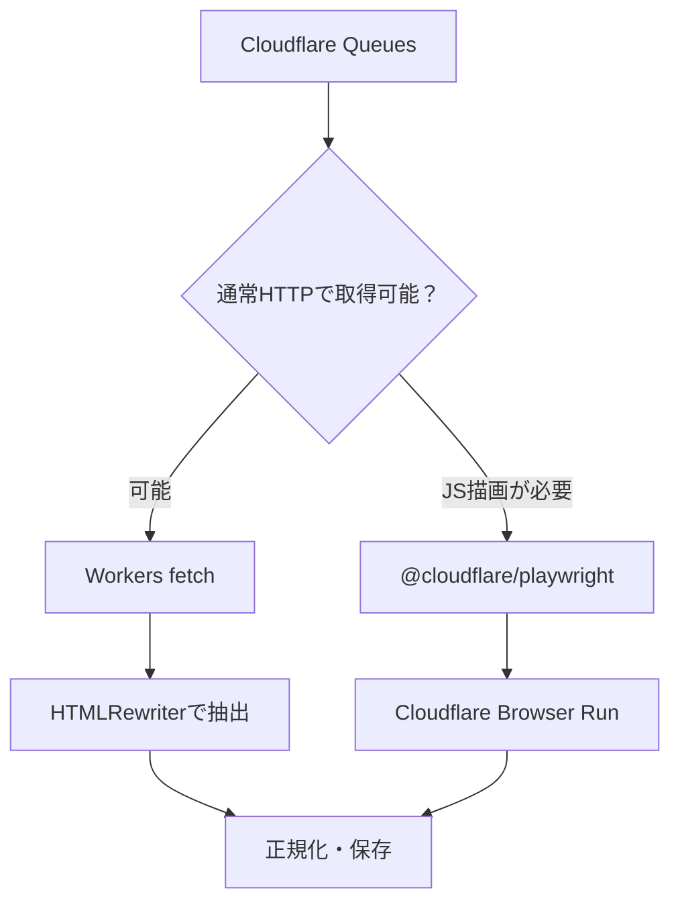

# スクレイピングライブラリ推奨

- 作成日時 (UTC): 2026-08-03T22:13:18.0000000Z
- 更新日時 (UTC): 2026-08-03T22:19:41.0000000Z
- 注記: 本文は公開用に秘密形式・メールアドレス・電話番号のみ不可逆に伏せ字化。

## user / 2026-08-03T22:13:15.0000000Z

```
スクレイピングをするのに適しているライブラリはありますかる
```

## assistant / 2026-08-03T22:13:19.0000000Z

```
null
```

## assistant / 2026-08-03T22:13:27.0000000Z

```
用途別に最適解が変わるため、現在のEnterpriseOS／Cloudflare Workers構成を前提に、HTTP取得・ブラウザ操作・大規模巡回の3層で候補を絞ります。公式資料で現行の対応状況も確認します。
```

## assistant / 2026-08-03T22:13:47.0000000Z

```
null
```

## assistant / 2026-08-03T22:13:47.0000000Z

```
null
```

## assistant / 2026-08-03T22:13:47.0000000Z

````
はい。現在のCloudflare Workers中心の構成なら、次の組み合わせが最適です。

| 用途 | 推奨ライブラリ | 特徴 |
|---|---|---|
| 静的HTML・API取得 | Workers標準`fetch()`＋`HTMLRewriter` | 最速・低コスト・ブラウザ不要 |
| JavaScriptサイト | `@cloudflare/playwright` | Workersから実ブラウザを操作 |
| 大規模巡回・URL管理 | Crawlee | キュー、再試行、重複排除、並列数制御 |
| Pythonで大規模収集 | Scrapy | 高速な非同期クローラー |
| 小規模なPython処理 | HTTPX＋Beautiful Soup | 簡単だが運用機能は少ない |
| 記事本文抽出 | Trafilatura | ニュース・ブログ本文の抽出向け |

### DataQorix向けの推奨構成



最初からすべてPlaywrightで取得すると、速度、ブラウザ枠、料金の面で不利です。推奨する処理順は次のとおりです。

1. API・JSONエンドポイント
2. `fetch()`＋`HTMLRewriter`
3. HTML内のJSON-LDや埋め込みJSON
4. 最後にPlaywright

Cloudflareの`HTMLRewriter`はWorkers上でストリーミング解析できるため、企業ページや求人一覧の大半はこちらで処理できます。[Cloudflare HTMLRewriter公式資料](https://developers.cloudflare.com/workers/runtime-apis/html-rewriter/)

JavaScript実行が必須のページだけ、Cloudflare対応版Playwrightを利用します。現在は「Browser Rendering」から「Browser Run」に名称が変わり、WorkersからPlaywright、Puppeteer、CDPなどで接続できます。[Cloudflare Browser Run](https://developers.cloudflare.com/browser-run/)／[Playwright対応資料](https://developers.cloudflare.com/browser-run/playwright/)

### Crawleeを使うべき場面

Crawleeは「HTMLを解析するだけのライブラリ」ではなく、次の運用機能をまとめて持っています。

- URLキュー
- 重複URLの除外
- 再試行
- 同時実行数の調整
- HTTP取得とPlaywright取得の使い分け
- セッション管理
- 失敗URLの管理

大規模な企業サイト巡回にはかなり適しています。[Crawlee PlaywrightCrawler公式資料](https://crawlee.dev/js/api/playwright-crawler/class/PlaywrightCrawler)

ただし、Crawlee本体をCloudflare Workers内のメイン実行基盤にするより、Node.jsコンテナ側で使うか、同等のキュー制御をCloudflare QueuesとDurable Objectsで構築するほうが自然です。

### 私の結論

DataQorix／EnterpriseOSでは、まず次を標準スタックにするのがよいです。

- 言語：TypeScript
- 通常取得：Workers `fetch()`
- HTML解析：`HTMLRewriter`
- ブラウザ取得：`@cloudflare/playwright`
- ジョブ管理：Cloudflare Queues
- 状態・排他制御：Durable Objects
- 本文抽出や複雑な後処理だけPython
- ローカル調査ツールとしてCrawlee

Python中心でゼロから作るならScrapyが第一候補です。非同期巡回、Spider、Item Pipelineなど大規模運用の基本機能が揃っています。[Scrapy公式サイト](https://scrapy.org/)／[Spider公式資料](https://docs.scrapy.org/en/latest/topics/spiders.html)

なお、PlaywrightやCrawleeを導入しても、アクセス制限やCAPTCHAが自動的に解決するわけではありません。対象サイトの規約、robots.txt、レート制限を個別に管理する設計が必要です。
````

## user / 2026-08-03T22:18:05.0000000Z

```
Scrapyでアクセス制限がかからないサイトからぶっこぬきたいです、方法を教えて
```

## assistant / 2026-08-03T22:18:11.0000000Z

```
null
```

## assistant / 2026-08-03T22:18:20.0000000Z

```
アクセス制限の回避ではなく、取得を許容している公開サイトをScrapyで安定巡回する構成なら作れます。対象サイトに負荷を掛けず、再開・重複除外・CSV/JSONL保存まで含む実用形で説明します。
```

## assistant / 2026-08-03T22:19:11.0000000Z

```
null
```

## assistant / 2026-08-03T22:19:11.0000000Z

```
null
```

## assistant / 2026-08-03T22:19:11.0000000Z

````
できます。Scrapyでは「1サイトへ大量同時アクセス」ではなく、**1ドメインは低速、複数ドメインを並列処理**する設計が安定します。

ただし、`200 OK`で取得できることと、無制限に取得してよいことは別です。利用規約・robots.txt・著作権・個人情報を確認し、403・429・CAPTCHAが出たサイトは回避せず停止してください。

## 1. Scrapyを準備

```bash
python -m venv .venv
source .venv/bin/activate

python -m pip install "scrapy>=2.17,<3"

scrapy startproject collector
cd collector
```

Windowsの場合：

```powershell
.venv\Scripts\activate
```

## 2. サイトマップから巡回する

公開サイトを丸ごと巡回するなら、リンクを無制限にたどるより`SitemapSpider`が効率的です。ネストしたサイトマップにも対応しています。[Scrapy SitemapSpider公式資料](https://docs.scrapy.org/en/latest/topics/spiders.html#sitemapspider)

`collector/spiders/public_site.py`

```python
from datetime import datetime, timezone

from scrapy.spiders import SitemapSpider


class PublicSiteSpider(SitemapSpider):
    name = "public_site"

    allowed_domains = ["example.com"]
    sitemap_urls = [
        "https://example.com/sitemap.xml",
    ]

    # 必要なURLだけに絞る
    sitemap_rules = [
        (r"/company/", "parse_page"),
        (r"/product/", "parse_page"),
        (r"/news/", "parse_page"),
    ]

    def parse_page(self, response):
        content_type = response.headers.get("Content-Type", b"").decode()

        if "text/html" not in content_type:
            return

        yield {
            "url": response.url,
            "status": response.status,
            "fetched_at": datetime.now(timezone.utc).isoformat(),
            "title": response.css("title::text").get(default="").strip(),
            "h1": response.css("h1::text").get(default="").strip(),
            "description": response.css(
                'meta[name="description"]::attr(content)'
            ).get(default="").strip(),
            "canonical_url": response.css(
                'link[rel="canonical"]::attr(href)'
            ).get(),
            "text": " ".join(
                text.strip()
                for text in response.css("main ::text").getall()
                if text.strip()
            ),
        }
```

`sitemap_rules`を`(r".*", "parse_page")`にすると全URLが対象になりますが、最初は必要なパスだけに限定してください。

## 3. 負荷を抑える設定

`collector/settings.py`へ追加します。

```python
ROBOTSTXT_OBEY = True

# 運営者が連絡できる識別情報
USER_AGENT = "DataQorixBot/0.1 (+mailto:[REDACTED_EMAIL])"

# 1サイトには低速アクセス
CONCURRENT_REQUESTS = 32
CONCURRENT_REQUESTS_PER_DOMAIN = 2
DOWNLOAD_DELAY = 1.0
RANDOMIZE_DOWNLOAD_DELAY = True
DOWNLOAD_TIMEOUT = 30

# 応答速度やエラーに応じて自動減速
AUTOTHROTTLE_ENABLED = True
AUTOTHROTTLE_START_DELAY = 1.0
AUTOTHROTTLE_MAX_DELAY = 60.0
AUTOTHROTTLE_TARGET_CONCURRENCY = 1.0

RETRY_ENABLED = True
RETRY_TIMES = 2

COOKIES_ENABLED = False
LOG_LEVEL = "INFO"

# 暴走防止。検証後に拡大
CLOSESPIDER_PAGECOUNT = 10_000

# 巨大ファイル対策
DOWNLOAD_MAXSIZE = 10 * 1024 * 1024
```

AutoThrottleは対象サイトの応答遅延などに応じて巡回間隔を調整します。[Scrapy AutoThrottle公式資料](https://docs.scrapy.org/en/latest/topics/autothrottle.html)

## 4. 実行と中断再開

```bash
mkdir -p data .jobs

scrapy crawl public_site \
  -o data/items.jl \
  -s JOBDIR=.jobs/public_site
```

- `items.jl`：途中で壊れにくいJSON Lines形式
- `JOBDIR`：中断後も未処理URLから再開
- 同じクロールを最初からやり直す場合は、新しいJOBDIR名を使用

CSVなら次のようにします。

```bash
scrapy crawl public_site -O data/items.csv
```

## JavaScriptで表示されるサイト

ブラウザでは見えるのにScrapyで取得できない場合、データがJavaScriptから読み込まれています。

まず開発者ツールのNetworkで、公開JSONエンドポイントを確認します。Scrapy公式も、最初にデータソースを特定して直接取得する方法を推奨しています。[動的コンテンツ取得の公式資料](https://docs.scrapy.org/en/latest/topics/dynamic-content.html)

```python
import scrapy


class PublicApiSpider(scrapy.Spider):
    name = "public_api"
    allowed_domains = ["example.com"]
    start_urls = ["https://example.com/api/items?page=1"]

    def parse(self, response):
        data = response.json()

        for item in data["items"]:
            yield item

        next_url = data.get("next")
        if next_url:
            yield response.follow(next_url, callback=self.parse)
```

結論として、取得可能なサイトでは次の順番が低コストです。

1. 公開CSV・公式API
2. `sitemap.xml`＋Scrapy
3. 通常リンク＋`CrawlSpider`
4. 公開JSONエンドポイント
5. 最後にPlaywright

大量巡回では、各サイトへは毎秒1件程度に抑えながら、多数のドメインを並行処理する構成が適しています。[Scrapy Broad Crawls公式資料](https://docs.scrapy.org/en/latest/topics/broad-crawls.html)
````
