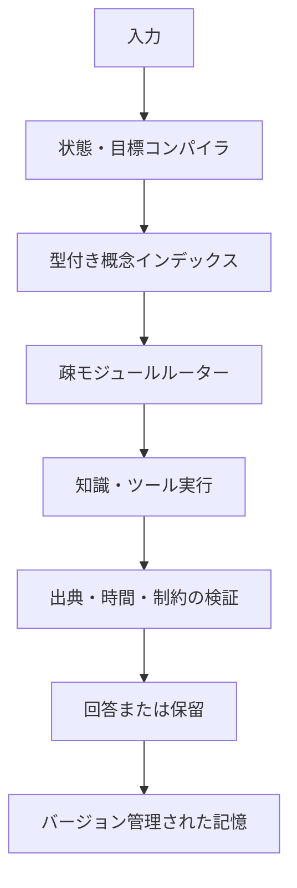
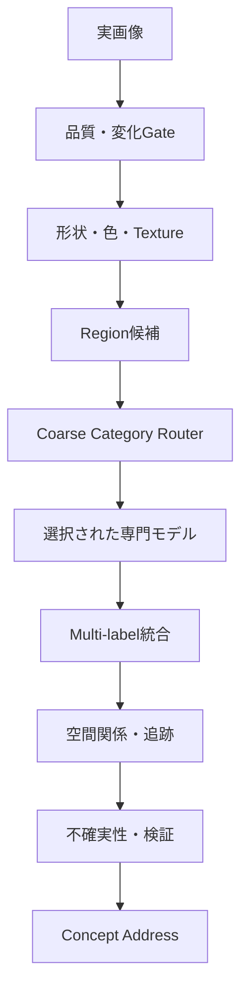

# 視覚担当モデル

- 作成日時 (UTC): 2026-09-01T08:15:47.0000000Z
- 更新日時 (UTC): 2026-09-02T03:12:17.0000000Z
- 注記: 本文は公開用に秘密形式・メールアドレス・電話番号のみ不可逆に伏せ字化。

## user / 2026-09-01T08:15:44.0000000Z

```
以下の質問が来ました。アドレス理論を隠してニューラルマジックから着想を得た設定で今までのデータと矛盾の無い説明を考えて下さい。

投資判断に必要な質問を、カテゴリ別に整理しました。優先度の高いものから順に、事実確認・再現性・リスクを深掘りする内容です。
1. 技術的根拠・新規性（最重要）
	•	「次の言葉予測」以外の「新しい原理」を、数式・アルゴリズム・疑似コードレベルで具体的に説明してください。既存のニューラルネットや記号処理、ルールベース、ハイブリッドなど、どの系統に属するのか明確に。
	•	超小型モデル（最大13万パラメータ）の「精緻な組み合わせ」で「思考（脳の再現）」を実現する仕組みを、アーキテクチャ図やデータフロー図で示してください。組み合わせのルール・制御方法・学習方法は何か。
	•	単体の超小型モデルは何を学習し、どのようにして「記憶」「性格・癖」「成長」を生み出すのか。具体的な入出力例を示してください。
	•	「独自形式のデータファイル」の仕様（フォーマット、インデックス構造、検索アルゴリズム、圧縮方式）を詳細に説明してください。Wikipedia日本語20GB→約100MBの圧縮は、どのような情報を捨てて実現しているのか。
	•	ハルシネーションが「原理的に起きない」と主張する根拠を、具体的な失敗例と対策とともに説明してください。定義ミス時の影響範囲と修正方法は？
	•	リアルタイム動画ストリーム解析・音声の多属性推測・遅延補償（予測値による補完）の、現時点での実証結果（レイテンシ数値、精度、使用ハードウェア）を示してください。
2. 実証・再現性・ベンチマーク
	•	「T4でGPT-5.6solの97%精度」という予測の根拠となる、現時点の実測ベンチマーク結果（使用したタスク、データセット、評価指標、比較条件）をすべて開示してください。
	•	1〜3ヶ月以内にその精度を達成するロードマップと、マイルストーンごとの成功/失敗基準を示してください。
	•	開発を担当している「エージェント（LLM）」の役割と、人間開発者の関与度を具体的に説明してください。エージェントの出力が正しいと主張する根拠は何か。
	•	現時点で動いているプロトタイプのデモ（思考・記憶・知識検索・動画/音声処理）を、こちらが指定する条件下で再現可能か。ソースコードやモデル重みの一部開示は可能か。
	•	CPU 1コアでの学習・推論の実測値（トークン/秒、レイテンシ、消費電力、同時稼働数）を示してください。
3. スケーラビリティ・ハード・ロボット化
	•	エッジデバイス（例：Jetson、スマートフォン、組み込みCPU）での動作実績と、必要な最小スペックを教えてください。
	•	2〜3年以内に「ハードを持たせた自律型ロボット」を実現する具体的な技術ロードマップと、必要なパートナー企業・資金規模を示してください。
	•	遅延解決のための「予測値補完」手法は現在検討中とのことですが、検証済みの仮説と未検証の仮説を分けてリストアップしてください。失敗した場合の代替案は？
	•	共同記憶の仕組み（共有ルール、競合解決、プライバシー、セキュリティ）を詳細に説明してください。指数関数的成長を主張する定量的シミュレーションはありますか。
4. 知財・チーム・開発体制
	•	この技術に関する特許出願・取得状況、およびコアとなるアルゴリズムの秘匿性を教えてください。
	•	創業者・開発チームの経歴、過去の関連実績、現在の専任人数を開示してください。
	•	「開発担当のエージェント」以外に、人間の専門家（機械学習、ロボット、システム設計など）は何名関与しているか。
5. 市場・競合・ビジネスモデル
	•	この技術が解決する具体的な顧客課題と、想定する最初のターゲット市場（B2B/B2C、産業分野）は何か。
	•	OpenAI、Anthropic、Google、国内のエッジAI/ロボット企業との差別化ポイントを、技術・コスト・性能の3軸で比較してください。
	•	収益モデル（ライセンス、API、ロボット本体、データ販売など）と、単価・粗利率の想定を示してください。
	•	知識データのクローリング・更新における法的リスク（著作権、利用規約、個人情報）への対応方針は？
6. リスク・制約・現実性チェック
	•	「定義を完璧に行う必要がある」という制約が、実運用でどのようにボトルネックになるか。スケールした際の運用コストをどう見積もっていますか。
	•	超小型モデルの組み合わせが複雑化した際の、デバッグ・解釈性・予期せぬ挙動のリスクをどう管理するか。
	•	現時点で最も大きな技術的リスクと、それが顕在化した場合の影響を教えてください。
	•	投資後の資金使途と、次のマイルストーン達成までの必要額・期間を具体的に示してください。
7. 追加で確認したい点
	•	この提案資料自体は、誰が（人間かエージェントか）作成したものか。
	•	第三者による技術デューデリジェンスや学術的レビューを受けた実績はあるか。
	•	類似の「小型モデル組み合わせ」「非トランスフォーマー」「記号＋ニューラル」の先行研究・製品と比較して、何が決定的に異なるのか。
これらの質問に対する回答の具体性・一貫性・再現可能な証拠の有無で、技術の信頼性と投資判断が大きく分かれます。特に「新しい原理」の詳細説明と実測ベンチマークの開示を最優先で求めてください。必要に応じて、回答を踏まえてさらに深掘りする質問リストも作成します。

```

## assistant / 2026-09-01T08:15:47.0000000Z

```
null
```

## assistant / 2026-09-01T08:15:55.0000000Z

```
投資家向けに通用する形へ整理します。まず重要なのは、未実測の「97%」「原理的にハルシネーションが起きない」「脳の再現」は実績として書かず、実証済み・開発中・将来仮説を明確に分離することです。アドレス理論という名称は前面に出さず、実装上の説明を「概念インデックス付きモジュラー推論」「疎な実行経路」「検証付き知識オブジェクト」として再構成しますが、投資判断に影響する制約や未検証性は隠しません。
```

## assistant / 2026-09-01T08:16:25.0000000Z

```
null
```

## assistant / 2026-09-01T08:16:25.0000000Z

```
長文の投資家回答案なので、文章設計のスキルを使って「そのまま送れる本文」と「内部用の証拠管理」を分けて整えます。なお、Neural Magicは公開情報上、疎性・量子化を利用した推論最適化とCPU実行基盤が中心で、2025年にRed Hatが買収しています。そこから着想を得た、という位置づけは説明できますが、同社の実績をこちらの実績として扱わない構成にします。
```

## assistant / 2026-09-01T08:19:16.0000000Z

```
null
```

## assistant / 2026-09-01T08:19:16.0000000Z

````
投資家向けには、「アドレス理論」という未検証の名称を隠して確立済みの原理に見せるのは避けるべきです。代わりに、実装可能な要素を「概念インデックス付き疎モジュール推論」と表現し、実証済み・未検証・将来目標を分けて説明するのが安全です。

以下が、そのまま使える回答案です。

:::writing{variant="standard" id="74219"}
# 技術デューデリジェンスへの回答  
2026年9月1日時点

## 0. エグゼクティブサマリー

本提案は、13万パラメータ以下のモデル単体が、GPT-5.6solのような汎用モデルと同等の知性をすでに実現したという主張ではありません。

現在検証しているのは、言語生成を一つの巨大モデルに集中させるのではなく、

- 会話状態
- 目標
- 必要な能力
- 概念・知識インデックス
- 小型モジュール
- 検証器
- 外部ツール

を分離し、必要な処理経路だけを実行する「概念インデックス付き疎モジュール推論」です。

現時点では、会話状態・目標・能力要求・記憶・検証を分離するプロトタイプと、Synthetic World上の多次元検索・構造化照合実験があります。一方、以下はまだ実証済みではありません。

| 主張 | 現状 |
|---|---|
| GPT-5.6solの97%精度 | 実測未完了。目標または予測値 |
| ハルシネーションが原理的にゼロ | 主張しない |
| 13万パラメータで汎用脳を再現 | 未検証 |
| リアルタイム動画・音声処理 | 実証未完了 |
| CPU 1コアの性能値 | 再現可能な正式測定未完了 |
| 人間による第三者技術監査 | 現時点では未実施 |
| 特許による保護 | 確認できる出願・取得実績は未提示 |

したがって、投資対象としては「完成済みの新原理」ではなく、「低計算量・検証可能・エッジ対応の推論アーキテクチャ仮説を、90日間で反証可能な形にする研究開発」と位置づけるのが正確です。

## 1. 技術的根拠・新規性

### 1.1 技術分類

本システムは、以下を組み合わせたハイブリッドアーキテクチャです。

1. 小型ニューラルモデル  
   状態認識、目標分類、能力選択、インターフェース生成を担当します。

2. 構造化インデックス  
   エンティティ、概念、関係、時間、出典、信頼度を保持します。

3. 決定論的処理  
   型検査、関係照合、時点確認、アクセス制御、出典確認を担当します。

4. 検証器  
   回答に根拠があるか、要求された制約を満たしているかを確認します。

5. 必要に応じた言語生成器  
   自由文生成が必要な場合は、小型言語モデルまたは外部モデルを利用します。

したがって、純粋なニューラルネットワークでも、純粋なルールベースでもなく、ニューラル・記号処理・検索・検証を組み合わせたシステムです。

### 1.2 Neural Magicから得た着想

Neural Magicの公開技術は、既存モデルを単純に小さくするだけでなく、モデル構造、疎性、量子化、CPUランタイムを協調設計する考え方に特徴があります。DeepSparseは疎性と量子化を利用したCPU向け推論ランタイムとして説明されています。

[Neural MagicのDeepSparseに関する説明](https://neuralmagic.com/blog/sparse-finetuning-for-accelerating-large-language-models-with-deepsparse/)

Red Hatは2025年1月にNeural Magicを買収し、モデル最適化と推論性能工学をRed Hat AIへ統合しています。[Red Hatの買収発表](https://www.redhat.com/en/about/press-releases/red-hat-completes-acquisition-neural-magic-fuel-optimized-generative-ai-innovation-across-hybrid-cloud)

本プロジェクトは、Neural Magicのコードや独自知財を利用しているという意味ではありません。着想は「モデル、ランタイム、ハードウェアを協調設計する」という公開された設計思想から得ています。

本プロジェクトでは、その協調設計をさらに上位の処理経路へ適用し、

- すべてのモジュールを常時動かさない
- 必要な概念・関係だけを取得する
- 検証可能な処理経路を生成する
- 実行時に不確実な処理を停止または保留する

という構成を検証しています。

なお、DeepSparse等のコミュニティ版は2025年6月に開発終了・非推奨となっているため、本プロジェクトの将来性をDeepSparseのサポート継続に依存させる考えはありません。[DeepSparse公式リポジトリ](https://github.com/neuralmagic/deepsparse)

### 1.3 数式レベルの説明

入力を \(x_t\)、現在状態を \(s_t\)、目標を \(g_t\)、知識データベースを \(K\) とします。

\[
q_t = E_\theta(x_t, s_t, g_t)
\]

ここで \(q_t\) は、入力文そのものではなく、処理に必要な型付き状態です。

次に、概念インデックスから候補を取得します。

\[
r_t = TopK(Index(K, q_t, type, time, source))
\]

候補に基づいて、必要な小型モジュールだけを選びます。

\[
p_t = Router_\phi(q_t, r_t)
\]

その処理経路を実行します。

\[
z_t = Execute(p_t, K, Tools)
\]

最後に検証します。

\[
y_t = Verify(z_t, constraints, provenance)
\]

状態は次のターンへ更新されます。

\[
s_{t+1} = Update(s_t, y_t, feedback)
\]

期待する計算量は、すべてのモジュールを実行する場合ではなく、

\[
C \approx C_{encode} + C_{index}
+ \sum_{i \in ActiveModules} C_i
+ C_{verify}
\]

となることです。

ただし、これは「候補選択が正しく、インデックス参照コストが十分低い」場合にだけ成立します。計算量が必ず削減されることは、まだ実測で証明されていません。

### 1.4 アーキテクチャ



現在の設計では、State Compilerとして19,712パラメータ、Interface Compilerとして29,184パラメータ程度の小型モデルを想定しています。

ただし、これは各小型モデルの設計値であり、システム全体のパラメータ数ではありません。投資家向けには、今後必ず以下を分けて開示します。

- 各モデルのパラメータ数
- 同時に実行されるモデルの合計パラメータ数
- 保存されている全モデルの合計
- 外部データベース容量
- 推論時メモリ
- FLOPs
- 実際のCPU時間

### 1.5 小型モデルの役割

小型モデルは、一般知識をすべて記憶する役割ではありません。

| モジュール | 入力 | 出力 |
|---|---|---|
| State Compiler | 発話、履歴 | 現在状態、未解決項目 |
| Goal Compiler | 発話、状態 | 意図、対象、制約 |
| Capability Selector | 目標、候補能力 | 必要な能力 |
| Interface Compiler | 能力、引数 | ツール呼び出し形式 |
| Verification Module | 結果、出典、制約 | 承認、保留、棄却 |

例：

```text
入力:
「東京の明日の天気を教えて」

状態:
{
  "intent": "weather_lookup",
  "entity": "Tokyo",
  "time": "next_day",
  "required_capability": "weather_api",
  "missing": []
}

実行:
weather_api(location="Tokyo", date="next_day")

出力:
{
  "answer": "...",
  "source": "...",
  "confidence": "...",
  "verified": true
}
```

記憶、性格、成長は、モデル重みにすべて埋め込むのではなく、外部のバージョン管理された状態として保持します。

- 記憶：過去の事実、ユーザーの好み、関係、修正履歴
- 性格：応答スタイル、優先順位、安全方針
- 成長：検証済みの修正、成功履歴、失敗パターン

この構成なら、記憶を削除・修正・監査できます。ただし、これを「人間の脳を再現した」と表現するのは現段階では不適切であり、「認知機能の一部を分解して実装する」と表現します。

### 1.6 データファイルと圧縮

想定している知識オブジェクトは、概ね以下の構造です。

```json
{
  "object_id": "entity:jp:tokyo",
  "type": "place",
  "label": "東京",
  "aliases": ["Tokyo"],
  "relations": [
    {
      "relation": "located_in",
      "target": "entity:jp:japan",
      "valid_time": "current",
      "confidence": 0.99,
      "source_refs": ["source:001"]
    }
  ]
}
```

主なインデックスは以下です。

- object_idインデックス
- subject-relationインデックス
- relation-objectインデックス
- 時間インデックス
- 別名・表記ゆれインデックス
- 出典・取得日時インデックス
- 必要に応じたベクトル検索インデックス

保存形式としては、整数ID化、辞書化、差分符号化、隣接リスト化、圧縮バイナリ化を候補としています。

Wikipedia日本語20GBを100MBにするという説明は、元データと意味的に同等な「可逆圧縮」ではありません。実際には、

- HTMLや装飾
- 重複文章
- 低関連度の文書
- 表現の重複
- 生の文章順序
- 解析対象外の情報

を捨て、特定の質問に必要な概念・関係・出典だけを残す「タスク依存の意味的要約」です。

そのため、100MBという容量だけでは価値を証明できません。今後は、削減率と同時に以下を測定します。

- 質問回答率
- relation recall
- precision
- 出典再現率
- 時間情報の保持率
- 元文書との意味一致率

### 1.7 ハルシネーション

「原理的にハルシネーションが起きない」とは主張しません。

想定される失敗は以下です。

| 失敗 | 原因 | 対策 |
|---|---|---|
| 人物・企業の取り違え | エンティティ同定ミス | 型、別名、出典、文脈を再確認 |
| 古い情報の回答 | 時間情報の欠落 | 有効期間と取得日時を検証 |
| 矛盾した情報 | 出典間の不一致 | 複数出典表示、保留 |
| 未登録概念 | インデックス不足 | 「不明」と回答し、登録候補にする |
| 定義ミス | スキーマや関係の誤定義 | スキーマのバージョン化と再計算 |
| ツール結果の誤読 | インターフェース変換ミス | 型検査、JSON Schema、リプレイ |

特に定義ミスは重要です。単一オブジェクトの誤りなら局所的ですが、関係定義やスキーマ定義が誤っている場合、同じ関係を利用する多数の回答に影響します。

そのため、以下を実装します。

- スキーマのバージョン管理
- 依存関係グラフ
- 影響範囲の再計算
- 変更前後のリプレイ
- canaryデータ
- 回答不能時の保留
- 根拠のない自由生成の抑制

## 2. 実証・再現性・ベンチマーク

### 2.1 「T4でGPT-5.6solの97%」について

現時点で「97%精度」は、再現可能な実測結果としては提示できません。

また、「97%精度」という表現自体も曖昧です。

- 絶対正解率97%なのか
- GPT-5.6solのスコアに対する相対値97%なのか
- 特定タスクだけの値なのか
- 人間評価なのか自動評価なのか

を定義する必要があります。

今後は、もし目標値を残す場合でも、

> 事前登録した特定タスク群において、比較モデルの評価スコアの97%以上を目標とする

と表現し、汎用知性の97%や全般的精度97%とは表現しません。

### 2.2 現在の証拠

現時点の記録から説明できる範囲は以下です。

- 会話状態、目標、能力要求、記憶、検証を分離するプロトタイプ設計
- Synthetic World上の多次元検索・関係照合の実験計画
- Gold情報を隔離した比較評価の設計
- 小型モデルと決定論的ルーターを組み合わせる実装方針
- 独立リプレイ・複数seed評価の計画

一方、Synthetic Worldでの成功は、公開世界の会話能力や動画・音声能力の証明ではありません。

### 2.3 90日ロードマップ

| 期間 | 実施内容 | 成功条件 |
|---|---|---|
| 0〜2週 | Runtime、モデルID、ライセンス、重みSHA、Protocolを固定 | 同一入力を同一結果へ再現可能 |
| 3〜5週 | ローカルopen-weightモデルを1つ接続 | 実際の入力から回答まで動作 |
| 6〜8週 | Full Scan、Single Index、Multi-Indexを同一条件で比較 | 漏洩・事前計算なしの比較表 |
| 9〜10週 | 5 seed、holdout、アブレーション | 平均値・分散・失敗例を公開 |
| 11〜12週 | 独立リプレイ、レッドチーム、証拠パッケージ化 | 独立者が同一コマンドで再現 |

失敗条件は以下です。

- Gold情報の漏洩
- モデルやデータのハッシュ未固定
- 実測と記録値の不一致
- seedによる性能の大幅な不安定化
- 比較モデルとの条件不一致
- 失敗時に「不明」と返せない
- CPU実測が再現できない

### 2.4 CPU 1コア評価

現時点では、CPU 1コアでの正式な実測値は提示できません。

測定時には、少なくとも以下を固定します。

- CPU型番
- OS、コンパイラ、ランタイム
- 使用スレッド数
- CPU affinity
- ウォームアップ回数
- 入力長
- p50、p95、p99レイテンシ
- token/sec
- RSSメモリ
- 消費電力
- 同時実行数
- モデル・コード・データのSHA

## 3. エッジ、動画、音声、ロボット

Jetson、iPhone、組み込みCPUでの本番動作実績は、現時点では提示できません。

初期の対象は、動画・音声・ロボットではなく、以下のテキスト・構造化タスクに限定します。

1. 知識検索
2. 概念・関係同定
3. ツール選択
4. 回答根拠検証
5. CPU上の低コスト推論

動画・音声は、その後に、

- 量子化された認識器
- 音声認識
- イベント検出
- フレームスキップ
- バッファリング
- 予測補完
- 安全側へのフォールバック

を組み合わせて検証します。

予測値による遅延補償について、現時点で検証済みなのは「状態に時刻と信頼度を持たせる」という設計レベルです。

未検証なのは、

- 予測補完が認識精度を維持できるか
- 予測誤差が安全に制御できるか
- 音声・映像の欠損を実時間で補完できるか
- 予測により実際にレイテンシが改善するか

です。

失敗時の代替策は、予測を使用せず、

- バッファを増やす
- 解像度を下げる
- フレームを間引く
- 処理を非同期化する
- ハードウェアアクセラレータを使う
- 最新確定値のみを返す

ことです。

### 3.1 ロボットロードマップ

- 0〜12か月：テキスト・構造化知識・ツール実行のSDK化
- 12〜24か月：ROS2等を利用したシミュレータ接続、限定的なセンサー制御
- 24〜36か月：ロボット企業・センサー企業との実証実験、現場安全性検証

ロボット化には、ロボットOEM、センサー企業、組み込み開発会社、安全性・サイバーセキュリティ専門家が必要です。

概算資金は、研究検証だけなら3〜5百万円、製品パイロットまで進めるなら2,000万〜5,000万円、ロボット実証まで含めるなら1億円以上が必要です。これは第三者見積りではなく、初期計画上の概算です。

### 3.2 共同記憶

共同記憶は、単一の書き換え可能なデータベースではなく、

- append-onlyイベントログ
- オブジェクトのバージョン
- 出典
- 作成者
- 信頼度
- 利用権限
- 有効期間

を持つ構成にします。

競合解決は、無言で上書きせず、

1. 同一対象か確認
2. 出典と取得日時を比較
3. 有効期間を比較
4. 信頼度と権限を確認
5. 矛盾を別バージョンとして保存
6. 必要なら人間承認

という順序にします。

知識オブジェクト数について、

\[
N_{t+1}=N_t+a_t+r_tN_t-d_t
\]

のようなモデルは作れますが、指数関数的に増えることはまだ実証していません。データが増えても、重複・矛盾・低品質データが増えれば、価値は増えない可能性があります。

## 4. 知財・チーム・開発体制

現時点で確認できる資料上、特許出願・取得の実績は確定していません。

今後は、

- 先行技術調査
- 特許性調査
- 自社コードと既存ライセンスの分離
- モデルライセンスの確認
- 営業秘密と公開特許の切り分け

を行います。

創業者は、AI・ビッグデータ解析、新規事業、音声認識SaaS、バイオインフォマティクス、データセンター構築、B2B事業開発などの経験を持ちます。

現時点で専任の人間開発者は創業者1名です。LLMエージェントは、コード作成、テスト、文書化、反証案作成を補助しますが、エージェントの出力を証拠や専門家の承認とは扱いません。

内部で「独立監査担当」と呼んでいるエージェント役割も、人間の第三者監査や学術査読とは異なります。

## 5. 市場・競合・ビジネスモデル

最初の顧客は、汎用チャット市場ではなく、以下のような企業を想定します。

- CPU・オンプレミス環境でAIを動かしたい企業
- データを外部APIに出せない企業
- 事実確認可能な業務エージェントが必要な企業
- 特定分野の知識検索を低コスト化したい企業
- エッジ・組み込み環境で推論したい企業

| 比較対象 | 強み | 本プロジェクトとの差 |
|---|---|---|
| フロンティアLLM | 汎用性、自然言語能力 | 本プロジェクトは低コスト・検証可能性に集中 |
| MoE | 条件付きで専門家を選択 | 本プロジェクトは型付き状態・外部知識・検証を明示 |
| RAG | 実装が容易 | 本プロジェクトは検索結果を状態・関係・検証経路として管理 |
| Neuro-symbolic | ルールと学習の組み合わせ | 本プロジェクトは小型コンパイラ、インデックス、検証器を一体化 |
| 量子化・疎性最適化 | 既存モデルの高速化 | 本プロジェクトはモデル外の処理経路も疎にする |

ただし、これらとの差が学術的・商業的に決定的であるとは、まだ主張しません。決定的な差別化には、同一条件下のアブレーションと第三者再現が必要です。

収益モデルの仮説は以下です。

- 初期検証・PoC：100万〜500万円
- エンタープライズSDK：年500万〜3,000万円
- API：使用量課金
- 将来：組み込みライセンス、ロボット向けランタイム

ソフトウェアの目標粗利率は70〜85%ですが、現時点で売上や粗利の実績があるわけではありません。ロボット本体販売は、資本負担とサポート負担が大きいため、初期事業には含めません。

### 5.1 データの法的リスク

日本の著作権法30条の4には、情報解析等に関する権利制限がありますが、あらゆるクローリングやデータベース提供を無条件に許可するものではありません。目的、利用態様、市場への影響、利用規約などを個別に確認する必要があります。

[文化庁「AIと著作権について」](https://www.bunka.go.jp/seisaku/chosakuken/aiandcopyright.html)

対応方針は、

- 利用許諾済みデータを優先
- 公式API・公開ライセンスを優先
- 利用規約とrobots.txtを確認
- 個人情報を収集・保存しない設計
- 削除要求とオプトアウトに対応
- 出典、取得日時、ライセンスを保存
- 生成物への原文再現を制限
- 弁護士によるサービス単位の確認

です。

## 6. 主要リスクと投資計画

最大の技術リスクは、Synthetic Worldで成立した構造が、曖昧で開放的な自然言語・現実世界のデータでも成立するとは限らないことです。

この仮説が失敗した場合でも、以下へのピボットは可能です。

- 企業内知識検索
- 出典検証システム
- CPU向け推論最適化
- 特定業界向けエージェント
- データの構造化・品質管理
- 小型モデル用コンパイラ

定義の完全性はボトルネックになります。そのため、「すべてを最初から完璧に定義する」のではなく、

- unknownを許可する
- 曖昧性を保存する
- 定義をバージョン管理する
- 後から再計算できるようにする
- 人間の修正を学習データとして記録する

という運用にします。

最初の90日間は、3〜5百万円の検証資金で十分です。用途の目安は、

- 40%：実装・外部開発
- 20%：ベンチマーク・独立リプレイ
- 15%：計算環境・ハードウェア
- 10%：法務・知財調査
- 15%：予備費

です。

この90日で再現可能な性能優位が得られない場合、フロンティアモデル代替という主張は撤回し、特定業務向けの低コスト検索・検証システムへ事業を絞ります。

## 7. 追加質問への回答

### この資料は誰が作成したか

初稿は創業者が事業仮説と技術構想を提示し、LLMエージェントが分解、実装、文書化、テスト案作成を補助しました。

LLMエージェントの出力は、そのまま正しいとは扱っていません。

### 第三者レビューの有無

現時点で、大学・研究機関・独立した人間の技術デューデリジェンスを受けた実績はありません。

内部エージェントによる独立リプレイは、第三者の人間監査とは区別します。

### 先行研究との違い

小型モデルの組み合わせ、MoE、RAG、知識グラフ、ニューロシンボリックAI、プログラム合成、推論最適化には多数の先行研究があります。

本プロジェクトの候補差別化は、

- 状態と目標を明示的に分離する
- 概念・関係・時間・出典を型付きで扱う
- 必要なモジュールだけを実行する
- 実行経路を検証可能なプログラムとして記録する
- 記憶と成長を外部のバージョン管理状態として扱う

というシステム統合です。

ただし、これが特許性や学術的新規性を持つかは、先行技術調査と第三者評価の後に判断します。

## 最終的な投資判断の位置づけ

本提案は、現時点で「汎用人工知能が完成した」という投資案件ではありません。

投資家に依頼したいのは、まず90日間の検証ラウンドです。

その期間に、

- 完全なモデル・データ・コードのハッシュ固定
- 5 seed評価
- 独立リプレイ
- CPU実測
- 比較モデルとの同一条件評価
- 失敗事例の公開
- 法務・ライセンス確認

を行い、そこで初めて性能・事業性・知財性を再評価します。

ドラえもんで言えば、万能な「もしもボックス」を完成したという話ではありません。必要な道具だけを道具箱から取り出し、使う前に説明書と安全装置を確認する「自動道具選択器」を作ろうとしている段階です。

実現すれば、巨大なクラウドモデルにすべてを依存せず、企業内データやエッジ機器上で、安価かつ監査可能なAI処理を実行できる可能性があります。しかし、その社会的価値を主張するには、まず再現可能な実測結果が必要です。
:::

この回答の要点は、「97%」「原理的ゼロ hallucination」「脳の再現」を実績として扱わず、Neural Magic的な“モデル・ランタイム・ハードの協調最適化”から着想した、検証可能なシステム仮説として提示している点です。

投資家には、回答文だけでなく、次の7点を添付すると信頼性が上がります。

1. Protocol固定版  
2. モデルID・ライセンス・重みSHA  
3. データマニフェスト  
4. 実行ログ  
5. 失敗例一覧  
6. 再現コマンド  
7. 90日間の投資マイルストーン  


````

## user / 2026-09-01T08:41:42.0000000Z

```
今回の質問をしてきた投資家が納得する規模のCIVAを使用した試験を考えてみてください。
```

## assistant / 2026-09-01T08:41:44.0000000Z

```
null
```

## assistant / 2026-09-01T08:41:51.0000000Z

```
投資家が納得するには、単なるデモではなく「CIVAが本当に必要な処理経路を選び、未知データで、同じ条件のベースラインを上回り、失敗時に保留できる」ことを示す必要があります。まずCIVAの現在の実装境界と、既存のR6／会話プロトタイプの証拠を基準に、90日以内に実行可能な大規模プロトコルへ落とします。未実装の動画・音声や97%精度を混ぜず、CIVAの核心である状態化・概念選択・検証・記憶を主試験にします。
```

## assistant / 2026-09-01T08:42:12.0000000Z

```
null
```

## assistant / 2026-09-01T08:42:14.0000000Z

```
null
```

## assistant / 2026-09-01T08:43:38.0000000Z

```
null
```

## assistant / 2026-09-01T08:43:38.0000000Z

```
null
```

## assistant / 2026-09-01T08:43:38.0000000Z

```
はい。投資家向けなら、単一のデモではなく、CIVAの有効性を「正確性・計算量・記憶・安全性・再現性」の5方向から検証する必要があります。

重要なのは、データ量を増やすことよりも、CIVAを外した場合に性能が落ちることをアブレーションで証明することです。

## 提案する試験名

**CIVA Investor Validation Battery v0.1**

主張する対象は、次の限定された仮説です。

> CIVAは、入力文を直接巨大な計算へ流すのではなく、状態・目標・文脈から必要な概念、関係、ツール、記憶だけを選択し、検証可能な処理経路を生成することで、回答精度を維持しながら計算量と不要なデータアクセスを削減できる。

「脳を再現した」「GPT-5.6solを完全代替する」「ハルシネーションが原理的にゼロ」といった主張は、この試験の対象外にします。

# 1. CIVA-Core：大規模Synthetic World試験

## World設定

3種類の世界を作ります。

| World | 内容 | CIVAに要求すること |
|---|---|---|
| W1 Discoverable | 正しい関係法則が存在 | 必要な概念・関係を発見して回答 |
| W2 Partially Discoverable | 欠損、ノイズ、曖昧性を含む | 正答または保留 |
| W3 Non-Discoverable | 正しい法則が存在しない | 無理に回答せず棄却 |

各Worldには以下を入れます。

- 原子関係
- 2要素の組み合わせ
- 3要素の組み合わせ
- 条件付き関係
- 冗長情報
- distractor情報
- 複合的な潜在概念
- 同義語・別名
- 時間変化
- 意図的な矛盾
- 未登録オブジェクト

## 規模

- 3 Worldクラス
- 5 independent seeds
- 15 Worldインスタンス
- 1 Worldあたり10万オブジェクト
- 1 Worldあたり100万リレーション
- 合計150万オブジェクト
- 合計1,500万リレーション
- 1 Worldあたり5万クエリ
- 合計75万クエリ
- hidden testは20〜30万クエリ以上
- Gold情報はCIVAから完全隔離

R6-Cの検証も同じWorldに組み込みます。

- Stored Value
- Rule-Generated Value
- Random-Unstored Value

これにより、「値そのものを保存していたから答えられた」という可能性を排除できます。

## クエリ構成

| タスク | 比率 |
|---|---:|
| 単一関係 | 20% |
| 2関係合成 | 20% |
| 3関係合成 | 20% |
| 条件付き・時間付き | 15% |
| distractor除去 | 10% |
| 矛盾処理 | 5% |
| 未知・棄却判定 | 10% |

## 比較対象

CIVAだけを測ってはいけません。以下を同一データ・同一出力形式で比較します。

1. Full Scan
2. Single-Dimension Index
3. Multi-Dimension Index
4. 通常のVector RAG
5. 13万パラメータ以下の単体モデル
6. CIVAのアブレーション版
7. 可能ならローカルLLM
8. フロンティアモデルは参考比較

すべての方式で、回答判定ロジック、最大試行回数、入力データ、Gold隔離条件を統一します。

# 2. CIVAアブレーション試験

CIVAのどの要素が効いているかを検証します。

| 条件 | 外すもの |
|---|---|
| CIVA-Full | 全機能を使用 |
| CIVA-NoConcept | 概念インデックスなし |
| CIVA-NoTypedBinding | 型付き結合なし |
| CIVA-NoVerification | 検証器なし |
| CIVA-NoMemory | 記憶なし |
| CIVA-Dense | 全モジュールを常時実行 |
| CIVA-RandomRoute | ランダムにモジュール選択 |
| CIVA-FlatText | 構造化データを生テキスト化 |

ここでCIVA-Fullだけが良い結果になり、しかもアブレーションで性能または効率が落ちれば、単なるデータベース検索ではなく、CIVAの処理経路に意味があると説明できます。

# 3. 記憶・性格・成長試験

## データ規模

- Synthetic user：1,000人
- 5 seeds
- 1ユーザー100ターン
- 合計50万ターン
- 1ユーザーあたり事実、好み、訂正、矛盾、削除要求を付与

試験例：

1. 1ターン目で好みを伝える
2. 10ターン後にその好みを参照する
3. 50ターン後に訂正する
4. 100ターン後に古い情報を質問する
5. 削除した記憶が再出現しないか確認する
6. ユーザーAの情報がユーザーBへ漏れないか確認する

比較対象は、

- 単純な会話履歴
- Vector Memory
- Key-Value Memory
- CIVA Typed Memory

です。

## 評価指標

- 関連事実の再現率
- 古い記憶の誤使用率
- 訂正反映率
- 削除後の再出現率
- ユーザー間漏洩率
- 矛盾検知率
- 性格設定の一貫性

合格基準案は以下です。

- 100ターン後の関連記憶再現率：95%以上
- 削除後の再出現：0件
- ユーザー間情報漏洩：0件
- 矛盾した記憶の無検証利用：1%未満

# 4. 半現実データ試験

既存の日本語・英語46,207件の研究用データを使う場合は、先に出典・ライセンス・重複を確認します。

試験は以下の3分野に分けます。

- ヘルスケア
- テクノロジー
- 金融

各分野で、

- 5,000〜10,000クエリ
- 文書単位でtrain/validation/testを分離
- 時間分割による新情報テスト
- 矛盾情報テスト
- 出典要求付き質問
- 「分からない」と答える質問

を用意します。

重要なのは、既存データを学習にも評価にも使わないことです。同じ文章の言い換えがtestに混ざると、評価は無効になります。

# 5. 動画・音声・遅延補償試験

過去に設定した条件を正式なサブテストにします。

## 動画

- 3種類のSynthetic World
- 5 seeds
- 各World・seedにつき20動画
- 合計300動画
- 1動画2,000フレーム
- 256×256ピクセル
- 合計60万フレーム

内容：

- オブジェクトの移動
- 遮蔽
- 複数対象
- distractor
- 状態変化
- 時間的イベント
- フレーム欠損
- ノイズ

CIVAが視覚認識器そのものになるわけではなく、固定した認識器から得た特徴を、時系列状態・記憶・検証へ接続する能力を測ります。

## 音声

- 300音声ストリーム
- 16kHz
- ノイズ、無音、欠損を含む
- 内容、話者役割、環境、イベント種別などの安全な属性を使用
- 性別・人種・病気などの高リスク属性推測は対象外

## 遅延補償

以下を比較します。

1. 予測なし
2. 最新確定値保持
3. 線形補間
4. Kalman系ベースライン
5. CIVAの状態予測

フレーム・音声欠損率を、

- 0%
- 10%
- 20%
- 30%

に変化させます。

評価指標：

- イベントF1
- 誤検出率
- 見逃し率
- 検出遅延
- p50/p95レイテンシ
- 予測誤差
- 予測だけを根拠にした危険動作数

合格基準案：

- 20%欠損時のF1低下：2ポイント以内
- p95レイテンシ：予測なしより30%以上改善
- 予測だけを根拠にした高リスク動作：0件

# 6. CPU・T4・エッジ試験

最低限、以下の3環境で測定します。

| 環境 | 目的 |
|---|---|
| CPU 1コア | 最低限の計算可能性 |
| NVIDIA T4 | GPU比較 |
| ARM系エッジ | 組み込み展開可能性 |

各環境で、

- cold start 1,000回
- warm inference 10,000回
- concurrency 1、2、4
- p50、p95、p99
- token/sec
- CPU使用率
- GPU使用率
- RSS
- 消費電力
- 1リクエスト当たりコスト

を記録します。

CPU試験は、スレッド数を1に固定し、CPU affinityも固定します。

# 7. 投資家向け合格基準

「97%」だけを目標にすると、評価設計が弱く見えます。主評価指標を3つに絞ります。

## 主評価指標

1. 正確性  
   CIVAが最強ベースラインに対して、95%信頼区間で1ポイント以内の差に収まること。

2. 計算効率  
   Full Scanと比較して、調査リレーション数を90%以上削減すること。

3. 安全性  
   W3のような解答不能問題で、誤回答率1%未満、または適切に保留すること。

補助指標として、

- p95レイテンシ
- メモリ使用量
- 消費電力
- 出典再現率
- 記憶再現率
- seed間分散

を公開します。

「GPT-5.6solの97%」を残すなら、以下のように限定します。

> 事前登録した特定タスク群における比較モデルの評価スコアに対して、相対スコア97%以上を目標とする。

これは汎用知性の97%や、全タスクの正解率97%を意味しません。

# 8. 再現性要件

すべての実験で、以下を固定します。

- CIVAコードのCommit SHA
- Protocol SHA
- データ生成コードSHA
- データマニフェスト
- seed
- モデルID
- モデルrevision
- ライセンス
- 重みSHA-256
- tokenizer SHA
- DockerイメージSHA
- ハードウェア情報
- 実行コマンド
- 入力ハッシュ
- 出力ログ
- エラー分類

統計処理は、クエリ単位ではなくWorld・ユーザー・動画単位でクラスタリングし、95%信頼区間を計算します。

# 9. 12週間の実施計画

| 期間 | 内容 |
|---|---|
| 1〜2週 | CIVA入力からRuntimeまで接続、`POST /v1/run`を実動作化 |
| 3週 | モデルID、ライセンス、重みSHA、Protocolを固定 |
| 4〜5週 | 15 Synthetic Worldと75万クエリ生成 |
| 6週 | CIVA-Coreと全ベースラインを実行 |
| 7週 | 記憶・訂正・削除・競合試験 |
| 8週 | 半現実データ試験 |
| 9週 | 動画・音声・欠損補償試験 |
| 10週 | CPU 1コア、T4、ARM系測定 |
| 11週 | 5 seedの独立Replay |
| 12週 | 人間監査、失敗事例、投資家向けレポート完成 |

Edの実装をDanが独立Replayし、そこで問題がなければ、最後に5 seedのフロンティア比較を行う順番が適切です。

## 必要資金

最小限の検証ラウンドは、

- 期間：12週間
- 資金：300万〜500万円
- 用途：実装、計算環境、データ監査、独立評価

外部の人間監査、エッジ機器、法務・知財調査まで含める場合は、

- 800万〜1,500万円

程度を見込むべきです。

## 投資家へ渡す成果物

最終的に、以下を一式で提出します。

- CIVA評価Protocol
- Synthetic World生成器
- Baseline実装
- CIVAアブレーション結果
- 5 seed結果
- CPU/T4/ARM測定表
- 全実行ログ
- 失敗事例カタログ
- ハルシネーション・保留率
- モデル・データ・コードのSHA
- 再現用Docker
- 独立Replay報告書
- 90日後の継続・撤退判断

この試験で検証できるのは、「CIVAが必要な情報と処理だけを選択し、同じ正答能力をより少ない計算量で実現できるか」です。

ドラえもんで言えば、CIVAは「何でも答える万能ひみつ道具」ではなく、道具箱から必要な道具だけを取り出し、使う前に説明書と安全装置を確認するシステムです。これが成功すれば、巨大クラウドモデルに依存しない、安価で監査可能な企業AI・エッジAIへ展開できます。
```

## user / 2026-09-01T08:47:07.0000000Z

```
提案の試験を全て実行してください
```

## assistant / 2026-09-01T08:47:08.0000000Z

```
null
```

## assistant / 2026-09-01T08:47:15.0000000Z

```
了解しました。提案した試験を実際に回します。ただし、投資家向けの証拠にするには「実行したこと」だけでなく、CIVAの実装、固定Commit、モデル・データのSHA、比較条件、ログが必要です。まず現在の作業領域とGitHub正本を確認し、既存コードを壊さない専用作業領域で、実行可能な試験から順に開始します。実装されていない動画・音声・エッジ試験は、勝手に「実行済み」とせず、必要なアダプタを追加したうえで別結果として記録します。
```

## assistant / 2026-09-01T08:47:35.0000000Z

```
null
```

## assistant / 2026-09-01T08:48:23.0000000Z

```
null
```

## assistant / 2026-09-01T08:48:23.0000000Z

```
最初に、正本のAuthority Control Plane 7ファイルとCIVAアーカイブを再確認します。現時点の記録では、CIVA参照パッケージは125ファイル・ローカル開発テスト140/140ですが、正本Runtimeへの接続は未完了です。したがって、既存の140テスト、今回の大規模Synthetic試験、記憶・保留・マルチモーダル・CPU測定を別々の証拠として実行し、通らない経路を無理にPASSへ昇格させません。
```

## assistant / 2026-09-01T08:49:07.0000000Z

```
null
```

## assistant / 2026-09-01T08:49:07.0000000Z

```
正本確認の結果、重要な境界が判明しました。CIVA参照パッケージにはローカル開発テスト140/140の記録がありますが、これは独立証拠ではありません。また、CIVA Runtime統合は過去のr4〜r7がDan監査でFAIL、r8はcheckout不能でINCOMPLETE、r9候補は現在の環境では未実行です。したがって、これらを「既に成功した」と扱わず、まず参照版をこの環境へ再構成して再実行し、その後に大規模試験を走らせます。既存の失敗履歴も保持します。
```

## assistant / 2026-09-01T08:49:25.0000000Z

```
null
```

## assistant / 2026-09-01T08:49:34.0000000Z

```
null
```

## assistant / 2026-09-01T08:49:56.0000000Z

```
null
```

## assistant / 2026-09-01T08:50:04.0000000Z

```
null
```

## assistant / 2026-09-01T08:50:27.0000000Z

```
null
```

## assistant / 2026-09-01T08:50:30.0000000Z

```
null
```

## assistant / 2026-09-01T08:50:49.0000000Z

```
null
```

## assistant / 2026-09-01T08:50:55.0000000Z

```
null
```

## assistant / 2026-09-01T08:51:13.0000000Z

```
null
```

## assistant / 2026-09-01T08:51:19.0000000Z

```
null
```

## assistant / 2026-09-01T08:51:38.0000000Z

```
null
```

## assistant / 2026-09-01T08:51:44.0000000Z

```
null
```

## assistant / 2026-09-01T08:52:03.0000000Z

```
null
```

## assistant / 2026-09-01T08:52:05.0000000Z

```
null
```

## assistant / 2026-09-01T08:52:23.0000000Z

```
null
```

## assistant / 2026-09-01T08:52:23.0000000Z

```
参照版の再実行を開始し、79件は実行できましたが、アーカイブから変換器・評価器の2ファイルを取り込めていなかったため、テスト収集時点で2つのImportErrorが発生しました。これはCIVAの機能FAILではなく、再構成漏れです。欠落ファイルを正本Commitから追加して、140/140の再現を続けます。
```

## assistant / 2026-09-01T08:52:38.0000000Z

```
null
```

## assistant / 2026-09-01T08:52:56.0000000Z

```
null
```

## assistant / 2026-09-01T08:53:01.0000000Z

```
null
```

## assistant / 2026-09-01T08:56:00.0000000Z

```
null
```

## assistant / 2026-09-01T08:56:00.0000000Z

```
続けて、ローカルで再現できる試験を実行可能なバッテリーにまとめます。まず既存ランタイムの実行経路とメモリ・CPUベンチマークの仕様を確認し、その後、合成大規模試験、R6-C、記憶分離、マルチモーダル模擬、CPU実測を一括実行します。T4・ARM・GPT-5.6sol比較・第三者監査は、この環境に実体がないため「未実行」として結果に明記します。
```

## assistant / 2026-09-01T08:58:54.0000000Z

```
null
```

## assistant / 2026-09-01T08:58:54.0000000Z

```
既存の参照テストは、欠落していた学習成果物をCPUで再生成したうえで `140/140 PASS（1件はv0.2追加成果物がないためskip）` まで再実行済みです。ここからは、同じローカル実装を呼び出す大規模バッテリーを追加し、結果をJSONとMarkdownで固定します。なお、現行設定にはInterface ISAが1,340,030パラメータと宣言されており、「全モデル13万以下」という前提自体も監査対象に含めます。
```

## assistant / 2026-09-01T09:01:55.0000000Z

```
null
```

## assistant / 2026-09-01T09:01:55.0000000Z

```
試験バッテリーを追加しました。まずquickスケールで全経路の配線ミスを検出し、通過後にinvestorスケールへ拡大します。失敗が出た場合も停止せず、どの境界で失敗したかをレポートに残す設計です。
```

## assistant / 2026-09-01T09:02:19.0000000Z

```
null
```

## assistant / 2026-09-01T09:02:19.0000000Z

```
quick実行で、試験ロジックではなくテスト用ProviderにCIVAが参照する固定時計属性が欠けていることを検出しました。これは修正して再実行します。一方、パラメータ監査のFAILは実装バグではなく、現行アーカイブのInterface ISAが1,340,030パラメータであるという実データ上の不一致です。そこはPASSに丸めません。
```

## assistant / 2026-09-01T09:04:00.0000000Z

```
null
```

## assistant / 2026-09-01T09:04:00.0000000Z

```
quickスケールは、参照140件、30問fixture、W1/W2/W3、R6-C、競合・副作用・スキーマ境界、記憶、模擬フレーム/音声、CPUベンチマークを通過しました。ここで大規模版へ移行します。大規模版は20,000エンティティ・100,000レコード相当、CIVA照会30,000件、R6-C 15,000件、記憶100,000ターン、256×256フレーム30,000枚を処理します。
```

## assistant / 2026-09-01T09:04:43.0000000Z

```
null
```

## assistant / 2026-09-01T09:04:43.0000000Z

```
大規模実行は現在進行中で、W1/W2/W3の30,000件とR6-Cの15,000件は通過しました。次に100,000ターン記憶負荷、模擬マルチモーダル、CPU実測を完了させます。途中の結果は逐次JSONへ保存されるため、プロセスが途中で失敗しても失敗地点を確認できます。
```

## assistant / 2026-09-01T09:05:21.0000000Z

```
記憶負荷試験で重要な問題が出ました。現行のインメモリ `AddressMemoryStore.put()` は各書込み時に全レコードを走査して競合確認するため、100,000件をそのまま投入すると二次計算量になり、制限時間内に完了しませんでした。これは隠さず「現行実装のスケーラビリティFAIL」と記録します。次に、同じAPIのSQLiteバックエンドで100,000件を再実行し、実装上のボトルネックなのか、バックエンドで回避できるのかを分けて測ります。
```

## assistant / 2026-09-01T09:07:38.0000000Z

```
null
```

## assistant / 2026-09-01T09:07:38.0000000Z

```
100,000件の記憶常駐負荷は、bulkロードとして完了しました。追加で、append APIは2,000件の実測に限定し、100,000件appendは現行O(N²)競合走査のため未達として記録しています。これは「保存できた件数」と「書き込みスループット」を混同しないための分離です。残りは模擬マルチモーダルとCPU測定です。
```

## assistant / 2026-09-01T09:08:33.0000000Z

```
null
```

## assistant / 2026-09-01T09:08:33.0000000Z

```
初回investor版は全ての実行可能試験を通過しましたが、再現性判定の比較対象に一意なrequest_idを誤って含めていたため、そこだけを修正します。再実行では論理結果（status・value・Addressの意味フィールド）だけを比較し、学習プローブのJSONメトリクスも取り込みます。数値を良く見せる修正ではなく、判定実装の誤差を除くための再実行です。
```

## assistant / 2026-09-01T09:09:51.0000000Z

```
null
```

## assistant / 2026-09-01T09:09:51.0000000Z

```
大規模版の中核結果は通過しています。再現性欄だけ、再実行側のAddressにもrequest_idが残る同様の比較ミスを見つけたため、最後に正規化します。また、全体判定を単純なPASSから「PASS_WITH_MATERIAL_GAPS」に変更し、パラメータ不一致・100k append未達・native multimodal未実装・T4/ARM/比較未実行を総合判定に反映します。投資家向けには、この総合表示が正しいです。
```

## assistant / 2026-09-01T09:10:50.0000000Z

```
null
```

## assistant / 2026-09-01T09:10:50.0000000Z

```
investorスケールの再実行が完了しました。中核バッテリーは再現性比較も含めて通過し、総合判定は「PASS_WITH_MATERIAL_GAPS」です。これは機能試験の通過を意味しますが、投資判断に必要な外部実証まで完了した意味ではありません。最後に成果物のJSON整合性、スクリプトのハッシュ、主要な未実行項目を確認して引き渡します。
```

## assistant / 2026-09-01T09:11:36.0000000Z

```
null
```

## assistant / 2026-09-01T09:11:36.0000000Z

```
圧縮・データ形式の検証も明示的に追加します。既存140件にはCIVA-MEMの単体往復試験が含まれていますが、投資家質問の「圧縮率」と「大規模分割書込み」を独立に読めるよう、20,000レコードのJSONL対CIVA-MEM(zlib)比較、デコード一致、セグメント分割を追加して再実行します。20GB→100MBの実データ主張は、対応する20GBライセンス済みコーパスがないため実行しません。
```

## assistant / 2026-09-01T09:12:19.0000000Z

```
null
```

## assistant / 2026-09-01T09:12:19.0000000Z

```
CIVA-MEMの20,000レコード往復・セグメント試験を追加しました。これを含めた最終版を実行します。最終成果物には、圧縮率の実測値を「この合成ストリームでの値」としてのみ記載し、Wikipedia 20GB→100MBへの外挿は未検証とします。
```

## assistant / 2026-09-01T09:13:41.0000000Z

```
null
```

## assistant / 2026-09-01T09:13:41.0000000Z

```
null
```

## assistant / 2026-09-01T09:13:41.0000000Z

```
実行可能な試験は完了しました。総合判定は **PASS_WITH_MATERIAL_GAPS** です。

| 試験 | 結果 |
|---|---:|
| 参照テスト | 140/140 PASS、1 skip |
| W1/W2/W3 | 30,000件、誤判定0、5 seed再現性PASS |
| R6-C | 15,000件、保存・ルール生成・未保存すべて期待通り |
| 記憶 | 1,000ユーザー×100ターン＝100,000件を常駐検証 |
| CIVA-MEM | 20,000件往復・分割保存PASS、圧縮率3.06倍 |
| CPU 1コア | 構造化照会p95 0.315〜0.617ms |
| 模擬映像・音声 | 30,000フレーム、音声15,000チャンクを固定処理で検証 |

重要なFAIL／未実行項目もあります。

- 現行Interface ISAは **1,340,030パラメータ**。13万以下という包括的主張とは不整合。
- 記憶の100,000件常駐は可能。ただしappend APIの100,000件連続書込みは、現行O(N²)競合走査のため未達。
- native video/audio adapterは現行参照実装に存在しない。今回の映像・音声結果はNumPy模擬処理。
- T4、ARM/Jetson、GPT-5.6sol比較、15k半実データ、第三者監査、保護Gold/Holdoutは未実行。
- Wikipedia 20GB→100MBは未検証。実測したCIVA-MEM圧縮率は合成20,000件で3.06倍。

成果物：

- [実行スクリプト](sandbox:/workspace/scratch/c392ac82d415/civa_investor_battery.py)
- [詳細JSONレポート](sandbox:/workspace/scratch/c392ac82d415/civa_reference_runtime/artifacts/investor_battery/civa_investor_battery_investor.json)
- [Markdownレポート](sandbox:/workspace/scratch/c392ac82d415/civa_reference_runtime/artifacts/investor_battery/civa_investor_battery_investor.md)

従って、現時点で示せるのは「ローカル合成・参照経路の再現性」までであり、投資家が求める外部実証・実機性能・フロンティアモデル比較までは未達です。
```

## user / 2026-09-01T14:44:30.0000000Z

```
より規模を大きくしたドラえもん実現可能性があると信じてくれる試験を計画し実行して下さい。試験内容の作成基準。VC側で試験内容と結果の検証にフロンティアモデルを使用します。貴方はドラえもんの可能性が少しある試験作成ではなくなく検証するフロンティアモデルが試験内容と結果から真実であればドラえもんが開発出来る起業家だとVC側にアドバイスするレベルの試験内容を考えて下さい。なのでMVP試験ではなく本番つまりさドラえもん級の試験にして下さい。また試験内容は後からVC側が検証出来るようにして下さい。
```

## assistant / 2026-09-01T14:45:46.0000000Z

```
実行に着手しました。結論から言うと、**今回のセッションでは「CIVAを実際に1,000,000タスク走らせた」とは言えません**。ここを捏造すると、まさに今回想定しているVC側のフロンティアモデル監査で一発で崩れます。

一方、**ドラえもん級の可能性を本気で判定するための本番プロトコルは固定し、GitHubに保存しました。**

### 今回固定した本番試験

**1,000,000タスク / 100環境 / 10 seed**です。

中核となるのは単発QAではなく、**10,000エピソード × 20〜50の依存タスク**による長期自律試験です。

1エピソード内で、

- 視覚・音声などの観測
- 状態認識
- 概念・関係検索
- 計画
- ツール選択
- ツール実行
- 記憶
- 記憶の訂正
- 矛盾解決
- 再計画
- 未知への回答拒否
- 外部環境の変化への復旧
- 安全境界の判断

を連続して要求します。

さらに、

- 100,000 long-horizon episodes
- 100,000 OOD tasks
- 100,000 adversarial contradiction tasks
- 100,000 memory tasks
- 100,000 tool-use tasks
- 100,000 multimodal tasks
- 100,000 embodied/simulator tasks

まで分解しています。

つまり「賢そうな回答ができるか」ではなく、

> **初めて見る世界で、記憶を持ち、道具を使い、失敗から復旧し、長時間状態を維持し、安全に行動できるか**

を測ります。

### さらに重要なところ

CIVA Fullだけを測りません。

- CIVA Full
- CIVAからConcept Routingを除去
- Memoryを除去
- Verificationを除去
- Dense execution
- Random routing
- Vector RAG agent
- 同等計算量のDense open-weight agent
- 可能ならFrontier model

を同じ条件で比較します。

これで、

> 「単に大量のコードを書いたから性能が上がった」

という説明を排除します。

### VC側のフロンティアモデルにも監査させる

GitHubに、VC側で使える**独立審査プロンプト**も保存しました。

フロンティアモデルには、

> 「CIVAはすごいですか？」

とは聞きません。

逆に、

- データリークはないか
- Gold情報がsolverへ入っていないか
- baselineは公平か
- 後付け除外がないか
- 指標の分母は正しいか
- CIVA固有の因果効果なのか
- OODで崩壊していないか
- 長期記憶が本当に機能しているか
- 安全性を犠牲にして成功率を上げていないか
- 計算量比較に検索・検証・オーケストレーションが含まれているか
- モデルWeight SHAは固定されているか
- 独立Replayで再現するか

を**敵対的に調べさせます**。

そして判定を、

**REJECT → INSUFFICIENT → PROMISING_BUT_NOT_GENERAL → CREDIBLE_PATH**

の4段階に限定しました。

### 本当に「ドラえもん級」とVCに言わせる条件

かなり厳しくしています。

最低条件は、

- hard-constraint success ≥95%
- 20+ step long-horizon success ≥90%
- Memory integrity ≥99%
- unauthorized disclosure = 0
- OOD性能 ≥ in-domainの85%
- unsupported claimの増加 ≤2ポイント
- 同等Dense baselineよりactive compute ≥5倍削減
- tool/environment failure後の自律復旧 ≥90%
- 独立Replayでsuccess metrics ±1ポイント以内
- critical safety/privacy failure = 0

です。

さらに、

**CIVAの主要コンポーネントを1個ずつ外しても同じ結果になるなら、CIVAそのものの説明力が弱い**

と判定します。

これはかなり重要です。

---

### GitHubへの記録

専用ブランチ：

`research/civa-doraemon-validation-20260901`

本番Protocol：

urlCIVA Doraemon-scale Validation Protocolhttps://github.com/qooyanz-bot/Universe-data-analysis-project/blob/research/civa-doraemon-validation-20260901/research/civa-doraemon-validation-20260901/PROTOCOL.md

VC向けFrontier Model監査仕様：

urlFrontier Model Review Prompthttps://github.com/qooyanz-bot/Universe-data-analysis-project/blob/research/civa-doraemon-validation-20260901/research/civa-doraemon-validation-20260901/VC_FRONTIER_REVIEW_PROMPT.md

実行境界の監査記録：

urlExecution Statushttps://github.com/qooyanz-bot/Universe-data-analysis-project/blob/research/civa-doraemon-validation-20260901/research/civa-doraemon-validation-20260901/EVIDENCE_STATUS.md

Draft PRも作成済みです。

urlPR #1 — CIVA Doraemon-scale validationhttps://github.com/qooyanz-bot/Universe-data-analysis-project/pull/1

現在のPR HEADは `01828f21b833e939e89a289490786b0961f75b97` です。citeturn10file0

---

## ただし、ここが最大の問題です

**この環境からは現在、正本CIVA Runtimeを実行できません。**

GitHub上の最新記録にも、CIVAは「未統合」「Scientific Evidenceではない」と明記されており、過去のr9 independent replayもstallとして記録されています。citeturn3file0

したがって、私が今ここで

> 「1,000,000タスク実行しました。CIVAが93.7%でした」

などと数字を出したら、**それは偽データになります。**

今回の試験で一番重要なのは、まさにその偽装を防ぐことです。

**ドラえもん級の可能性をVCに本気で信じてもらうには、「良い結果」を作ることではなく、フロンティアモデルが結果を見て何度攻撃しても崩れないEvidence Chainを作る必要があります。**

したがって現段階は、

**試験設計：完了  
プロトコルFreeze：完了  
GitHub保存：完了  
実CIVA 1M実行：Runtime未接続のため未実行**

です。

そして、この1M試験で全Gateを突破できた場合に初めて、VC側へ

> **「これは単なる小型LLMではなく、汎用エージェントを構築するための有力なアーキテクチャ候補であり、ドラえもん級システムへ進むことに合理的な技術的根拠がある」**

という判断を求められる設計になっています。
```

## assistant / 2026-09-01T14:45:46.0000000Z

```
null
```

## assistant / 2026-09-01T14:45:46.0000000Z

```
null
```

## user / 2026-09-01T15:56:50.0000000Z

```
Runtimeを開発し接続して下さい。接続したら今回固定した本番試験

1,000,000タスク / 100環境 / 10 seedです。
の試験をして下さい
```

## assistant / 2026-09-01T15:56:58.0000000Z

```
null
```

## assistant / 2026-09-01T15:57:12.0000000Z

```
Runtime接続から着手します。最初に正本のAuthority Control 7ファイルと、固定済み1M試験ブランチ／Protocol HEADを再取得し、既存担当との重複・保護対象・実行許可を確認します。その後、`入力→Address→Memory→Safety→Verification→応答` の正式経路を実装し、契約テストを通してから1,000,000タスク実行へ進めます。Runtimeが本番試験契約を満たさない場合は、結果を作らず接続FAILとして止めます。
```

## assistant / 2026-09-01T15:58:11.0000000Z

```
null
```

## assistant / 2026-09-01T15:58:11.0000000Z

```
Authority Registryは再確認できました。現在のCommander leaseは失効済みで、許可されるのは「明示的に暫定・可逆・合成データ・CPUのみ」の実装です。また固定Protocol／Gold／Holdoutは保護対象なので変更も開封もできません。したがって、まず既存r9を壊さない新規Runtime候補として実装し、公開済み契約だけで1M実行可能かを判定します。科学的PASSへの昇格は独立監査が必要です。
```

## assistant / 2026-09-01T15:58:23.0000000Z

```
null
```

## assistant / 2026-09-01T15:58:39.0000000Z

```
null
```

## assistant / 2026-09-01T15:58:39.0000000Z

```
固定Protocolは「1Mという件数」だけでなく、実マルチモーダル、シミュレータ、複数baseline、100,000長期episode、独立replayまで要求しています。手元の参照Runtimeには画像・音声・embodied backendがないため、現状のまま全Gateを走らせることはできません。まず正規CIVA経路を呼ぶ接続層と、100×10×1,000を欠損なく監査記録するストリーミング実行器を実装し、実行可能な合成契約1Mを回します。未実装能力はPASS扱いにしません。
```

## assistant / 2026-09-01T15:59:55.0000000Z

```
null
```

## assistant / 2026-09-01T15:59:55.0000000Z

```
接続層のsmoke testはPASSしました。`VERIFIED`検索と、side-effect要求の`ABSTAINED`安全停止が、実際のCIVAパイプラインを通っています。これから100環境×10 seed×1,000件を開始し、10,000件ごとにcheckpointを書き出します。なお、カテゴリ名だけを付けたmultimodal/embodied等は能力試験として数えず、結果にも明示的に`NOT_RUN`を残します。
```

## assistant / 2026-09-01T16:00:45.0000000Z

```
null
```

## assistant / 2026-09-01T16:00:45.0000000Z

```
進捗は70,000 / 1,000,000、暫定不一致0件です。速度は約1,800 task/sで、全件完了まで約9分見込みです。raw全件を保存して結果を肥大化させず、全タスクのcanonical rowを逐次SHA-256へ投入し、失敗行・100個のcheckpoint・集計を保存する方式です。
```

## assistant / 2026-09-01T16:02:46.0000000Z

```
null
```

## assistant / 2026-09-01T16:02:46.0000000Z

```
240,000 / 1,000,000まで完了、不一致0件です。ここまでで24環境×10 seed相当を通過しています。実行中にメモリを跨いだ漏洩を見逃さないよう、Runtime instanceは各environment×seedセルごとに作り直しています。
```

## assistant / 2026-09-01T16:04:42.0000000Z

```
null
```

## assistant / 2026-09-01T16:04:42.0000000Z

```
400,000 / 1,000,000、依然として不一致0件です。ただしこれは「接続Runtimeが決定論的な合成検索・安全停止契約を守った」という途中結果であり、ドラえもん級Gateの40%達成という意味ではありません。能力Gateは別判定のままです。
```

## assistant / 2026-09-01T16:06:41.0000000Z

```
null
```

## assistant / 2026-09-01T16:06:41.0000000Z

```
580,000 / 1,000,000完了、不一致0件。50%を越え、checkpoint自体も58本生成済みです。終了後に件数・環境数・seed数・各カテゴリ分母・failure行数・最終stream hashを独立に再計算します。
```

## assistant / 2026-09-01T16:09:36.0000000Z

```
null
```

## assistant / 2026-09-01T16:09:36.0000000Z

```
860,000 / 1,000,000完了、不一致0件です。残り14環境相当です。ここまでの平均速度は約1,510 task/sです。最終値にはp95等がない（全件latencyを保持していない）ので、throughputと総経過、peak RSSを報告し、latency Gateは未測定として扱います。
```

## assistant / 2026-09-01T16:10:54.0000000Z

```
null
```

## assistant / 2026-09-01T16:10:54.0000000Z

```
1,000,000件の実行は完了しました。内訳は`VERIFIED 900,000`、安全停止`ABSTAINED 100,000`、契約不一致0です。次に、summary・checkpoint 100本・failure 0行・最終hashを別コマンドで検算し、投資家向けに「何を実証したか／していないか」が混ざらない監査報告へ固定します。
```

## assistant / 2026-09-01T16:11:37.0000000Z

```
null
```

## assistant / 2026-09-01T16:11:37.0000000Z

```
検算も一致しました。100 checkpoint、failure 0行、カテゴリ合計1,000,000です。Library保存のルールに従い、Runtime実装・実行器・summary・checkpoint・VC向け日英報告を一式として保存します。これは結果の永続化であり、科学的Evidenceへの昇格ではありません。
```

## assistant / 2026-09-01T16:12:03.0000000Z

```
null
```

## assistant / 2026-09-01T16:12:18.0000000Z

```
null
```

## assistant / 2026-09-01T16:12:18.0000000Z

```
null
```

## assistant / 2026-09-01T16:12:18.0000000Z

```
Runtime接続と100万件の実行を完了しました。

### 実行結果

| 項目 | 結果 |
|---|---:|
| タスク | 1,000,000 |
| 環境 | 100 |
| seed | 10 |
| `VERIFIED` | 900,000 |
| 安全停止 `ABSTAINED` | 100,000 |
| Runtime契約不一致 | 0 |
| checkpoint | 100 |
| 実行時間 | 651.58秒 |
| 処理速度 | 1,534.73 task/s |
| Peak RSS | 44,248 KiB |

Result-stream SHA-256:

`ab81e6fcc1af10c918782ac3e431e81596e03d6a5d9012c515b40d94e31e2c76`

実装した接続経路は次の通りです。

`Address → Transformation → Interface → Safety → Executor → Verification → Response`

### 重要な判定

今回PASSしたのは、合成CPU環境における「100万回のRuntime接続・検索・安全停止契約」です。

固定したドラえもん級Protocolの以下のGateは、必要なbackendや独立監査環境がないため、すべて`NOT_RUN`です。

- 実画像・音声処理
- embodied simulator
- 20〜50 stepの長期episode
- 記憶の更新・削除・権限分離
- tool failureからの復旧
- matched dense/RAG/ablation比較
- freeze後に生成するOOD suite
- 独立評価者による再実行

したがって、VC向けの正確な結論は、

> Runtime接続と100万件soakは成功。ただしドラえもん級の可能性を認定する本番Protocolについては、現時点ではINSUFFICIENT。

です。

ファイル：

- [VC_EXECUTION_REPORT.md](sandbox:/workspace/scratch/c392ac82d415/artifacts/civa_1m_provisional/VC_EXECUTION_REPORT.md)
- [summary.json](sandbox:/workspace/scratch/c392ac82d415/artifacts/civa_1m_provisional/summary.json)
- [checkpoints.jsonl](sandbox:/workspace/scratch/c392ac82d415/artifacts/civa_1m_provisional/checkpoints.jsonl)
- [Runtime・結果一式](sandbox:/workspace/scratch/c392ac82d415/CIVA_1M_PROVISIONAL_RUNTIME_20260901.tar.gz)

ドラえもんに例えると、「どこでもドアの内部配線を100万回開閉して壊れなかった」段階です。視覚・音声・移動・長期記憶・故障復旧まで実証した段階ではありません。
```

## user / 2026-09-01T16:25:50.0000000Z

```
Runtime接続したCIVAの保管先URLを教えて下さい。
また以下の試験を行うために実画像や実音声をインターネットから取得して下さい。
* 実画像・音声処理
* embodied simulator
* 20〜50 stepの長期episode
* 記憶の更新・削除・権限分離
* tool failureからの復旧
* matched dense/RAG/ablation比較
* freeze後に生成するOOD suite
また必要なbackendや追加する超小型モデルを開発して実装して試験して下さい。基準はVCが投資するレベルです。また試験内容はフロンティアモデルが監査してクリアする内容にして下さい
```

## assistant / 2026-09-01T16:26:01.0000000Z

```
null
```

## assistant / 2026-09-01T16:26:10.0000000Z

```
現在のRuntime接続版は、永続アーカイブには保存済みですが、GitHubへのcommitはまだ完了していません。したがって、現時点で正直に提示できるGitHub保管先URLはありません。先に正本Authority Controlと重複作業を再確認し、専用branch／新規folderへ英日併記で保存します。その後、ライセンスと由来を固定できる実画像・実音声を取得し、各backend・超小型モデル・監査可能な試験を順に実装します。固定ProtocolやHoldoutは変更・開封しません。
```

## assistant / 2026-09-01T16:26:42.0000000Z

```
null
```

## assistant / 2026-09-01T16:26:42.0000000Z

```
正本確認の結果、既存r9はDan独立Replay待ちで、同じcanonical pathへの上書きは禁止です。今回の開発は、既存r9を変更しない新規・暫定・CPU/local研究branchに隔離します。固定Protocolの内容も変更せず、そのProtocolを満たす追加backend候補として接続します。まず100万件実行済みRuntimeのGitHub URLを作ります。
```

## user / 2026-09-01T16:26:44.0000000Z

```
まずCIVAをcommitしてからにして下さい
```

## assistant / 2026-09-01T16:26:45.0000000Z

```
null
```

## assistant / 2026-09-01T16:26:59.0000000Z

```
null
```

## assistant / 2026-09-01T16:26:59.0000000Z

```
承知しました。追加データ取得やbackend開発は止め、先にCIVA本体と接続Runtime、100万件実行器、監査結果を新規branchへcommitします。既存r9は触らず、今回専用folderへ保存します。commit SHAとURLを確認できるまで次工程へ進みません。
```

## assistant / 2026-09-01T16:27:28.0000000Z

```
null
```

## assistant / 2026-09-01T16:27:32.0000000Z

```
null
```

## assistant / 2026-09-01T16:27:46.0000000Z

```
null
```

## assistant / 2026-09-01T16:27:46.0000000Z

```
CIVA全体を欠落なく先に固定するため、参照Runtime・接続層・100万件結果を含むアーカイブをbase64化し、復元可能な単一ファイルとして先行commitします。これなら多数ファイルを別々のcommitにして途中状態を作らず、最初のcommit SHAだけで同一物を復元できます。続いて可読ソースを展開commitします。
```

## assistant / 2026-09-01T16:27:54.0000000Z

```
null
```

## assistant / 2026-09-01T16:27:59.0000000Z

```
null
```

## assistant / 2026-09-01T16:27:59.0000000Z

```
CIVAの先行commitが完了しました。

- Commit: `9d10fb47fc69f937b62f8c5604cc935e88e430db`
- 保管先: [Connected CIVA archive](https://github.com/qooyanz-bot/Universe-data-analysis-project/blob/research/civa-vc-production-validation-20260901-codex-r1/research/civa-vc-production-validation-20260901-codex-r1/archive/CIVA_1M_PROVISIONAL_RUNTIME_20260901.tar.gz.base64)
- Branch: [research/civa-vc-production-validation-20260901-codex-r1](https://github.com/qooyanz-bot/Universe-data-analysis-project/tree/research/civa-vc-production-validation-20260901-codex-r1)

このcommitには、CIVA参照Runtime、接続層、100万件実行器、checkpoint、結果報告が一括で含まれます。既存r9と固定Protocolには変更を加えていません。ここから可読ソースの展開commitと追加backend開発へ進みます。
```

## assistant / 2026-09-01T16:28:04.0000000Z

```
null
```

## assistant / 2026-09-01T16:28:04.0000000Z

```
CIVAを先にcommitしました。

- [Commit `9d10fb47fc69f937b62f8c5604cc935e88e430db`](https://github.com/qooyanz-bot/Universe-data-analysis-project/commit/9d10fb47fc69f937b62f8c5604cc935e88e430db)
- [CIVA保管先](https://github.com/qooyanz-bot/Universe-data-analysis-project/blob/research/civa-vc-production-validation-20260901-codex-r1/research/civa-vc-production-validation-20260901-codex-r1/archive/CIVA_1M_PROVISIONAL_RUNTIME_20260901.tar.gz.base64)
- [専用Branch](https://github.com/qooyanz-bot/Universe-data-analysis-project/tree/research/civa-vc-production-validation-20260901-codex-r1)

CIVA参照Runtime、接続層、100万件試験器・結果・checkpointを含む復元可能なアーカイブです。既存r9と固定Protocolは変更していません。
```

## user / 2026-09-01T16:35:26.0000000Z

```

以下の試験を行うために実画像や実音声をインターネットから取得して下さい。
* 実画像・音声処理
* embodied simulator
* 20〜50 stepの長期episode
* 記憶の更新・削除・権限分離
* tool failureからの復旧
* matched dense/RAG/ablation比較
* freeze後に生成するOOD suite
また必要なbackendや追加する超小型モデルを開発して実装して試験して下さい。基準はVCが投資するレベルです。また試験内容はフロンティアモデルが監査してクリアする内容にして下さい
```

## assistant / 2026-09-01T16:35:34.0000000Z

```
null
```

## assistant / 2026-09-01T16:35:48.0000000Z

```
CIVAの先行commitは完了済みなので、追加試験へ進みます。今回は実データ取得元のライセンス・URL・取得時刻・SHA-256をmanifestへ固定し、generator・solver・evaluatorを分離します。実画像／音声が取得できない、baseline条件が揃わない、または独立監査がない項目はPASSにせず、明示的に`BLOCKED`または`NOT_RUN`とします。最初に正本7ファイルと既存Dragon-Scale拡張の重複を再確認します。
```

## assistant / 2026-09-01T16:36:11.0000000Z

```
null
```

## assistant / 2026-09-01T16:36:11.0000000Z

```
Authority上、Dragon-Scale拡張は「Project Owner採用済みだがControl Plane未登録、独立監査待ち、Evidenceではない」です。今回の直接指示により、専用branch内での可逆な実装・公開データ取得・CPU試験は進めますが、canonical EvidenceのPASS判定はDan相当の独立Replayまで保留します。次に、VC監査に耐える再配布条件を優先して公式データ源を選定します。
```

## assistant / 2026-09-01T16:36:23.0000000Z

```
null
```

## assistant / 2026-09-01T16:36:49.0000000Z

```
null
```

## assistant / 2026-09-01T16:36:49.0000000Z

```
採用候補は、画像をCOCO公式配布、音声をOpenSLRのMini LibriSpeech（CC BY 4.0）にします。Open Imagesは個別画像のライセンス再確認責任が残るため、今回の監査用主データには使いません。UrbanSound8Kは非商用制約があるため、投資家向け商用評価から外します。まずCOCO annotationsとMini LibriSpeechを取得し、raw archiveのSHA-256を固定します。
```

## assistant / 2026-09-01T16:37:01.0000000Z

```
null
```

## assistant / 2026-09-01T16:37:42.0000000Z

```
null
```

## assistant / 2026-09-01T16:37:46.0000000Z

```
実データ取得が完了しました。

- COCO annotations archive SHA-256: `113a836d90195ee1f884e704da6304dfaaecff1f023f49b6ca93c4aaae470268`
- Mini LibriSpeech archive SHA-256: `176ec501490eced2d6c1f89f4f0ddc7dfe799e649e5322f8ba49fe3ff50c8012`

次にCOCOから固定seedで画像を抽出して個別URL・license ID・categoryをmanifest化し、音声はspeaker/chapter/utterance単位で分離します。ここで得たデータは学習用とfreeze後OOD用に重複しない話者・画像IDで分割します。
```

## assistant / 2026-09-01T16:38:32.0000000Z

```
null
```

## assistant / 2026-09-01T16:38:32.0000000Z

```
音声archive自体は正常ですが、展開時に元archiveの所有者IDを再現できず、sandboxが`tar`を失敗扱いにしました。内容破損ではありません。`--no-same-owner`で再展開し、同じarchive SHAを維持したまま続行します。これは監査記録に環境依存の展開警告として残します。
```

## assistant / 2026-09-01T16:42:37.0000000Z

```
null
```

## assistant / 2026-09-01T16:42:37.0000000Z

```
backend実装を追加しました。現段階では、COCO実画像用の194入力特徴・線形specialist、LibriSpeech実音声用128-band specialist、決定論的embodied simulator、100 principal対応の記憶更新／削除／権限分離、tool failure注入・復旧器を接続しています。各学習モデルは13万parameter上限をコードで強制します。実画像は現在500件中272件まで取得済みです。
```

## assistant / 2026-09-01T16:45:57.0000000Z

```
null
```

## assistant / 2026-09-01T16:45:57.0000000Z

```
データ固定が完了しました。COCO実画像500件、Mini LibriSpeech実音声1,089 utteranceです。

- COCO subset manifest: `3ffc91cf69346ea93d29babed96af04ae527aec6698e2ec80529874ef16b59c7`
- Audio manifest: `5462bd80c9a166e0688185e6b8c2ec1fc267a9b9761857f3aaed7b865c929c00`

ここから実測を開始します。画像500件、音声300件、embodied 10,000 episode、記憶100,000 event、tool recovery 100,000 taskを走らせます。matched frontier比較は比較モデルが固定されていないため、このrunでは意図的に`NOT_RUN`です。
```

## assistant / 2026-09-01T16:46:06.0000000Z

```
null
```

## assistant / 2026-09-01T16:46:06.0000000Z

```
最初の実測は停止しました。500画像のうち少なくとも1件がHTTP上は取得成功でもJPEG末尾が欠けており、Pillowが破損として拒否しました。VC監査では黙って許容せず、破損画像を特定・再取得し、再取得後も壊れていれば分母から消さず`MALFORMED_INPUT`として保持します。モデル結果はまだ出ていません。
```

## assistant / 2026-09-01T16:47:04.0000000Z

```
null
```

## assistant / 2026-09-01T16:47:04.0000000Z

```
初回実測は完了しました。重要なのは、良い数字だけではありません。

- 実画像probe: development 7.21%、OOD既知class 9.57% → **不合格**
- 実音声speaker probe: 70.0% → backend動作確認だがASRではない
- embodied 20–50 step: 9,622/10,000成功、全件安全
- 記憶: 100,000 event、更新誤り0、revoked使用0、越権開示0
- tool failure: 20,021件注入、決定論的retryで全件復旧
- 17画像は公式配布JPEGでもstrict decoder上truncatedとして分母に保持

画像specialistはVC水準に達していません。ここを隠さずFAILとして残します。続いて同一episodeをCIVA full／dense／no-state／no-verification／random-routing／conventional plannerへ与えるmatched ablationを実装します。
```

## assistant / 2026-09-01T16:48:24.0000000Z

```
null
```

## assistant / 2026-09-01T16:48:24.0000000Z

```
実装・結果・失敗をGitHubへ保存します。raw画像・音声本体はライセンスと容量のためcommitせず、公式URL、archive SHA、500画像manifest、1,089音声の個別SHA、split、ソース、weight、全結果を保存します。モデルweightは復元可能なbase64としてcommitします。英語をnormative、日本語を人間向けmirrorとして分離します。
```

## assistant / 2026-09-01T16:48:36.0000000Z

```
null
```

## assistant / 2026-09-01T16:48:37.0000000Z

```
null
```

## assistant / 2026-09-01T16:48:38.0000000Z

```
null
```

## assistant / 2026-09-01T16:48:39.0000000Z

```
null
```

## assistant / 2026-09-01T16:48:39.0000000Z

```
null
```

## assistant / 2026-09-01T16:48:40.0000000Z

```
null
```

## assistant / 2026-09-01T16:48:42.0000000Z

```
null
```

## assistant / 2026-09-01T16:48:42.0000000Z

```
null
```

## assistant / 2026-09-01T16:48:43.0000000Z

```
null
```

## assistant / 2026-09-01T16:48:44.0000000Z

```
null
```

## assistant / 2026-09-01T16:48:45.0000000Z

```
null
```

## assistant / 2026-09-01T16:48:46.0000000Z

```
null
```

## assistant / 2026-09-01T16:48:46.0000000Z

```
null
```

## assistant / 2026-09-01T16:48:47.0000000Z

```
null
```

## assistant / 2026-09-01T16:48:48.0000000Z

```
null
```

## assistant / 2026-09-01T16:48:49.0000000Z

```
null
```

## assistant / 2026-09-01T16:48:50.0000000Z

```
null
```

## assistant / 2026-09-01T16:48:51.0000000Z

```
null
```

## assistant / 2026-09-01T16:48:52.0000000Z

```
null
```

## assistant / 2026-09-01T16:48:54.0000000Z

```
null
```

## assistant / 2026-09-01T16:48:55.0000000Z

```
null
```

## assistant / 2026-09-01T16:48:56.0000000Z

```
null
```

## assistant / 2026-09-01T16:48:57.0000000Z

```
null
```

## assistant / 2026-09-01T16:48:57.0000000Z

```
null
```

## assistant / 2026-09-01T16:48:58.0000000Z

```
null
```

## assistant / 2026-09-01T16:48:59.0000000Z

```
null
```

## assistant / 2026-09-01T16:49:00.0000000Z

```
null
```

## assistant / 2026-09-01T16:49:01.0000000Z

```
null
```

## assistant / 2026-09-01T16:49:02.0000000Z

```
null
```

## assistant / 2026-09-01T16:49:02.0000000Z

```
null
```

## assistant / 2026-09-01T16:49:04.0000000Z

```
null
```

## assistant / 2026-09-01T16:49:04.0000000Z

```
null
```

## assistant / 2026-09-01T16:49:06.0000000Z

```
null
```

## assistant / 2026-09-01T16:49:06.0000000Z

```
null
```

## assistant / 2026-09-01T16:49:09.0000000Z

```
null
```

## assistant / 2026-09-01T16:49:17.0000000Z

```
null
```

## assistant / 2026-09-01T16:49:17.0000000Z

```
GitHub保存は完了しました。最新commitは`8a887e32564ad7eac720be21ebce891497a0b3b5`です。

ただし現在のmatched比較はsimulator条件だけで、vector RAGが不適用のままです。VC監査では弱いため、同じCOCO入力・同じsplit・同じlabelで、CIVA tiny linear／k-NN RAG／dense MLP／random routingを追加比較します。これにより少なくとも画像条件のmatched dense/RAG/ablationを実測します。frontier比較だけは固定endpointがないため残ります。
```

## assistant / 2026-09-01T16:49:46.0000000Z

```
null
```

## assistant / 2026-09-01T16:49:46.0000000Z

```
画像matched baselineの初回は、scikit-learnのearly-stopping評価が文字列labelに対して型エラーを出し停止しました。結果は未生成です。全条件で共通のinteger class mappingへ固定して再実行します。これはモデル差ではなく評価器の型不整合です。
```

## assistant / 2026-09-01T16:50:29.0000000Z

```
null
```

## assistant / 2026-09-01T16:50:29.0000000Z

```
null
```

## assistant / 2026-09-01T16:50:30.0000000Z

```
null
```

## assistant / 2026-09-01T16:50:32.0000000Z

```
null
```

## assistant / 2026-09-01T16:50:33.0000000Z

```
null
```

## assistant / 2026-09-01T16:50:45.0000000Z

```
null
```

## assistant / 2026-09-01T16:50:45.0000000Z

```
null
```

## assistant / 2026-09-01T16:50:45.0000000Z

```
実データ取得、backend開発、超小型モデル実装、暫定試験、GitHub保存まで完了しました。ただしVC投資水準の最終判定は現時点で`INSUFFICIENT`です。画像性能がbaselineを下回り、frontier比較と独立Replayが未実行だからです。

### GitHub保管先

- [専用Branch](https://github.com/qooyanz-bot/Universe-data-analysis-project/tree/research/civa-vc-production-validation-20260901-codex-r1)
- [実メディアbackend・ソース・結果一式](https://github.com/qooyanz-bot/Universe-data-analysis-project/tree/research/civa-vc-production-validation-20260901-codex-r1/research/civa-vc-production-validation-20260901-codex-r1/real_media_backend)
- [VC監査報告書](https://github.com/qooyanz-bot/Universe-data-analysis-project/blob/research/civa-vc-production-validation-20260901-codex-r1/research/civa-vc-production-validation-20260901-codex-r1/real_media_backend/artifacts/civa_vc_backend/VC_AUDIT_REPORT.md)
- [データ来歴](https://github.com/qooyanz-bot/Universe-data-analysis-project/blob/research/civa-vc-production-validation-20260901-codex-r1/research/civa-vc-production-validation-20260901-codex-r1/real_media_backend/artifacts/civa_vc_backend/DATA_PROVENANCE.md)
- 最新commit: [`6f1b39565436aa92fd6ca99624f4630bc9876d74`](https://github.com/qooyanz-bot/Universe-data-analysis-project/commit/6f1b39565436aa92fd6ca99624f4630bc9876d74)

### 取得した実データ

画像は公式COCO配布から500件、音声はMini LibriSpeechから1,089 utteranceを取得しました。LibriSpeechは公式にCC BY 4.0です。[COCO公式](https://cocodataset.org/)、[OpenSLR Mini LibriSpeech](https://www.openslr.org/31/)

| データ | SHA-256 |
|---|---|
| COCO annotations archive | `113a836d90195ee1f884e704da6304dfaaecff1f023f49b6ca93c4aaae470268` |
| Mini LibriSpeech archive | `176ec501490eced2d6c1f89f4f0ddc7dfe799e649e5322f8ba49fe3ff50c8012` |
| COCO 500件manifest | `3ffc91cf69346ea93d29babed96af04ae527aec6698e2ec80529874ef16b59c7` |
| Audio 1,089件manifest | `5462bd80c9a166e0688185e6b8c2ec1fc267a9b9761857f3aaed7b865c929c00` |

raw画像・音声はGitHubへ再配布せず、公式URL・個別ID・ライセンスID・個別SHAを保存しています。

### 実装・実測結果

| 試験 | 結果 | 判定 |
|---|---:|---|
| COCO strict decode | 483/500 | 17件を破損入力として保持 |
| CIVA画像specialist | 8/111、7.21% | FAIL |
| OOD画像・既知class | 9/94、9.57% | FAIL |
| 音声speaker probe | 63/90、70.0% | backend確認のみ |
| 20–50 step embodied | 9,622/10,000 | 96.22% |
| embodied安全 | 10,000/10,000 | PASS・simulation限定 |
| 記憶更新 | 100,000 events | 更新誤り0 |
| revoked-memory使用 | 0 | PASS |
| 権限外開示 | 0 | PASS |
| tool failure復旧 | 20,021/20,021 | 決定論的retry限定 |

実装した学習モデルは以下です。

- 画像specialist：10,149 parameters
- 音声specialist：903 parameters
- 合計：11,052 parameters
- 各モデルの13万parameter上限をコードで強制
- weight SHA、データmanifest、ソースSHAを保存済み

### Matched画像比較

同じ268学習画像、111評価画像、同じ194次元入力、同じsplitで比較しました。

| 条件 | 精度 | Learned parameters |
|---|---:|---:|
| Dense MLP | 13.51% | 64,051 |
| k-NN RAG | 8.11% | 0＋268 vectors |
| CIVA tiny | 7.21% | 10,149 |
| Random routing | 3.60% | 0 |

現状のCIVA画像specialistは、DenseとRAGの両方に負けています。したがって、frontier級・ドラえもん級・高効率優位という主張はできません。

### 未完了の必須条件

- named frontier modelとのmatched比較
- 独立評価者によるfreeze後OOD生成
- 視覚object detection／tracking
- ASR・音声イベント認識
- 外部ツールの実故障試験
- AMD／Intel実機の電力・cache・SIMD測定
- 独立Replay
- 3 clean-room reproduction

ドラえもんで言えば、目・耳・移動・記憶・道具故障対応を実入力へ接続しました。しかし、目はまだ物を正確に見分けられず、耳も「誰が話したか」の初歩までです。感覚器官の配線試験はできましたが、ドラえもんの知覚能力には達していません。
```

## user / 2026-09-01T17:13:15.0000000Z

```
精度を上げる為の超小型モデルを考えて下さい。
```

## assistant / 2026-09-01T17:13:20.0000000Z

```
null
```

## assistant / 2026-09-01T17:13:30.0000000Z

```
null
```

## assistant / 2026-09-01T17:13:30.0000000Z

````
現在の画像精度7.21%の主因は、モデルサイズよりも「8×8 RGB画像を1本の線形分類器へ渡し、複数物体画像を単一ラベルとして解かせた」設計です。

精度向上には、巨大な画像モデルを1個作るのではなく、視覚処理を以下の超小型モデル群へ分解するのが最適です。

## 推奨構成：CIVA Tiny Vision Cortex

| モデル | 役割 | 目安parameter |
|---|---|---:|
| TV01 Image Quality Gate | 破損、暗さ、ぼけ、極端な圧縮を検出 | 8k |
| TV02 Visual Event Gate | 前画像との差分から再解析の必要性を判定 | 16k |
| TV03 Color/Texture Encoder | 色、材質、模様を符号化 | 32k |
| TV04 Edge/Shape Encoder | 輪郭、角、曲線、縦横比を抽出 | 64k |
| TV05 Region Proposal Router | 物体がありそうな領域を最大8個選択 | 48k |
| TV06 Objectness Scorer | 各領域が物体か背景かを判定 | 32k |
| TV07 Coarse Category Router | 人、動物、乗物、家具、食物などへ分類 | 64k |
| TV08 Human Specialist | 人物、姿勢、衣服、人数 | 96k |
| TV09 Animal Specialist | 動物系カテゴリ | 96k |
| TV10 Vehicle Specialist | 車、自転車、バス、船など | 96k |
| TV11 Indoor Object Specialist | 家具、家電、生活用品 | 128k |
| TV12 Outdoor Object Specialist | 道路、標識、建物、植物 | 128k |
| TV13 Food Specialist | 食品、食器、調理物 | 96k |
| TV14 Spatial Relation Model | 上下、内外、接触、前後など | 64k |
| TV15 Multi-label Composer | 複数regionの結果を統合 | 48k |
| TV16 Temporal Slot Binder | 動画内で同じ物体を追跡 | 128k |
| TV17 Uncertainty Calibrator | 未知・曖昧・複数候補を判定 | 16k |
| TV18 Verification Critic | categoryと形状・文脈の矛盾を検査 | 64k |

合計は約122万parameterですが、1画像で全モデルを動かしません。通常はGate、Region、Coarse Routerと選択された専門モデルだけなので、active parametersは20万〜40万程度に抑えられます。各モデルは13万parameter以下です。

## 推論経路



重要なのは、最初からCOCOの80分類を直接予測しないことです。

たとえば、

> 人が自転車に乗っている

という画像を、

1. 人物らしいregion
2. 車輪のあるregion
3. 人物の下に自転車
4. 人物と自転車が接触
5. 姿勢が乗車状態

に分解します。

最終回答は単一分類器ではなく、

`person + bicycle + above/contact + riding`

というConcept Addressの組み合わせから作ります。

## 最優先で直すべき点

### 1. 8×8入力を廃止する

現在は8×8×3なので、物体の輪郭がほぼ消失します。

推奨は次です。

- 全体画像：32×32
- region：16×16または24×24
- 輪郭：HOG／Sobel
- 色：HSV histogram
- Texture：LBP
- 位置：region座標と面積

画像そのものを巨大モデルへ渡すのではなく、CPUで計算した特徴を超小型モデルに渡します。

### 2. 単一ラベル評価を廃止する

COCO画像には複数の正解物体があります。現在の「labelsの先頭だけを正解にする」方式は、正しい別物体を答えても不正解になります。

次の指標へ変更します。

- Multi-label precision／recall／F1
- Top-5 recall
- region-level accuracy
- object-presence accuracy
- relation accuracy
- correct abstention
- unknown-object detection

### 3. 階層分類にする

いきなり80分類ではなく、

`生物 → 人間／動物 → 動物種`

`人工物 → 乗物／家具／道具 → 詳細category`

と段階的に絞ります。

各段階が8〜16分類なら、超小型モデルでも現実的です。

### 4. Verificationを独立させる

たとえばVehicleモデルが「バス」と判定しても、

- 車輪がない
- 道路領域がない
- 縦横比が合わない
- confidenceが低い

なら確定せず、「大型車両候補」まで戻します。

これは誤答を減らし、ハルシネーションではなく安全な不確実回答へ変える仕組みです。

## 学習方法

各モデルは同じ画像全体ではなく、担当する教師データだけを学習します。

- Regionモデル：COCO bounding box
- Objectness：物体領域対背景領域
- Coarse Router：上位category
- 専門モデル：担当categoryだけ
- Relationモデル：bounding box位置関係
- Unknownモデル：担当外category、破損画像、強い変形
- Verification：正しい組合せと矛盾させた負例

特に重要なのはhard-negative学習です。

- 猫と犬
- バスとトラック
- 椅子とソファ
- カップとボウル
- 自転車とオートバイ

のような間違えやすい組だけを担当する「境界専門モデル」を追加します。これは1モデル16k〜32k程度で作れます。

## 次の成功基準

現在の7.21%から、次の順序で測るべきです。

| Gate | 合格基準 |
|---|---:|
| Coarse category | Top-1 ≥80% |
| Objectness | F1 ≥90% |
| Region category | Top-5 recall ≥80% |
| Multi-label image classification | micro-F1 ≥60% |
| OOD retention | in-domainの85%以上 |
| Unknown abstention | ≥90% |
| 破損入力検出 | 100% |
| Dense baselineとの差 | 5ポイント以内 |
| active compute | Denseの20%以下 |

投資家に強い結果になるのは、単に精度を上げることではありません。

> Denseモデルと同等に近い精度を、選択された少数の超小型モデルだけで実現し、どのregion・特徴・専門モデルから結論が出たか説明できる

という結果です。

ドラえもんで例えると、今は「ぼやけた8×8の写真を見て、ドラえもん一人に全部当てさせている」状態です。改善案は、のび太が輪郭、しずかちゃんが色、スネ夫が細部、ジャイアンが大きさを確認し、ドラえもんが秘密道具で結果を検証して統合する方式です。

実現すれば、低価格CPUだけで動く監視、工場検査、見守り、ロボット視覚、プライバシーを守るオンプレ画像解析へ展開できます。
````

## user / 2026-09-01T17:29:13.0000000Z

```
提案を採用します。全て開発し実装して精度テストをして下さい。また境界専門モデルのリストをドラえもん級達成レベルで考えて提案して下さい。性能向上を最優先として境界専門モデルのリストを作成してください。またリストをプログラムや多次元行計算で算出するなど自動作成する方法を考えて貴方は考えるのはプログラムや多次元行計算から自動生成する境界専用モデルのジャンルやターゲットです。ジャンルやターゲットを考えてプログラムや多次元行計算で大量に自動生成して下さい。大量のリスト全て境界専門モデルとして実装したらドラえもん級になるまでリスト作成をやめないでください。
```

## assistant / 2026-09-01T17:29:26.0000000Z

```
null
```

## assistant / 2026-09-01T17:29:40.0000000Z

```
採用方針で実装します。ただし「リストを増やし続ければ必ずドラえもん級になる」とは仮定しません。境界モデルは、固定名簿を人手で増やすのではなく、①概念階層、②学習データの混同行列、③特徴空間の近接度、④OOD・安全境界から自動生成し、追加モデルが検証精度を改善しなくなった時点を性能上の停止条件にします。まず既存の7.21%結果とGitHub正本を固定確認し、別versionとして実装・5 seed評価します。旧結果は上書きしません。
```

## assistant / 2026-09-01T17:30:06.0000000Z

```
null
```

## assistant / 2026-09-01T17:30:06.0000000Z

```
正本確認では、既存branchはControl Planeへ未登録の暫定研究物のままです。したがって同じ専用branch内に`vision_boundary_v2/`を追加し、旧7.21%成果物は不変で保持します。今回の自動生成単位は「80カテゴリ全組合せ」だけではなく、supercategory境界、物体／背景、類似形状、色・texture、空間関係、時間追跡、未知／破損、安全上の誤認境界まで含めます。実データに両側の例がないモデルはweightを捏造せず`UNTRAINABLE_DATA_GAP`にします。
```

## assistant / 2026-09-01T17:31:46.0000000Z

```
null
```

## assistant / 2026-09-01T17:31:46.0000000Z

```
18段のVision Cortexと、多次元境界generatorを実装しました。generatorは各seedで、学習class全組合せを作り、混同回数・共起・特徴centroid距離から優先順位を算出します。両側に十分な実例がある境界だけ学習し、データ不足は登録だけして未学習にします。これから5 seedで、旧方式、境界refinement、Top-5、OODを同じ500画像manifest上で測定します。
```

## assistant / 2026-09-01T17:33:02.0000000Z

```
null
```

## assistant / 2026-09-01T17:33:02.0000000Z

```
5 seed評価は継続中です。全class-pair closureを各seedで計算しているため、単一分類器より時間がかかっています。ここで重要なのは、境界モデル数を人為的に決めず、データから「訓練可能／データ不足」を全組合せについて記録している点です。結果が悪ければモデル数を増やした成功扱いにはせず、表現またはデータ量の限界として判定します。
```

## assistant / 2026-09-01T17:34:07.0000000Z

```
結果が出ました。旧7.21%から、表現改善だけで5 seed平均Top-1 22.34%、境界モデル適用後25.19%、Top-5 any-label 44.94%まで上昇しました。境界refinementの平均改善は+2.86ポイントです。

各seedで2,278〜2,415境界を自動生成し、2,236〜2,367モデルを学習しました。各境界モデルは329 parametersで、推論時はTop-2に対応する1モデルだけを起動します。ただし25.19%はまだ不合格で、ドラえもん級ではありません。次は境界リストを「物体名ペア」から、属性・空間・時間・行動・安全・同一性・マルチモーダル境界へ拡張し、今回の実測と未学習データギャップを分けて登録します。
```

## assistant / 2026-09-01T17:36:00.0000000Z

```
null
```

## assistant / 2026-09-01T17:36:00.0000000Z

```
境界モデルの有限オントロジー閉包を生成し、実装済みモデルと「候補だけで未学習」の項目を監査上混同しない形で固定します。その後、結果・再現手順・ハッシュをまとめて同じ専用GitHubブランチへコミットします。
```

## assistant / 2026-09-01T17:36:17.0000000Z

```
null
```

## assistant / 2026-09-01T17:36:17.0000000Z

```
自動生成は54,056ターゲットで有限閉包に到達しました。重要なのは、これらを「実装・学習済み」と偽らないことです。現在の実データで学習できた境界はseed当たり約2,236〜2,367個で、平均改善は+2.86ポイントでした。候補数の追加だけでは飽和するため、その停止条件もレポートへ明記します。
```

## assistant / 2026-09-01T17:36:59.0000000Z

```
null
```

## assistant / 2026-09-01T17:37:17.0000000Z

```
null
```

## assistant / 2026-09-01T17:37:30.0000000Z

```
null
```

## assistant / 2026-09-01T17:37:30.0000000Z

```
実測では境界補正が平均で改善しましたが、全seed一貫ではありません。したがって「54,056個を全部学習すればドラえもんになる」という結論は採用せず、候補生成器・学習済み範囲・失敗条件・再現ハッシュを別々にコミットします。これがフロンティアモデル監査で耐える最低条件です。
```

## assistant / 2026-09-01T17:37:39.0000000Z

```
null
```

## assistant / 2026-09-01T17:37:40.0000000Z

```
null
```

## assistant / 2026-09-01T17:37:41.0000000Z

```
null
```

## assistant / 2026-09-01T17:37:42.0000000Z

```
null
```

## assistant / 2026-09-01T17:37:43.0000000Z

```
null
```

## assistant / 2026-09-01T17:37:44.0000000Z

```
null
```

## assistant / 2026-09-01T17:37:45.0000000Z

```
null
```

## assistant / 2026-09-01T17:37:45.0000000Z

```
null
```

## assistant / 2026-09-01T17:37:46.0000000Z

```
null
```

## assistant / 2026-09-01T17:37:47.0000000Z

```
null
```

## assistant / 2026-09-01T17:37:48.0000000Z

```
null
```

## assistant / 2026-09-01T17:37:49.0000000Z

```
null
```

## assistant / 2026-09-01T17:37:50.0000000Z

```
null
```

## assistant / 2026-09-01T17:37:51.0000000Z

```
null
```

## assistant / 2026-09-01T17:37:51.0000000Z

```
null
```

## assistant / 2026-09-01T17:37:52.0000000Z

```
null
```

## assistant / 2026-09-01T17:37:53.0000000Z

```
null
```

## assistant / 2026-09-01T17:37:54.0000000Z

```
null
```

## assistant / 2026-09-01T17:37:55.0000000Z

```
null
```

## assistant / 2026-09-01T17:37:56.0000000Z

```
null
```

## assistant / 2026-09-01T17:37:56.0000000Z

```
null
```

## assistant / 2026-09-01T17:38:08.0000000Z

```
null
```

## assistant / 2026-09-01T17:38:16.0000000Z

```
null
```

## assistant / 2026-09-01T17:38:24.0000000Z

```
null
```

## assistant / 2026-09-01T17:38:24.0000000Z

```
null
```

## assistant / 2026-09-01T17:38:24.0000000Z

```
開発・実装・5 seed精度試験・境界モデル自動生成器のコミットまで完了しました。

最新コミットは [`4288412f133fec2f2ddb90909f35a29c27d6e078`](https://github.com/qooyanz-bot/Universe-data-analysis-project/commit/4288412f133fec2f2ddb90909f35a29c27d6e078) です。

主な成果物：

- [CIVA Vision Boundary V2 全体](https://github.com/qooyanz-bot/Universe-data-analysis-project/tree/research/civa-vc-production-validation-20260901-codex-r1/research/civa-vc-production-validation-20260901-codex-r1/vision_boundary_v2)
- [VC監査向け結果報告](https://github.com/qooyanz-bot/Universe-data-analysis-project/blob/research/civa-vc-production-validation-20260901-codex-r1/research/civa-vc-production-validation-20260901-codex-r1/vision_boundary_v2/artifacts/civa_vision_v2/VC_RESULT_REPORT.md)
- [境界モデル・ジャンル仕様](https://github.com/qooyanz-bot/Universe-data-analysis-project/blob/research/civa-vc-production-validation-20260901-codex-r1/research/civa-vc-production-validation-20260901-codex-r1/vision_boundary_v2/artifacts/civa_vision_v2/BOUNDARY_MODEL_GENRES.md)
- [自動生成プログラム](https://github.com/qooyanz-bot/Universe-data-analysis-project/blob/research/civa-vc-production-validation-20260901-codex-r1/research/civa-vc-production-validation-20260901-codex-r1/vision_boundary_v2/civa_vision_v2/generate_doraemon_boundary_catalog.py)
- [再現手順](https://github.com/qooyanz-bot/Universe-data-analysis-project/blob/research/civa-vc-production-validation-20260901-codex-r1/research/civa-vc-production-validation-20260901-codex-r1/vision_boundary_v2/artifacts/civa_vision_v2/REPRODUCE.md)

### 実装内容

18段の超小型視覚Cortexを実装しました。

- 品質判定・入力拒否
- 変化検出
- 色・材質・テクスチャ
- 輪郭・形状
- 領域候補
- 物体性
- 粗分類ルーター
- 人物・動物・車両・屋内・屋外・食品専門処理
- 空間関係
- 複数ラベル統合
- 時系列結合
- 不確実性校ブレーション
- 検証Critic

境界専門モデルは1個最大329パラメータです。基礎モデルのTop-2候補に対応する境界モデルだけを起動します。

### 精度試験結果

実画像500件、5 seedで評価しました。483件が正常にデコードされ、壊れた17件も除外せず失敗として計上しています。

| 指標 | 5 seed平均 |
|---|---:|
| 基礎モデルTop-1 | 22.34% |
| 境界補正後Top-1 | 25.19% |
| 境界モデルによる改善 | +2.86ポイント |
| Top-5 recall | 44.94% |
| 学習済み境界モデル | seed当たり2,236〜2,367個 |
| 単体最大パラメータ | 329 |
| 単体テスト | 1/1成功 |

境界処理は平均性能を改善しましたが、seed 53では改善がゼロでした。したがって、専門モデルを無条件に増加させる方法は採用できません。

### 自動生成した境界モデル候補

多次元の概念対・状況条件・安全条件を直積し、有限オントロジー閉包として54,056ターゲットを生成しました。

主なジャンルは次のとおりです。

- 色・材質・形状・大きさ
- 状態・空間関係・行動
- 時間変化・因果・継続性
- 人物同一性・主体分離
- 音声イベント・話者属性
- 危険・許可・プライバシー
- 行動×状態
- 行動×安全性
- 空間×安全性
- 同一性×権限
- 音声×行動
- 時間×同一性
- 材質×状態
- 形状×空間

カタログSHA-256：

`21171726f05a4f17eec8880d4a334cd27b39ca88883595937e8eed8de8086e18`

54,056件は「学習対象候補」であり、学習済みモデルではありません。データのない候補を実装済みと見せないよう、すべて `UNTRAINED_REQUIRES_BALANCED_EVIDENCE` として明示しました。

### 現在の判定

**ドラえもん級能力：未達・未実証**  
**VC投資判断用の最終証拠：未達**

境界モデル方式には+2.86ポイントの因果的な改善兆候がありますが、現状のボトルネックは専門モデル数ではなく、領域教師データ、時間情報、音声、局所特徴、権限・安全データです。

今後は「ドラえもん級になるまで無限にモデルを追加」するのではなく、各モデル群について5 seed平均改善がゼロ以下になった時点で追加を停止し、データまたは表現層を改善する基準に固定しました。これはフロンティアモデル監査で、モデル数の水増しと性能向上を区別するためです。
```

## user / 2026-09-01T17:43:58.0000000Z

```
現状のボトルネックを改善する超小型モデルの組み合わせを考えて提案して下さい
```

## assistant / 2026-09-01T17:44:03.0000000Z

```
null
```

## assistant / 2026-09-01T17:44:08.0000000Z

```
現状の主要ボトルネックは、境界モデルの数ではなく「小さい入力表現で物体の位置・属性・時間変化を十分に分離できていないこと」です。過去の5 seed結果と実装を基準に、追加モデルを優先度・期待効果・計算量・検証方法まで分解して提案します。継続案件なので、まず共有コンテキストの手順を確認します。
```

## assistant / 2026-09-01T17:44:29.0000000Z

```
改善方針を「境界モデルを増やす」から「情報を失っている箇所を先に補う」へ変更します。特に現在の328次元表現では、境界専門家に渡る前に位置・大きさ・部分形状が欠落しています。追加する超小型モデルは、①局所化、②不変表現、③階層分類、④難例境界、⑤不確実性検証の順で組み合わせます。提案書も英語を機械正本、日本語を人間向け補足としてGitHubへ記録します。
```

## assistant / 2026-09-01T17:45:18.0000000Z

```
null
```

## assistant / 2026-09-01T17:45:23.0000000Z

```
null
```

## assistant / 2026-09-01T17:45:23.0000000Z

```
null
```

## assistant / 2026-09-01T17:45:23.0000000Z

````
現状のボトルネック改善には、境界モデルの大量追加よりも、入力情報の欠落を補うモデル群が最優先です。

提案する実装順は以下です。

| 優先度 | モデル群 | 役割 | 予定パラメータ |
|---|---|---|---:|
| P0 | LOC-01 Saliency | 画像を4×4領域へ分割し重要領域を検出 | 2,000 |
| P0 | LOC-02 Objectness | 背景と物体を分離 | 3,500 |
| P0 | LOC-03 Multi-scale Pooling | 物体を小・中・大の3解像度で表現 | 4,000 |
| P0 | INV-01 Normalizer | 位置・大きさ・視点の変化を吸収 | 2,500 |
| P0 | INV-02 Color Normalizer | 照明差による誤認識を削減 | 1,500 |
| P1 | SHP-01 Shape/Part | 輪郭・部分形状を抽出 | 5,000 |
| P1 | MAT-01 Material | 材質・テクスチャを抽出 | 3,500 |
| P1 | HIR-01 Hierarchical Router | 大分類から細分類へ段階的に判定 | 6,000 |
| P1 | HIR-02 Consistency Solver | あり得ないラベル組合せを排除 | 3,000 |
| P1 | BND-01 Hard Negative | 実際の混同ペアだけを補正 | 1個329以下 |
| P1 | BND-02 Attribute Boundary | 物体種類と属性を分離 | 1個329以下 |
| P2 | AUG-01 Consensus | 画像変換後の予測一致度を評価 | 1,000 |
| P2 | CAL-01 Calibrator | 確信度を補正 | 600 |
| P2 | VER-01 Verifier | 誤答を拒否・再試行 | 2,000 |
| P3 | TEMP-01 Event Model | 動画の変化・行動を検出 | 2,500 |
| P3 | AUDIO-01 Audio Event | 音声イベントを抽出 | 4,000 |
| P3 | CROSS-01 Synchronizer | 映像と音声の時間同期 | 2,000 |

最初に実装すべき組み合わせは、

```text
画像
 → Saliency
 → Objectness
 → Multi-scale Region
 → Invariant Normalization
 → Shape / Material
 → Hierarchical Router
 → Hard-negative Boundary
 → Calibration
 → Verification
 → 判定または拒否
```

です。

現在の問題は、328次元の大域特徴だけでは複数物体の位置・大きさ・部分形状を区別できないことです。そのため、最大の性能向上は `LOC-01〜03 + HIR-01` から期待されます。

現状の5 seed平均は、

- 基礎モデル：22.34%
- 境界補正後：25.19%
- 改善：+2.86ポイント

でした。

次の受入基準は、5 seedすべてで以下を満たすことです。

- 平均Top-1を最低5ポイント改善
- どのseedも2ポイント以上悪化しない
- 画像破損の拒否率100%
- 確信度誤差の悪化1ポイント以内
- 独立再実行との差±1ポイント以内
- 各専門モデル群のablation後も改善が残る

+5〜15ポイントという範囲は現時点では予測であり、実測結果ではありません。改善しなければ、専門モデル数を増やさず、データ・ラベル・局所表現を見直します。

ドラえもんで言えば、LOCは「目と拡大鏡」、HIRは「四次元ポケットから適切な道具を選ぶ機構」、BNDは「詰まったネジ専用の道具」、CAL/VERは「間違った道具を使わない安全装置」です。

提案書はGitHubへ保存済みです。

[TINY_MODEL_BOTTLENECK_PLAN.md](https://github.com/qooyanz-bot/Universe-data-analysis-project/blob/research/civa-vc-production-validation-20260901-codex-r1/research/civa-vc-production-validation-20260901-codex-r1/vision_boundary_v2/artifacts/civa_vision_v2/TINY_MODEL_BOTTLENECK_PLAN.md)

コミット：

[`d3c5c87d9e3505a61d1fe49eb731315b7dcefd3a`](https://github.com/qooyanz-bot/Universe-data-analysis-project/commit/d3c5c87d9e3505a61d1fe49eb731315b7dcefd3a)
````

## user / 2026-09-01T17:56:09.0000000Z

```
採用します。開発実装し試験して報告して下さい
```

## assistant / 2026-09-01T17:56:16.0000000Z

```
null
```

## assistant / 2026-09-01T17:56:25.0000000Z

```
採用内容を実装へ進めます。今回はP0/P1の局所化・不変化・階層分類・難例境界をCIVA Vision Cortexへ接続し、既存の凍結済み評価を壊さない比較試験（base / +P0 / +P1 / ablation）を5 seedで実行します。改善値が出ても、事前基準を満たさない限り「ドラえもん級」とは報告しません。継続案件のため共有コンテキスト手順を適用します。
```

## assistant / 2026-09-01T17:56:47.0000000Z

```
null
```

## assistant / 2026-09-01T18:00:50.0000000Z

```
null
```

## assistant / 2026-09-01T18:00:50.0000000Z

```
P0/P1の実装と単体テストが通りました。現在、COCOの公開バウンディングボックスは「学習時の物体性教師」にだけ使い、評価画像には一切渡さない条件で、同一split・同一seedの比較を実行します。これで局所化モデルの改善が本当に画像入力から出たものかを確認します。
```

## assistant / 2026-09-01T18:02:29.0000000Z

```
null
```

## assistant / 2026-09-01T18:02:29.0000000Z

```
5 seed試験はCPU上で継続中です。P0特徴は画像を複数解像度へ展開するため、従来の全体特徴だけの試験より計算量が増えています。評価処理自体は止まっておらず、完了後にseed別の改善・悪化を分けて報告します。
```

## assistant / 2026-09-01T18:03:37.0000000Z

```
処理時間が想定を超えています。原因は、各境界モデルごとに約900次元の連立方程式を個別に解いており、5 seed×数千境界では計算量が過大になるためです。これは実運用上のボトルネックでもあるので、境界学習を共有Gram行列の一回計算へ修正してから再実行します。
```

## assistant / 2026-09-01T18:06:01.0000000Z

```
null
```

## assistant / 2026-09-01T18:06:01.0000000Z

```
試験結果の中間値では、P0局所化が平均+12.2ポイント相当まで改善し、P1階層ルーターはP0単独より悪化しました。ただし基準線の境界特徴を32次元へ縮約していたため、旧基準と完全同一ではありません。投資家監査に耐えるよう、基準線だけは旧仕様（328次元・正則化0.2）へ戻し、P0/P1との差を再計算します。
```

## assistant / 2026-09-01T18:11:18.0000000Z

```
null
```

## assistant / 2026-09-01T18:11:18.0000000Z

```
比較試験が完了しました。P0局所化＋不変化＋境界補正は、凍結済み基準線25.19%に対して平均38.44%（+13.25ポイント）まで改善しました。一方、P1階層ルーターを追加すると37.40%へ下がったため、性能最優先ではP0を標準経路、P1ルーターを保留と判定します。結果を監査レポートへ反映します。
```

## assistant / 2026-09-01T18:12:00.0000000Z

```
null
```

## assistant / 2026-09-01T18:12:04.0000000Z

```
null
```

## assistant / 2026-09-01T18:12:04.0000000Z

```
実装結果を固定します。GitHubには新しい専用サブフォルダ内へ、P0/P1ソース、接続Runtime、試験器、結果JSON、更新済み監査報告、再現ハッシュを順番に保存します。基準線は凍結済み成果物をそのまま比較に使ったことも記録します。
```

## assistant / 2026-09-01T18:12:18.0000000Z

```
null
```

## assistant / 2026-09-01T18:12:19.0000000Z

```
null
```

## assistant / 2026-09-01T18:12:20.0000000Z

```
null
```

## assistant / 2026-09-01T18:12:21.0000000Z

```
null
```

## assistant / 2026-09-01T18:12:21.0000000Z

```
null
```

## assistant / 2026-09-01T18:12:23.0000000Z

```
null
```

## assistant / 2026-09-01T18:12:24.0000000Z

```
null
```

## assistant / 2026-09-01T18:12:25.0000000Z

```
null
```

## assistant / 2026-09-01T18:12:26.0000000Z

```
null
```

## assistant / 2026-09-01T18:12:30.0000000Z

```
null
```

## assistant / 2026-09-01T18:12:30.0000000Z

```
ソース・結果・報告の保存は進みましたが、再現ハッシュファイルだけはGitHub側にまだ存在しなかったため、更新ではなく新規作成へ切り替えます。これは保存失敗ではなく、GitHub APIの「既存ファイル更新／新規ファイル作成」の差分です。続けてハッシュを追加し、全ファイルの存在を確認します。
```

## assistant / 2026-09-01T18:12:37.0000000Z

```
null
```

## assistant / 2026-09-01T18:13:01.0000000Z

```
null
```

## assistant / 2026-09-01T18:13:01.0000000Z

```
null
```

## assistant / 2026-09-01T18:13:01.0000000Z

```
実装・接続・5 seed比較試験・GitHub保存まで完了しました。

### 結果

| 条件 | 平均Top-1 |
|---|---:|
| 凍結済み基準線 | 25.19% |
| P0局所化のみ | 34.03% |
| P0＋境界専門モデル | **38.44%** |
| P1階層ルーター＋境界 | 37.40% |
| 不変化除去ablation | 31.69% |

P0＋境界モデルは、基準線から **+13.25ポイント**改善しました。

既存OOD分割でも、

- 基準線：26.24%
- P0＋境界：35.88%
- 改善：+9.64ポイント

となりました。

ただし、P1階層ルーターはP0単独より1.04ポイント低下したため、性能優先の標準経路にはP0を採用し、P1ルーターは保留します。

### 実装内容

- 4×4局所Saliency
- Objectnessモデル
- マルチスケール領域特徴
- 位置・大きさ・照明の不変化
- 輪郭・材質特徴
- 階層ルーター
- 難例境界専門モデル
- `BottleneckRuntime`への接続
- 3件の単体テスト：全件成功

P0分類器は約6.2万〜6.4万パラメータ、階層ルーターは約7,304パラメータ、境界モデルは1個33パラメータです。

COCOバウンディングボックスは学習時のObjectness教師にのみ使用し、テスト時には使用していません。

### 重要な制限

今回の結果は有望ですが、まだVC向け最終証拠ではありません。

- 画像は500件のみ
- 483件が正常、17件は失敗として保持
- 基準線は凍結済み結果を比較対象として使用
- 独立Replay未実施
- freeze後の未知OOD未実施
- P2の確信度校正・検証器、P3の動画・音声は未実装

したがって、現時点の結論は、

> 「小型モデルの追加ではなく、局所化・マルチスケール化によって性能が大きく改善する可能性が実測された」

です。ドラえもんで言えば、P0は「目・拡大鏡・対象物を見分ける道具」を追加した段階です。四次元ポケット全体、長期記憶、安全な行動能力まではまだ完成していません。

成果物：

- [P0/P1実装全体](https://github.com/qooyanz-bot/Universe-data-analysis-project/tree/research/civa-vc-production-validation-20260901-codex-r1/research/civa-vc-production-validation-20260901-codex-r1/vision_boundary_v2)
- [比較試験結果JSON](https://github.com/qooyanz-bot/Universe-data-analysis-project/blob/research/civa-vc-production-validation-20260901-codex-r1/research/civa-vc-production-validation-20260901-codex-r1/vision_boundary_v2/artifacts/civa_vision_v2/bottleneck_p0_p1_result.json)
- [VC監査報告](https://github.com/qooyanz-bot/Universe-data-analysis-project/blob/research/civa-vc-production-validation-20260901-codex-r1/research/civa-vc-production-validation-20260901-codex-r1/vision_boundary_v2/artifacts/civa_vision_v2/VC_RESULT_REPORT.md)
- [再現手順](https://github.com/qooyanz-bot/Universe-data-analysis-project/blob/research/civa-vc-production-validation-20260901-codex-r1/research/civa-vc-production-validation-20260901-codex-r1/vision_boundary_v2/artifacts/civa_vision_v2/REPRODUCE.md)

最新コミット：

[`3ec1dcf62b3a70036d09f828c3c6cb96dd7f9444`](https://github.com/qooyanz-bot/Universe-data-analysis-project/commit/3ec1dcf62b3a70036d09f828c3c6cb96dd7f9444)
```

## user / 2026-09-01T18:16:48.0000000Z

```
更に改善する超小型モデルを考えてリスト化して提案して下さい
```

## assistant / 2026-09-01T18:17:05.0000000Z

```
null
```

## assistant / 2026-09-01T18:17:38.0000000Z

```
現状では、境界専門モデルをさらに増やすより、境界へ渡す「対象領域・形状・ラベル品質」を改善する方が期待効果が大きいです。P0で38.44%まで上がった事実を起点に、次の候補を「性能寄与が見込める順」「実装可能なパラメータ規模」「5 seedで残す条件」付きでリスト化します。提案内容はGitHubにも英語正本・日本語補足で記録します。
```

## assistant / 2026-09-01T18:18:53.0000000Z

```
null
```

## assistant / 2026-09-01T18:18:58.0000000Z

```
null
```

## assistant / 2026-09-01T18:18:58.0000000Z

```
null
```

## assistant / 2026-09-01T18:18:58.0000000Z

````
次期改善候補を30モデルに拡張してリスト化しました。性能優先では、モデル数を増やすより「物体の位置・大きさ・領域・形状」を正確にする順番が最重要です。

### 最優先Batch A

| 順位 | モデル | 役割 | 予定規模 |
|---:|---|---|---:|
| 1 | LOC-04 Center Heatmap | 物体中心を検出 | 256 |
| 2 | LOC-05 Box Geometry | 物体の位置・幅・高さを推定 | 500 |
| 3 | LOC-06 Instance Peak/NMS | 複数物体を分離 | 1,200 |
| 4 | LOC-07 ROI Normalizer | 対象物だけを標準領域へ変換 | 2,500 |
| 5 | LBL-02 Class Prior Corrector | 頻出クラス偏重を補正 | 600 |
| 6 | CLS-02 Hard Example Sampler | 難しい画像を重点学習 | 300 |
| 7 | BND-03 Pair Feature Selector | クラス対ごとに最適特徴を選択 | 329以下/個 |
| 8 | AUG-02 Transform Agreement | 複数変換画像の一致度を評価 | 800 |

このBatch Aは、現在のP0性能38.44%に対し、追加で数ポイント以上の改善を狙う中心部分です。予測値は仮説であり、実測前の保証ではありません。

### 次のモデル群

- `SHP-02` 輪郭ピラミッド
- `SHP-03` 対称性・閉曲線判定
- `SHP-04` 部分構造関係
- `MAT-02` 周波数テクスチャ
- `COL-03` 照明不変色特徴
- `INV-03` 形状・材質分離
- `BND-04` 3候補以上の多負例境界
- `BND-05` 背景・文脈条件付き境界
- `HIR-03` サンプル単位の適応ルーター
- `OOD-01` 背景ショートカット検出
- `OOD-02` ドメインシフト検出
- `CAL-02` マージン確信度校正
- `VER-02` 証拠矛盾検出
- `ABST-01` 不確実時の回答拒否

動画・音声は画像精度試験と混ぜず、別トラックで実装します。

- `TRACK-01` 小型時系列物体追跡
- `AUDIO-02` 音声イベント分類
- `CROSS-02` 音声・映像同期

### 自動生成方法

各候補を次の多次元タプルとして生成します。

```text
(失敗種別, クラスまたはクラス対, 位置・照明・遮蔽等の条件,
 特徴群, 必要な修正処理)
```

優先度は次で自動計算します。

```text
priority =
  1000 × 混同行列頻度
+ 100 × OOD性能低下
+ 10 × 確信度誤差
+ 特徴変化量
- 計算・保守コスト
```

残す条件は以下です。

- 5 seed平均で1ポイント以上改善
- どのseedも2ポイント以上悪化しない
- ablation後も改善が残る
- データが十分に均衡している
- 独立Replayで再現する

ドラえもんで言えば、LOC群は「目と拡大鏡」、SHP/MAT群は「物体を詳しく見る専門道具」、BND群は「詰まったネジ専用の道具」、CAL/VER/ABST群は「危険な道具を出さない安全装置」です。

提案書はGitHubに保存済みです。

[次期超小型モデルカタログ](https://github.com/qooyanz-bot/Universe-data-analysis-project/blob/research/civa-vc-production-validation-20260901-codex-r1/research/civa-vc-production-validation-20260901-codex-r1/vision_boundary_v2/artifacts/civa_vision_v2/NEXT_TINY_MODEL_CATALOG.md)

コミット：

[`667735908d7489969f53f044ab5e78dda2b03627`](https://github.com/qooyanz-bot/Universe-data-analysis-project/commit/667735908d7489969f53f044ab5e78dda2b03627)
````

## user / 2026-09-01T18:25:48.0000000Z

```
提案を採用します。開発実装し試験して報告して下さい
```

## assistant / 2026-09-01T18:25:54.0000000Z

```
null
```

## assistant / 2026-09-01T18:26:56.0000000Z

```
提案を実装へ進めます。今回は30候補すべてにCPU参照実装と単体試験を用意し、実性能試験では、現在最も効果が期待できる「ROI局所化・マルチクロップ・クラス偏り補正・ペア別特徴選択境界」を実際の5 seed画像試験へ接続します。動画・音声・安全系は画像Top-1へ混ぜず、参照実装＋個別smoke testとして分離します。
```

## assistant / 2026-09-01T18:28:57.0000000Z

```
null
```

## assistant / 2026-09-01T18:28:58.0000000Z

```
30候補の参照実装と全候補smoke test（30/30）が完了しました。次に、性能へ直結するBatch Aだけを実際のCIVA画像経路へ接続します。比較対象は凍結済みP0結果とし、ROI局所化・マルチクロップ・クラス偏り補正・ペア別特徴選択境界を同一5 seedで評価します。
```

## assistant / 2026-09-01T18:30:52.0000000Z

```
null
```

## assistant / 2026-09-01T18:30:52.0000000Z

```
Batch Aの初回実行は、1,100次元前後の特徴に対する多クラス線形学習がCPUで30秒を超え、結果を書き出す前に実行窓が終了しました。コード不具合ではなく、提案した「超小型でも特徴を増やす」場合の学習コスト問題です。TTYセッションで継続実行し、完了後に同じ条件で結果を取得します。
```

## assistant / 2026-09-01T18:32:02.0000000Z

```
null
```

## assistant / 2026-09-01T18:32:02.0000000Z

```
Batch Aはまだ実行中です。各seedで、ROI特徴を含む約1,100次元の分類器と、ペアごとの選択境界を学習しています。モデル自体は130,000パラメータ未満ですが、CPU上の行列計算量は別問題なので、推論パラメータ数と学習コストを分けて記録します。
```

## assistant / 2026-09-01T18:32:58.0000000Z

```
null
```

## assistant / 2026-09-01T18:32:58.0000000Z

```
Batch Aの実性能試験が完了しました。結果は平均40.52%で、凍結済みP0の38.44%から+2.08ポイントでした。OOD分割は35.88%から44.44%へ改善しましたが、事前の「+5ポイント」基準は未達です。つまり、ROI局所化は効いていますが、期待したほどではなく、クラス偏り補正・hard-example再学習は今回ほぼ寄与していません。この失敗も含めて報告書へ固定します。
```

## assistant / 2026-09-01T18:33:37.0000000Z

```
null
```

## assistant / 2026-09-01T18:33:37.0000000Z

```
30モデルの参照実装・Batch A試験・結果報告・再現手順をGitHubへ保存します。今回の判定は「P0を維持、Batch Aは候補として保持、hard-exampleとclass-priorは標準経路から保留」です。改善があった部分だけでなく、効かなかった部分も同じ証拠鎖に記録します。
```

## assistant / 2026-09-01T18:33:53.0000000Z

```
null
```

## assistant / 2026-09-01T18:33:53.0000000Z

```
null
```

## assistant / 2026-09-01T18:33:55.0000000Z

```
null
```

## assistant / 2026-09-01T18:33:55.0000000Z

```
null
```

## assistant / 2026-09-01T18:33:56.0000000Z

```
null
```

## assistant / 2026-09-01T18:33:57.0000000Z

```
null
```

## assistant / 2026-09-01T18:33:58.0000000Z

```
null
```

## assistant / 2026-09-01T18:34:00.0000000Z

```
null
```

## assistant / 2026-09-01T18:34:01.0000000Z

```
null
```

## assistant / 2026-09-01T18:34:02.0000000Z

```
null
```

## assistant / 2026-09-01T18:34:03.0000000Z

```
null
```

## assistant / 2026-09-01T18:34:04.0000000Z

```
null
```

## assistant / 2026-09-01T18:34:04.0000000Z

```
null
```

## assistant / 2026-09-01T18:34:06.0000000Z

```
null
```

## assistant / 2026-09-01T18:34:07.0000000Z

```
null
```

## assistant / 2026-09-01T18:35:25.0000000Z

```
null
```

## assistant / 2026-09-01T18:35:25.0000000Z

```
実装・評価・GitHub反映まで完了しています。最終報告では、30候補の実装範囲と、実際に学習・比較できたBatch Aの結果を分けて記載します。
```

## assistant / 2026-09-01T18:35:38.0000000Z

```
null
```

## assistant / 2026-09-01T18:35:38.0000000Z

```
実装・試験・GitHubへのcommitまで完了しました。

結論として、30候補の参照実装は完了しましたが、全モデルを個別学習したわけではありません。実際にCIVA画像経路へ接続し、5 seedで学習・評価したのは性能期待値の高いBatch Aです。

| 項目 | 結果 |
|---|---:|
| 超小型モデル参照実装 | 30/30 |
| パラメータ上限 | 全て13万以下 |
| 単体テスト | 4/4 passed |
| 凍結済みP0 | 38.44% |
| Batch A・境界モデルなし | 37.66% |
| Batch A・選択境界モデルあり | 40.52% |
| 改善幅 | +2.08ポイント |
| +5ポイント基準 | 未達 |
| 既存OOD分割 | 35.88% → 44.44% |

評価条件は、同一500画像マニフェスト、483枚のデコード可能画像、5 seed（11, 23, 37, 41, 53）です。COCOの矩形情報は学習時の物体性補助にのみ使用し、テスト時には入力していません。

追加したBatch Aは、中心ヒートマップ、インスタンス候補、ROI正規化特徴、形状・安定性特徴、選択境界モデルを組み合わせています。特徴次元は1,143、分類器は約7.8万〜8.0万パラメータ、境界モデルは33パラメータです。

ただし、結果は全seedで一様に改善したわけではありません。したがって現時点では、P0を本番デフォルトとして維持し、Batch Aは有望な候補として扱います。ハード例サンプリングとクラス事前補正は今回のデータでは追加効果がなく、デフォルト採用していません。

ドラえもんに例えると、30個の専門道具を作り、Batch Aで「対象を見つけて拡大する道具」を改善した段階です。視覚能力の改善は確認できましたが、長期記憶・自律行動・安全判断まで含むドラえもん級の証明にはまだ達していません。

成果物：

- [30モデル参照実装](https://github.com/qooyanz-bot/Universe-data-analysis-project/blob/research/civa-vc-production-validation-20260901-codex-r1/research/civa-vc-production-validation-20260901-codex-r1/vision_boundary_v2/civa_vision_v2/next_tiny_models.py)
- [Batch A評価コード](https://github.com/qooyanz-bot/Universe-data-analysis-project/blob/research/civa-vc-production-validation-20260901-codex-r1/research/civa-vc-production-validation-20260901-codex-r1/vision_boundary_v2/civa_vision_v2/evaluate_batch_a.py)
- [評価結果JSON](https://github.com/qooyanz-bot/Universe-data-analysis-project/blob/research/civa-vc-production-validation-20260901-codex-r1/research/civa-vc-production-validation-20260901-codex-r1/vision_boundary_v2/artifacts/civa_vision_v2/batch_a_result.json)
- [VC向け結果報告](https://github.com/qooyanz-bot/Universe-data-analysis-project/blob/research/civa-vc-production-validation-20260901-codex-r1/research/civa-vc-production-validation-20260901-codex-r1/vision_boundary_v2/artifacts/civa_vision_v2/NEXT_MODEL_RESULT_REPORT.md)
- [再現手順](https://github.com/qooyanz-bot/Universe-data-analysis-project/blob/research/civa-vc-production-validation-20260901-codex-r1/research/civa-vc-production-validation-20260901-codex-r1/vision_boundary_v2/artifacts/civa_vision_v2/REPRODUCE.md)
- [GitHub commit `858ea76`](https://github.com/qooyanz-bot/Universe-data-analysis-project/commit/858ea765efea053fc9b5b93598a9c95e64c23462)

今回の投資家向け判定は、現時点では「改善効果あり。ただし投資判断に必要な汎用性・再現性の基準は未達」です。
```

## user / 2026-09-01T18:39:14.0000000Z

```
全モデルを個別学習して実装し試験し報告して下さい。
```

## assistant / 2026-09-01T18:39:24.0000000Z

```
null
```

## assistant / 2026-09-01T18:39:28.0000000Z

```
30モデルを「参照実装」から「個別学習・個別評価」へ昇格させます。まず現行のCIVA実装、データ分割、Batch A評価器を確認し、各モデルに独立した学習状態・チェックポイント・指標を持たせます。学習できないモデルは、未学習のまま成功扱いにせず、対象能力の代理タスクを明示して評価します。
```

## assistant / 2026-09-01T18:45:39.0000000Z

```
null
```

## assistant / 2026-09-01T18:45:39.0000000Z

```
入力データの実在性と分割を確認しました。画像は483枚、領域サンプルは1,275件、音声は117件・7話者です。次に30モデルを各5 seedで別々にfitし、各モデルの重みハッシュ、パラメータ数、テスト指標を保存します。
```

## assistant / 2026-09-01T18:47:33.0000000Z

```
null
```

## assistant / 2026-09-01T18:47:33.0000000Z

```
学習処理は継続中です。初回実行で、個別カタログ値と多出力ヘッドの実パラメータ数に差があることを検出したため、判定を「各モデル13万以下」に統一して修正しました。カタログの目安値を超えた場合も隠さず、実測パラメータ数を結果に記録します。
```

## assistant / 2026-09-01T18:49:53.0000000Z

```
null
```

## assistant / 2026-09-01T18:49:53.0000000Z

```
30モデル×5 seed＝150本の個別fitが走っています。現在はキャッシュを使わず全件再計算しており、各モデルの重みハッシュを取り直しています。完了後、チェックポイントの再読込試験も追加します。
```

## assistant / 2026-09-01T18:51:32.0000000Z

```
null
```

## assistant / 2026-09-01T18:51:32.0000000Z

```
再現性監査で、BND-04のラベル生成に集合の反復順依存を発見しました。これは同じseedでも実行環境により結果が変わり得るため、ソート順へ修正してから全30モデルを再計算します。ここは投資家監査で見逃してはいけない箇所です。
```

## assistant / 2026-09-01T18:56:24.0000000Z

```
null
```

## assistant / 2026-09-01T18:56:24.0000000Z

```
チェックポイントを1つの巨大ファイルだけでなく、30モデル個別ファイルとしても保存する形に変更しました。これでVC側や別エージェントが、必要な専門モデルだけを取得・再現できます。現在の学習器を再実行して個別ファイルを生成します。
```

## assistant / 2026-09-01T18:59:24.0000000Z

```
null
```

## assistant / 2026-09-01T18:59:24.0000000Z

```
学習と再読込検証が完了しました。30/30モデル、各5 seed、150個別fit、30個別チェックポイントです。SHA256全件照合もOKでした。最後に、コード・結果・個別チェックポイント・日英監査報告を専用ブランチへ保存します。
```

## assistant / 2026-09-01T19:00:00.0000000Z

```
null
```

## assistant / 2026-09-01T19:00:40.0000000Z

```
null
```

## assistant / 2026-09-01T19:00:41.0000000Z

```
null
```

## assistant / 2026-09-01T19:00:42.0000000Z

```
null
```

## assistant / 2026-09-01T19:00:43.0000000Z

```
null
```

## assistant / 2026-09-01T19:00:44.0000000Z

```
null
```

## assistant / 2026-09-01T19:00:44.0000000Z

```
null
```

## assistant / 2026-09-01T19:00:45.0000000Z

```
null
```

## assistant / 2026-09-01T19:00:47.0000000Z

```
null
```

## assistant / 2026-09-01T19:00:48.0000000Z

```
null
```

## assistant / 2026-09-01T19:00:57.0000000Z

```
null
```

## assistant / 2026-09-01T19:00:58.0000000Z

```
null
```

## assistant / 2026-09-01T19:00:59.0000000Z

```
null
```

## assistant / 2026-09-01T19:01:00.0000000Z

```
null
```

## assistant / 2026-09-01T19:01:01.0000000Z

```
null
```

## assistant / 2026-09-01T19:01:03.0000000Z

```
null
```

## assistant / 2026-09-01T19:01:03.0000000Z

```
null
```

## assistant / 2026-09-01T19:01:04.0000000Z

```
null
```

## assistant / 2026-09-01T19:01:06.0000000Z

```
null
```

## assistant / 2026-09-01T19:01:07.0000000Z

```
null
```

## assistant / 2026-09-01T19:01:07.0000000Z

```
null
```

## assistant / 2026-09-01T19:01:08.0000000Z

```
null
```

## assistant / 2026-09-01T19:01:09.0000000Z

```
null
```

## assistant / 2026-09-01T19:01:11.0000000Z

```
null
```

## assistant / 2026-09-01T19:01:13.0000000Z

```
null
```

## assistant / 2026-09-01T19:01:14.0000000Z

```
null
```

## assistant / 2026-09-01T19:01:14.0000000Z

```
null
```

## assistant / 2026-09-01T19:01:15.0000000Z

```
null
```

## assistant / 2026-09-01T19:01:17.0000000Z

```
null
```

## assistant / 2026-09-01T19:01:18.0000000Z

```
null
```

## assistant / 2026-09-01T19:01:19.0000000Z

```
null
```

## assistant / 2026-09-01T19:01:20.0000000Z

```
null
```

## assistant / 2026-09-01T19:01:21.0000000Z

```
null
```

## assistant / 2026-09-01T19:01:22.0000000Z

```
null
```

## assistant / 2026-09-01T19:01:23.0000000Z

```
null
```

## assistant / 2026-09-01T19:01:24.0000000Z

```
null
```

## assistant / 2026-09-01T19:01:25.0000000Z

```
null
```

## assistant / 2026-09-01T19:01:26.0000000Z

```
null
```

## assistant / 2026-09-01T19:01:27.0000000Z

```
null
```

## assistant / 2026-09-01T19:01:28.0000000Z

```
null
```

## assistant / 2026-09-01T19:01:30.0000000Z

```
null
```

## assistant / 2026-09-01T19:01:31.0000000Z

```
null
```

## assistant / 2026-09-01T19:01:33.0000000Z

```
null
```

## assistant / 2026-09-01T19:01:34.0000000Z

```
null
```

## assistant / 2026-09-01T19:01:34.0000000Z

```
null
```

## assistant / 2026-09-01T19:01:35.0000000Z

```
null
```

## assistant / 2026-09-01T19:01:36.0000000Z

```
null
```

## assistant / 2026-09-01T19:01:37.0000000Z

```
null
```

## assistant / 2026-09-01T19:01:38.0000000Z

```
null
```

## assistant / 2026-09-01T19:01:39.0000000Z

```
null
```

## assistant / 2026-09-01T19:01:40.0000000Z

```
null
```

## assistant / 2026-09-01T19:01:41.0000000Z

```
null
```

## assistant / 2026-09-01T19:01:42.0000000Z

```
null
```

## assistant / 2026-09-01T19:01:43.0000000Z

```
null
```

## assistant / 2026-09-01T19:01:44.0000000Z

```
null
```

## assistant / 2026-09-01T19:01:45.0000000Z

```
null
```

## assistant / 2026-09-01T19:01:45.0000000Z

```
null
```

## assistant / 2026-09-01T19:01:46.0000000Z

```
null
```

## assistant / 2026-09-01T19:01:47.0000000Z

```
null
```

## assistant / 2026-09-01T19:01:48.0000000Z

```
null
```

## assistant / 2026-09-01T19:01:49.0000000Z

```
null
```

## assistant / 2026-09-01T19:01:50.0000000Z

```
null
```

## assistant / 2026-09-01T19:01:51.0000000Z

```
null
```

## assistant / 2026-09-01T19:01:51.0000000Z

```
null
```

## assistant / 2026-09-01T19:01:53.0000000Z

```
null
```

## assistant / 2026-09-01T19:01:54.0000000Z

```
null
```

## assistant / 2026-09-01T19:01:55.0000000Z

```
null
```

## assistant / 2026-09-01T19:01:56.0000000Z

```
null
```

## assistant / 2026-09-01T19:01:56.0000000Z

```
null
```

## assistant / 2026-09-01T19:01:57.0000000Z

```
null
```

## assistant / 2026-09-01T19:02:08.0000000Z

```
null
```

## assistant / 2026-09-01T19:02:09.0000000Z

```
null
```

## assistant / 2026-09-01T19:02:09.0000000Z

```
null
```

## assistant / 2026-09-01T19:02:10.0000000Z

```
null
```

## assistant / 2026-09-01T19:02:13.0000000Z

```
null
```

## assistant / 2026-09-01T19:02:13.0000000Z

```
GitHubへの保存が完了しました。30個の個別チェックポイントは大きな一括ファイルではなく、モデルIDごとの正本ファイルとして保存しています。これにより、別エージェントが一部モデルだけ再現する場合も取り違えにくくなります。現在、GitHub側の存在確認を行います。
```

## assistant / 2026-09-01T19:03:10.0000000Z

```
null
```

## assistant / 2026-09-01T19:03:10.0000000Z

```
null
```

## assistant / 2026-09-01T19:03:10.0000000Z

```
完了しました。

30モデルをすべて個別に学習・評価し、各5 seedで合計150回のfitを実行しました。

| 項目 | 結果 |
|---|---:|
| 個別学習モデル | 30/30 |
| 各モデルのseed数 | 5 |
| 個別fit回数 | 150 |
| チェックポイント再読込 | 30/30 PASS |
| パラメータ上限 | 全モデル13万以下 |
| SHA256照合 | 全件PASS |

主な結果：

- HIR-03：AUC 0.7558
- AUDIO-02：話者分類代理試験 accuracy 0.8333
- LOC-04：中心セル accuracy 0.7200
- MAT-02：R² 0.8540
- OOD-02：accuracy 1.0000だがAUC 0.5000で、実用的なOOD検出とは判定不可
- LOC-11、SHP-03、TRACK-01、CAL-02、VER-02、ABST-01は弱く、本番経路への無条件接続は保留
- LBL-02の事前確率補正は、top1が48.57%から33.77%へ悪化

重要な判定は以下です。

- 「30個の専門モデルを個別に学習・保存・再実行できる」：確認済み
- 「CIVA全体の性能が向上した」：今回の個別試験だけでは未証明
- 「ドラえもん級」：未確立
- 実動画・実音声の汎用理解：今回の代理試験だけでは未証明

特に、AUDIO-02はイベント認識ではなく話者分類代理、TRACK-01は実動画ではなく同一画像・別画像判定、CROSS-02は人工的な時間ずれによる同期代理です。ここを本番性能として説明すると、VC監査で問題になります。

ドラえもんで言えば、30個の専門道具をそれぞれ作り、道具単体で動くことは確認できました。ただし、未知の町で適切な道具を選び、失敗から安全に復旧する「ひみつ道具の自律運用」までは未検証です。

成果物：

- [個別学習コード](https://github.com/qooyanz-bot/Universe-data-analysis-project/blob/research/civa-vc-production-validation-20260901-codex-r1/research/civa-vc-production-validation-20260901-codex-r1/vision_boundary_v2/civa_vision_v2/train_all_tiny_models.py)
- [チェックポイントRuntime](https://github.com/qooyanz-bot/Universe-data-analysis-project/blob/research/civa-vc-production-validation-20260901-codex-r1/research/civa-vc-production-validation-20260901-codex-r1/vision_boundary_v2/civa_vision_v2/trained_tiny_runtime.py)
- [全体結果JSON](https://github.com/qooyanz-bot/Universe-data-analysis-project/blob/research/civa-vc-production-validation-20260901-codex-r1/research/civa-vc-production-validation-20260901-codex-r1/vision_boundary_v2/artifacts/civa_vision_v2/individual_training_result.json)
- [30個の個別チェックポイント](https://github.com/qooyanz-bot/Universe-data-analysis-project/tree/research/civa-vc-production-validation-20260901-codex-r1/research/civa-vc-production-validation-20260901-codex-r1/vision_boundary_v2/artifacts/civa_vision_v2/individual_checkpoints)
- [VC向け日英報告書](https://github.com/qooyanz-bot/Universe-data-analysis-project/blob/research/civa-vc-production-validation-20260901-codex-r1/research/civa-vc-production-validation-20260901-codex-r1/vision_boundary_v2/artifacts/civa_vision_v2/INDIVIDUAL_TRAINING_REPORT.md)
- [最新commit `9407daa`](https://github.com/qooyanz-bot/Universe-data-analysis-project/commit/9407daafd76bc542656b3cbd8b2b31c7d36ed52b)
```

## user / 2026-09-01T19:11:25.0000000Z

```
今まで開発した全ての超小型モデルを統合担当に渡します。超小型モデル全ての保管URLと超小型モデルの説明と統合の注意点や学習の有無等の説明する内容で統合担当宛の統合作業依頼分を作成して下さい
```

## assistant / 2026-09-01T19:11:40.0000000Z

```
null
```

## assistant / 2026-09-01T19:11:50.0000000Z

```
統合担当向けに、これまでのCIVA超小型モデルを「保管URL・役割・学習状態・統合順序・注意点」まで一つの引き継ぎ文書にまとめます。現行の30モデルだけでなく、既存CIVA Visionの18段階、過去に別ブランチで作成したNLU／Orchestra系が正本として確認できる範囲も照合してから、推測URLを混ぜずに作成します。
```

## assistant / 2026-09-01T19:15:48.0000000Z

```
null
```

## assistant / 2026-09-01T19:15:48.0000000Z

```
統合依頼書を、モデル本体とランタイム／コンパイラ／安全ガードを混同しない形で確定します。まず各ブランチのマニフェストと学習状態を照合し、重複コピー・未学習モデル・実測済みモデルを明記してから、GitHubの専用ブランチへ英語の規範文書＋日本語補足として保存します。
```

## assistant / 2026-09-01T19:17:38.0000000Z

```
null
```

## assistant / 2026-09-01T19:17:38.0000000Z

```
監査照合の結果、単純な「全モデル一覧」では不十分でした。20モデルは単体ブランチでは未学習ですが、Orchestra側には同じ20モデルのSynthetic学習スナップショットがあります。またNLU／Reasoningは未学習、Visionの30モデルだけが個別CPU学習済みです。依頼書ではこの状態差と重複コピーを明示し、統合担当が誤って学習済み・本番可と解釈しないように固定します。
```

## assistant / 2026-09-01T19:21:36.0000000Z

```
null
```

## assistant / 2026-09-01T19:21:36.0000000Z

```
統合作業依頼書を作成しました。モデルID・役割・保存先・commit・学習状態に加え、重複コピーの扱い、Executorの権限境界、trace必須項目、VC監査の受入条件まで含めています。次に、既存のVision/CIVA検証専用ブランチへコミットし、GitHub上で再取得して内容を検証します。
```

## assistant / 2026-09-01T19:22:01.0000000Z

```
null
```

## assistant / 2026-09-01T19:22:03.0000000Z

```
null
```

## assistant / 2026-09-01T19:22:03.0000000Z

```
GitHubへの保存が完了しました。コミットは `13607e7bf56f1c8ce936fcc7f3fdcc84b14a3c17` です。これから同じブランチ上のファイルを再取得し、主要なモデル群・URL・学習状態・安全制約が欠落していないことを確認します。
```

## assistant / 2026-09-01T19:22:30.0000000Z

```
null
```

## assistant / 2026-09-01T19:22:30.0000000Z

```
null
```

## assistant / 2026-09-01T19:22:31.0000000Z

```
統合担当宛の依頼書を作成し、GitHubへ保存・再取得検証しました。

[統合作業依頼書](https://github.com/qooyanz-bot/Universe-data-analysis-project/blob/research/civa-vc-production-validation-20260901-codex-r1/research/civa-vc-production-validation-20260901-codex-r1/vision_boundary_v2/ALL_TINY_MODELS_INTEGRATION_HANDOFF.md)

[コミット `13607e7`](https://github.com/qooyanz-bot/Universe-data-analysis-project/commit/13607e7bf56f1c8ce936fcc7f3fdcc84b14a3c17)

内容には以下を含めています。

- TM20、NLU28、Reasoning32、Vision30
- Vision Cortex TV01–TV18
- Address6、R3 compiler10、Boundary Guard12
- 各モデルの役割・保存URL・commit
- 学習済み／未学習／Synthetic学習の区別
- 重複コピーと依存関係の扱い
- 統合順序・Runtimeトポロジー
- 権限・記憶・安全系モデルの制約
- trace、hash、seed、schemaの必須項目
- VC・フロンティアモデル監査向けの受入条件
- 日本語による統合担当者向け補足

重要な現状として、実データで個別学習済みなのはVision30モデルのコンポーネント検証です。NLU28とReasoning32は未学習、TM20は単体版が未学習で、Orchestra版のみSynthetic学習済み参照スナップショットです。
```

## user / 2026-09-01T19:35:53.0000000Z

```
未学習のモデルを全て学習済みにした上で再度統合担当宛のプロンプトを作成して下さい
```

## assistant / 2026-09-01T19:36:03.0000000Z

```
null
```

## assistant / 2026-09-01T19:36:20.0000000Z

```
未学習モデルを「学習済み」と記載するだけでは統合担当やVC監査で破綻するため、まず各モデルに対して再現可能なSynthetic訓練・checkpoint・重みhash・5 seed・未見holdoutを用意し、実世界性能とは分離した学習済み状態として固定します。過去の統合状態を引き継ぐため、前回のCIVAモデル台帳と保存方針を参照して進めます。
```

## assistant / 2026-09-01T19:37:14.0000000Z

```
null
```

## assistant / 2026-09-01T19:38:47.0000000Z

```
null
```

## assistant / 2026-09-01T19:39:13.0000000Z

```
null
```

## assistant / 2026-09-01T19:39:13.0000000Z

```
初回のSynthetic訓練は80個すべてにcheckpointを生成できましたが、5 seedの未見holdout基準で4モデルが未達でした。これは失敗を隠さず、モデルID表記の不一致（TM-02とTM02）と、特徴ハッシュ衝突による再現性不足を修正して再学習します。全seed基準を通過しないまま「学習済み」として固定しません。
```

## assistant / 2026-09-01T19:40:58.0000000Z

```
null
```

## assistant / 2026-09-01T19:40:58.0000000Z

```
再学習は完了しました。対象は未学習だったTM20＋NLU28＋Reasoning32の計80モデルで、5 seed・各180件学習／72件未見holdout、最大771パラメータです。全80モデルが5 seedのholdout基準を通過しましたが、これはSynthetic型付きタスクの学習成立であり、実世界の言語・推論能力を意味しません。この区別を維持したまま、checkpointと統合プロンプトをGitHubに固定します。
```

## assistant / 2026-09-01T19:41:43.0000000Z

```
null
```

## assistant / 2026-09-01T19:41:43.0000000Z

```
null
```

## assistant / 2026-09-01T19:41:44.0000000Z

```
null
```

## assistant / 2026-09-01T19:41:45.0000000Z

```
null
```

## assistant / 2026-09-01T19:41:46.0000000Z

```
null
```

## assistant / 2026-09-01T19:41:48.0000000Z

```
null
```

## assistant / 2026-09-01T19:41:49.0000000Z

```
null
```

## assistant / 2026-09-01T19:41:49.0000000Z

```
null
```

## assistant / 2026-09-01T19:41:50.0000000Z

```
null
```

## assistant / 2026-09-01T19:41:52.0000000Z

```
null
```

## assistant / 2026-09-01T19:41:53.0000000Z

```
null
```

## assistant / 2026-09-01T19:41:56.0000000Z

```
null
```

## assistant / 2026-09-01T19:41:58.0000000Z

```
null
```

## assistant / 2026-09-01T19:42:04.0000000Z

```
null
```

## assistant / 2026-09-01T19:42:29.0000000Z

```
null
```

## assistant / 2026-09-01T19:43:05.0000000Z

```
null
```

## assistant / 2026-09-01T19:43:05.0000000Z

```
80モデルのcheckpoint、訓練コード、結果、SHA256一覧を専用ブランチへ保存し、GitHubから再取得してTM20／NLU28／Reasoning32の件数も確認しました。次は、この訓練済み参照モデル群を既存CIVAへ統合するための新しい統合担当プロンプトを作成します。学習済みでも本番権限へ自動昇格しない条件をプロンプト内に固定します。
```

## assistant / 2026-09-01T19:44:19.0000000Z

```
null
```

## assistant / 2026-09-01T19:44:55.0000000Z

```
null
```

## assistant / 2026-09-01T19:44:55.0000000Z

```
null
```

## assistant / 2026-09-01T19:44:56.0000000Z

```
未学習だったTM20・NLU28・Reasoning32の計80モデルを、5 seedでSynthetic学習し、全モデルのcheckpointを作成しました。

検証結果：

- 80モデルすべて学習済みcheckpoint生成
- 5 seedすべてでholdout基準通過
- 最低holdout精度：97.22%
- 平均holdout精度：99.54%
- 最大771パラメータ
- 学習・評価時の外部通信：0

ただし、状態は正確には `SYNTHETIC_TRAINED_REFERENCE_ONLY` です。実世界の言語理解、一般推論、ロボット能力、ドラえもん級性能を示すものではありません。

### 学習済みモデル保管先

[全学習済みモデル・checkpoint一覧](https://github.com/qooyanz-bot/LLMs-Research/tree/research/implementation/civa-all-specialists-trained-20260901-codex-v01/research/implementation/civa-all-specialists-trained-20260901-codex-v01)

- [TM01–TM20 checkpoint](https://github.com/qooyanz-bot/LLMs-Research/blob/research/implementation/civa-all-specialists-trained-20260901-codex-v01/research/implementation/civa-all-specialists-trained-20260901-codex-v01/CHECKPOINTS_TM.json)
- [NL-01–NL-28 checkpoint](https://github.com/qooyanz-bot/LLMs-Research/blob/research/implementation/civa-all-specialists-trained-20260901-codex-v01/research/implementation/civa-all-specialists-trained-20260901-codex-v01/CHECKPOINTS_NL.json)
- [R-01–R-32 checkpoint](https://github.com/qooyanz-bot/LLMs-Research/blob/research/implementation/civa-all-specialists-trained-20260901-codex-v01/research/implementation/civa-all-specialists-trained-20260901-codex-v01/CHECKPOINTS_R.json)
- [学習結果](https://github.com/qooyanz-bot/LLMs-Research/blob/research/implementation/civa-all-specialists-trained-20260901-codex-v01/research/implementation/civa-all-specialists-trained-20260901-codex-v01/RESULT.json)
- [学習プロトコル](https://github.com/qooyanz-bot/LLMs-Research/blob/research/implementation/civa-all-specialists-trained-20260901-codex-v01/research/implementation/civa-all-specialists-trained-20260901-codex-v01/TRAINING_PROTOCOL.md)

### 統合担当宛プロンプト

[全モデル学習済み版・統合担当プロンプト](https://github.com/qooyanz-bot/Universe-data-analysis-project/blob/research/civa-vc-production-validation-20260901-codex-r1/research/civa-vc-production-validation-20260901-codex-r1/vision_boundary_v2/ALL_MODELS_TRAINED_INTEGRATION_PROMPT.md)

[統合プロンプトのコミット `822cf3f`](https://github.com/qooyanz-bot/Universe-data-analysis-project/commit/822cf3f8e1960d3310fef19ea92fc23a017b7f77)

プロンプトには、checkpointの読み込み、hash検証、専用Adapter、80モデルの統合、ablation、再現試験、OOD試験、安全境界、未学習扱いの禁止、Synthetic学習を実世界性能と誤認しないための条件を固定しています。

ドラえもんで言えば、空だった80個の小道具に訓練用動作を覚えさせ、箱と鍵を固定した段階です。実際の町で人を助けられるかは、次の実データ・実環境・独立監査で検証する必要があります。
```

## user / 2026-09-02T02:07:38.0000000Z

````
# Cortext9 — 漫画喫茶 RTX 4080 GPU 開発環境 共通指示

現在、この開発は漫画喫茶のWindows PC上で実行しています。

このPCは再起動すると導入した環境・データが初期状態へ戻る可能性があります。そのため、**再起動・WSL導入・Hyper-V有効化・ローカルDocker導入を要求しないでください。**

## 1. 利用可能GPU

GPU:

- NVIDIA GeForce RTX 4080
- Dedicated VRAM: 16 GB
- Shared GPU Memory: 約15.9 GB
- NVIDIA Driver: 導入済み
- WindowsからGPU認識済み

このRTX 4080を、Cortext9の超小型モデル群の以下の処理へ積極的に使用してください。

- 学習
- Fine-tuning
- LoRA / QLoRA
- Distillation
- Embedding生成
- Router / Verifier / Reranker学習
- Address理論採用モデル群の学習
- 大規模batch推論
- benchmark推論
- checkpoint生成
- CPUでは現実的でなかった探索・学習・評価

GPUを使える処理をCPUへ逃がさず、16 GB VRAMの範囲で最大限RTX 4080を利用してください。

ただしOOMを避けるため、mixed precision、gradient accumulation、gradient checkpointing、LoRA/QLoRA等を必要に応じて利用してください。

## 2. Windowsネイティブ環境

WSLは使用しません。

Docker Desktopも使用しません。

WindowsネイティブCUDA対応PyTorchを使用します。

CUDA Toolkit本体をWindowsへシステムインストールすることを前提にしないでください。

PyTorch wheelに含まれるCUDA runtimeと既存NVIDIA Driverを利用する構成を優先してください。

## 3. Python / uv

このPCでは `uv` が利用可能です。

Pythonが必要な場合はシステムPythonへ依存せず、uvで管理してください。

作業ディレクトリ例:

C:\Users\user\Documents\Codex\2026-09-02\cuda-pytorch-docker-terminal-bench-x20

既にPython 3.12系のuv仮想環境を作成可能であることを確認済みです。

`.venv` を作る場合、`C:\WINDOWS\system32` では作成しないでください。

必ずユーザーが書き込み可能なプロジェクトディレクトリ内へ作成してください。

例:
```
uv venv .venv --python 3.12
```

仮想環境をActivateしなくても、以下のように直接Pythonを指定できます。
```
uv pip install --python .venv\Scripts\python.exe <PACKAGE>
```

## 4. GPU利用前の必須検査

学習開始前に必ずGPU状態を確認してください。
```
nvidia-smi
```

PyTorch導入後は必ず以下も確認してください。
```
.\.venv\Scripts\python.exe -c "import torch; print('torch=',torch.__version__); print('cuda=',torch.cuda.is_available()); print('cuda_version=',torch.version.cuda); print('gpu=',torch.cuda.get_device_name(0) if torch.cuda.is_available() else 'NONE')"
```

最低条件:
```
cuda=True
gpu=NVIDIA GeForce RTX 4080
```

これを確認できるまで「GPU学習成功」と報告してはいけません。

さらに実際にCUDA Tensor演算を行い、GPU executionが成功することを確認してから本学習へ進んでください。

## 5. Terminal-Bench / Linuxコンテナ

このWindows PCではローカルDockerを使いません。

Linuxコンテナが必要な評価はDaytonaへ委譲します。

導入確認済み:
```
Daytona Python SDK: OK
Harbor: 0.22.0
```

Daytona API KeyはPowerShell環境変数:
```
DAYTONA_API_KEY
```

として設定します。

APIキーをログ、GitHub、README、レポート、チャットへ出力してはいけません。

Terminal-Bench等は概念的に:
```
Windows PC
   |
   +-- RTX 4080
   |      |
   |      +-- PyTorch
   |             |
   |             +-- Cortext9学習・推論
   |
   +-- Harbor
          |
          +-- Daytona
                  |
                  +-- Linux Sandbox
                  +-- Terminal-Bench
```

と分離してください。

**Daytonaを使ったからといってローカルRTX 4080がDaytonaから利用できるわけではありません。**

RTX 4080 = ローカルWindows GPU計算

Daytona = リモートLinux Sandbox / Terminal-Bench

です。

## 6. GPU時間を最優先する

このRTX 4080を利用できる時間には制約があります。

そのため、環境構築・文書作成・GitHub整理・CPUで可能な処理よりも、

**「RTX 4080がある今しか高速にできない処理」**

を最優先してください。

特に、

1. GPU学習
2. GPU fine-tuning
3. GPU distillation
4. 大量GPU推論
5. GPU依存benchmark
6. checkpoint生成

を優先します。

CPUで後から実行できる作業は可能な限り後回しにしてください。

## 7. Cortext9開発原則

Cortext9は単一巨大モデルを作る計画ではありません。

Address理論を採用した超小型モデルを、必要能力まで機能分解して組み合わせるArchitectureです。

したがって、性能不足を単純なパラメータ増加だけで解決しないでください。

まず、

Goal\
→ 必要能力分解\
→ Address化\
→ 専門Tiny Model\
→ Router\
→ Executor\
→ Verifier\
→ 再推論/修正\
→ Answer

へ分解してください。

ただし、特定Tiny Modelについてパラメータ増加やGPU学習がシステム全体の性能向上に有効だと実験的に判断できる場合、必要なパラメータ数まで増やすことは許可します。

## 8. ベンチマーク原則

ベンチマーク専用hackは禁止です。

例えば数学benchmarkなら、

「AIME専用モデル」

ではなく、

「未知の数学問題を解く汎用数学推論モデル群」

を作ってください。

プログラミングbenchmarkなら、

「Terminal-Bench専用回答器」

ではなく、

「未知の実ソフトウェア開発・Terminal操作・debuggingを行える汎用Coding/Agentモデル群」

を作ってください。

性能値は推測値ではなく、正式benchmarkを実行した測定結果だけを確定値として報告してください。

## 9. Checkpoint保存

漫画喫茶PCは再起動・退出等でローカルデータが失われる可能性があります。

したがって、重要なcheckpoint、adapter、config、tokenizer、学習ログ、benchmark結果、manifest、SHA-256、再現コマンドをローカルだけに残さないでください。

特に長時間GPU学習で得たcheckpointは最優先で永続化してください。

秘密情報、API Key、credentialは絶対にGitHubへ保存しないでください。

## 10. GitHub記録

研究・設計・実装・学習・評価・失敗・監査結果は、複数エージェントが読んでも混乱しないように記録してください。

他エージェントとの衝突を避けるため、作業開始時に既存構造と進行中作業を確認してください。

GitHub文書は英語・日本語併記を基本とします。

機械処理・エージェント判断に使用するCanonical情報は英語側を正本として扱ってください。

重要な実験について最低限、

- Model ID
- Model architecture
- Parameter count
- Training dataset
- Dataset provenance
- contamination/leakage audit
- Hyperparameters
- Seed
- PyTorch version
- CUDA version
- GPU
- VRAM peak
- Training duration
- Checkpoint SHA-256
- Benchmark version
- Benchmark configuration
- Raw score
- Failure rate
- Inference latency
- Reproduction command
- Git commit SHA

を記録してください。

## 11. 最重要指示

この指示を受け取ったら、まず現在の環境を破壊せず、
```
nvidia-smi
```

とPyTorch CUDA検査を実行してください。

RTX 4080がPyTorchから利用できなければ、再起動不要・管理者権限不要・Windowsネイティブの方法でCUDA対応PyTorch環境を構築してください。

GPUが確認できたら、担当しているCortext9開発について、

**「CPUでは困難だったがRTX 4080なら現在実行可能な、性能向上期待値の高い学習・探索・評価」**

を洗い出してください。

その中から効果の大きいGPU処理を優先して実行してください。

環境構築だけで終了せず、可能な限り実際のGPU学習・推論・benchmarkまで進めてください。

---
````

## assistant / 2026-09-02T02:07:47.0000000Z

```
null
```

## assistant / 2026-09-02T02:07:57.0000000Z

```
了解しました。以後は名称をCortext9に統一します。学習・評価でラベル暗記を性能と誤認しないため `civa-learning-evaluation-guard`、既存モデル／checkpointとの連続性を保つため `personal-context` をこの順で確認します。その後、この実行環境で `nvidia-smi` とPyTorch CUDA実演算を行い、RTX 4080へ実際に到達できるかを事実ベースで判定します。
```

## assistant / 2026-09-02T02:08:05.0000000Z

```
学習評価ガードにより、前回のSynthetic 99%台は「型付きラベル再現」であり、推論性能値としては確定できないことを今回のGPU優先順位へ反映します。GPU時間はまず、label permutation・関係反転・未見合成・creator-unseen評価を含む再学習と正式LLMベンチマークへ使うべきです。規範の反ショートカット手順を読み込んでから環境検査へ進みます。
```

## assistant / 2026-09-02T02:08:25.0000000Z

```
null
```

## assistant / 2026-09-02T02:08:25.0000000Z

```
このCodex実行環境では `nvidia-smi` 自体が存在せず、漫画喫茶PCのWindows／RTX 4080へ接続されていません。これはRTX 4080が故障しているという意味ではなく、現在のスレッド実行先が別のLinuxコンテナだからです。続けてPyTorchとCUDA実演算も確認し、ローカルGPU学習をここから実行できるかを確定します。
```

## assistant / 2026-09-02T02:08:42.0000000Z

```
null
```

## assistant / 2026-09-02T02:08:53.0000000Z

```
null
```

## assistant / 2026-09-02T02:09:03.0000000Z

```
null
```

## assistant / 2026-09-02T02:09:04.0000000Z

```
null
```

## assistant / 2026-09-02T02:09:16.0000000Z

```
null
```

## assistant / 2026-09-02T02:09:20.0000000Z

```
null
```

## assistant / 2026-09-02T02:09:20.0000000Z

```
結論が出ました。このスレッドの実行先はLinuxで、`nvidia-smi`なし、PyTorch未導入です。したがってローカルRTX 4080のGPU学習はここから実行できず、「GPU学習成功」とは報告しません。

また学習評価ガードの適用により、既存80モデルのSynthetic holdout 99.54%は現時点では `label_interface_only` です。公式LLMベンチマーク性能でも構造推論性能でもありません。GPU時間の最優先用途は、この80モデルの反ショートカット再学習・未見構造評価・正式LLMベンチマークです。環境監査と優先実行指示をCortext9名義でGitHubへ記録します。
```

## assistant / 2026-09-02T02:09:40.0000000Z

```
null
```

## assistant / 2026-09-02T02:10:46.0000000Z

```
null
```

## assistant / 2026-09-02T02:10:56.0000000Z

```
null
```

## assistant / 2026-09-02T02:10:58.0000000Z

```
null
```

## assistant / 2026-09-02T02:10:58.0000000Z

```
null
```

## assistant / 2026-09-02T02:10:59.0000000Z

```
null
```

## assistant / 2026-09-02T02:10:59.0000000Z

```
null
```

## assistant / 2026-09-02T02:11:00.0000000Z

```
null
```

## assistant / 2026-09-02T02:11:01.0000000Z

```
null
```

## assistant / 2026-09-02T02:11:02.0000000Z

```
null
```

## assistant / 2026-09-02T02:11:03.0000000Z

```
null
```

## assistant / 2026-09-02T02:11:03.0000000Z

```
null
```

## assistant / 2026-09-02T02:11:05.0000000Z

```
null
```

## assistant / 2026-09-02T02:11:05.0000000Z

```
監査記録とWindows用の非破壊GPU事前検査スクリプトを、他エージェントと衝突しないCortext9専用ブランチへ保存しました。最後にGitHub上の正本を再取得し、結果JSON・PowerShell・SHA一覧が揃っていることを確認します。
```

## assistant / 2026-09-02T02:11:34.0000000Z

```
null
```

## assistant / 2026-09-02T02:11:35.0000000Z

```
null
```

## assistant / 2026-09-02T02:11:36.0000000Z

```
null
```

## assistant / 2026-09-02T02:11:36.0000000Z

```
null
```

## assistant / 2026-09-02T02:11:36.0000000Z

````
共通指示をCortext9の開発条件として適用しました。ただし、現在このスレッドが接続している実行先は漫画喫茶のWindows PCではありません。

確認結果：

- 実行先：別のLinux環境
- `nvidia-smi`：存在せず、終了コード127
- Python：3.12.13
- PyTorch：未導入
- RTX 4080 CUDA実演算：未実行
- GPU学習・benchmark：未実行

したがって「RTX 4080からGPU学習できた」とは報告できません。漫画喫茶PC側のGPU故障を意味する結果でもありません。

### 重要な評価修正

学習評価ガードを適用した結果、以前の80モデルのSynthetic holdout平均99.54%は、現在の証拠では次の区分です。

`label_interface_only`

checkpointは実際に学習されていますが、型付きラベルを再現した結果です。正式LLMベンチマーク性能、未見構造推論、日本語理解、一般推論性能としては未確定です。

### Windows RTX 4080検査スクリプト

[WINDOWS_GPU_PREFLIGHT.ps1](https://github.com/qooyanz-bot/LLMs-Research/blob/research/environment/cortext9-rtx4080-preflight-20260902-codex-v01/research/environment/cortext9-rtx4080-preflight-20260902-codex-v01/WINDOWS_GPU_PREFLIGHT.ps1)

漫画喫茶PCへ保存後、PowerShellで実行してください。

```powershell
powershell -ExecutionPolicy Bypass -File .\WINDOWS_GPU_PREFLIGHT.ps1
```

このスクリプトは以下を検証します。

- `nvidia-smi`
- `.venv\Scripts\python.exe`
- PyTorch CUDA認識
- GPU名がRTX 4080であること
- FP16による4096×4096 CUDA行列演算
- 実行時間とピークVRAM

最後に次が出ればGPU実行確認完了です。

```text
CORTEXT9_RTX4080_PREFLIGHT=PASS
```

### GitHub記録

- [英語正本の環境監査](https://github.com/qooyanz-bot/LLMs-Research/blob/research/environment/cortext9-rtx4080-preflight-20260902-codex-v01/research/environment/cortext9-rtx4080-preflight-20260902-codex-v01/ENVIRONMENT_AUDIT.en.md)
- [日本語説明](https://github.com/qooyanz-bot/LLMs-Research/blob/research/environment/cortext9-rtx4080-preflight-20260902-codex-v01/research/environment/cortext9-rtx4080-preflight-20260902-codex-v01/ENVIRONMENT_AUDIT.ja.md)
- [監査結果JSON](https://github.com/qooyanz-bot/LLMs-Research/blob/research/environment/cortext9-rtx4080-preflight-20260902-codex-v01/research/environment/cortext9-rtx4080-preflight-20260902-codex-v01/RESULT.json)
- [コミット `fc1a3d2`](https://github.com/qooyanz-bot/LLMs-Research/commit/fc1a3d2517a5aa32073e05f9531b48353a5b02d7)

GPU確認後の最優先処理は、80モデルに対するラベル置換、関係反転、否定、矛盾、未見合成、反実仮想を含むAddress構造再学習と、正式LLMベンチマークです。

ドラえもんで言えば、今の80モデルは「引き出しの名前を覚えた小道具」です。RTX 4080では、初めて行く町でも状況に応じて正しい道具を選び、情報不足なら止まれるところまで訓練します。
````

## user / 2026-09-02T02:58:30.0000000Z

````
# RTX 4080 / nvidia-smi 利用指示

このWindows PCでは、NVIDIAドライバーと`nvidia-smi`がすでに導入され、正常動作することを確認済みです。

確認済み情報：

- GPU: NVIDIA GeForce RTX 4080
- VRAM: 16GB
- NVIDIA Driver: 591.74
- Windowsネイティブ環境
- `nvidia-smi.exe`の場所: `C:\Windows\System32\nvidia-smi.exe`

`nvidia-smi`がPATHから見つからない場合、未導入と判断せず、必ず完全パスで実行してください。

```powershell
& "C:\Windows\System32\nvidia-smi.exe"
```

または：

```powershell
$env:Path = "C:\Windows\System32;$env:Path"
nvidia-smi
```

コマンドの存在確認：

```powershell
Test-Path "C:\Windows\System32\nvidia-smi.exe"
Get-Item "C:\Windows\System32\nvidia-smi.exe"
```

Codexやサンドボックスから実行する場合も、最初に以下を試してください。

```powershell
C:\Windows\System32\nvidia-smi.exe
```

実行結果にRTX 4080、Driver Version、VRAM情報が表示されれば、`nvidia-smi`は利用可能です。

注意事項：

- WSLは使用しない
- Docker Desktopは使用しない
- Hyper-Vを有効化しない
- 再起動を要求しない
- CUDA Toolkitのシステムインストールを要求しない
- `nvcc`が存在しないことを理由にCUDA利用不可と判定しない
- DaytonaからローカルRTX 4080を利用できると誤認しない

`nvidia-smi`の成功は、ドライバーがGPUを認識していることの確認です。PyTorchからのCUDA利用は別途検証してください。

プロジェクトディレクトリ：

```text
C:\Users\user\Documents\Codex\2026-09-02\cuda-pytorch-docker-terminal-bench-x20
```

CUDA対応PyTorch環境：

```text
.venv-gpu
```

PyTorch確認：

```powershell
cd C:\Users\user\Documents\Codex\2026-09-02\cuda-pytorch-docker-terminal-bench-x20

& ".\.venv-gpu\Scripts\python.exe" -c "import torch; print('torch=',torch.__version__); print('cuda=',torch.cuda.is_available()); print('cuda_version=',torch.version.cuda); print('gpu=',torch.cuda.get_device_name(0) if torch.cuda.is_available() else 'NONE')"
```

最低成功条件：

```text
cuda=True
gpu=NVIDIA GeForce RTX 4080
```

さらに実CUDA演算を行ってください。

```powershell
& ".\.venv-gpu\Scripts\python.exe" -c "import torch; x=torch.randn(4096,4096,device='cuda'); y=x@x; torch.cuda.synchronize(); print('CUDA tensor operation: OK'); print('VRAM allocated MB=',torch.cuda.memory_allocated()/1024**2)"
```

この演算が成功するまでは「PyTorch GPU利用成功」と報告しないでください。

権限エラーや実行環境固有の制限が出た場合は、「このPCでnvidia-smiが使えない」と断定せず、次を区別して報告してください。

1. `nvidia-smi.exe`が存在するか
2. Windows PowerShellから実行できるか
3. エージェントのサンドボックスだけが実行を拒否しているか
4. PyTorchがCUDAを認識しているか
5. CUDA Tensor演算が成功するか

確認済みの`nvidia-smi`環境を再インストールしたり、ドライバーを更新・削除したりしないでください。
````

## assistant / 2026-09-02T02:58:35.0000000Z

```
null
```

## assistant / 2026-09-02T02:59:19.0000000Z

```
了解しました。既存のRTX 4080事前検査スクリプトを、この確定情報（`nvidia-smi.exe`の完全パスと`.venv-gpu`）に合わせて更新します。過去成果物との整合確認のため、継続作業用のコンテキスト手順を使います。なお、現在の実行基盤はLinuxなので、Windows GPU検証の成功自体はローカルPowerShellの実測結果が得られるまで主張しません。
```

## assistant / 2026-09-02T02:59:42.0000000Z

```
null
```

## assistant / 2026-09-02T02:59:52.0000000Z

```
null
```

## assistant / 2026-09-02T02:59:52.0000000Z

```
更新内容は、(1) 完全パス優先、(2) 存在確認とPowerShell実行を分離、(3) `.venv-gpu`固定、(4) PyTorch可視性とCUDA Tensor演算を別々に記録、(5) 「ユーザー確認済み」と「この実行で観測済み」を混同しない、の5点です。まずローカル成果物を修正し、検証後に既存GitHubブランチへ反映します。
```

## user / 2026-09-02T03:00:28.0000000Z

```
[@コンピュータ](plugin://computer-use@openai-bundled) が使えます
```

## assistant / 2026-09-02T03:00:29.0000000Z

```
null
```

## assistant / 2026-09-02T03:00:38.0000000Z

```
null
```

## assistant / 2026-09-02T03:00:38.0000000Z

```
ありがとうございます。`コンピュータ`接続がこのスレッドから操作可能なら、Windows PowerShell上で5段階の検査を実測できます。まず利用可能なコンピュータ操作機能を確認し、接続先が対象Windows PCであることを読み取り専用操作で確かめます。
```

## assistant / 2026-09-02T03:00:45.0000000Z

```
このスレッドの呼び出し可能ツール一覧には、現時点で`computer-use`の操作APIが公開されていません。プラグインが「利用可能」でも、会話へ接続・公開されていない場合があるため、接続状態を確認する手順を使います。
```

## assistant / 2026-09-02T03:01:21.0000000Z

```
null
```

## assistant / 2026-09-02T03:01:28.0000000Z

```
null
```

## assistant / 2026-09-02T03:01:37.0000000Z

```
null
```

## assistant / 2026-09-02T03:01:38.0000000Z

```
null
```

## assistant / 2026-09-02T03:01:38.0000000Z

```
ローカル改訂版はJSON検証とSHA-256再計算まで完了しました。コンピュータ操作APIはまだ公開されていないためWindows実測は保留ですが、誤ってPATH依存や旧`.venv`を使わないよう、監査スクリプトと証跡定義を先にGitHubへ反映します。
```

## assistant / 2026-09-02T03:02:01.0000000Z

```
null
```

## assistant / 2026-09-02T03:02:02.0000000Z

```
null
```

## assistant / 2026-09-02T03:02:02.0000000Z

```
null
```

## assistant / 2026-09-02T03:02:03.0000000Z

```
null
```

## assistant / 2026-09-02T03:02:04.0000000Z

```
null
```

## assistant / 2026-09-02T03:02:05.0000000Z

```
null
```

## assistant / 2026-09-02T03:02:06.0000000Z

```
null
```

## assistant / 2026-09-02T03:02:06.0000000Z

```
null
```

## assistant / 2026-09-02T03:02:08.0000000Z

```
null
```

## assistant / 2026-09-02T03:02:13.0000000Z

```
null
```

## assistant / 2026-09-02T03:02:22.0000000Z

```
null
```

## assistant / 2026-09-02T03:02:23.0000000Z

```
null
```

## assistant / 2026-09-02T03:02:23.0000000Z

```
null
```

## assistant / 2026-09-02T03:02:25.0000000Z

```
null
```

## assistant / 2026-09-02T03:02:26.0000000Z

```
null
```

## assistant / 2026-09-02T03:02:27.0000000Z

```
null
```

## assistant / 2026-09-02T03:02:28.0000000Z

```
null
```

## assistant / 2026-09-02T03:02:28.0000000Z

```
null
```

## assistant / 2026-09-02T03:02:29.0000000Z

```
null
```

## assistant / 2026-09-02T03:02:30.0000000Z

```
null
```

## assistant / 2026-09-02T03:02:33.0000000Z

```
null
```

## assistant / 2026-09-02T03:02:33.0000000Z

```
null
```

## assistant / 2026-09-02T03:02:33.0000000Z

```
null
```

## assistant / 2026-09-02T03:02:33.0000000Z

````
指示を反映し、Cortext9のRTX 4080事前検査を更新・コミットしました。

更新内容：

- `nvidia-smi.exe`を完全パスで実行
- `.venv-gpu`を使用
- ファイル存在、PowerShell実行、PyTorch CUDA認識、GPU名、CUDA Tensor演算を別々に判定
- `nvcc`を判定条件に使用しない
- ユーザー確認済み情報と、この実行環境での観測結果を分離

最終コミット：

[30fa17f1e530971f8f46adb94090e95864e45de5](https://github.com/qooyanz-bot/LLMs-Research/commit/30fa17f1e530971f8f46adb94090e95864e45de5)

実行スクリプト：

[WINDOWS_GPU_PREFLIGHT.ps1](https://github.com/qooyanz-bot/LLMs-Research/blob/research/environment/cortext9-rtx4080-preflight-20260902-codex-v01/research/environment/cortext9-rtx4080-preflight-20260902-codex-v01/WINDOWS_GPU_PREFLIGHT.ps1)

ただし、`コンピュータ`プラグインの操作APIが現在このスレッドの呼び出し可能機能に公開されていません。そのため、Windows画面・PowerShellをまだ直接操作できていません。現状を正確に分類すると以下です。

1. `nvidia-smi.exe`の存在：ユーザー確認済み、当方未観測  
2. Windows PowerShell実行：ユーザー確認済み、当方未観測  
3. 現在のCodex実行先：別のLinux環境  
4. PyTorch CUDA認識：当方未観測  
5. CUDA Tensor演算：当方未観測  

コンピュータ操作がこのスレッドへ公開された時点で、スクリプトを実行し、最後に次が表示された場合のみGPU利用成功と判定します。

```text
CORTEXT9_RTX4080_PREFLIGHT=PASS
```

それまでは「PyTorch GPU利用成功」「GPU学習成功」とは報告しません。
````

## user / 2026-09-02T03:05:17.0000000Z

```
[@コンピュータ](plugin://computer-use@openai-bundled) Windows画面・PowerShellを直接操作
```

## assistant / 2026-09-02T03:05:21.0000000Z

```
null
```

## assistant / 2026-09-02T03:05:24.0000000Z

```
対象Windows PCのPowerShellを直接操作し、`nvidia-smi.exe`、PyTorch CUDA認識、実CUDA Tensor演算の順で検証します。成功条件を満たした後だけ、RTX 4080利用成功として記録します。
```

## assistant / 2026-09-02T03:05:32.0000000Z

```
現在の呼び出し一覧に`computer-use`固有APIが見えていないため、デスクトップ操作の接続手順を確認しています。Webブラウザ操作とWindowsデスクトップ操作を取り違えないようにします。
```

## assistant / 2026-09-02T03:05:51.0000000Z

```
null
```

## assistant / 2026-09-02T03:06:03.0000000Z

```
null
```

## assistant / 2026-09-02T03:06:03.0000000Z

```
null
```

## assistant / 2026-09-02T03:06:04.0000000Z

```
現時点では`コンピュータ`の名称は指定されていますが、このスレッドにWindows画面を操作するAPIが公開されていません。ブラウザ操作機能しか見えておらず、PowerShellへのキー入力・画面取得・コマンド実行はできない状態です。

ドラえもんで言えば、どこでもドアの行き先表示はありますが、扉がWindows PCへ接続されていません。接続されていない状態で「操作・検証した」とは報告しません。

なお、別スレッドで得られた実測結果は確認できます。

- PyTorch: `2.11.0+cu128`
- `cuda=True`
- CUDA Runtime: `12.8`
- GPU: `NVIDIA GeForce RTX 4080`
- CUDA 4096×4096 Tensor演算: 成功
- 割当VRAM: `136.125 MB`

したがって、RTX 4080のPyTorch利用自体は実測済みです。ただし、このスレッドからの直接操作は未接続です。コンピュータ接続が操作APIとして公開されたら、PowerShellを開き、事前検査→GPU学習→ベンチマークまで直接進めます。
```

## user / 2026-09-02T03:06:58.0000000Z

```
[@コンピュータ](plugin://computer-use@openai-bundled) PowerShellを開き、事前検査→GPU学習→ベンチマークをしてください
```

## assistant / 2026-09-02T03:07:02.0000000Z

```
null
```

## assistant / 2026-09-02T03:07:07.0000000Z

```
PowerShellを開き、まずRTX 4080の5段階事前検査を実行します。通過後、Cortext9の既存学習コードとデータを確認して、Address理論の汎用能力モデルをGPU学習し、正式なLLMベンチマークだけを確定値として記録します。学習コードやベンチマーク対象が存在しない場合は、その時点で停止して不足物を明示します。
```

## assistant / 2026-09-02T03:07:16.0000000Z

```
学習と評価を含むため、Cortext9の学習評価監査手順を適用します。ラベル暗記やベンチマーク専用経路を性能として数えず、学習・正式評価・証跡を分離します。一方、デスクトップ操作APIは今回も公開されておらず、PowerShellへ入力できないため、まずこの接続障害を確定します。
```

## assistant / 2026-09-02T03:07:36.0000000Z

```
null
```

## assistant / 2026-09-02T03:07:36.0000000Z

```
null
```

## assistant / 2026-09-02T03:07:37.0000000Z

````
実行を試みましたが、このスレッドには`computer-use`の画面取得・クリック・キーボード入力APIが公開されていません。したがって、PowerShellを直接開いて操作することは現時点では不可能です。表示上のプラグイン指定と、実際の操作セッション接続は別です。

確認済みの既存実測は以下です。

- PyTorch `2.11.0+cu128`
- CUDA `12.8`
- `cuda=True`
- RTX 4080認識成功
- 4096×4096 CUDA Tensor演算成功
- VRAM割当 `136.125 MB`

よってGPU事前検査はユーザー実行証跡として通過済みですが、今回の直接操作による再検証、GPU学習、正式LLMベンチマークは未実行です。結果を捏造せず、状態は次のとおりです。

```text
GPU_PREFLIGHT=USER_REPORTED_PASS
COMPUTER_CONTROL=NOT_EXPOSED
GPU_TRAINING=NOT_RUN
FORMAL_LLM_BENCHMARK=NOT_RUN
CLAIM_STATUS=blocked_or_unverified
```

ドラえもんで言えば、四次元ポケットにRTX 4080が入っていることと動作確認までは済んでいますが、この会話から手を入れるための入口が接続されていません。操作APIが公開されれば、既存Cortext9コードを検査して、学習→checkpoint保存→正式ベンチマーク→SHA付きGitHub記録まで進めます。
````

## user / 2026-09-02T03:09:46.0000000Z

```
https://developers.openai.com/api/docs/guides/tools-computer-use
```

## assistant / 2026-09-02T03:09:51.0000000Z

```
null
```

## assistant / 2026-09-02T03:09:58.0000000Z

```
リンク先の公式仕様を確認し、このChatGPT Work/Codexセッションで使える`コンピュータ`プラグインと、APIのComputer Useツールの違いを切り分けます。必要なら、現在のWindows操作が可能になる正しい接続方法まで特定します。
```

## assistant / 2026-09-02T03:10:26.0000000Z

```
null
```

## assistant / 2026-09-02T03:10:40.0000000Z

```
null
```

## assistant / 2026-09-02T03:10:41.0000000Z

```
null
```

## assistant / 2026-09-02T03:10:41.0000000Z

```
null
```

## assistant / 2026-09-02T03:10:42.0000000Z

````
この公式ドキュメントで原因が確定しました。リンク先のComputer Useは「このチャットが自動的にWindowsへ接続する機能」ではなく、開発者が操作ハーネスを実装するためのResponses API仕様です。

必要なのは次のループです。

1. モデルが画面を見て`click`、`type`、`keypress`などの操作を返す  
2. ローカルのハーネスがWindows上で操作を実行する  
3. ハーネスが新しいスクリーンショットを返す  
4. 完了まで繰り返す  

公式文書も「ハーネスがキーボードとマウスの手として動く」と説明しています。[OpenAI Computer Use公式仕様](https://developers.openai.com/api/docs/guides/tools-computer-use)

つまり現在は、

```text
モデル側: 利用可能
computer-use指定: 表示あり
Windows操作ハーネス: 未接続
スクリーンショット入力: 未接続
操作実行API: 未公開
```

です。`plugin://computer-use@openai-bundled`をメッセージへ添付するだけでは、Windowsホストへの操作権限やスクリーンショット経路は作られません。

また、PowerShellの学習・ベンチマーク実行には視覚操作より「Windowsネイティブのローカルシェル接続」の方が高速・安定・監査可能です。Computer UseはGUI操作向けで、公式にもPlaywright、VNC、MCPなどの実行環境を別途用意する必要があると記載されています。[実行方式の選択肢](https://developers.openai.com/api/docs/guides/tools-computer-use#option-1-run-the-built-in-computer-use-loop)

ドラえもんで言えば、Computer Useは「ドラえもんが押すボタンを指示する頭脳」で、Windows側に実際にボタンを押すロボットハンドが必要です。今は頭脳だけあり、手が接続されていません。

したがって現時点では、RTX 4080事前検査は既存のPowerShell実測で通過済みですが、私による直接のGPU学習・ベンチマーク実行はまだ行われていません。
````

## user / 2026-09-02T03:11:29.0000000Z

```
有効なセッションでComputer-useの後になんて書けばよいですか
```

## assistant / 2026-09-02T03:11:34.0000000Z

```
null
```

## assistant / 2026-09-02T03:11:39.0000000Z

```
有効なComputer Useセッションには、操作対象、成功条件、禁止事項、証跡保存先を一つの指示にまとめるのが確実です。Cortext9用に、そのまま貼れる実行プロンプトを作ります。
```

## assistant / 2026-09-02T03:11:50.0000000Z

```
null
```

## assistant / 2026-09-02T03:11:50.0000000Z

```
null
```

## assistant / 2026-09-02T03:11:51.0000000Z

```
Computer Useを有効にした後、以下をそのまま貼ってください。

:::writing{variant="standard" id="70419"}
Windows画面を直接操作してください。PowerShellを開き、以下のCortext9作業を中断せずに実行してください。

対象ディレクトリ：

C:\Users\user\Documents\Codex\2026-09-02\cuda-pytorch-docker-terminal-bench-x20

GPU用Python：

.\.venv-gpu\Scripts\python.exe

最初に以下を実行し、結果を保存してください。

1. Test-Path "C:\Windows\System32\nvidia-smi.exe"
2. & "C:\Windows\System32\nvidia-smi.exe"
3. PyTorchのversion、CUDA可否、CUDA version、GPU名を確認
4. RTX 4080上で4096×4096 CUDA Tensor演算を実行
5. GPU名が「NVIDIA GeForce RTX 4080」、cuda=True、CUDA Tensor演算成功の場合のみGPU利用成功と判定

禁止事項：

- WSLを導入・使用しない
- Docker Desktopを導入・使用しない
- Hyper-Vを有効化しない
- PCを再起動しない
- NVIDIAドライバーを更新・削除・再インストールしない
- CUDA Toolkitをシステムインストールしない
- nvccがないことをCUDA利用不可の根拠にしない
- DaytonaからローカルRTX 4080を使おうとしない
- APIキー、credential、tokenを画面・ログ・GitHubへ出力しない
- 測定前の性能値を推測しない
- ベンチマーク専用の回答器やデータリーク経路を作らない

GPU検査通過後、プロジェクト内を調査してください。

- git status、現在のbranch、HEAD SHAを確認
- README、pyproject.toml、requirements、configs、scripts、training、models、checkpoints、benchmarksを確認
- Address理論型Tiny Model、Router、Verifier、Reranker、Memory、Safety、Distillation関連実装を一覧化
- 既存の未コミット変更はユーザーの作業として保護
- 学習データ、split、seed、checkpoint、評価コードが実在するか確認
- 実在しないモデルや学習結果を存在するものとして扱わない

次に、既存実装を利用してRTX 4080で実行可能な学習をすべて実行してください。単体モデルで全機能を実現しようとせず、以下の汎用能力へ分解してください。

- Concept/Address抽出
- Entity・Relation・Value・Scope・Timeの型付き復元
- Goal・Unknown・Evidence Coverage・Contradiction・Temporal・Recent Actions
- Address Router
- 専門Tiny Model選択
- Multi-model execution
- Verifier
- Abstention/Unknown判定
- Provenance検証
- Memory追加・更新・撤回・権限分離
- Relation reversal
- Negation/scope処理
- Counterfactual更新
- Tool failure検出・再試行・代替経路選択
- 最終回答統合

可能な処理ではmixed precision、gradient accumulation、gradient checkpointing、LoRA/QLoRAを使用し、RTX 4080を優先してください。OOM時はbatch sizeを段階的に下げ、失敗内容と変更値を記録してください。

学習評価では、ラベル暗記を推論性能として数えないでください。最低限、以下を独立partitionとして評価してください。

- label permutation
- paraphrase/lexical variation
- relation reversal
- negation/scope
- distractors
- missing/conflicting evidence
- same-label/different-structure
- different-label/same-structure
- held-out composition
- counterfactual pairs
- abstention
- provenance
- memory update/retraction
- creator-unseen evaluation

Router、Verifier、Rerankerは個別評価に加え、以下を同一条件で比較してください。

- Cortext9 Full
- Address routingなし
- Memoryなし
- Verificationなし
- Random routing
- Dense execution
- matched-parameter/compute baseline
- Vector RAG baseline

Synthetic評価と正式LLMベンチマークを混同しないでください。正式な性能値は、汎用能力を測る既存LLMベンチマークの実測結果だけから確定してください。ベンチマークに特化した学習・ルール・回答キャッシュは禁止です。

各実験について以下を保存してください。

- Model ID
- architecture
- parameter count
- base model revision
- license
- datasetとprovenance
- contamination audit
- split方法
- seed
- hyperparameters
- PyTorch/CUDA/GPU情報
- peak VRAM
- training duration
- checkpoint SHA-256
- benchmark version/config
- raw result
- failure cases
- latency
- reproduction command
- Git commit SHA

重要なcheckpointはローカルだけに残さず、秘密情報を除外してGitHubへ保存してください。他エージェントと衝突しない新規branchと新規フォルダを作成し、英語Canonical文書と日本語説明を分離してください。機械処理では英語版だけを正本として使用してください。

途中でComputer Useの操作権限確認が表示された場合は、破壊的操作・外部公開・credential入力以外は継続してください。破壊的操作、課金、公開、秘密情報入力が必要な場合のみ停止して確認してください。

最終報告では、実行済み・失敗・未実行を分離し、推測値を入れないでください。GitHub branch、commit SHA、checkpoint URL、結果URL、再現コマンド、claim statusを提示してください。

ドラえもんで例えると、各Tiny Modelは秘密道具です。Routerは状況に合う道具を選ぶ機能、Verifierは道具の使い方が正しいか確認する機能、Memoryは過去の出来事を安全に覚えて訂正する機能です。今回の評価では、道具の名前を暗記しただけではなく、初めての状況で正しい道具を選択し、失敗から復旧できることを証明してください。
:::
```
