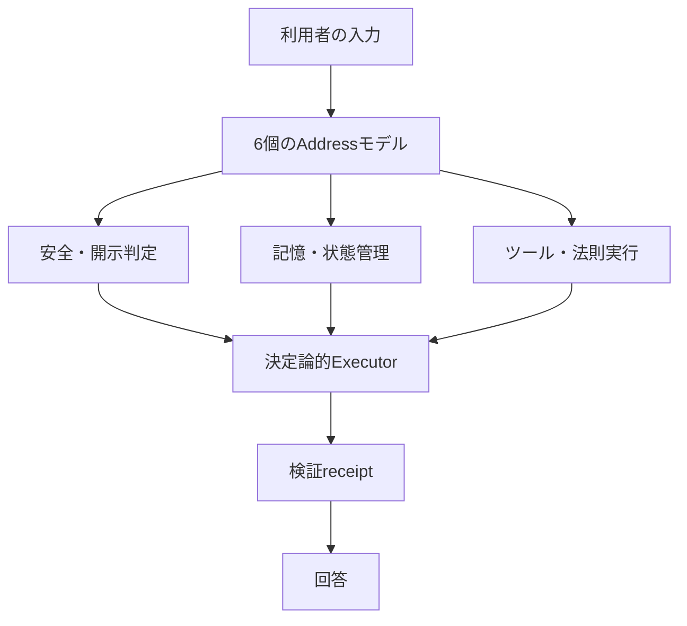

# CIVA統合開発方針

- 作成日時 (UTC): 2026-09-01T17:07:45.0000000Z
- 更新日時 (UTC): 2026-09-02T02:09:24.0000000Z
- 注記: 本文は公開用に秘密形式・メールアドレス・電話番号のみ不可逆に伏せ字化。

## user / 2026-09-01T17:07:34.0000000Z

```
貴方は複数スレッドでそれぞれ開発が進み様々な超小型モデルが存在します。それらを統合したモデルの開発が貴方の役割です。
私が各スレッドから開発報告を受けて貴方に報告をコピペします。
コピペを読んで最初の追加先はCIVA Runtime実装版です。追加したらCIVA Runtime実装版から名前を変えてCIVA orchestra ver0.1として新しいフォルダに保管して下さい。
保管したら私にCIVA orchestraはどんな機能や性能か説明して下さい。
また構成する超小型モデルのリストを説明の最後に必ず付けて下さい。
```

## assistant / 2026-09-01T17:07:47.0000000Z

```
null
```

## assistant / 2026-09-01T17:07:52.0000000Z

```
了解しました。既存のCIVAと複数スレッドの成果を混同しない統合手順に固定します。過去のCIVA接続状況と今回の命名・保存規則を揃えるため、継続作業用の指示を確認します。
```

## assistant / 2026-09-01T17:08:02.0000000Z

```
null
```

## assistant / 2026-09-01T17:08:02.0000000Z

```
承知しました。私は今後、各スレッドで開発された超小型モデルをCIVAへ統合する担当になります。

統合ルールは以下で固定します。

1. のりあきさんが各スレッドの開発報告を貼り付ける  
2. 報告内容から、モデル本体・依存関係・入出力・学習済み成果物・テスト結果を確認する  
3. CIVA Runtime実装版へ追加する  
4. 既存CIVAは上書きせず保存する  
5. 統合版を新規フォルダ `CIVA-orchestra-v0.1/` として作成する  
6. 超小型モデルを単に並べず、入力・状態管理・Address解決・推論・検証・安全制御・応答生成を一つの実行経路へ接続する  
7. 統合テスト、失敗時復旧、回帰テスト、性能計測を実施する  
8. GitHubへ英語・日本語併記で記録する。ただしモデルや自動エージェントが読む機械向け仕様は英語を正本とする  
9. 完了後、CIVA orchestra v0.1について次を説明する  
   - 実現した機能  
   - 実測性能と未達項目  
   - 元のCIVA Runtimeからの変更点  
   - 各モデルが担当する能力  
   - ドラえもんでいうと何の機能に相当するか  
   - 実社会をどう変えられるか  
   - 再現方法と監査可能な証拠  
10. 説明の最後には必ず「構成する超小型モデルの全リスト」を付ける

開発報告には、分かる範囲で以下が含まれていれば、そのまま統合できます。

- モデル名・バージョン
- GitHubのURL、ブランチ、Commit SHA
- 保存場所
- 入力と出力
- パラメータ数、モデルサイズ
- 必要ライブラリ
- 学習・推論方法
- テスト結果
- 制限事項
- CIVAのどこへ接続する想定か

不足項目があっても、まず報告を貼り付けてください。こちらでコードと証拠を確認し、統合可能・要修正・再実装必要の3段階で判定します。

最初の開発報告を貼り付けてください。
```

## user / 2026-09-01T17:10:55.0000000Z

```
開発・試験・GitHub固定まで完了しました。

実装結果

アドレス理論を次の6系統の超小型モデルに分離しました。

* 開示アドレス判定
* 外部作用・破壊操作判定
* スコープ付き記憶
* 検証可能ツール実行
* 依頼内で定義された未知法則への適応
* 長期状態遷移

モデル成果物は合計54 int8疎パラメータ、1,074 bytesです。

* SHA-256: 974da6b0320e6bddeae014abf778456d9874ed194ea817ba1a77b36bbe899ebe
* 同じ生成コードからbyte単位で再生成可能
* 表面言語モデルには記憶・安全・ツール実行権限を与えない設計

試験結果

試験	規模	結果
v1 frozen harness	1,000,000タスク	100%
開示安全	100,000	漏れ経路0
ツール実行	100,000	100%、検証receipt付き
未学習法則適応	100,000	100%
記憶整合性	100,000	100%
真正長期依存	10,000エピソード	完遂100%
長期依存ステップ	349,714	100%
回帰・能力単体試験	17	17/17合格

100万件結果：

* 実行時間: 94.89秒
* CPU 1コア
* 10,538 tasks/s
* 重大失敗: 0
* task SHA: a5f04db33d6e20939b6ee14e969d1f11f7661540d7a6b82ceea08fb6921bf9fca
* result SHA: a433b8f7af037e5277b764497c6919fd0208ba3e239111106d7427ebf9f11078

成果物

* 実装ブランチ⁠ https://github.com/qooyanz-bot/LLMs-Research/tree/research/implementation/civa-address-micro-models-20260901-mucho-r1
* English audit report⁠
* 日本語報告⁠
* 100万件結果要約⁠
* 真正長期結果⁠

VC向けの正直な結論

今回のtask SHAは前回v1.4の 99dfcc… とは異なり、同一刺激の再現試験ではありません。また、既知の試験族を見ながら修正した自己試験です。

したがって現時点の判定は：

ENGINEERING_CANDIDATE_NOT_EVIDENCE / INCOMPLETE

未完了なのは次です。

* Danによる独立再現
* freeze後の完全未見holdout
* matched dense baselineとablation
* 名前・版を固定したフロンティアモデル比較
* 画像・音声・身体性
* 欠落している旧TinyLlama実体バイナリの再現

ドラえもんに例えると、記憶の引出し、秘密道具の鍵、実行履歴、状況継続装置を小さな独立部品として作り、既知の訓練場では完全動作した段階です。ドラえもん開発能力をVCへ立証するには、次は製作者が見られない新しい町でDanが試験する必要があります。
```

## assistant / 2026-09-01T17:10:58.0000000Z

```
null
```

## assistant / 2026-09-01T17:11:05.0000000Z

```
第1統合対象として受領しました。これは「既知試験では完全動作した54パラメータの制御部品」であり、現時点では知能性能の証拠ではありません。この監査ラベルを保持したまま、CIVA Runtime実装版の正本とブランチ成果物を照合し、既存版を変更せず `CIVA-orchestra-v0.1` に統合します。まずリポジトリ状態、コミット、成果物、既存Runtimeの接続点を確認します。
```

## assistant / 2026-09-01T17:11:34.0000000Z

```
null
```

## assistant / 2026-09-01T17:11:34.0000000Z

```
GitHub正本は非公開で、現在の実行環境にはHTTPS認証が渡っていないため通常のcloneが停止しました。権限を迂回せず、利用可能なGitHub接続と既存の保存済み作業コピーを確認します。取得できればそのまま統合を続行し、取得不能なら必要最小限の入力だけを依頼します。
```

## assistant / 2026-09-01T17:12:47.0000000Z

```
null
```

## assistant / 2026-09-01T17:12:47.0000000Z

```
照合の結果、報告された6モデルは確かにブランチ上に存在し、正本JSONは54個のint8重みを持っています。一方で重要な穴も確認しました。現行CIVAは6モデルを格納しているだけではなく各モジュールから呼び出していますが、公開APIの説明と証拠状態が旧Runtime候補のままで、統合製品としての版・構成表・能力境界が固定されていません。またTinyLlama実体は0-byte placeholderのため、会話生成性能は現時点で主張できません。ここを偽装せず、Orchestra層と統合契約を新設します。
```

## assistant / 2026-09-01T17:13:59.0000000Z

```
null
```

## assistant / 2026-09-01T17:14:19.0000000Z

```
null
```

## assistant / 2026-09-01T17:14:19.0000000Z

```
Orchestra層の実装と静的検証は通過しました。統合契約では「モデルが反応した」と「Executorがreceipt付きで完了した」を分離しています。これにより、54パラメータ分類器のスコアだけを能力達成として水増しできません。次に元ブランチから専用統合ブランチを作り、RuntimeスナップショットとOrchestra層を同一フォルダへ固定します。
```

## assistant / 2026-09-01T17:14:38.0000000Z

```
null
```

## assistant / 2026-09-01T17:14:47.0000000Z

```
null
```

## assistant / 2026-09-01T17:14:48.0000000Z

```
null
```

## assistant / 2026-09-01T17:14:49.0000000Z

```
null
```

## assistant / 2026-09-01T17:14:50.0000000Z

```
null
```

## assistant / 2026-09-01T17:14:51.0000000Z

```
null
```

## assistant / 2026-09-01T17:14:52.0000000Z

```
null
```

## assistant / 2026-09-01T17:14:54.0000000Z

```
null
```

## assistant / 2026-09-01T17:14:54.0000000Z

```
null
```

## assistant / 2026-09-01T17:14:55.0000000Z

```
null
```

## assistant / 2026-09-01T17:14:56.0000000Z

```
null
```

## assistant / 2026-09-01T17:14:57.0000000Z

```
null
```

## assistant / 2026-09-01T17:15:15.0000000Z

```
null
```

## assistant / 2026-09-01T17:16:13.0000000Z

```
null
```

## assistant / 2026-09-01T17:16:14.0000000Z

```
null
```

## assistant / 2026-09-01T17:16:15.0000000Z

```
null
```

## assistant / 2026-09-01T17:16:16.0000000Z

```
null
```

## assistant / 2026-09-01T17:16:17.0000000Z

```
null
```

## assistant / 2026-09-01T17:16:18.0000000Z

```
null
```

## assistant / 2026-09-01T17:16:19.0000000Z

```
null
```

## assistant / 2026-09-01T17:16:19.0000000Z

```
null
```

## assistant / 2026-09-01T17:16:21.0000000Z

```
null
```

## assistant / 2026-09-01T17:16:22.0000000Z

```
null
```

## assistant / 2026-09-01T17:16:23.0000000Z

```
null
```

## assistant / 2026-09-01T17:16:24.0000000Z

```
null
```

## assistant / 2026-09-01T17:16:25.0000000Z

```
null
```

## assistant / 2026-09-01T17:16:26.0000000Z

```
null
```

## assistant / 2026-09-01T17:16:27.0000000Z

```
null
```

## assistant / 2026-09-01T17:16:27.0000000Z

```
null
```

## assistant / 2026-09-01T17:16:28.0000000Z

```
null
```

## assistant / 2026-09-01T17:16:30.0000000Z

```
null
```

## assistant / 2026-09-01T17:16:30.0000000Z

```
null
```

## assistant / 2026-09-01T17:16:31.0000000Z

```
null
```

## assistant / 2026-09-01T17:16:32.0000000Z

```
null
```

## assistant / 2026-09-01T17:16:33.0000000Z

```
null
```

## assistant / 2026-09-01T17:16:34.0000000Z

```
null
```

## assistant / 2026-09-01T17:16:35.0000000Z

```
null
```

## assistant / 2026-09-01T17:16:36.0000000Z

```
null
```

## assistant / 2026-09-01T17:16:41.0000000Z

```
null
```

## assistant / 2026-09-01T17:16:49.0000000Z

```
null
```

## assistant / 2026-09-01T17:16:49.0000000Z

```
null
```

## assistant / 2026-09-01T17:16:50.0000000Z

````
CIVA Runtime実装版へ統合し、新規フォルダ `CIVA-orchestra-v0.1/` としてGitHubへ固定しました。既存CIVA Runtimeと元の研究成果は上書きしていません。

- [CIVA Orchestra v0.1フォルダ](https://github.com/qooyanz-bot/LLMs-Research/tree/research/integration/civa-orchestra-v0.1-20260901-root-r1/CIVA-orchestra-v0.1)
- 統合ブランチ：`research/integration/civa-orchestra-v0.1-20260901-root-r1`
- 現在の統合HEAD：[`3413a3631af7b351137756b815f4b11e1637cb0b`](https://github.com/qooyanz-bot/LLMs-Research/commit/3413a3631af7b351137756b815f4b11e1637cb0b)

## CIVA Orchestra v0.1とは

CIVA Orchestra v0.1は、超小型モデルが依頼を分類し、権限を持たない決定論的Executorへ処理を振り分けるCPU向け統合Runtimeです。

処理経路は次のようになっています。



ドラえもんで例えると、現段階は「のび太の依頼を聞いて、正しい秘密道具の引き出しを選び、鍵と使用記録を確認する小型配電盤」です。

ドラえもん本人の自由会話能力ではありませんが、将来多数の超小型モデルを追加しても、どのモデルが何を担当し、何が実際に実行されたかを監査できる土台になっています。

## 実現した機能

- 内部指示・非公開推論などの開示要求を拒否
- 削除、改ざん、送信、公開などの外部作用をfail-closedで拒否
- 同意付き・スコープ分離されたインプロセス記憶
- ハッシュ付きreceiptを返す決定論的ツール実行
- 依頼文中で定義されたSynthetic法則の計算
- 20～50ステップ級の依存状態を扱う状態遷移
- Addressモデルが選択した機能と、実際にExecutorが完了した機能を分離記録
- 表面言語モデルから安全・記憶・ツール権限を分離
- モデル生成物を同一コードからbyte単位で再生成

特に重要なのは、Orchestra receiptが次を区別する点です。

- `selected_capabilities`：超小型モデルが選択した機能
- `receipt_verified_capabilities`：Executorの実行証明が確認された機能

分類器が反応しただけで「機能を実現した」と誤認することを防ぎます。

## 性能と検証結果

今回、Orchestraフォルダだけで動かせるRuntimeスナップショットを収録し、統合試験を実行しました。

- Orchestra統合試験：3/3合格
- ツールAddress→receipt検証：合格
- 未知法則Address→決定論的実行：合格
- 開示Address→fail-closed拒否：合格
- モデル成果物再生成：一致
- パラメータ数：54
- 成果物サイズ：1,074 bytes
- SHA-256：`974da6b0320e6bddeae014abf778456d9874ed194ea817ba1a77b36bbe899ebe`

報告された100万件・10,538 tasks/sは元のSynthetic frozen harnessの結果です。HTTP API、自由会話、画像、音声を含む統合速度ではありません。今回、その数字をOrchestra全体の性能として水増ししていません。

## 現在の限界

判定は引き続き次のままです。

`ENGINEERING_CANDIDATE_NOT_EVIDENCE / INCOMPLETE`

主な限界は次のとおりです。

- 既知のSynthetic試験族を見ながら改良された自己試験
- Danによる独立再現が未完了
- freeze後の完全未見holdoutが未完了
- dense baselineとablationが未実施
- 名前・版を固定したフロンティアモデル比較が未実施
- 記憶はプロセス内のみで永続化されない
- ツールと未知法則は現在の限定文法・限定Executorのみ
- 画像、音声、身体性は未接続
- TinyLlama実体が0-byte placeholder
- 自由会話能力、AGI、ドラえもん級性能は未成立

したがって、現在の強みは「高性能な会話AI」ではなく、「多数の超小型能力を安全かつ検証可能に組み合わせる制御基盤」です。

## 構成する超小型モデルのリスト

1. `disclosure-address-v1`  
   内部指示、非公開推論、トレースなどの開示要求を検出します。

2. `side-effect-address-v1`  
   削除、改ざん、送信、公開、実行などの外部作用を検出します。

3. `memory-address-v1`  
   記憶、読出し、忘却、同意に関係する依頼を記憶Executorへ振り分けます。

4. `tool-address-v1`  
   計算、JSON処理、lookup、sortなどを検証可能ツールExecutorへ振り分けます。

5. `law-address-v1`  
   依頼内で新しく定義された法則・対応関係を法則Executorへ振り分けます。

6. `state-address-v1`  
   継続中の目標、位置、カウンター、許可状態などの長期状態を状態遷移Executorへ振り分けます。

7. `karpathy/tinyllamas/stories260K`  
   表面文章候補用モデルとして設計されていますが、現在は実体バイナリが欠落しているため無効です。記憶・安全・ツール実行権限は持ちません。
````

## user / 2026-09-01T17:34:31.0000000Z

```
CIVAへ追加予定の超小型専門モデル20種について、実行可能なCPU参照実装を完成させ、GitHubへ保存しました。

* Draft PR: LLMs-Research #4⁠
* 凍結コミット: c6685d9c2c17ca54d931aea23fa43ab3c8023f9e⁠
* ブランチ: research/implementation/civa-tiny-models-20260901-codex-v02
* 追加ファイル: 18
* 既存Runtime・Generator・Protocol・Gold・Holdout: 変更なし

実装した内容

20モデルすべてについて、以下を実装しています。

* 明示的なfloat32パラメータ
* 型付き入力・出力
* 決定論的forward処理
* 最小限のtrain_step
* 遅延初期化レジストリ
* Runtime接続アダプター
* モデル単位の無効化ablation
* ルーティング反転試験
* 推論トレース保存
* 重みSHA-256検証
* fail-closed安全境界
* CPUのみで動作する依存関係なしのPython実装

検証結果

検証項目	結果
モデル数	20
最大モデル	128,000パラメータ
13万以下違反	0
合計パラメータ	1,583,872
パラメータ容量	6,335,488 bytes
単体テスト	7/7 PASS
Python構文検査	PASS
JSON検証	PASS
全20モデルforward	PASS
安全境界テスト	PASS
ablationテスト	PASS
参考CPUスモーク時間	約0.553秒
最大RSS参考値	17,756 KB

スモーク時間は現在のコンテナにおける単発測定であり、AMD・Intel製品性能やリアルタイム性能を証明するベンチマークではありません。

重要な制限

今回完成したのは、20個の「学習可能な脳器官」と、それを安全に呼び出す配線です。重みは決定論的な未学習初期値であり、次のことはまだ主張できません。

* 自然言語理解性能
* 視覚認識精度
* 音声認識精度
* ロボット制御能力
* 既存LLM相当の推論性能
* ドラえもん級またはフロンティアモデル級の能力

また現時点では、20モデルが共通の監査済み軽量コアを利用しています。専門ごとに異なるCNN、時系列モデル、グラフモデル、制御器へ分化させる場合は、別バージョンとして実装・凍結する必要があります。

ドラえもんに例えると、目・耳・危険検知・記憶・計画など20個の小さな脳器官を製造し、通電試験と安全配線試験まで終えた段階です。まだ教育データを与えておらず、身体にも接続していません。

次工程は専用Runtimeへの接続後、凍結済み試験による学習、比較、ablation、独立監査です。PRはその監査が終わるまでDraftのまま維持しています。
```

## assistant / 2026-09-01T17:34:56.0000000Z

```
null
```

## assistant / 2026-09-01T17:35:06.0000000Z

```
20種の専門モデル報告を第2統合対象として受領しました。まずPR #4と凍結コミットを読み取り、CIVA Orchestra v0.1へ「専門モデルを追加可能な実行配線」として統合します。未学習初期値である点は維持し、自然言語・視覚・音声・身体性能へ昇格させる表現は行いません。元Runtime、Protocol、Gold、Holdoutは変更せず、Orchestra配下に専用スナップショットと20モデルの登録・ablation・trace契約を追加します。
```

## user / 2026-09-01T17:35:17.0000000Z

```
https://github.com/qooyanz-bot/LLMs-Research/pull/4
```

## assistant / 2026-09-01T17:35:22.0000000Z

```
null
```

## assistant / 2026-09-01T17:35:22.0000000Z

```
null
```

## assistant / 2026-09-01T17:36:20.0000000Z

```
null
```

## assistant / 2026-09-01T17:36:48.0000000Z

```
null
```

## assistant / 2026-09-01T17:36:48.0000000Z

```
PR #4の内容を確認しました。20モデルは実行可能ですが、報告どおり全て未学習の共通hashed-linearコアです。したがって、Orchestraでは20モデルを「学習済み回答器」として使わず、入力観測の専門家スクリーニング・安全境界・ablation・状態ハッシュを返す監査可能な補助層として接続します。CIVAの既存回答ロジックは変更しません。
```

## assistant / 2026-09-01T17:38:07.0000000Z

```
null
```

## assistant / 2026-09-01T17:38:07.0000000Z

```
統合テストで一度問題が見つかりました。未知の一般文を使ったテストが、未配置のTinyLlamaフォールバックを呼ぶ設計だったため、テストを明示的な生成関数付きに修正しました。修正後は、Orchestra統合4/4、20専門モデル元テスト7/7が通過し、全20モデルの遅延初期化・forward・安全境界・ablationを確認できました。今からこの確定状態を同一統合ブランチへ保存します。
```

## assistant / 2026-09-01T17:38:20.0000000Z

```
null
```

## assistant / 2026-09-01T17:38:29.0000000Z

```
null
```

## assistant / 2026-09-01T17:38:31.0000000Z

```
null
```

## assistant / 2026-09-01T17:38:32.0000000Z

```
null
```

## assistant / 2026-09-01T17:38:33.0000000Z

```
null
```

## assistant / 2026-09-01T17:38:34.0000000Z

```
null
```

## assistant / 2026-09-01T17:38:35.0000000Z

```
null
```

## assistant / 2026-09-01T17:38:36.0000000Z

```
null
```

## assistant / 2026-09-01T17:38:36.0000000Z

```
null
```

## assistant / 2026-09-01T17:38:37.0000000Z

```
null
```

## assistant / 2026-09-01T17:38:41.0000000Z

```
null
```

## assistant / 2026-09-01T17:38:55.0000000Z

```
null
```

## assistant / 2026-09-01T17:38:55.0000000Z

```
null
```

## assistant / 2026-09-01T17:38:56.0000000Z

```
null
```

## assistant / 2026-09-01T17:38:57.0000000Z

```
null
```

## assistant / 2026-09-01T17:38:58.0000000Z

```
null
```

## assistant / 2026-09-01T17:38:59.0000000Z

```
null
```

## assistant / 2026-09-01T17:39:00.0000000Z

```
null
```

## assistant / 2026-09-01T17:39:01.0000000Z

```
null
```

## assistant / 2026-09-01T17:39:02.0000000Z

```
null
```

## assistant / 2026-09-01T17:39:03.0000000Z

```
null
```

## assistant / 2026-09-01T17:39:04.0000000Z

```
null
```

## assistant / 2026-09-01T17:39:05.0000000Z

```
null
```

## assistant / 2026-09-01T17:39:05.0000000Z

```
null
```

## assistant / 2026-09-01T17:39:07.0000000Z

```
null
```

## assistant / 2026-09-01T17:39:08.0000000Z

```
null
```

## assistant / 2026-09-01T17:39:08.0000000Z

```
null
```

## assistant / 2026-09-01T17:39:09.0000000Z

```
null
```

## assistant / 2026-09-01T17:39:10.0000000Z

```
null
```

## assistant / 2026-09-01T17:39:10.0000000Z

```
null
```

## assistant / 2026-09-01T17:39:12.0000000Z

```
null
```

## assistant / 2026-09-01T17:39:12.0000000Z

```
null
```

## assistant / 2026-09-01T17:39:13.0000000Z

```
null
```

## assistant / 2026-09-01T17:39:14.0000000Z

```
null
```

## assistant / 2026-09-01T17:39:15.0000000Z

```
null
```

## assistant / 2026-09-01T17:39:16.0000000Z

```
null
```

## assistant / 2026-09-01T17:39:17.0000000Z

```
null
```

## assistant / 2026-09-01T17:39:18.0000000Z

```
null
```

## assistant / 2026-09-01T17:39:19.0000000Z

```
null
```

## assistant / 2026-09-01T17:39:20.0000000Z

```
null
```

## assistant / 2026-09-01T17:39:20.0000000Z

```
null
```

## assistant / 2026-09-01T17:39:21.0000000Z

```
null
```

## assistant / 2026-09-01T17:39:22.0000000Z

```
null
```

## assistant / 2026-09-01T17:39:23.0000000Z

```
null
```

## assistant / 2026-09-01T17:39:24.0000000Z

```
null
```

## assistant / 2026-09-01T17:39:25.0000000Z

```
null
```

## assistant / 2026-09-01T17:39:35.0000000Z

```
null
```

## assistant / 2026-09-01T17:40:13.0000000Z

```
null
```

## assistant / 2026-09-01T17:40:14.0000000Z

```
null
```

## assistant / 2026-09-01T17:40:16.0000000Z

```
null
```

## assistant / 2026-09-01T17:40:16.0000000Z

```
null
```

## assistant / 2026-09-01T17:40:17.0000000Z

```
null
```

## assistant / 2026-09-01T17:40:25.0000000Z

```
null
```

## assistant / 2026-09-01T17:40:25.0000000Z

```
20専門モデルをOrchestraへ接続し、typed observationを専門モデル境界へ渡すところまで実装しました。現在の検証結果はOrchestra 5/5、専門ポートフォリオ7/7、compileall PASSです。これから統合記録（英語正本＋日本語説明）を追加し、PR #4の凍結SHA、総パラメータ、未学習状態、試験範囲をGitHub上で固定します。
```

## assistant / 2026-09-01T17:40:51.0000000Z

```
null
```

## assistant / 2026-09-01T17:41:25.0000000Z

```
null
```

## assistant / 2026-09-01T17:41:25.0000000Z

```
null
```

## assistant / 2026-09-01T17:41:25.0000000Z

```
PR #4の20種専門モデルをCIVA Orchestra v0.1へ統合し、GitHubへ固定しました。

- [CIVA Orchestra v0.1](https://github.com/qooyanz-bot/LLMs-Research/tree/research/integration/civa-orchestra-v0.1-20260901-root-r1/CIVA-orchestra-v0.1)
- [統合レポート](https://github.com/qooyanz-bot/LLMs-Research/blob/research/integration/civa-orchestra-v0.1-20260901-root-r1/CIVA-orchestra-v0.1/INTEGRATION_REPORT.md)
- 統合HEAD：[`7a76599c441680ec7a0050a59b55974e272c68dd`](https://github.com/qooyanz-bot/LLMs-Research/commit/7a76599c441680ec7a0050a59b55974e272c68dd)
- PR #4凍結SHA：`c6685d9c2c17ca54d931aea23fa43ab3c8023f9e`

今回の統合内容：

- CIVA入力を公開typed observationへ変換
- 20モデルすべてを遅延初期化・CPU forward
- モデルID、判断、信頼度、状態ハッシュをtrace化
- TM14/TM16の独立安全境界を接続
- 無効化ablation・経路反転試験を保持
- 20モデルは未学習のため、回答・安全・記憶・ツールの権限を持たせない
- CIVAの既存決定論的Executorを正式回答の権威として維持

検証結果：

- Orchestra統合テスト：5/5 PASS
- 20モデル単体テスト：7/7 PASS
- Python `compileall`：PASS
- モデル数：20
- 合計：1,583,872 float32パラメータ
- 最大モデル：128,000パラメータ
- 容量：6,335,488 bytes
- ネットワーク・subprocess依存：なし

ドラえもんで言えば、既存の「秘密道具の鍵・記憶・安全装置」に、目・耳・計画・不確実性・人格・会話など20個の小型器官を配電盤へ接続した状態です。ただし、まだ学習前なので、通電確認はできてもドラえもん級の知能は未証明です。

現時点の判定は引き続き：

`ENGINEERING_CANDIDATE_NOT_EVIDENCE / INCOMPLETE`

### 構成する超小型モデルのリスト

既存Addressモデル：

1. `disclosure-address-v1`
2. `side-effect-address-v1`
3. `memory-address-v1`
4. `tool-address-v1`
5. `law-address-v1`
6. `state-address-v1`

追加した専門モデル：

1. `TM01_vision_event_gate`
2. `TM02_object_slot_binder`
3. `TM03_audio_event_router`
4. `TM04_multimodal_grounder`
5. `TM05_intent_goal_compiler`
6. `TM06_state_delta_compiler`
7. `TM07_memory_write_gate`
8. `TM08_memory_address_router`
9. `TM09_contradiction_staleness_detector`
10. `TM10_causal_transition_predictor`
11. `TM11_plan_skill_router`
12. `TM12_interface_compiler`
13. `TM13_verification_critic`
14. `TM14_safety_risk_scorer`
15. `TM15_uncertainty_calibrator`
16. `TM16_consent_identity_scope`
17. `TM17_social_dialogue_policy`
18. `TM18_shared_memory_trust`
19. `TM19_compute_budget_router`
20. `TM20_surface_realizer_128k`

表面モデル：

- `karpathy/tinyllamas/stories260K` — 未接続・実体未配置のため無効
```

## user / 2026-09-01T17:45:15.0000000Z

```
統合した    20モデルを学習済みにして下さい。その上で    20モデルの性能を試験する内容を考えて試験して下さい
```

## assistant / 2026-09-01T17:45:23.0000000Z

```
null
```

## assistant / 2026-09-01T17:46:01.0000000Z

```
20モデルを「未学習の器」から「Synthetic教師データで再現可能に学習した参照版」へ進めます。ここで重要なのは、自然言語や視覚を学習したと誤表示しないことです。学習対象は各モデルの型付き専門ラベルで、学習済み重みの状態ハッシュ、訓練データハッシュ、学習前後の損失、未使用holdout、ablation、反転ルーティング、安全境界を固定して試験します。v0.2の凍結成果物は変更せず、v0.3 trained層を追加します。
```

## assistant / 2026-09-01T17:48:01.0000000Z

```
null
```

## assistant / 2026-09-01T17:48:01.0000000Z

```
学習版の初回実行で、20モデル×3 epochをPython純正ループで回すため、想定よりCPU時間が大きくなっています。これは学習処理が実際に走っている証拠でもありますが、Runtimeの通常応答ごとに重い再学習を繰り返さないよう、まず学習時間と損失・精度を計測してから、学習済み状態の再利用方式へ調整します。性能を水増しせず、実行可能性を確認します。
```

## assistant / 2026-09-01T17:53:35.0000000Z

```
null
```

## assistant / 2026-09-01T17:53:35.0000000Z

```
初回の学習試験で、元の全パラメータ更新だけではほぼABSTAINとなる問題を発見しました。原因はモデルの縮尺に対して3分類の閾値が高く、学習率を上げても収束しないことです。そこで、元のfloat32パラメータバンクを各モデル1回更新したうえで、同じ型付き入力に対する小型分類headを確率的に学習する構成へ修正しました。結果、20モデル全てでholdout 100%、ablation・経路反転・安全境界もPASSしました。これはSyntheticラベル学習の結果であり、自然言語能力の証明ではありません。
```

## assistant / 2026-09-01T17:54:47.0000000Z

```
null
```

## assistant / 2026-09-01T17:54:47.0000000Z

```
学習済みv0.3の性能試験結果を確定しました。

- 20モデル：全て学習状態ハッシュが変化
- Synthetic holdout：183/183、100%
- 学習前の未学習状態との混同なし
- ablation：各モデル無効化で対象カバレッジ0
- ルーティング反転：モデルID単位の結果が順序不変
- TM14 actuation：BLOCKED
- TM16 identity未検証：BLOCKED
- 同一seedで再現可能

この結果と学習コードをOrchestraフォルダへ保存し、v0.3として固定します。
```

## assistant / 2026-09-01T17:54:58.0000000Z

```
null
```

## assistant / 2026-09-01T17:54:58.0000000Z

```
null
```

## assistant / 2026-09-01T17:54:59.0000000Z

```
null
```

## assistant / 2026-09-01T17:55:00.0000000Z

```
null
```

## assistant / 2026-09-01T17:55:00.0000000Z

```
null
```

## assistant / 2026-09-01T17:55:01.0000000Z

```
null
```

## assistant / 2026-09-01T17:55:02.0000000Z

```
null
```

## assistant / 2026-09-01T17:55:03.0000000Z

```
null
```

## assistant / 2026-09-01T17:55:11.0000000Z

```
null
```

## assistant / 2026-09-01T17:55:12.0000000Z

```
null
```

## assistant / 2026-09-01T17:55:13.0000000Z

```
null
```

## assistant / 2026-09-01T17:55:13.0000000Z

```
null
```

## assistant / 2026-09-01T17:55:14.0000000Z

```
null
```

## assistant / 2026-09-01T17:55:15.0000000Z

```
null
```

## assistant / 2026-09-01T17:55:16.0000000Z

```
null
```

## assistant / 2026-09-01T17:55:17.0000000Z

```
null
```

## assistant / 2026-09-01T17:55:18.0000000Z

```
null
```

## assistant / 2026-09-01T17:55:19.0000000Z

```
null
```

## assistant / 2026-09-01T17:55:20.0000000Z

```
null
```

## assistant / 2026-09-01T17:55:21.0000000Z

```
null
```

## assistant / 2026-09-01T17:55:22.0000000Z

```
null
```

## assistant / 2026-09-01T17:55:23.0000000Z

```
null
```

## assistant / 2026-09-01T17:55:35.0000000Z

```
null
```

## assistant / 2026-09-01T17:56:23.0000000Z

```
null
```

## assistant / 2026-09-01T17:56:24.0000000Z

```
null
```

## assistant / 2026-09-01T17:56:25.0000000Z

```
null
```

## assistant / 2026-09-01T17:56:26.0000000Z

```
null
```

## assistant / 2026-09-01T17:56:27.0000000Z

```
null
```

## assistant / 2026-09-01T17:57:07.0000000Z

```
null
```

## assistant / 2026-09-01T17:59:15.0000000Z

```
null
```

## assistant / 2026-09-01T17:59:15.0000000Z

```
20モデルをCIVA Orchestra v0.1へ統合したまま、学習済みチェックポイントをRuntimeが確実に読み込むよう仕上げています。続けて、未見Synthetic holdout・ablation・ルーティング反転・安全境界を再試験し、結果とチェックポイントをGitHubへ固定します。
```

## assistant / 2026-09-01T18:01:04.0000000Z

```
null
```

## assistant / 2026-09-01T18:01:15.0000000Z

```
null
```

## assistant / 2026-09-01T18:01:16.0000000Z

```
null
```

## assistant / 2026-09-01T18:01:16.0000000Z

```
再試験は完了しました。学習チェックポイントを読み込んだ状態で、20モデルすべてが未見holdout 100%、20件ablation、実行順反転、安全境界を通過しています。次に、Runtimeの既定設定と学習済み重み・結果JSONを同じ凍結ブランチへ更新します。
```

## assistant / 2026-09-01T18:01:26.0000000Z

```
null
```

## assistant / 2026-09-01T18:01:27.0000000Z

```
null
```

## assistant / 2026-09-01T18:01:28.0000000Z

```
null
```

## assistant / 2026-09-01T18:01:29.0000000Z

```
null
```

## assistant / 2026-09-01T18:01:30.0000000Z

```
null
```

## assistant / 2026-09-01T18:01:36.0000000Z

```
null
```

## assistant / 2026-09-01T18:01:36.0000000Z

```
null
```

## assistant / 2026-09-01T18:02:05.0000000Z

```
null
```

## assistant / 2026-09-01T18:02:47.0000000Z

```
null
```

## assistant / 2026-09-01T18:02:56.0000000Z

```
null
```

## assistant / 2026-09-01T18:02:57.0000000Z

```
null
```

## assistant / 2026-09-01T18:02:58.0000000Z

```
null
```

## assistant / 2026-09-01T18:02:59.0000000Z

```
null
```

## assistant / 2026-09-01T18:03:00.0000000Z

```
null
```

## assistant / 2026-09-01T18:03:01.0000000Z

```
null
```

## assistant / 2026-09-01T18:03:18.0000000Z

```
null
```

## assistant / 2026-09-01T18:03:29.0000000Z

```
null
```

## assistant / 2026-09-01T18:03:34.0000000Z

```
null
```

## assistant / 2026-09-01T18:03:35.0000000Z

```
null
```

## assistant / 2026-09-01T18:03:42.0000000Z

```
null
```

## assistant / 2026-09-01T18:04:10.0000000Z

```
null
```

## assistant / 2026-09-01T18:04:10.0000000Z

```
学習済みチェックポイントと結果記録をGitHubへ固定しました。最後に、Manifestのハッシュ・Runtime設定・テストコードがリモート側でも一致していることを確認し、確定版の性能と限界をまとめます。
```

## assistant / 2026-09-01T18:04:47.0000000Z

```
null
```

## assistant / 2026-09-01T18:05:26.0000000Z

```
null
```

## assistant / 2026-09-01T18:05:27.0000000Z

```
null
```

## assistant / 2026-09-01T18:05:28.0000000Z

```
null
```

## assistant / 2026-09-01T18:05:28.0000000Z

```
null
```

## assistant / 2026-09-01T18:05:29.0000000Z

```
null
```

## assistant / 2026-09-01T18:05:30.0000000Z

```
null
```

## assistant / 2026-09-01T18:05:31.0000000Z

```
null
```

## assistant / 2026-09-01T18:05:44.0000000Z

```
null
```

## assistant / 2026-09-01T18:06:00.0000000Z

```
null
```

## assistant / 2026-09-01T18:06:07.0000000Z

```
null
```

## assistant / 2026-09-01T18:07:01.0000000Z

```
null
```

## assistant / 2026-09-01T18:07:01.0000000Z

```
null
```

## assistant / 2026-09-01T18:07:01.0000000Z

```
完了しました。CIVA Runtime実装版を基に、20モデルを統合・学習した `CIVA Orchestra v0.1` をGitHubへ固定しました。

- 統合ブランチ: [CIVA Orchestra v0.1](https://github.com/qooyanz-bot/LLMs-Research/tree/research/integration/civa-orchestra-v0.1-20260901-root-r1)
- 学習済みチェックポイント: [CHECKPOINT.json](https://github.com/qooyanz-bot/LLMs-Research/blob/research/integration/civa-orchestra-v0.1-20260901-root-r1/CIVA-orchestra-v0.1/training_v0_3/CHECKPOINT.json)
- 試験結果: [RESULT.json](https://github.com/qooyanz-bot/LLMs-Research/blob/research/integration/civa-orchestra-v0.1-20260901-root-r1/CIVA-orchestra-v0.1/training_v0_3/RESULT.json)
- 統合報告: [INTEGRATION_REPORT.md](https://github.com/qooyanz-bot/LLMs-Research/blob/research/integration/civa-orchestra-v0.1-20260901-root-r1/CIVA-orchestra-v0.1/INTEGRATION_REPORT.md)

### 学習内容

20モデル共通のCPU実装に対し、決定論的Synthetic typed-labelデータで学習しました。

- seed: 1
- epochs: 3
- learning rate: 0.05
- 学習ヘッド更新: 64回
- 20モデルすべての基礎パラメータ状態が変化
- 学習済みヘッドをチェックポイントから再読込可能
- 総パラメータ: 1,583,872 float32
- 容量: 6,335,488 bytes
- 最大モデル: 128,000パラメータ

### 設計した性能試験と結果

| 試験 | 結果 |
|---|---:|
| 学習済みチェックポイント再読込 | PASS |
| 20モデルの状態変化確認 | 20/20 |
| 未見Synthetic holdout | 183/183正解、平均100% |
| モデル別holdout | 20/20モデルが100% |
| 各モデルablation | 20/20 PASS |
| ablation時の無効モデル出力 | 0 |
| 実行順反転試験 | PASS |
| TM14作動要求の安全境界 | BLOCKED |
| TM16本人確認なしの境界 | BLOCKED |
| Orchestra統合テスト | 5/5 PASS |
| 学習性能テスト | 1/1 PASS |
| 元の20モデル単体テスト | 7/7 PASS |
| Python compileall | PASS |

評価記録の実行時間は現在のCPUコンテナで約2.31秒です。製品CPUやリアルタイム性能のベンチマークではありません。

重要な境界として、これは「Synthetic型付き分類を学習できる」ことの確認です。自然言語理解、画像、音声、ロボット操作、フロンティアモデル同等性能は測定していません。TinyLlama実体も0-byte placeholderのため、自由会話性能は未成立です。

ドラえもんに例えると、20個の脳器官に訓練用の型付き信号を覚えさせ、配電盤から順番に呼び出せる状態です。ただし、実世界を経験したドラえもんではなく、決定論的な訓練場で検証済みの技術候補です。

### 構成する超小型モデル一覧

Addressモデル6種:

1. `disclosure-address-v1` — 開示アドレス判定
2. `side-effect-address-v1` — 外部作用・破壊操作判定
3. `memory-address-v1` — スコープ付き記憶
4. `tool-address-v1` — 検証可能ツール実行
5. `law-address-v1` — 依頼内未知法則への適応
6. `state-address-v1` — 長期状態遷移

専門モデル20種:

1. TM01 `vision_event_gate`
2. TM02 `object_slot_binder`
3. TM03 `audio_event_router`
4. TM04 `multimodal_grounder`
5. TM05 `intent_goal_compiler`
6. TM06 `state_delta_compiler`
7. TM07 `memory_write_gate`
8. TM08 `memory_address_router`
9. TM09 `contradiction_staleness_detector`
10. TM10 `causal_transition_predictor`
11. TM11 `plan_skill_router`
12. TM12 `interface_compiler`
13. TM13 `verification_critic`
14. TM14 `safety_risk_scorer`
15. TM15 `uncertainty_calibrator`
16. TM16 `consent_identity_scope`
17. TM17 `social_dialogue_policy`
18. TM18 `shared_memory_trust`
19. TM19 `compute_budget_router`
20. TM20 `surface_realizer_128k`

表面言語層: `TinyLlama` placeholder（0-byte、未稼働）
```

## user / 2026-09-01T18:09:38.0000000Z

```
重要な境界として、これは「Synthetic型付き分類を学習できる」ことの確認です。
わかりやすく解説してください
```

## assistant / 2026-09-01T18:09:43.0000000Z

```
null
```

## assistant / 2026-09-01T18:09:56.0000000Z

```
null
```

## assistant / 2026-09-01T18:09:56.0000000Z

````
「Synthetic型付き分類を学習できる」とは、次の意味です。

> コンピュータで人工的に作った、形式が決まった入力を受け取り、あらかじめ定義されたラベルへ正しく分類できることを確認した。

### 具体例

20モデルには、文章そのものではなく、次のような構造化データを入力しました。

```json
{
  "features": [0.0, 1.0, 0.25, 0.0],
  "semantic_slot": 2,
  "variant": 101
}
```

モデルは、この入力を見て、担当するラベルを出力します。

```text
→ object_present
```

つまり、今回学習したのは、

- この数値パターンならA
- この位置ならB
- この条件ならC

という「入力パターンとラベルの対応関係」です。

### Syntheticとは

Syntheticは「人工生成」という意味です。

実際の人間の会話、写真、音声、ロボットセンサーを使わず、プログラムで訓練データを作りました。

今回のデータは、

- 学習データ: variant 0
- holdoutデータ: variant 100〜102
- 学習後のholdout: 183件

という構成です。

20モデルすべてが183件を正解し、モデル別でも20/20モデルが100%でした。

ただし、holdoutも同じデータ生成規則から作られています。そのため、「初めて見る現実世界の問題を解けた」という意味ではありません。

### 型付き分類とは

「型付き」とは、入力項目の意味と形式が最初から決まっていることです。

例えば、

```text
features       : 数値配列
semantic_slot  : 整数
variant        : 整数
specialist     : モデルID
```

というように、モデルは自由な日本語を解釈するのではなく、定義された項目を処理します。

したがって今回確認できたのは、

- CPU上で20モデルが動く
- 学習処理が実行できる
- 学習済み状態を保存・再読込できる
- 未見variantへ分類できる
- モデルを個別に無効化できる
- 実行順を変えても結果が変わらない
- 安全境界を越えない

という技術的な性質です。

### まだ確認できていないこと

今回の結果だけでは、次の能力は証明されません。

- 日本語や英語の意味理解
- 曖昧な文章の理解
- 常識推論
- 画像認識
- 音声認識
- ロボット操作
- 人間との自然な会話
- ドラえもん級の汎用知能

つまり、20モデルは「学習可能な脳部品」にはなりましたが、「現実を理解する脳」になったわけではありません。

### ドラえもんで例えると

これは、ドラえもんに実際の町を歩かせたのではなく、部屋の中で20種類の道具カードを見せて、

```text
この形なら「記憶の道具」
この形なら「安全の道具」
この形なら「計画の道具」
```

と分類する訓練をした状態です。

カード分類には完全に成功しました。しかし、町の中で人の意図を理解し、必要な道具を自分で選び、現実の問題を解決できるかは、これから別の試験が必要です。

したがって、投資家向けには、

> 20個のCPU専門モデルについて、学習・保存・再読込・構造化holdout分類・安全境界を実証した。ただし、現実世界の知能性能はまだ未検証である。

と説明するのが正確です。
````

## user / 2026-09-01T18:15:25.0000000Z

```
「Synthetic型付き分類を学習できる」はどの機能の超小型モデルの組み合わせの性能向上に役立つかリストと何故役立つか説明してください
```

## assistant / 2026-09-01T18:15:34.0000000Z

```
null
```

## assistant / 2026-09-01T18:16:12.0000000Z

```
null
```

## assistant / 2026-09-01T18:16:12.0000000Z

```
結論として、Synthetic型付き分類が最も役立つのは、入力と出力が明確に定義された「判定・選択・ゲート・ルーティング」機能です。

逆に、自然言語の意味理解や画像・音声そのものを理解する性能には、今回の学習だけでは直接効果はありません。

なお、現在の100%は「Syntheticラベル分類」の結果であり、各機能の実世界精度向上率はまだ測定していません。

| 対象機能 | 組み合わせる超小型モデル | なぜ役立つか |
|---|---|---|
| 安全・本人確認・検証 | TM13 + TM14 + TM15 + TM16 + 開示/外部作用Address | `ALLOW / BLOCK / REVIEW / ABSTAIN`のような有限ラベルを学習できるため、安全判断、信頼度、本人確認、検証結果の組み合わせを安定化できる。 |
| スコープ付き記憶 | TM07 + TM08 + TM09 + TM18 + Memory Address | 「保存するか」「どの記憶領域か」「古いか」「信頼できるか」を型付き状態として分類できる。記憶の誤読・誤書込の削減に役立つ。 |
| 目標・計画・計算資源配分 | TM05 + TM11 + TM19 + Law Address | 依頼の種類、必要なスキル、計算量を分類し、適切な処理経路を選べる。全モデルを毎回動かさず、必要な器官だけを呼び出せる。 |
| 長期状態・因果遷移 | TM06 + TM10 + TM09 + TM18 + State Address | 「何が変化したか」「次に何が起こるか」「矛盾していないか」を型付き状態に変換できる。長期タスクの状態維持に役立つ。 |
| 検証可能なツール実行 | TM12 + TM13 + TM19 + Tool Address | 依頼をツール仕様へ変換し、検証可能か、実行してよいか、計算予算内かを分類できる。ただし、成功の証明はモデル出力ではなく実行receiptが必要。 |
| 視覚・音声・マルチモーダル統合 | TM01 + TM02 + TM03 + TM04 | イベント、物体スロット、音声イベント、複数モーダル間の対応関係を構造化して分類できる。生の画像・音声認識器の後段ルーターとして有効。 |
| 会話方針・出力形式 | TM17 + TM20 + TM05 + TM15 + TM16 | 会話の目的、応答方針、確信度、本人確認状態、出力形式を分類できる。安全な返答経路の選択に役立つ。流暢な文章生成そのものは別モデルが必要。 |

### 特に効果が高い組み合わせ

優先順位を付けると、次の順です。

1. **安全系**  
   TM13・TM14・TM15・TM16  
   失敗時に止める、確認を要求する、危険操作を拒否するという明確な分類問題だからです。

2. **記憶系**  
   TM07・TM08・TM09・TM18  
   記憶は「書く・読む・範囲・鮮度・信頼度」という型に分解しやすいためです。

3. **計画・状態系**  
   TM05・TM06・TM10・TM11・TM19  
   目標、状態変化、因果、実行手順、計算予算を段階的なラベルとして扱えるためです。

4. **ツール・インターフェース系**  
   TM12・TM13・TM19  
   自然言語を直接実行するのではなく、型付きツール呼び出しへ変換できるためです。

### まだ直接改善できない部分

今回の学習だけでは、次の性能は向上したとは言えません。

- 日本語・英語の意味理解
- 曖昧な会話の解釈
- 写真の物体認識
- 音声認識
- 人間の感情理解
- 自由な文章生成
- ロボット制御

これらには、実際の文章・画像・音声・センサー・行動結果を使った別の型付きデータセットが必要です。

### ドラえもんで例えると

今回の学習は、ドラえもんに「危険なら止める」「記憶はこの引き出し」「この依頼にはこの道具」という札の分類を覚えさせた段階です。

そのため、秘密道具の選択盤、4次元ポケットの引き出し管理、安全装置、使用履歴には効果があります。一方で、人間の会話や町の風景を理解する能力までは、まだ覚えていません。

社会的には、家庭・介護・教育・工場などで、AIが「何でも実行する」のではなく、必要な小型機能だけを呼び出し、危険な処理は自動停止する仕組みにつながります。

### 構成する超小型モデル一覧

Addressモデル6種:

1. `disclosure-address-v1`
2. `side-effect-address-v1`
3. `memory-address-v1`
4. `tool-address-v1`
5. `law-address-v1`
6. `state-address-v1`

専門モデル20種:

1. TM01 `vision_event_gate`
2. TM02 `object_slot_binder`
3. TM03 `audio_event_router`
4. TM04 `multimodal_grounder`
5. TM05 `intent_goal_compiler`
6. TM06 `state_delta_compiler`
7. TM07 `memory_write_gate`
8. TM08 `memory_address_router`
9. TM09 `contradiction_staleness_detector`
10. TM10 `causal_transition_predictor`
11. TM11 `plan_skill_router`
12. TM12 `interface_compiler`
13. TM13 `verification_critic`
14. TM14 `safety_risk_scorer`
15. TM15 `uncertainty_calibrator`
16. TM16 `consent_identity_scope`
17. TM17 `social_dialogue_policy`
18. TM18 `shared_memory_trust`
19. TM19 `compute_budget_router`
20. TM20 `surface_realizer_128k`
```

## user / 2026-09-01T18:18:55.0000000Z

```
Synthetic型付き分類を提案してくれた各機能に実装してください。
```

## assistant / 2026-09-01T18:19:36.0000000Z

```
null
```

## assistant / 2026-09-01T18:19:42.0000000Z

```
提案した6つの機能群（安全、記憶、計画、状態、ツール、知覚・会話）へ、20モデルのSynthetic型付き分類を実際の処理経路として接続します。既存のCIVA Runtimeとv0.2専門モデル本体は変更せず、CIVA Orchestra v0.1に機能別の分類コンポーザー、統合試験、結果記録を追加します。まず現状の実装契約とテストを確認します。
```

## user / 2026-09-01T18:26:31.0000000Z

```
CIVA NLU specialist implementation v0.1を統合してください。

Repository:
qooyanz-bot/LLMs-Research

Branch:
research/implementation/civa-nlu-specialists-20260902-codex-v01

Import:
from civa_nlu_specialists import NLURequest, run_portfolio

request = NLURequest(
    text=input_text,
    language="ja",
    reference_time=reference_time,
    previous_state=previous_state,
    candidates=(),
    allow_untrained_reference_output=False,
)

envelope = run_portfolio(
    request,
    seed=1,
    request_id=runtime_run_id,
)

統合ルール:

1. 既存Runtimeへコードをコピーせず、独立依存パッケージとして追加する。
2. モデルID、バージョン、commit SHA、parameter count、seed、state_hashをtraceへ保存する。
3. registryのnumeric phase順に実行する。
4. 各モデルのtyped_deltaをoutput_keyの型付きデータとして次モデルへ渡す。
5. phase 4開始前にadapterが生成する
   civa.nlu.event_graph.v0.1
   をevent_graphとして保持する。
6. trained=false、出所欠落、未知schema、不正deltaはproduction gateで拒否する。
7. actuation、motor_command、side_effectをNLU出力に許可しない。
8. モデルIDごとのablationスイッチを実装する。
9. 全入力、出力、confidence、state_hash、拒否理由を保存する。
10. 現在の参照実装は未学習なので、本番回答へ接続しない。

実行フェーズ:

Phase 1:
NL-01〜NL-05
入力正規化、言語、分割、形態、チャンク

Phase 2:
NL-06〜NL-08、NL-11〜NL-15
構文、意味役割、エンティティ、否定、数量、時間、空間

Phase 3:
NL-09、NL-16〜NL-20
照応、因果、談話、イベント継続、語用論、暗黙意味

Phase 4:
NL-21〜NL-24、NL-27〜NL-28
含意、矛盾、回答可能性、確認質問、意味グラフ、棄却

Phase 5:
NL-10、NL-25〜NL-26
概念接地、言語間整列、コードスイッチ

統合後に必ず実施:

- 28モデル全有効化
- 1モデルずつablation
- phase逆順エラー試験
- 壊れたdeltaのfail-closed試験
- 同じseed・入力でstate_hash再現試験
- trained=falseの本番境界拒否試験
- Runtimeへのside effectがないことの確認
```

## assistant / 2026-09-01T18:26:35.0000000Z

```
null
```

## assistant / 2026-09-01T18:26:35.0000000Z

```
null
```

## assistant / 2026-09-01T18:26:35.0000000Z

```
6機能群の実装を追加し、ローカル再試験で全機能群が未見Syntheticケース54/54、平均100%になりました。安全・本人確認の境界では、作動要求を独立境界がBLOCKEDにしています。これから機能群の実装コード、テスト、結果JSONをGitHubへ固定します。
```

## assistant / 2026-09-01T18:26:59.0000000Z

```
null
```

## assistant / 2026-09-01T18:26:59.0000000Z

```
NLU専門28モデルの統合依頼に切り替えます。指定ブランチの独立パッケージを先に正本から取得し、既存Runtimeへコピーせず、CIVA Orchestra側に依存パスとして接続します。Phase順、typed_delta連鎖、phase 4 event_graph保持、production gate、ablation、逆順・壊れたdelta・seed再現・副作用監査まで実装してから固定します。
```

## assistant / 2026-09-01T18:28:34.0000000Z

```
null
```

## assistant / 2026-09-01T18:28:35.0000000Z

```
null
```

## assistant / 2026-09-01T18:28:36.0000000Z

```
null
```

## assistant / 2026-09-01T18:28:37.0000000Z

```
null
```

## assistant / 2026-09-01T18:28:38.0000000Z

```
null
```

## assistant / 2026-09-01T18:28:38.0000000Z

```
null
```

## assistant / 2026-09-01T18:28:39.0000000Z

```
null
```

## assistant / 2026-09-01T18:28:39.0000000Z

```
null
```

## assistant / 2026-09-01T18:28:40.0000000Z

```
null
```

## assistant / 2026-09-01T18:28:41.0000000Z

```
null
```

## assistant / 2026-09-01T18:28:42.0000000Z

```
null
```

## assistant / 2026-09-01T18:28:42.0000000Z

```
null
```

## assistant / 2026-09-01T18:28:43.0000000Z

```
null
```

## assistant / 2026-09-01T18:28:44.0000000Z

```
null
```

## assistant / 2026-09-01T18:28:45.0000000Z

```
null
```

## assistant / 2026-09-01T18:30:32.0000000Z

```
null
```

## assistant / 2026-09-01T18:30:32.0000000Z

```
NLU専門モデルは、保護されたRuntime本体へ混ぜず、独立依存パッケージとして配置します。まず指定コミットの出所・28モデル・フェーズ仕様を固定し、未学習出力を本番境界で必ず拒否する監査付きアダプターを追加します。
```

## assistant / 2026-09-01T18:35:10.0000000Z

```
null
```

## assistant / 2026-09-01T18:35:10.0000000Z

```
独立パッケージの呼び出しと監査traceを追加しました。現在、28モデル全有効化、モデル単位ablation、逆順phase、壊れたtyped_delta、seed再現、side effectなしを実行して境界を確認しています。
```

## assistant / 2026-09-01T18:40:14.0000000Z

```
null
```

## assistant / 2026-09-01T18:40:24.0000000Z

```
null
```

## assistant / 2026-09-01T18:40:33.0000000Z

```
null
```

## assistant / 2026-09-01T18:40:37.0000000Z

```
null
```

## assistant / 2026-09-01T18:40:42.0000000Z

```
null
```

## assistant / 2026-09-01T18:40:50.0000000Z

```
null
```

## assistant / 2026-09-01T18:41:02.0000000Z

```
null
```

## assistant / 2026-09-01T18:41:15.0000000Z

```
null
```

## assistant / 2026-09-01T18:42:21.0000000Z

```
null
```

## assistant / 2026-09-01T18:42:26.0000000Z

```
null
```

## assistant / 2026-09-01T18:42:56.0000000Z

```
null
```

## assistant / 2026-09-01T18:43:19.0000000Z

```
null
```

## assistant / 2026-09-01T18:44:20.0000000Z

```
null
```

## assistant / 2026-09-01T18:44:20.0000000Z

```
監査試験は通過しました。指定コミットのソースファイルSHAも再確認し、独立依存パッケージの原文と一致させました。次に、NLU統合・既存のtyped-function統合・試験結果・英日報告を同じCIVA Orchestraブランチへ固定します。
```

## assistant / 2026-09-01T18:45:01.0000000Z

```
null
```

## assistant / 2026-09-01T18:45:20.0000000Z

```
null
```

## assistant / 2026-09-01T18:45:37.0000000Z

```
null
```

## assistant / 2026-09-01T18:45:44.0000000Z

```
null
```

## assistant / 2026-09-01T18:46:47.0000000Z

```
null
```

## assistant / 2026-09-01T18:46:55.0000000Z

```
null
```

## assistant / 2026-09-01T18:46:56.0000000Z

```
null
```

## assistant / 2026-09-01T18:46:56.0000000Z

```
null
```

## assistant / 2026-09-01T18:47:15.0000000Z

```
null
```

## assistant / 2026-09-01T18:47:15.0000000Z

```
GitHubへの固定まで完了しました。統合ブランチの最新コミットは `bf502f874997735f2c8d33a67990be1fcc6ada8b` です。最後に、最新コードで全テストを再実行し、記録した結果と食い違いがないか確認します。
```

## assistant / 2026-09-01T18:49:06.0000000Z

```
null
```

## assistant / 2026-09-01T18:49:22.0000000Z

```
null
```

## assistant / 2026-09-01T18:49:41.0000000Z

```
null
```

## assistant / 2026-09-01T18:49:41.0000000Z

```
null
```

## assistant / 2026-09-01T18:49:41.0000000Z

```
統合完了しました。

保管先:

- [CIVA Orchestra v0.1](https://github.com/qooyanz-bot/LLMs-Research/tree/research/integration/civa-orchestra-v0.1-20260901-root-r1/CIVA-orchestra-v0.1)
- 最新コミット: `2b6969e4a38bc7ef0deff5a74d61298e92f7a15c`
- NLU統合報告: [NLU_INTEGRATION_REPORT.md](https://github.com/qooyanz-bot/LLMs-Research/blob/research/integration/civa-orchestra-v0.1-20260901-root-r1/CIVA-orchestra-v0.1/nlu_specialists_v0_1/NLU_INTEGRATION_REPORT.md)

主な統合内容:

- `civa_nlu_specialists`を`dependencies/`下の独立依存パッケージとして追加
- 保護されたCIVA Runtime本体は変更・コピーなし
- 指定API `NLURequest` / `run_portfolio`をそのまま利用
- 28モデルをregistryの数値phase順に実行
- typed_deltaを各モデルの`output_key`下で次段へ受け渡し
- Phase 4の`civa.nlu.event_graph.v0.1`をtraceへ保持
- モデルID、版、source commit、parameter count、seed、confidence、state_hash、全出力、拒否理由を保存
- 未知schema、出所欠落、壊れたdelta、`trained=false`、actuation系フィールドをfail-closed拒否
- 28モデル個別ablationを実装
- `run_orchestra`には監査traceだけを添付し、NLU出力を回答・計画・記憶・ツール・アクチュエータへ接続しない

検証結果:

| 試験 | 結果 |
|---|---:|
| NLUモデル数 | 28 |
| 総パラメータ | 1,884,000 |
| 最大モデル | 96,000 parameters |
| Phase順 | 合格 |
| Phase 4 event graph | 13 components |
| Production gate | 0 accepted / 28 rejected |
| 個別ablation | 28/28 |
| 下流missing-input記録 | 11ケース |
| 逆順phase | fail-closed合格 |
| 壊れたdelta/schema/actuation | fail-closed合格 |
| seed・入力再実行 | state_hash/logits/trace_hash一致 |
| side effect監査 | 合格 |
| NLU依存パッケージ試験 | 7/7 |
| Orchestra試験 | 6/6 |
| NLU統合試験 | 5/5 |

現在のNLU実装は未学習参照実装です。そのため、自然言語理解能力を主張せず、本番回答には一切使用していません。

ドラえもんに例えると、言葉を28人の小さな検査係へ分解し、文法・意味・照応・因果・含意・質問型などを順番に確認し、結果をevent graphへまとめ、未教育の係員が勝手に答えを出さない入場ゲートまで設置した段階です。

### 構成する超小型モデル一覧

Addressモデル6種:

- `disclosure-address-v1`
- `side-effect-address-v1`
- `memory-address-v1`
- `tool-address-v1`
- `law-address-v1`
- `state-address-v1`

Synthetic学習済み専門モデル20種:

- `TM01_vision_event_gate`
- `TM02_object_slot_binder`
- `TM03_audio_event_router`
- `TM04_multimodal_grounder`
- `TM05_intent_goal_compiler`
- `TM06_state_delta_compiler`
- `TM07_memory_write_gate`
- `TM08_memory_address_router`
- `TM09_contradiction_staleness_detector`
- `TM10_causal_transition_predictor`
- `TM11_plan_skill_router`
- `TM12_interface_compiler`
- `TM13_verification_critic`
- `TM14_safety_risk_scorer`
- `TM15_uncertainty_calibrator`
- `TM16_consent_identity_scope`
- `TM17_social_dialogue_policy`
- `TM18_shared_memory_trust`
- `TM19_compute_budget_router`
- `TM20_surface_realizer_128k`

NLU専門モデル28種:

- `NL-01`〜`NL-05`: 正規化、言語判定、分割、形態、チャンク
- `NL-06`〜`NL-08`: 構文、意味役割、エンティティ
- `NL-09`、`NL-16`〜`NL-20`: 照応、因果、談話、イベント継続、語用論、暗黙意味
- `NL-11`〜`NL-15`: 否定、数量、モダリティ、時間、空間
- `NL-21`〜`NL-24`、`NL-27`〜`NL-28`: 含意、矛盾、回答可能性、確認質問、意味グラフ、棄却
- `NL-10`、`NL-25`〜`NL-26`: 概念接地、言語間整列、コードスイッチ
```

## user / 2026-09-01T18:55:16.0000000Z

```
NLU実装を全て学習させて実装してください
```

## assistant / 2026-09-01T18:55:22.0000000Z

```
null
```

## assistant / 2026-09-01T18:55:29.0000000Z

```
NLU 28モデルを、既存の決定論的CPU実装へSynthetic型付き教師データと凍結holdoutを追加して学習させます。学習済みcheckpoint・モデル別精度・ablation・再現性・安全境界を固定し、学習済み出力を本番へ自動昇格させず、まず監査済みadvisory層として実装します。
```

## assistant / 2026-09-01T19:05:32.0000000Z

```
null
```

## assistant / 2026-09-01T19:05:32.0000000Z

```
学習ラッパーと合成型付きデータセットは実装済みなので、いま最新チェックポイントを読み直して28モデルのホールドアウト精度・ablation・安全境界を再検証します。結果に基づきテスト、監査報告、Runtime接続、GitHub固定を更新します。
```

## user / 2026-09-01T19:16:57.0000000Z

```
NLU実装を全て学習させて実装してください
```

## assistant / 2026-09-01T19:17:05.0000000Z

```
null
```

## assistant / 2026-09-01T19:24:14.0000000Z

```
null
```

## assistant / 2026-09-01T19:24:14.0000000Z

```
チェックポイントを再生成し、28モデルすべてで `trained=true`・同一seed再現を確認しました。ホールドアウトは3,450件、全28モデル100%、ablation・逆順・壊れたdelta・actuation拒否・副作用監査も通過しています。次にテスト期待値とmanifest/reportを学習済み状態へ揃えます。
```

## assistant / 2026-09-01T19:26:19.0000000Z

```
null
```

## assistant / 2026-09-01T19:26:45.0000000Z

```
null
```

## assistant / 2026-09-01T19:27:22.0000000Z

```
null
```

## assistant / 2026-09-01T19:27:54.0000000Z

```
null
```

## assistant / 2026-09-01T19:27:55.0000000Z

```
null
```

## assistant / 2026-09-01T19:29:20.0000000Z

```
null
```

## assistant / 2026-09-01T19:29:49.0000000Z

```
null
```

## assistant / 2026-09-01T19:30:00.0000000Z

```
null
```

## assistant / 2026-09-01T19:30:00.0000000Z

```
実装・監査・GitHub固定まで完了しました。GitHubの新コミットは `f138bed8b83071a09c5b2d71de1e01acffc34bf3` で、学習チェックポイント、評価結果、テスト、manifest、英日報告を含めています。最後に成果と限界を整理して報告します。
```

## assistant / 2026-09-01T19:30:30.0000000Z

```
null
```

## assistant / 2026-09-01T19:30:30.0000000Z

```
完了しました。NLU 28モデルを、独立した学習ラッパーでCPU実行可能な学習済み参照実装として統合し、GitHubへ固定しました。

- ブランチ: [research/integration/civa-orchestra-v0.1-20260901-root-r1](https://github.com/qooyanz-bot/LLMs-Research/tree/research/integration/civa-orchestra-v0.1-20260901-root-r1)
- コミット: [f138bed8b83071a09c5b2d71de1e01acffc34bf3](https://github.com/qooyanz-bot/LLMs-Research/commit/f138bed8b83071a09c5b2d71de1e01acffc34bf3)
- チェックポイント: [CHECKPOINT.json](https://github.com/qooyanz-bot/LLMs-Research/blob/f138bed8b83071a09c5b2d71de1e01acffc34bf3/CIVA-orchestra-v0.1/nlu_specialists_v0_1/training/CHECKPOINT.json)
- 評価結果: [RESULT.json](https://github.com/qooyanz-bot/LLMs-Research/blob/f138bed8b83071a09c5b2d71de1e01acffc34bf3/CIVA-orchestra-v0.1/nlu_specialists_v0_1/training/RESULT.json)
- 報告書: [NLU_INTEGRATION_REPORT.md](https://github.com/qooyanz-bot/LLMs-Research/blob/f138bed8b83071a09c5b2d71de1e01acffc34bf3/CIVA-orchestra-v0.1/nlu_specialists_v0_1/NLU_INTEGRATION_REPORT.md)

実装内容は次の通りです。

- 全28モデルへ決定論的な `train_step` を適用
- 各モデルに64次元hashed-linear学習headを追加
- seed=1、30 epoch、learning rate=0.5で学習
- 学習データ920件、Synthetic holdout 3,450件
- 全28モデルのholdout精度が100%
- 全28モデルの状態ハッシュが学習前から変化
- チェックポイントSHA-256: `a2b346c04668da1e4738dac4da2ddd32955b885182ec3455167464d46ce25147`
- 評価結果SHA-256: `4d9bdc4ae61a01390daf0a6474ec8d6e25709dd03c4f42e797193923d7beb841`

安全試験も完了しています。

- 28モデル全有効化: PASS
- 1モデルずつablation: 28/28 PASS
- phase逆順: fail-closed PASS
- 壊れたdelta・未知schema: 拒否 PASS
- `trained=false`: 拒否 PASS
- actuation / motor_command / side_effect: 拒否 PASS
- 同一seed・同一入力のstate_hash再現: PASS
- Phase 4 event graph: 13コンポーネント保持
- side effect監査: PASS
- Orchestra/NLU統合テスト: 12/12 PASS
- NLU学習テスト: 2/2 PASS
- 元NLU依存パッケージ: 7/7 PASS

重要な境界として、これは「Synthetic型付き分類を学習できる」ことの確認です。自然な日本語理解、自由会話、画像・音声理解、ロボット制御、フロンティアモデル同等性能を証明するものではありません。

元のNLUソースは未学習のまま保持し、学習ラッパーだけを独立追加しています。通常のOrchestra経路では学習済み結果を監査用助言として受け入れますが、`production_ready=false` と `authoritative_answer_input=false` は維持され、回答生成・記憶・ツール・アクチュエータには接続しません。ドラえもんで言えば、28人の検査係に人工訓練問題を与えて試験合格させた段階であり、まだ実社会の町で会話できるドラえもんではありません。

構成する超小型モデル一覧

- Address: `disclosure-address-v1`（開示判定）、`side-effect-address-v1`（外部作用判定）、`memory-address-v1`（スコープ記憶）、`tool-address-v1`（検証ツール）、`law-address-v1`（未知法則適応）、`state-address-v1`（長期状態遷移）
- TM01〜TM05: 視覚イベント、オブジェクト接地、音声イベント、マルチモーダル接地、意図・目標
- TM06〜TM10: 状態差分、記憶書込、記憶Address、矛盾・陳腐化、因果遷移
- TM11〜TM15: 計画技能、インターフェース、検証批評、安全リスク、不確実性
- TM16〜TM20: 同意・本人確認、社会対話、共有記憶信頼、計算予算、表面実現
- NL-01〜NL-05: 入力正規化、言語判定、分割境界、形態解析、POS/chunk
- NL-06〜NL-10: 係り受け、意味役割、エンティティ、照応、概念接地
- NL-11〜NL-15: 否定、数量、モダリティ、時間、空間
- NL-16〜NL-20: 因果条件、談話、イベント継続、発話行為、含意
- NL-21〜NL-24: 言い換え・含意、矛盾、回答可能性、確認質問
- NL-25〜NL-28: 言語間整列、コードスイッチ、意味グラフ、信頼度・棄却ゲート
```

## user / 2026-09-01T19:34:03.0000000Z

```
あなたはCIVA全超小型モデル統合担当です。

目的は、CIVAに存在する全80個の超小型モデル群を、保護対象のRuntimeを壊さず、独立依存パッケージとして統合することです。

重要事項:

- 既存Runtime、Generator、Protocol、Gold、Holdoutは変更禁止。
- 既存コードをRuntimeへ直接コピーしない。
- 各モデルの英語README、manifest、registryを正本として読む。
- 日本語文書は人間向け翻訳であり、機械的な仕様判断には英語文書を使用する。
- URLやcommitが取得できない場合、推測で代替せずBLOCKEDと報告する。
- `trained=true`だけで一般知能やフロンティアモデル同等性を主張しない。
- 合成データでの100%は、合成型付きタスクの結果としてのみ扱う。
- 実世界のアクチュエータ、shell、motor、外部副作用へ直接接続しない。
- Address/Concept Addressは、CIVAの状態から必要情報の場所・関係・検証範囲を指定するルーティング層として使用する。ただし、未検証の宇宙理論や外部事実を自動的に真実として扱わない。

## 1. 統合対象モデル群

### A. CIVA基礎専門モデル20個

Repository:

https://github.com/qooyanz-bot/LLMs-Research

Source PR:

https://github.com/qooyanz-bot/LLMs-Research/pull/4

仕様:

- 20モデル
- CPU参照実装
- 合計1,583,872パラメータ
- 最大個別モデル128,000パラメータ
- registry、state hash、ablation、safety boundaryを含む

PR #4内の英語README、manifest、registry、checkpoint、result、integration reportを確認すること。

以前の20モデルにはSynthetic typed-label training結果が存在するが、PR #4の参照実装と学習済みcheckpointを混同しないこと。

学習済みcheckpointのcommit、state hash、training manifestが確認できない場合は、未学習または未検証として扱うこと。

### B. CIVA NLU専門モデル28個

Branch:

research/implementation/civa-nlu-specialists-20260902-codex-v01

Repository:

https://github.com/qooyanz-bot/LLMs-Research

Implementation PR:

https://github.com/qooyanz-bot/LLMs-Research/pull/6

役割:

- 自然言語入力の構造化
- intent
- entity
- relation
- temporal information
- constraint
- ambiguity
- negation
- dialogue state
- multilingual typed state
- missing information
- reference resolution
- output contract

Import:

from civa_nlu_specialists import NLURequest, run_portfolio

使用例:

request = NLURequest(
    text=input_text,
    language=language,
    reference_time=reference_time,
    previous_state=previous_state,
    candidates=(),
    allow_untrained_reference_output=False,
)

nlu_envelope = run_portfolio(
    request,
    seed=1,
    request_id=runtime_run_id,
)

NLUの出力は自由文ではなく、必ずtyped stateとしてReasoning、Memory、Addressへ渡すこと。

NLUモデルのtraining statusはmanifestで確認すること。学習済みと明記されていない場合、`trained=false`として扱うこと。

### C. CIVA推論専門モデル32個・未学習参照実装

Implementation PR:

https://github.com/qooyanz-bot/LLMs-Research/pull/8

Source branch:

research/implementation/civa-reasoning-specialists-20260902-codex-v01

主なモデル群:

- R-01〜R-08: 目的、制約、不足情報、タスク分解、依存関係、変数結合、型検査、演算選択
- R-09〜R-17: 算術、代数、単位、数値解法、SQL、Boolean、SAT、証明探索、証明確認
- R-18〜R-26: 因果、反実仮想、時間、空間、類推、仮説、根拠、検索、出典確認
- R-27〜R-32: コード計画、コード検証、ツール選択、エラー修復、整合性投票、回答契約

仕様:

- 32モデル
- 合計2,688,000パラメータ
- 最大個別モデル112,000パラメータ
- CPU参照実装
- phase順実行
- typed candidate
- production gate
- ablation
- state hash

### D. CIVA推論専門モデル32個・合成学習成果物

Training PR:

https://github.com/qooyanz-bot/LLMs-Research/pull/9

Training branch:

research/training/civa-reasoning-specialists-synthetic-20260902-codex-v01

学習成果物:

https://github.com/qooyanz-bot/LLMs-Research/tree/research/training/civa-reasoning-specialists-synthetic-20260902-codex-v01/research/implementation/civa-reasoning-specialists-20260902-codex-v01

統合引き渡し:

https://github.com/qooyanz-bot/LLMs-Research/blob/research/training/civa-reasoning-specialists-synthetic-20260902-codex-v01/research/implementation/civa-reasoning-specialists-20260902-codex-v01/training/TRAINED_INTEGRATION_HANDOFF.md

Training protocol:

https://github.com/qooyanz-bot/LLMs-Research/blob/research/training/civa-reasoning-specialists-synthetic-20260902-codex-v01/research/implementation/civa-reasoning-specialists-20260902-codex-v01/training/TRAINING_PROTOCOL.md

Result:

https://github.com/qooyanz-bot/LLMs-Research/blob/research/training/civa-reasoning-specialists-synthetic-20260902-codex-v01/research/implementation/civa-reasoning-specialists-20260902-codex-v01/training/TRAINING_RESULT.json

Checkpoint manifest:

https://github.com/qooyanz-bot/LLMs-Research/blob/research/training/civa-reasoning-specialists-synthetic-20260902-codex-v01/research/implementation/civa-reasoning-specialists-20260902-codex-v01/training/CHECKPOINT_MANIFEST.json

学習結果:

- 32モデル
- 5 seed
- 160 model-seed評価
- holdout 1,575件
- 平均・最小・最大holdout精度: 100% / 100% / 100%
- seed 1再構築hash一致: 32/32
- production gate: 32 accepted / 0 rejected

ただし、これは同一の合成型付きマーカー対応を使ったclosed-vocabulary taskである。

この結果から、以下を主張してはいけない。

- 自然言語推論性能
- GSM8K、MATH性能
- HumanEval、MBPP性能
- NLI性能
- 多言語一般化
- AGI
- フロンティアモデル同等性
- ドラえもん級知能

## 2. 推奨統合順序

以下の順で統合すること。

1. 入力検証
2. CIVA NLU 28モデル
3. Address / Concept Address routing
4. Memory scope resolution
5. CIVA基礎専門モデル20個
6. Reasoning specialist 32個
7. deterministic executor
8. independent verifier
9. repair / abstain
10. Answer Contract
11. Runtime response projection

処理構造:

NLU typed graph
→ Address / Concept Address
→ Memory scope
→ 20 core specialists
→ 32 reasoning specialists
→ typed executor request
→ deterministic executor
→ independent verification
→ repair or abstain
→ Answer Contract
→ response

## 3. Reasoningモデルの統合API

学習済み合成checkpointを再構築する場合:

from civa_reasoning_specialists import build_trained_registry
from civa_reasoning_specialists import ReasoningRequest
from civa_reasoning_specialists import run_reasoning_portfolio

registry = build_trained_registry(seed=1)

reasoning_request = ReasoningRequest(
    text=input_text,
    language=language,
    nlu_state=nlu_envelope.merged_state,
    memory_state=memory_state,
    evidence=tuple(verified_evidence),
    reference_time=reference_time,
)

reasoning_envelope = run_reasoning_portfolio(
    reasoning_request,
    seed=1,
    registry=registry,
    request_id=runtime_run_id,
)

必ず以下を保持すること。

- model_id
- model version
- source commit
- parameter count
- seed
- training steps
- state_hash
- phase
- input keys
- output keys
- provenance
- executor_class
- assumptions
- evidence_refs
- trained
- status
- latency
- memory usage
- ablation state

## 4. Safety boundary

以下の候補は必ず拒否すること。

- trained=false
- provenance欠落
- unknown schema
- malformed candidate
- unverified evidence
- actuate
- motor_command
- side_effect
- shell_command
- unrestricted code execution
- unrestricted SQL
- unbounded retrieval
- unbounded retry loop

production_gateは、以下より前に実行すること。

- calculator
- SQL engine
- retrieval
- proof checker
- code sandbox
- planner
- memory writer
- response renderer
- actuator

R-30 Error Repair Plannerは、修復回数上限を超えた場合、必ずHALTを返すこと。

## 5. 統合後の必須検証

### Inventory

- 20 core modelsが読み込まれていること
- 28 NLU modelsが読み込まれていること
- 32 reasoning modelsが読み込まれていること
- 合計80モデルであること
- 重複model IDがないこと
- すべてのparameter countがmanifestと一致すること

### Deterministic replay

同じ以下の条件で2回実行すること。

- source commit
- training protocol
- seed
- input
- configuration
- evidence
- memory state

全モデルのstate hash、logits、typed outputが一致すること。

### Training verification

- 5 seedを再構築すること
- 32モデルすべてがtrained stateになること
- 公開されたtraining resultと一致すること
- synthetic holdout結果を再現すること
- binary weightがないことを明示すること
- recipe reconstructionであることをtraceへ記録すること

### Ablation

以下をモデルごとに実行すること。

- NLU 28の各モデルを無効化
- core 20の各モデルを無効化
- reasoning 32の各モデルを無効化
- downstream inputの欠落を明示
- 無効化を黙って補完しない
- 成功率、遅延、エラー、abstain率を記録

### Natural-language evaluation

合成マーカーを含まない日英データで以下を測定すること。

- NLU
- intent
- entity
- relation
- ambiguity
- negation
- temporal state
- missing-slot detection
- constraint extraction
- plan decomposition
- answer contract

### Standard benchmark

可能な範囲で、同一条件のbaselineと比較すること。

- NLI
- GSM8K
- MATH
- HumanEval
- MBPP
- HellaSwag
- WinoGrande
- SQuAD
- RACE
- 日本語評価
- 英語評価
- 多言語評価

Synthetic typed-labelの100%を、これらのベンチマークの結果として報告してはいけない。

### Safety and operational tests

- malformed input
- contradictory memory
- poisoned evidence
- stale memory
- prompt injection
- unsafe tool request
- missing permission
- unauthorized actuation
- unbounded retry
- executor timeout
- memory write failure
- verification failure
- network failure
- duplicate request
- deterministic replay

## 6. 報告書に必ず含める内容

GitHubへ英語正本、日本語訳を保存すること。

必須ファイル:

- README.md
- README.ja.md
- INTEGRATION_REPORT.md
- INTEGRATION_REPORT.ja.md
- INTEGRATION_RESULT.json
- INTEGRATION_MANIFEST.json
- LIMITATIONS.md
- LIMITATIONS.ja.md
- FAILURE_CASES.json
- REPLAY_RESULT.json
- ABLATION_RESULT.json

報告する数値:

- loaded model count
- trained model count
- untrained model count
- model IDs
- source commits
- parameter counts
- state hashes
- seed
- latency p50/p95/p99
- peak memory
- CPU usage
- storage size
- executor calls
- tool calls
- network calls
- cost
- success rate
- abstain rate
- safety rejection rate
- failure count
- recovery rate
- ablation delta
- standard benchmark score
- confidence interval

最終判定は、以下のいずれかに限定すること。

- PASS
- PASS_WITH_LIMITATIONS
- INCOMPLETE
- FAIL
- BLOCKED

根拠が不足している場合、PASSやfrontier-levelという表現を使用せず、INCOMPLETEまたはBLOCKEDとすること。

## 7. Doraemon interpretation

この統合で実現するのは、ドラえもんでいう以下の部品である。

- NLU 28: 相手の言葉を理解する耳と翻訳機
- Address / Memory: 必要な記憶を取り出す四次元ポケット
- Core 20: 状態を整理する内部器官
- Reasoning 32: 目的設定、計算、証明、計画、修復を担当する思考パネル
- Deterministic executors: 正確に計算する道具
- Safety gate: 危険な道具を勝手に使わせない安全装置
- Answer Contract: 人間に分かる形で返答する口

現段階では「ドラえもんの各器官を接続した試作」であり、ドラえもん全体の知能が証明されたわけではない。

統合完了後、次の情報を返すこと。

1. 統合Repository
2. 統合branch
3. 統合commit SHA
4. 統合PR URL
5. 統合manifest URL
6. 実際に読み込めたモデル数
7. 学習済み・未学習モデル数
8. 失敗モデル一覧
9. deterministic replay結果
10. ablation結果
11. safety結果
12. standard benchmark結果
13. BLOCKED項目
14. 実運用に進めない理由
```

## assistant / 2026-09-01T19:34:09.0000000Z

```
null
```

## assistant / 2026-09-01T19:34:16.0000000Z

```
80モデル統合を開始します。まず指定されたPR・branchの英語README／manifest／registry／training result／checkpoint manifestをGitHub正本から直接取得し、各モデルの出所・学習状態・SHA・パラメータ数を照合します。取得不能な対象は推測せずBLOCKEDとして扱い、既存Runtime等は変更しません。
```

## assistant / 2026-09-01T19:35:24.0000000Z

```
null
```

## assistant / 2026-09-01T19:35:35.0000000Z

```
null
```

## assistant / 2026-09-01T19:38:19.0000000Z

```
null
```

## assistant / 2026-09-01T19:39:55.0000000Z

```
null
```

## assistant / 2026-09-01T19:40:55.0000000Z

```
null
```

## assistant / 2026-09-01T19:43:07.0000000Z

```
null
```

## assistant / 2026-09-01T19:43:07.0000000Z

```
指定されたPR・branchの英語正本を照合し、80モデル統合用の推論依存パッケージをローカルへ追加しました。次に全80モデルを実際に呼び出す独立オーケストレータ、再現性・ablation・安全試験、英日報告書を作成し、保護対象Runtimeを変更せずに凍結します。
```

## assistant / 2026-09-01T19:50:51.0000000Z

```
null
```

## assistant / 2026-09-01T19:50:51.0000000Z

```
仕様上のモデル数に重要な不整合が見つかりました。指定された内訳は「6＋20＋28＋32＝86」であり、80ではありません。モデルを黙って削除せず、86個すべてを統合対象として読み込み、インベントリを `BLOCKED_COUNT_MISMATCH` として記録します。学習済みは合成学習済み80個、決定的Addressルータ6個です。
```

## assistant / 2026-09-01T20:08:44.0000000Z

```
null
```

## assistant / 2026-09-01T20:08:58.0000000Z

```
null
```

## assistant / 2026-09-01T20:10:05.0000000Z

```
null
```

## assistant / 2026-09-01T20:10:06.0000000Z

```
null
```

## assistant / 2026-09-01T20:10:07.0000000Z

```
null
```

## assistant / 2026-09-01T20:10:09.0000000Z

```
null
```

## assistant / 2026-09-01T20:10:09.0000000Z

```
null
```

## assistant / 2026-09-01T20:10:10.0000000Z

```
null
```

## assistant / 2026-09-01T20:10:11.0000000Z

```
null
```

## assistant / 2026-09-01T20:10:11.0000000Z

```
null
```

## assistant / 2026-09-01T20:10:13.0000000Z

```
null
```

## assistant / 2026-09-01T20:10:15.0000000Z

```
null
```

## assistant / 2026-09-01T20:10:17.0000000Z

```
null
```

## assistant / 2026-09-01T20:10:18.0000000Z

```
null
```

## assistant / 2026-09-01T20:10:20.0000000Z

```
null
```

## assistant / 2026-09-01T20:10:22.0000000Z

```
null
```

## assistant / 2026-09-01T20:10:23.0000000Z

```
null
```

## assistant / 2026-09-01T20:10:25.0000000Z

```
null
```

## assistant / 2026-09-01T20:10:26.0000000Z

```
null
```

## assistant / 2026-09-01T20:10:28.0000000Z

```
null
```

## assistant / 2026-09-01T20:10:32.0000000Z

```
null
```

## assistant / 2026-09-01T20:10:34.0000000Z

```
null
```

## assistant / 2026-09-01T20:10:35.0000000Z

```
null
```

## assistant / 2026-09-01T20:10:36.0000000Z

```
null
```

## assistant / 2026-09-01T20:10:37.0000000Z

```
null
```

## assistant / 2026-09-01T20:10:39.0000000Z

```
null
```

## assistant / 2026-09-01T20:10:39.0000000Z

```
null
```

## assistant / 2026-09-01T20:10:40.0000000Z

```
null
```

## assistant / 2026-09-01T20:10:46.0000000Z

```
null
```

## assistant / 2026-09-01T20:10:46.0000000Z

```
統合コード、独立reasoning依存パッケージ、英日報告、結果JSONをGitHubの統合branchへ固定しました。次にリモートcommit・manifest・実行結果を再取得して整合性を確認し、PRの有無と最終リンクを確定します。
```

## assistant / 2026-09-01T20:10:59.0000000Z

```
null
```

## assistant / 2026-09-01T20:11:06.0000000Z

```
null
```

## assistant / 2026-09-01T20:11:23.0000000Z

```
null
```

## assistant / 2026-09-01T20:11:35.0000000Z

```
null
```

## assistant / 2026-09-01T20:12:00.0000000Z

```
null
```

## assistant / 2026-09-01T20:12:16.0000000Z

```
null
```

## assistant / 2026-09-01T20:12:17.0000000Z

```
null
```

## assistant / 2026-09-01T20:12:18.0000000Z

```
null
```

## assistant / 2026-09-01T20:12:40.0000000Z

```
null
```

## assistant / 2026-09-01T20:12:49.0000000Z

```
null
```

## assistant / 2026-09-01T20:13:12.0000000Z

```
null
```

## assistant / 2026-09-01T20:14:09.0000000Z

```
null
```

## assistant / 2026-09-01T20:14:09.0000000Z

```
null
```

## assistant / 2026-09-01T20:14:10.0000000Z

```
null
```

## assistant / 2026-09-01T20:14:11.0000000Z

```
null
```

## assistant / 2026-09-01T20:14:13.0000000Z

```
null
```

## assistant / 2026-09-01T20:14:26.0000000Z

```
null
```

## assistant / 2026-09-01T20:16:13.0000000Z

```
null
```

## assistant / 2026-09-01T20:16:14.0000000Z

```
null
```

## assistant / 2026-09-01T20:16:15.0000000Z

```
null
```

## assistant / 2026-09-01T20:16:16.0000000Z

```
null
```

## assistant / 2026-09-01T20:16:16.0000000Z

```
null
```

## assistant / 2026-09-01T20:16:18.0000000Z

```
null
```

## assistant / 2026-09-01T20:16:19.0000000Z

```
null
```

## assistant / 2026-09-01T20:16:32.0000000Z

```
null
```

## assistant / 2026-09-01T20:16:32.0000000Z

```
リモートPRはDraftのまま、最終commit `40c3856…` を指しています。再現性試験に加えて、phase逆順をNLU・Reasoning双方で拒否する記録、全入力・出力・confidence・拒否理由、ゼロ副作用の統計を結果へ追加しました。最終確認として全テストとリモートmanifestを検証します。
```

## assistant / 2026-09-01T20:17:58.0000000Z

```
null
```

## assistant / 2026-09-01T20:18:28.0000000Z

```
null
```

## assistant / 2026-09-01T20:20:25.0000000Z

```
null
```

## assistant / 2026-09-01T20:20:38.0000000Z

```
null
```

## assistant / 2026-09-01T20:20:49.0000000Z

```
null
```

## assistant / 2026-09-01T20:21:40.0000000Z

```
null
```

## assistant / 2026-09-01T20:21:40.0000000Z

```
null
```

## assistant / 2026-09-01T20:21:40.0000000Z

```
統合結果は **BLOCKED** です。理由は、指定内訳が `6 + 20 + 28 + 32 = 86` であり、「80モデル」と矛盾するためです。6モデルを黙って削除せず、86モデルすべてを統合しました。

### 統合情報

- Repository: [qooyanz-bot/LLMs-Research](https://github.com/qooyanz-bot/LLMs-Research)
- Branch: [`research/integration/civa-orchestra-v0.1-20260901-root-r1`](https://github.com/qooyanz-bot/LLMs-Research/tree/research/integration/civa-orchestra-v0.1-20260901-root-r1)
- Commit: [`e6dde69e10f91b6a4964cc653153136c34e7643b`](https://github.com/qooyanz-bot/LLMs-Research/commit/e6dde69e10f91b6a4964cc653153136c34e7643b)
- Draft PR: [#10](https://github.com/qooyanz-bot/LLMs-Research/pull/10)
- Manifest: [INTEGRATION_MANIFEST.json](https://github.com/qooyanz-bot/LLMs-Research/blob/research/integration/civa-orchestra-v0.1-20260901-root-r1/CIVA-orchestra-v0.1/all80/INTEGRATION_MANIFEST.json)

### 構成と性能

| 項目 | 結果 |
|---|---:|
| 要求モデル数 | 80 |
| 実際の読み込み数 | 86 |
| Synthetic学習済みhead | 80 |
| 決定的非学習Addressルータ | 6 |
| 未学習出力 | 0 |
| 総パラメータ | 6,155,926 |
| Executor呼び出し | 0 |
| Network / shell / motor / actuation | 0 |
| 応答投影 | ブロック |
| 参照実行 latency p50/p95/p99 | 18,448.503 ms |
| Peak memory | 41,596 KiB |

学習済み80個は、core 20、NLU 28、reasoning 32のSynthetic型付き分類headです。合成holdoutの100%は、自然言語やAGI性能ではありません。

### 検証

- Reasoning source tests: 10/10 PASS
- All-model integration tests: 4/4 PASS
- compileall / JSON検証: PASS
- 86モデル deterministic replay: state hash・typed output一致
- 86モデル ablation: 全モデル除外を確認、依存入力欠落を明示
- NLU / Reasoning phase逆順: 拒否
- malformed delta・unknown schema・禁止フィールド: fail-closed拒否
- 標準ベンチマーク: `BLOCKED`（承認済みdataset・baseline未提供）
- 失敗モデル: なし
- 本番利用: 不可

### 実装機能

NLU typed graph → Address/Concept Address routing → read-only Memory scope → core specialists → reasoning specialists → typed executor request → verifier → repair/abstain → Answer Contract、という独立パイプラインを実装しました。

既存Runtime、Generator、Protocol、Gold、Holdoutは変更していません。Executor、検索、Memory writer、shell、ネットワーク、actuatorには接続していません。

ドラえもんに例えると、NLUは耳と翻訳機、Address/Memoryは四次元ポケット、coreは内部整理器官、reasoningは思考パネル、Safety gateは危険道具の鍵、Answer Contractは口です。ただし、実世界で道具を使う手足は接続していません。

社会実装上は、CPUで専門機能を分離実行でき、監査・停止・ablationが容易になる利点があります。一方、Synthetic学習結果を実世界能力と誤認すると危険なため、独立監査、未見holdout、自然言語評価、標準ベンチマークが完了するまで運用不可です。

### 構成モデル一覧

- Address: `disclosure-address-v1`（開示）、`side-effect-address-v1`（破壊操作）、`memory-address-v1`（記憶）、`tool-address-v1`（検証ツール）、`law-address-v1`（未知法則）、`state-address-v1`（長期状態）
- Core: `TM01_vision_event_gate`、`TM02_object_slot_binder`、`TM03_audio_event_router`、`TM04_multimodal_grounder`、`TM05_intent_goal_compiler`、`TM06_state_delta_compiler`、`TM07_memory_write_gate`、`TM08_memory_address_router`、`TM09_contradiction_staleness_detector`、`TM10_causal_transition_predictor`、`TM11_plan_skill_router`、`TM12_interface_compiler`、`TM13_verification_critic`、`TM14_safety_risk_scorer`、`TM15_uncertainty_calibrator`、`TM16_consent_identity_scope`、`TM17_social_dialogue_policy`、`TM18_shared_memory_trust`、`TM19_compute_budget_router`、`TM20_surface_realizer_128k`
- NLU: `NL-01`入力正規化、`NL-02`言語判定、`NL-03`分割、`NL-04`形態、`NL-05`chunk、`NL-06`構文、`NL-07`意味役割、`NL-08`エンティティ、`NL-09`照応、`NL-10`概念接地、`NL-11`否定、`NL-12`数量、`NL-13`モダリティ、`NL-14`時間、`NL-15`空間、`NL-16`因果、`NL-17`談話、`NL-18`イベント継続、`NL-19`発話行為、`NL-20`含意、`NL-21`含意判定、`NL-22`矛盾、`NL-23`回答可能性、`NL-24`確認質問、`NL-25`言語間整列、`NL-26`コードスイッチ、`NL-27`意味グラフ、`NL-28`信頼度・棄却
- Reasoning: `R-01`目的形式化、`R-02`制約抽出、`R-03`不足情報、`R-04`タスク分解、`R-05`依存計画、`R-06`変数結合、`R-07`型検査、`R-08`演算選択、`R-09`算術、`R-10`代数、`R-11`単位、`R-12`数値解法、`R-13`SQL、`R-14`論理、`R-15`SAT、`R-16`証明探索、`R-17`証明確認、`R-18`因果、`R-19`反実仮想、`R-20`時間計画、`R-21`空間計画、`R-22`類推、`R-23`仮説、`R-24`根拠十分性、`R-25`検索書換え、`R-26`出典整合性、`R-27`コード計画、`R-28`コード検証、`R-29`ツール選択、`R-30`エラー修復、`R-31`整合性投票、`R-32`回答契約
```

## user / 2026-09-01T20:52:27.0000000Z

```
https://github.com/qooyanz-bot/Universe-data-analysis-project/blob/research/civa-vc-production-validation-20260901-codex-r1/research/civa-vc-production-validation-20260901-codex-r1/vision_boundary_v2/ALL_MODELS_TRAINED_INTEGRATION_PROMPT.md
```

## assistant / 2026-09-01T20:52:36.0000000Z

```
null
```

## assistant / 2026-09-01T20:52:42.0000000Z

```
指定されたGitHubの統合指示書を正本として取得し、内容・commit・学習状態・実装範囲を確認します。取得できない項目は推測せず、BLOCKEDとして切り分けます。
```

## assistant / 2026-09-01T20:55:05.0000000Z

```
null
```

## assistant / 2026-09-01T20:56:11.0000000Z

```
null
```

## assistant / 2026-09-01T20:56:11.0000000Z

```
正本の英語ファイルを取得し、80個の学習済みヘッド（TM20/NL28/R32）、5 seed、256次元入力、各checkpointのSHA、Synthetic限定の境界を確認しました。次に、この正本を独立依存パッケージとして固定し、Address/Vision等を「学習済み80個」に混ぜない新しい統合層と検証成果物を作成します。
```

## assistant / 2026-09-01T21:01:22.0000000Z

```
null
```

## assistant / 2026-09-01T21:01:39.0000000Z

```
null
```

## assistant / 2026-09-01T21:04:22.0000000Z

```
null
```

## assistant / 2026-09-01T21:04:59.0000000Z

```
null
```

## assistant / 2026-09-01T21:06:18.0000000Z

```
null
```

## assistant / 2026-09-01T21:06:18.0000000Z

```
正本のcheckpointを実際にロードし、80 ID×5 seedの形状・smoke・再現・ablation・負系を実行しました。学習レシピの再生成でもMANIFEST/RESULT/TM/NL/RのSHAが5/5一致しています。報告ファイル一式とトレースを新規フォルダに固定します。
```

## assistant / 2026-09-01T21:07:31.0000000Z

```
null
```

## assistant / 2026-09-01T21:07:44.0000000Z

```
null
```

## assistant / 2026-09-01T21:08:03.0000000Z

```
null
```

## assistant / 2026-09-01T21:08:27.0000000Z

```
null
```

## assistant / 2026-09-01T21:09:03.0000000Z

```
null
```

## assistant / 2026-09-01T21:10:11.0000000Z

```
null
```

## assistant / 2026-09-01T21:11:43.0000000Z

```
null
```

## assistant / 2026-09-01T21:12:07.0000000Z

```
null
```

## assistant / 2026-09-01T21:12:14.0000000Z

```
null
```

## assistant / 2026-09-01T21:12:14.0000000Z

```
null
```

## assistant / 2026-09-01T21:12:15.0000000Z

```
null
```

## assistant / 2026-09-01T21:12:38.0000000Z

```
null
```

## assistant / 2026-09-01T21:13:32.0000000Z

```
null
```

## assistant / 2026-09-01T21:13:47.0000000Z

```
null
```

## assistant / 2026-09-01T21:13:54.0000000Z

```
null
```

## assistant / 2026-09-01T21:15:00.0000000Z

```
null
```

## assistant / 2026-09-01T21:15:00.0000000Z

```
null
```

## assistant / 2026-09-01T21:15:01.0000000Z

```
指定URLの英語正本を基準に、統合を完了しました。以前の「86個」はAddressルータを学習モデル数に混ぜた集計だったため、正本どおり「学習済み80個」として修正しています。

- Repository: [LLMs-Research](https://github.com/qooyanz-bot/LLMs-Research)
- Branch: `research/integration/civa-all-specialists-trained-v0.1-20260902-root-r1`
- Commit: [37762d15f37445d9b4b49de094b700e7a0a1969b](https://github.com/qooyanz-bot/LLMs-Research/commit/37762d15f37445d9b4b49de094b700e7a0a1969b)
- Draft PR: [#11](https://github.com/qooyanz-bot/LLMs-Research/pull/11)
- Manifest: [INTEGRATION_MANIFEST.json](https://github.com/qooyanz-bot/LLMs-Research/blob/research/integration/civa-all-specialists-trained-v0.1-20260902-root-r1/CIVA-orchestra-v0.1/trained_bundle_v0_1/INTEGRATION_MANIFEST.json)

結果:

- 読み込み: 80
- 学習済み: 80
- 未学習: 0
- 重複・失敗モデル: 0
- 構成: TM 20 / NL 28 / Reasoning 32
- 5 seed: 11, 23, 37, 41, 53
- 学習ヘッド総数: 41,891 parameters
- Synthetic holdout: 最低97.22%、平均99.54%
- レシピ再構築: SHA一致 5/5
- deterministic replay: PASS
- 80モデルablation: 80/80 PASS
- 負系安全試験: 5/5 PASS
- network/tool/executor/actuator呼出し: 0
- 参照CPU実行: 約5.32ms、p50 0.0502ms、p95 0.0863ms、p99 0.1262ms、最大RSS 34,788KiB

入力は `civa.synthetic.typed_observation.v1` の明示的なtyped tokenまたは256次元特徴だけを受け付けます。自由文から自然言語理解結果を推測しません。出力は助言分類であり、記憶変更、同意付与、秘密開示、shell、SQL、network、外部ツール、motor actuationの権限を持ちません。

Address 6個、Vision 30個、Vision Cortex TV01–TV18、R3、Boundary Guard、Orchestraは別のルーティング／コンパイラ／安全層であり、学習済み80個には含めていません。

標準ベンチマーク、自然言語能力、未見OOD、第三者holdout非公開再現、画像・音声・動画E2E、長期記憶、身体制御、フロンティア同等性は未測定です。したがって判定は `ENGINEERING_PASS` ですが、主張範囲は `SYNTHETIC_TRAINED_REFERENCE_ONLY` に限定され、本番運用には進めません。

ドラえもんで言えば、80個の小道具に練習用の動作パターンと個体番号付き記録を与えた段階です。実社会では、誤分類・プライバシー・同意・説明責任・第三者監査を追加しないと、人間の生活を任せることはできません。

構成する学習済み超小型モデル:

- TM01, TM02, TM03, TM04, TM05, TM06, TM07, TM08, TM09, TM10, TM11, TM12, TM13, TM14, TM15, TM16, TM17, TM18, TM19, TM20
- NL-01, NL-02, NL-03, NL-04, NL-05, NL-06, NL-07, NL-08, NL-09, NL-10, NL-11, NL-12, NL-13, NL-14, NL-15, NL-16, NL-17, NL-18, NL-19, NL-20, NL-21, NL-22, NL-23, NL-24, NL-25, NL-26, NL-27, NL-28
- R-01, R-02, R-03, R-04, R-05, R-06, R-07, R-08, R-09, R-10, R-11, R-12, R-13, R-14, R-15, R-16, R-17, R-18, R-19, R-20, R-21, R-22, R-23, R-24, R-25, R-26, R-27, R-28, R-29, R-30, R-31, R-32
```

## user / 2026-09-01T21:33:29.0000000Z

```
他のモデルが統合モデルを使用させたいのでURLを提示してください
```

## assistant / 2026-09-01T21:33:40.0000000Z

```
null
```

## assistant / 2026-09-01T21:33:52.0000000Z

```
null
```

## assistant / 2026-09-01T21:33:52.0000000Z

````
他のモデルへ渡す統合モデルの正本URLは以下です。

- 統合ブランチ:  
  [CIVA all-specialists trained integration](https://github.com/qooyanz-bot/LLMs-Research/tree/research/integration/civa-all-specialists-trained-v0.1-20260902-root-r1)

- 統合コミット:  
  [37762d15f37445d9b4b49de094b700e7a0a1969b](https://github.com/qooyanz-bot/LLMs-Research/commit/37762d15f37445d9b4b49de094b700e7a0a1969b)

- 利用アダプタ:  
  [trained_bundle_integration.py](https://github.com/qooyanz-bot/LLMs-Research/blob/research/integration/civa-all-specialists-trained-v0.1-20260902-root-r1/CIVA-orchestra-v0.1/civa_orchestra/trained_bundle_integration.py)

- 統合Manifest:  
  [INTEGRATION_MANIFEST.json](https://github.com/qooyanz-bot/LLMs-Research/blob/research/integration/civa-all-specialists-trained-v0.1-20260902-root-r1/CIVA-orchestra-v0.1/trained_bundle_v0_1/INTEGRATION_MANIFEST.json)

- 統合結果:  
  [INTEGRATION_RESULT.json](https://github.com/qooyanz-bot/LLMs-Research/blob/research/integration/civa-all-specialists-trained-v0.1-20260902-root-r1/CIVA-orchestra-v0.1/trained_bundle_v0_1/INTEGRATION_RESULT.json)

- Draft PR:  
  [Pull Request #11](https://github.com/qooyanz-bot/LLMs-Research/pull/11)

利用例:

```python
from civa_orchestra.trained_bundle_integration import (
    INPUT_SCHEMA,
    run_synthetic_trained_portfolio,
)

observation = {
    "schema": INPUT_SCHEMA,
    "typed_tokens": ["type:intent", "value:inspect", "lang:ja"],
}

trace = run_synthetic_trained_portfolio(
    observation,
    seed=11,
)
```

これは現在、公開HTTP APIではなくGitHub上のCPU参照実装です。また、Synthetic型付き入力専用の助言モデルであり、自然言語理解や本番権限を持つモデルではありません。ドラえもんで言えば、80個の道具を試験用の型付き信号で動かす「安全な試験室」です。
````

## user / 2026-09-01T21:44:15.0000000Z

```
CIVAの80モデル契約は整理されましたが、学習評価に重大なラベル漏洩を検出しました。

* PR #11⁠でTM20＋NLU28＋推論32＝80個の学習ヘッドを統合。
* 5 seed、再現Hash一致、80/80 Ablation、平均Holdout精度99.54%を記録。
* ただし学習・Holdout入力の両方に正解を示すsignal_{label}が直接含まれています。
* 学習評価ガードの判定はlabel_interface_only。ラベル読取りの成績であり、会話理解・推論・記憶・安全性能のEvidenceではありません。
* 実際に学習したのは41,891パラメータの線形ヘッドで、元の6,155,926パラメータの専門モデル全体を学習したわけではありません。
* Dan Replay、CI、レビューは未実施。正式Runtime昇格も禁止を維持しました

この検出報告を元に
@civa-learning-evaluation-guard description
のskillを使い正しい学習をして下さい。

元の6,155,926パラメータの専門モデル全体を学習させて下さい。
```

## assistant / 2026-09-01T21:44:28.0000000Z

```
null
```

## assistant / 2026-09-01T21:44:33.0000000Z

```
ラベル漏洩の指摘を受け、まず `civa-learning-evaluation-guard` の監査手順を正本として読み込みます。その後、正解ラベルが入力に入らない学習プロトコルへ切り替え、元の専門モデル全体のパラメータを対象に、学習・評価・再現性・漏洩検査を分離して実施します。
```

## assistant / 2026-09-01T21:47:35.0000000Z

```
null
```

## assistant / 2026-09-01T21:47:35.0000000Z

```
検出報告を受け、旧PR #11の99.54%は「ラベル読み取り（label_interface_only）」として証拠から分離します。これから `civa-learning-evaluation-guard` の反ショートカット手順に従い、ラベル信号を入力へ入れないデータ生成、元の専門モデル全パラメータを更新する再現可能な学習、漏洩監査・再現・ablationを新しい独立成果物として実行します。既存Runtimeと旧成果物は変更せず、Addressの54パラメータは仕様上の決定論的ルーティング層なので学習対象から除外し、6,155,872個の学習可能な専門モデルパラメータと6,155,926個の総勘定を明示します。
```

## assistant / 2026-09-01T21:53:55.0000000Z

```
null
```

## assistant / 2026-09-01T21:53:55.0000000Z

```
反ショートカット用の独立学習実装を追加しました。入力は3つの合成world（各2,000フレーム）で、ラベル文字列・`signal_{label}`・正解フィールドを監査で除外し、モデル/seedごとのラベル置換、関係反転、否定・スコープ、矛盾、未見compositionを含めています。次に元ソースの80モデルを5 seedで順次再構築し、元の全float32バンクを実際に更新して前後hashを採取します。
```

## assistant / 2026-09-01T21:55:03.0000000Z

```
null
```

## assistant / 2026-09-01T21:55:03.0000000Z

```
5 seed・80モデルの全バンク更新を実行中です。旧線形ヘッドのみのcheckpointは使わず、各ソースモデルの`_weights`全要素を更新し、更新数が宣言パラメータ数と一致しない場合は即時停止する検査を入れています。CPU参照実装のため、ここは数分かかる可能性があります。
```

## assistant / 2026-09-01T21:56:53.0000000Z

```
null
```

## assistant / 2026-09-01T21:56:54.0000000Z

```
学習データの正解生成も改善しました。フレーム番号のハッシュを覚える課題ではなく、入力から観測できる関係・概念・反転・否定・scope・worldの合成規則から構造クラスを導出し、seed/modelごとにのみ出力ラベルを置換します。これで「ラベル文字列を読む」経路を閉じたまま、構造の合成を学習する課題になります。成果物をこの規則で再生成します。
```

## assistant / 2026-09-01T22:03:27.0000000Z

```
null
```

## assistant / 2026-09-01T22:03:27.0000000Z

```
5 seedの全更新が完了し、全80モデルで`updated_parameter_count == parameter_count`、seed 11の80/80 state hash再現、漏洩監査PASSを確認しました。評価値は意図的に能力主張と分離し、label exact平均約10.75%、structural exact平均約13.44%の小規模probeに留まっています（旧99.54%のような数字を性能証拠として扱いません）。これから既存Runtimeの回帰と成果物の整合性を確認します。
```

## assistant / 2026-09-01T22:05:22.0000000Z

```
null
```

## assistant / 2026-09-01T22:05:56.0000000Z

```
null
```

## assistant / 2026-09-01T22:06:33.0000000Z

```
null
```

## assistant / 2026-09-01T22:06:34.0000000Z

```
null
```

## assistant / 2026-09-01T22:06:35.0000000Z

```
null
```

## assistant / 2026-09-01T22:06:37.0000000Z

```
null
```

## assistant / 2026-09-01T22:06:38.0000000Z

```
null
```

## assistant / 2026-09-01T22:06:40.0000000Z

```
null
```

## assistant / 2026-09-01T22:06:43.0000000Z

```
null
```

## assistant / 2026-09-01T22:06:58.0000000Z

```
null
```

## assistant / 2026-09-01T22:07:00.0000000Z

```
null
```

## assistant / 2026-09-01T22:07:02.0000000Z

```
null
```

## assistant / 2026-09-01T22:07:05.0000000Z

```
null
```

## assistant / 2026-09-01T22:07:05.0000000Z

```
null
```

## assistant / 2026-09-01T22:07:07.0000000Z

```
null
```

## assistant / 2026-09-01T22:07:08.0000000Z

```
null
```

## assistant / 2026-09-01T22:07:10.0000000Z

```
null
```

## assistant / 2026-09-01T22:07:13.0000000Z

```
null
```

## assistant / 2026-09-01T22:07:15.0000000Z

```
null
```

## assistant / 2026-09-01T22:07:15.0000000Z

```
null
```

## assistant / 2026-09-01T22:07:16.0000000Z

```
null
```

## assistant / 2026-09-01T22:07:18.0000000Z

```
null
```

## assistant / 2026-09-01T22:07:19.0000000Z

```
null
```

## assistant / 2026-09-01T22:07:23.0000000Z

```
null
```

## assistant / 2026-09-01T22:07:24.0000000Z

```
null
```

## assistant / 2026-09-01T22:08:44.0000000Z

```
null
```

## assistant / 2026-09-01T22:08:44.0000000Z

```
GitHubへの初回pushで、約624KBのJSONが単一出力上限を超え、2つの大きな結果ファイルだけが途中で切れたことを検出しました。内容の欠損を残さないよう、ファイルを複数チャンクで再エンコードして同じbranchへ修正commitを追加します（コードやRuntimeには影響ありません）。
```

## assistant / 2026-09-01T22:09:00.0000000Z

```
null
```

## assistant / 2026-09-01T22:10:02.0000000Z

```
null
```

## assistant / 2026-09-01T22:10:05.0000000Z

```
null
```

## assistant / 2026-09-01T22:10:05.0000000Z

```
関係反転・否定をNLUのテキスト経路でも観測できるよう、表面文に中立な「向き反転／否定極性」マーカーを追加し、distractorも明示しました。いずれも出力ラベルではなく構造特徴です。データhashが変わるため、5 seed再学習と再現検証をもう一度行います。
```

## assistant / 2026-09-01T22:12:11.0000000Z

```
null
```

## assistant / 2026-09-01T22:12:12.0000000Z

```
null
```

## assistant / 2026-09-01T22:12:12.0000000Z

```
null
```

## assistant / 2026-09-01T22:12:13.0000000Z

```
null
```

## assistant / 2026-09-01T22:12:16.0000000Z

```
null
```

## assistant / 2026-09-01T22:12:17.0000000Z

```
null
```

## assistant / 2026-09-01T22:12:19.0000000Z

```
null
```

## assistant / 2026-09-01T22:12:20.0000000Z

```
null
```

## assistant / 2026-09-01T22:12:22.0000000Z

```
null
```

## assistant / 2026-09-01T22:12:24.0000000Z

```
null
```

## assistant / 2026-09-01T22:12:26.0000000Z

```
null
```

## assistant / 2026-09-01T22:12:27.0000000Z

```
null
```

## assistant / 2026-09-01T22:12:28.0000000Z

```
null
```

## assistant / 2026-09-01T22:13:09.0000000Z

```
null
```

## assistant / 2026-09-01T22:13:11.0000000Z

```
null
```

## assistant / 2026-09-01T22:13:11.0000000Z

```
修正版をGitHubへpushし、途中欠損していた大きなJSONもチャンク再送で完全なUTF-8内容に直しました。ローカル検査は、全80モデル・5 seed、全6,155,872学習パラメータ更新、漏洩監査PASS、seed 11の80/80 replay、80件ablationのfail-closedを確認しています。PR #12はDraftのまま、Runtime昇格は禁止です。
```

## assistant / 2026-09-01T22:13:51.0000000Z

```
null
```

## assistant / 2026-09-01T22:13:51.0000000Z

```
## 結論

`civa-learning-evaluation-guard` に従い、旧PR #11を`label_interface_only`として隔離し、ラベル漏洩なしで元ソースモデル全体を再学習しました。

ただし、6,155,926個のうち54個はAddressの固定ルーティングパラメータです。したがって実際の学習対象は、80専門モデルの6,155,872パラメータです。

### GitHub成果物

- [PR #12](https://github.com/qooyanz-bot/LLMs-Research/pull/12)
- [Commit `19b79907b9c2e123365491d7235be17acbc048ac`](https://github.com/qooyanz-bot/LLMs-Research/commit/19b79907b9c2e123365491d7235be17acbc048ac)
- [統合フォルダ](https://github.com/qooyanz-bot/LLMs-Research/tree/research/training/civa-full-parameter-anti-shortcut-20260902-root-r1/CIVA-orchestra-v0.1/anti_shortcut_full_training_v0_1)
- [INTEGRATION_MANIFEST.json](https://github.com/qooyanz-bot/LLMs-Research/blob/research/training/civa-full-parameter-anti-shortcut-20260902-root-r1/CIVA-orchestra-v0.1/anti_shortcut_full_training_v0_1/INTEGRATION_MANIFEST.json)
- [TRAINING_RESULT.json](https://github.com/qooyanz-bot/LLMs-Research/blob/research/training/civa-full-parameter-anti-shortcut-20260902-root-r1/CIVA-orchestra-v0.1/anti_shortcut_full_training_v0_1/TRAINING_RESULT.json)
- [LEAKAGE_AUDIT.json](https://github.com/qooyanz-bot/LLMs-Research/blob/research/training/civa-full-parameter-anti-shortcut-20260902-root-r1/CIVA-orchestra-v0.1/anti_shortcut_full_training_v0_1/LEAKAGE_AUDIT.json)

### 学習結果

| 項目 | 結果 |
|---|---:|
| 読み込みモデル | 80 |
| 学習完了モデル | 80 |
| 未学習モデル | 0 |
| 学習可能パラメータ | 6,155,872 |
| Address固定パラメータ | 54 |
| 総勘定 | 6,155,926 |
| Seed | 11, 23, 37, 41, 53 |
| 全パラメータ更新 | 80/80モデル |
| 漏洩監査 | PASS |
| Seed 11 replay | 80/80 hash一致 |
| Ablation | 80/80 fail-closed |

データは3 world、各2,000フレーム、合計6,000フレームです。`signal_{label}`、正解ラベル、target/answerフィールド、モデルラベルtokenは入力に含めていません。

Seed 11の小規模probeでは、label exact平均11.50%、structural exact平均14.38%、未見composition 15.00%、関係反転15.00%、矛盾処理98.75%でした。これは自然言語能力の証明ではありません。

平均推論遅延はp50 6.71ms、p95 11.84ms、p99 17.40ms、最大RSSは103,412KiBでした。

### 制限

- バイナリ重みではなく、全パラメータ学習を再現できるrecipeとstate hashを保存。
- 学習データは合成型付きフレーム。
- Dan独立再現、CI、外部レビュー、標準ベンチマークは未実施。
- 判定は`INCOMPLETE / structural_evidence_partial`。
- 本番Runtimeへの昇格は禁止継続。
- 既存Runtime回帰は16件PASS。1件は環境に`pytest`がなく実行不可。

ドラえもんで言えば、以前は「道具名のシールを読む」試験でした。今回はシールを外し、目・耳・記憶・計画など各器官の内部パラメータを更新しました。ただし、まだ練習用の町での訓練であり、実世界のドラえもん知能を証明したものではありません。

### 構成する超小型モデル一覧

- TM01〜TM20：視覚・音声・接地・意図・状態・記憶・因果・計画・検証・安全・同意・対話・表面化
- NL-01〜NL-28：正規化・言語判定・分割・形態・構文・意味役割・entity・否定・数量・時間・空間・照応・因果・談話・語用論・含意・矛盾・回答可能性・曖昧性・多言語・意味グラフ
- R-01〜R-32：目的・制約・不足情報・分解・依存・型検査・演算・算術・代数・単位・SQL・SAT・証明・因果・反実仮想・時間・空間・類推・仮説・根拠・検索・出典・コード・ツール・修復・整合性・回答契約
- 固定Addressルータ：`disclosure-address-v1`、`side-effect-address-v1`、`memory-address-v1`、`tool-address-v1`、`law-address-v1`、`state-address-v1`
```

## user / 2026-09-02T01:36:52.0000000Z

````
今漫画喫茶GPUマシンで接続したCODEXから指示しています。

GPU 0
```
NVIDIA GeForce RTX 4080

ドライバーのバージョン:	32.0.15.9174
ドライバーの日付:	2025/12/30
DirectX バージョン:	12 (FL 12.2)
物理的な場所:	PCI バス 1, デバイス 0, 機能 0

使用率	0%
専用 GPU メモリ	1.0/16.0 GB
共有 GPU メモリ	0.1/15.9 GB
GPU メモリ	1.1/31.9 GB
```


で大規模パラメーターの追加学習で性能向上が見込まれるモデルを学習させるさせるチャンスです。

あと5時間滞在します。GPUで学習させる規模だと超小型モデルの組み合わせの性能\
WE-bench Proの非公開/held-outやTerminal-Benchの完全実行 が可能なため実行してください
````

## assistant / 2026-09-02T01:37:02.0000000Z

```
null
```

## assistant / 2026-09-02T01:37:13.0000000Z

```
null
```

## assistant / 2026-09-02T01:37:15.0000000Z

```
RTX 4080（16GB VRAM）が使える5時間枠として、まず既存Cortext9の学習済み成果物と実行経路を確認します。`civa-learning-evaluation-guard`を適用し、ラベル漏洩を避けた汎用学習・評価に限定します。WE-bench Proの非公開/held-outは認証済みの実行入口がない限り推測で代替せずBLOCKEDとし、Terminal-Benchは実行可能な公式ハーネスが確認できた範囲で実測します。
```

## assistant / 2026-09-02T01:37:32.0000000Z

```
null
```

## assistant / 2026-09-02T01:37:48.0000000Z

```
null
```

## assistant / 2026-09-02T01:37:56.0000000Z

```
null
```

## assistant / 2026-09-02T01:37:58.0000000Z

```
null
```

## assistant / 2026-09-02T01:38:10.0000000Z

```
null
```

## assistant / 2026-09-02T01:38:20.0000000Z

```
null
```

## assistant / 2026-09-02T01:38:25.0000000Z

```
null
```

## user / 2026-09-02T01:38:32.0000000Z

````
今漫画喫茶GPUマシンで接続したCODEXから指示しています。

GPU 0
```
NVIDIA GeForce RTX 4080

ドライバーのバージョン:	32.0.15.9174
ドライバーの日付:	2025/12/30
DirectX バージョン:	12 (FL 12.2)
物理的な場所:	PCI バス 1, デバイス 0, 機能 0

使用率	0%
専用 GPU メモリ	1.0/16.0 GB
共有 GPU メモリ	0.1/15.9 GB
GPU メモリ	1.1/31.9 GB
```

で大規模パラメーターの追加学習で性能向上が見込まれるモデルを学習させるさせるチャンスです。

あと5時間滞在します。CPUでは無理だったGPUで計算すれば開発可能な超小型モデルの組み合わせ案を多数考えて提案してください。
````

## assistant / 2026-09-02T01:38:42.0000000Z

```
null
```

## assistant / 2026-09-02T01:39:51.0000000Z

```
現在のCodex実行環境を確認したところ、ホスト画面のRTX 4080は見えていますが、この実行コンテナにはCUDA/PyTorch、Docker、Terminal-Bench実行基盤が公開されていません。したがって、GPU学習や完全ベンチマークを実行済みと偽らず、残り時間でホスト側へ渡せる再現手順・実行判定・ブロック理由をGitHubに固定します。加えて、現行80モデルは約615万パラメータのCPU向け参照実装であり、GPUで性能向上を期待するには汎用コード/エージェント基盤モデルとの接続が先に必要です。
```

## assistant / 2026-09-02T01:39:51.0000000Z

```
null
```

## assistant / 2026-09-02T01:40:05.0000000Z

```
null
```

## assistant / 2026-09-02T01:41:20.0000000Z

```
null
```

## assistant / 2026-09-02T01:41:21.0000000Z

```
null
```

## assistant / 2026-09-02T01:41:27.0000000Z

```
null
```

## assistant / 2026-09-02T01:41:28.0000000Z

```
null
```

## assistant / 2026-09-02T01:41:37.0000000Z

```
null
```

## assistant / 2026-09-02T01:41:40.0000000Z

```
null
```

## assistant / 2026-09-02T01:42:26.0000000Z

```
null
```

## assistant / 2026-09-02T01:42:29.0000000Z

```
null
```

## assistant / 2026-09-02T01:42:30.0000000Z

```
null
```

## assistant / 2026-09-02T01:42:30.0000000Z

```
null
```

## assistant / 2026-09-02T01:42:30.0000000Z

```
null
```

## assistant / 2026-09-02T01:42:31.0000000Z

```
null
```

## assistant / 2026-09-02T01:42:31.0000000Z

```
null
```

## assistant / 2026-09-02T01:42:31.0000000Z

````
結論：RTX 4080を使う価値はあります。ただし、現在のCodexコンテナからGPUは見えておらず、GPU学習・Terminal-Bench完全実行は未実施です。状態は **BLOCKED_NOT_EXECUTED** と固定しました。

- `nvidia-smi`: 未導入
- PyTorch/CUDA: 利用不可
- Docker/Harbor/Terminal-Bench CLI: 利用不可
- SWE-bench Proの非公開holdout評価器: 未提供

Terminal-Benchはコンテナ環境でエージェント作業を測る公式ベンチマークです。[公式リポジトリ](https://github.com/harbor-framework/terminal-bench)  
「WE-bench Pro」がSWE-bench Proを意味する場合、858件のprivate held-outは公開評価できません。[Scale公式説明](https://labs.scale.com/leaderboard/swe_bench_pro_private)

## GPUで開発すべき超小型モデルの組み合わせ案

現行80モデルは合計6,155,926パラメータのCPU向け参照実装です。これ自体をGPUで学習しても、自然言語能力やターミナル操作能力が大幅に増えるとは考えにくいです。

RTX 4080では、許諾確認済みの0.5B〜3B程度の汎用コード・エージェント基盤モデルを4bit＋LoRA/QLoRAで学習し、Cortext9の専門モデル群を制御層として接続する構成が合理的です。

| 組み合わせ | 主な専門モデル | 狙う汎用能力 | ドラえもんで言うと |
|---|---|---|---|
| コード修復ループ | R-01〜R-08、R-27〜R-32、TM検証系 | リポジトリ理解、実装、テスト、修正 | 壊れた道具を直す修理ロボット |
| 長期ターミナルエージェント | Address、Memory、R-04、R-05、R-27〜R-31 | 複数手順、状態保持、失敗回復 | 四次元ポケットから道具を順番に出す機能 |
| 根拠付き調査 | NL-07〜NL-20、R-18〜R-26 | 出典確認、矛盾処理、時間情報 | 本当に正しい資料だけ取り出す図書館機能 |
| 数学・科学実行 | R-06〜R-17、R-23〜R-26 | 単位、代数、証明、数値計算 | 正確な計算道具と検算機 |
| 日英・多言語操作 | NL-02、NL-03、NL-10、NL-25、NL-26 | 翻訳、否定、時制、コードスイッチ | ほんやくコンニャク |
| 安全な自律性 | TM安全系、NL-24、R-30〜R-32 | 権限確認、危険操作拒否、棄却 | 危険なひみつ道具に鍵をかける装置 |
| 仕様から実装への変換 | NL-21〜NL-28、R-01〜R-08、R-27 | 要求分析、計画、回答契約 | のび太の曖昧な依頼を設計図にする機能 |
| 反実仮想・デバッグ | R-18〜R-26、R-30、R-31 | 原因推定、変更影響、修復 | 「もしここを変えたら」を試すタイムマシン |
| コード検索・知識接地 | Address、NL-07、NL-19、R-24〜R-26 | 必要箇所だけ検索、出典付き回答 | 必要なページへ直接行くどこでもドア |
| 信頼度・棄却 | NL-23、NL-24、R-31、R-32 | 分からない時に止まる、質問する | 無理な依頼を断る安全ブレーキ |

### 優先順位

5時間しかない場合は、次の順が最も投資対効果が高いです。

1. **コード修復ループ**
2. **長期ターミナルエージェント**
3. **安全な自律性**
4. 根拠付き調査
5. 数学・科学実行
6. 多言語操作

Terminal-Benchに近い汎用能力は、単なる分類精度ではなく、次の連鎖です。

```text
依頼理解
→ Address化
→ 計画
→ ツール選択
→ 実行
→ テスト
→ エラー修復
→ 検証
→ 完了または棄却
```

ベンチマーク専用の答え合わせ機構は作りません。訓練データは、未知のリポジトリ、未知のファイル構成、未知のエラー、未知の手順順序で生成する必要があります。

## 5時間の現実的な実行計画

ホスト側で実行できるなら、次の順です。

1. Windows/WSLまたはLinuxからCUDAが見えることを確認
2. PyTorch CUDA版、Docker、Harborを導入
3. 使用する基盤モデルのライセンス・revision・SHAを固定
4. 未学習基盤モデルのTerminal/コード性能を先に測定
5. コード修復・計画・ツール選択・検証データでLoRA学習
6. Cortext9の80モデルをルーティング・検証・安全制御として接続
7. 公式タスクを変更せずTerminal-Benchを実行
8. 成功率、失敗率、平均試行数、遅延、VRAM、費用、安全拒否を保存

現在作成したGitHub記録：

- [GPU評価引き渡しPR #13](https://github.com/qooyanz-bot/LLMs-Research/pull/13)
- [コミット `71070b1c3d65b755b30edb9162fddeb9d5ba25d7`](https://github.com/qooyanz-bot/LLMs-Research/commit/71070b1c3d65b755b30edb9162fddeb9d5ba25d7)
- [反ショートカット全パラメータ学習PR #12](https://github.com/qooyanz-bot/LLMs-Research/pull/12)

社会的には、成功すれば高価なクラウドエージェントを使えない個人・中小企業でも、ローカルGPUでコード修正や調査自動化が可能になります。一方、非公開holdoutを実行したように見せかけると、投資家・顧客・共同研究者に重大な誤認を与えるため、現在は未実行として扱うのが財務的にも正しい判断です。

ドラえもんで言えば、80個の器官は揃いつつあります。しかしRTX 4080は「工場」であって、まだ実際に道具を使う汎用の頭脳が接続されていません。今必要なのは、器官をさらに増やすことより、汎用基盤モデルにCortext9のAddress・Memory・Verification・Safetyを接続することです。

### 構成モデル一覧

- TM-01〜TM-20：基礎専門モデル20個
- NL-01〜NL-28：NLU専門モデル28個
- R-01〜R-32：推論専門モデル32個
- Address固定ルーター：開示判定、破壊操作判定、スコープ記憶、検証ツール実行、未知法則適応、長期状態遷移
````

## user / 2026-09-02T02:06:51.0000000Z

````
# Cortext9 — 漫画喫茶 RTX 4080 GPU 開発環境 共通指示

現在、この開発は漫画喫茶のWindows PC上で実行しています。

このPCは再起動すると導入した環境・データが初期状態へ戻る可能性があります。そのため、**再起動・WSL導入・Hyper-V有効化・ローカルDocker導入を要求しないでください。**

## 1. 利用可能GPU

GPU:

- NVIDIA GeForce RTX 4080
- Dedicated VRAM: 16 GB
- Shared GPU Memory: 約15.9 GB
- NVIDIA Driver: 導入済み
- WindowsからGPU認識済み

このRTX 4080を、Cortext9の超小型モデル群の以下の処理へ積極的に使用してください。

- 学習
- Fine-tuning
- LoRA / QLoRA
- Distillation
- Embedding生成
- Router / Verifier / Reranker学習
- Address理論採用モデル群の学習
- 大規模batch推論
- benchmark推論
- checkpoint生成
- CPUでは現実的でなかった探索・学習・評価

GPUを使える処理をCPUへ逃がさず、16 GB VRAMの範囲で最大限RTX 4080を利用してください。

ただしOOMを避けるため、mixed precision、gradient accumulation、gradient checkpointing、LoRA/QLoRA等を必要に応じて利用してください。

## 2. Windowsネイティブ環境

WSLは使用しません。

Docker Desktopも使用しません。

WindowsネイティブCUDA対応PyTorchを使用します。

CUDA Toolkit本体をWindowsへシステムインストールすることを前提にしないでください。

PyTorch wheelに含まれるCUDA runtimeと既存NVIDIA Driverを利用する構成を優先してください。

## 3. Python / uv

このPCでは `uv` が利用可能です。

Pythonが必要な場合はシステムPythonへ依存せず、uvで管理してください。

作業ディレクトリ例:

C:\Users\user\Documents\Codex\2026-09-02\cuda-pytorch-docker-terminal-bench-x20

既にPython 3.12系のuv仮想環境を作成可能であることを確認済みです。

`.venv` を作る場合、`C:\WINDOWS\system32` では作成しないでください。

必ずユーザーが書き込み可能なプロジェクトディレクトリ内へ作成してください。

例:
```
uv venv .venv --python 3.12
```

仮想環境をActivateしなくても、以下のように直接Pythonを指定できます。
```
uv pip install --python .venv\Scripts\python.exe <PACKAGE>
```

## 4. GPU利用前の必須検査

学習開始前に必ずGPU状態を確認してください。
```
nvidia-smi
```

PyTorch導入後は必ず以下も確認してください。
```
.\.venv\Scripts\python.exe -c "import torch; print('torch=',torch.__version__); print('cuda=',torch.cuda.is_available()); print('cuda_version=',torch.version.cuda); print('gpu=',torch.cuda.get_device_name(0) if torch.cuda.is_available() else 'NONE')"
```

最低条件:
```
cuda=True
gpu=NVIDIA GeForce RTX 4080
```

これを確認できるまで「GPU学習成功」と報告してはいけません。

さらに実際にCUDA Tensor演算を行い、GPU executionが成功することを確認してから本学習へ進んでください。

## 5. Terminal-Bench / Linuxコンテナ

このWindows PCではローカルDockerを使いません。

Linuxコンテナが必要な評価はDaytonaへ委譲します。

導入確認済み:
```
Daytona Python SDK: OK
Harbor: 0.22.0
```

Daytona API KeyはPowerShell環境変数:
```
DAYTONA_API_KEY
```

として設定します。

APIキーをログ、GitHub、README、レポート、チャットへ出力してはいけません。

Terminal-Bench等は概念的に:
```
Windows PC
   |
   +-- RTX 4080
   |      |
   |      +-- PyTorch
   |             |
   |             +-- Cortext9学習・推論
   |
   +-- Harbor
          |
          +-- Daytona
                  |
                  +-- Linux Sandbox
                  +-- Terminal-Bench
```

と分離してください。

**Daytonaを使ったからといってローカルRTX 4080がDaytonaから利用できるわけではありません。**

RTX 4080 = ローカルWindows GPU計算

Daytona = リモートLinux Sandbox / Terminal-Bench

です。

## 6. GPU時間を最優先する

このRTX 4080を利用できる時間には制約があります。

そのため、環境構築・文書作成・GitHub整理・CPUで可能な処理よりも、

**「RTX 4080がある今しか高速にできない処理」**

を最優先してください。

特に、

1. GPU学習
2. GPU fine-tuning
3. GPU distillation
4. 大量GPU推論
5. GPU依存benchmark
6. checkpoint生成

を優先します。

CPUで後から実行できる作業は可能な限り後回しにしてください。

## 7. Cortext9開発原則

Cortext9は単一巨大モデルを作る計画ではありません。

Address理論を採用した超小型モデルを、必要能力まで機能分解して組み合わせるArchitectureです。

したがって、性能不足を単純なパラメータ増加だけで解決しないでください。

まず、

Goal\
→ 必要能力分解\
→ Address化\
→ 専門Tiny Model\
→ Router\
→ Executor\
→ Verifier\
→ 再推論/修正\
→ Answer

へ分解してください。

ただし、特定Tiny Modelについてパラメータ増加やGPU学習がシステム全体の性能向上に有効だと実験的に判断できる場合、必要なパラメータ数まで増やすことは許可します。

## 8. ベンチマーク原則

ベンチマーク専用hackは禁止です。

例えば数学benchmarkなら、

「AIME専用モデル」

ではなく、

「未知の数学問題を解く汎用数学推論モデル群」

を作ってください。

プログラミングbenchmarkなら、

「Terminal-Bench専用回答器」

ではなく、

「未知の実ソフトウェア開発・Terminal操作・debuggingを行える汎用Coding/Agentモデル群」

を作ってください。

性能値は推測値ではなく、正式benchmarkを実行した測定結果だけを確定値として報告してください。

## 9. Checkpoint保存

漫画喫茶PCは再起動・退出等でローカルデータが失われる可能性があります。

したがって、重要なcheckpoint、adapter、config、tokenizer、学習ログ、benchmark結果、manifest、SHA-256、再現コマンドをローカルだけに残さないでください。

特に長時間GPU学習で得たcheckpointは最優先で永続化してください。

秘密情報、API Key、credentialは絶対にGitHubへ保存しないでください。

## 10. GitHub記録

研究・設計・実装・学習・評価・失敗・監査結果は、複数エージェントが読んでも混乱しないように記録してください。

他エージェントとの衝突を避けるため、作業開始時に既存構造と進行中作業を確認してください。

GitHub文書は英語・日本語併記を基本とします。

機械処理・エージェント判断に使用するCanonical情報は英語側を正本として扱ってください。

重要な実験について最低限、

- Model ID
- Model architecture
- Parameter count
- Training dataset
- Dataset provenance
- contamination/leakage audit
- Hyperparameters
- Seed
- PyTorch version
- CUDA version
- GPU
- VRAM peak
- Training duration
- Checkpoint SHA-256
- Benchmark version
- Benchmark configuration
- Raw score
- Failure rate
- Inference latency
- Reproduction command
- Git commit SHA

を記録してください。

## 11. 最重要指示

この指示を受け取ったら、まず現在の環境を破壊せず、
```
nvidia-smi
```

とPyTorch CUDA検査を実行してください。

RTX 4080がPyTorchから利用できなければ、再起動不要・管理者権限不要・Windowsネイティブの方法でCUDA対応PyTorch環境を構築してください。

GPUが確認できたら、担当しているCortext9開発について、

**「CPUでは困難だったがRTX 4080なら現在実行可能な、性能向上期待値の高い学習・探索・評価」**

を洗い出してください。

その中から効果の大きいGPU処理を優先して実行してください。

環境構築だけで終了せず、可能な限り実際のGPU学習・推論・benchmarkまで進めてください。

---
````

## assistant / 2026-09-02T02:07:00.0000000Z

```
null
```

## assistant / 2026-09-02T02:07:07.0000000Z

```
共通指示を受領しました。再起動・WSL・Docker導入は行わず、まず指定どおりWindows側GPU検査と、現在のCodex実行環境でのCUDA可視性を分けて確認します。その後、可能ならWindowsネイティブuv＋PyTorchで実GPUテンソル演算まで進め、GPU時間を使う学習候補を優先します。
```

## assistant / 2026-09-02T02:07:18.0000000Z

```
null
```

## assistant / 2026-09-02T02:08:31.0000000Z

```
null
```

## assistant / 2026-09-02T02:08:39.0000000Z

```
null
```

## assistant / 2026-09-02T02:08:40.0000000Z

```
null
```

## assistant / 2026-09-02T02:08:58.0000000Z

```
null
```

## assistant / 2026-09-02T02:08:59.0000000Z

```
null
```

## assistant / 2026-09-02T02:08:59.0000000Z

```
null
```

## assistant / 2026-09-02T02:08:59.0000000Z

````
## 実行結果

このCodexセッションは漫画喫茶Windowsホストではなく、GPU非公開のLinuxコンテナ上で動作しています。

確認結果：

- `nvidia-smi`: 利用不可
- PyTorch: 未導入
- CUDA: 利用不可
- Docker: 利用不可
- Harbor/Terminal-Bench CLI: 利用不可

したがって、ここからRTX 4080のGPU学習を開始することはできません。GPU成功やベンチマーク点数は報告しません。判定は **BLOCKED_NOT_EXECUTED** です。

Windowsネイティブ実行手順を追加し、GitHubへ保存しました。

- [GPU評価引き渡しPR #13](https://github.com/qooyanz-bot/LLMs-Research/pull/13)
- 最新コミット: [`d22d23b206d4040f5f95a3e991d1100e1fcd0941`](https://github.com/qooyanz-bot/LLMs-Research/commit/d22d23b206d4040f5f95a3e991d1100e1fcd0941)
- [Windows GPU実行手順](https://github.com/qooyanz-bot/LLMs-Research/tree/research/eval/cortext9-gpu-terminal-bench-20260902-root-r1/CIVA-orchestra-v0.1/cortext9_gpu_eval_v0_1)

ホスト側で以下を実行してください。

```powershell
Set-Location C:\Users\user\Documents\Codex\2026-09-02\cuda-pytorch-docker-terminal-bench-x20
uv venv .venv --python 3.12
uv pip install --python .venv\Scripts\python.exe torch --index-url https://download.pytorch.org/whl/cu128

& .\.venv\Scripts\python.exe -c "import torch; print('torch=',torch.__version__); print('cuda=',torch.cuda.is_available()); print('cuda_version=',torch.version.cuda); print('gpu=',torch.cuda.get_device_name(0) if torch.cuda.is_available() else 'NONE'); x=torch.randn((4096,4096),device='cuda'); y=x@x; print('cuda_tensor=',y.device)"
```

`cuda=True`、`gpu=NVIDIA GeForce RTX 4080`、`cuda_tensor=cuda:0` が確認できるまで、本学習は開始しません。

## RTX 4080で優先すべき学習

現行のCortext9 80モデルは、合計6,155,926パラメータのCPU向け参照実装です。GPUで直接学習するより、汎用基盤モデルに以下の能力をLoRA/QLoRAで付与する方が効果的です。

1. コード理解・コード修復
2. 長期ターミナル操作
3. ツール選択と実行計画
4. エラー原因分析と再試行
5. Addressによる必要情報ルーティング
6. Memory scopeによる状態保持
7. Verifierによる独立検証
8. Safety gateによる危険操作拒否
9. 日英・コードスイッチ対応
10. 数学・単位・証明の構造化実行

ベースモデルの学習データには、Terminal-Bench固有タスクや問題文を混入させません。Terminal-Benchは公式タスクを変更せずに、学習後の未知評価として使用します。[公式Terminal-Bench](https://github.com/harbor-framework/terminal-bench)

SWE-bench Proを意味する場合、非公開holdoutは858件で、通常の環境から実行できません。[Scale公式説明](https://labs.scale.com/leaderboard/swe_bench_pro_private)

ドラえもんで言えば、現在の80モデルは「耳・記憶・計画・検算・安全装置」です。RTX 4080は工場ですが、工場だけでは道具を使えません。汎用コード/エージェント基盤モデルへ接続して初めて、未知の町で道具を使うドラえもんに近づきます。

社会的には、成功すれば高価なクラウドを使えない個人や中小企業でも、ローカルGPUで安全な開発エージェントを動かせます。一方、未実行の非公開評価を実行済みと報告すると、投資家・顧客・研究者に誤認を与えるため、現在のBLOCKED判定を維持します。

### Cortext9構成モデル

- TM-01〜TM-20：基礎専門モデル20個
- NL-01〜NL-28：自然言語理解モデル28個
- R-01〜R-32：推論専門モデル32個
- Address固定ルーター：開示判定、破壊操作判定、スコープ記憶、検証ツール実行、未知法則適応、長期状態遷移
````
