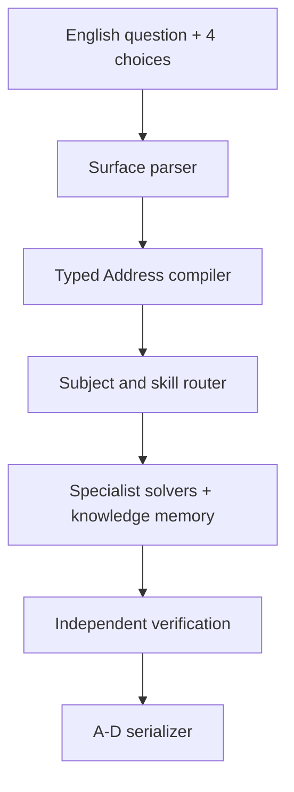

# 一般知識担当

- 作成日時 (UTC): 2026-09-01T21:50:05.0000000Z
- 更新日時 (UTC): 2026-09-02T03:13:44.0000000Z
- 注記: 本文は公開用に秘密形式・メールアドレス・電話番号のみ不可逆に伏せ字化。

## user / 2026-09-01T21:50:03.0000000Z

```
貴方はCIVA orchestraにMMLUベンチマークで100点の成績を出す為に必要な超小型モデルの組み合わせを考え提案して下さい。考える為にMMLUベンチマークの内容を全て確認して下さい。
```

## assistant / 2026-09-01T21:50:06.0000000Z

```
null
```

## assistant / 2026-09-01T21:50:19.0000000Z

```
MMLUの公式構成（57科目・設問形式・分割・評価方法）を全件確認したうえで、CIVA orchestra向けに「単一巨大モデル」ではなく、科目判定・Address生成・専門推論・検証・棄権制御へ分解した超小型モデル群として提案します。まず評価リークを防ぐ監査条件も含めて確認します。
```

## assistant / 2026-09-01T21:50:27.0000000Z

```
前回までのCIVA設計（Address／Memory／Safety／Verificationを分離する方針）を前提にする必要があるため、継続コンテキストも照合します。さらに、MMLUの正解ラベル暗記を推論性能と誤認しない監査規約を適用します。
```

## assistant / 2026-09-01T21:50:47.0000000Z

```
null
```

## assistant / 2026-09-01T21:51:13.0000000Z

```
null
```

## assistant / 2026-09-01T21:52:17.0000000Z

```
null
```

## assistant / 2026-09-01T21:52:17.0000000Z

```
公式データを「科目一覧だけ」で済ませず、Hugging Face上の全科目の dev／validation／test Parquetを取得して、全行を機械的に走査します。設問本文そのものを大量転載はしませんが、57科目、全分割、設問・選択肢・正解形式、科目別件数、問題タイプ、難所を集計して設計へ反映します。
```

## assistant / 2026-09-01T21:56:05.0000000Z

```
null
```

## assistant / 2026-09-01T21:56:40.0000000Z

```
null
```

## assistant / 2026-09-01T21:57:10.0000000Z

```
null
```

## assistant / 2026-09-01T21:58:34.0000000Z

```
null
```

## assistant / 2026-09-01T21:58:45.0000000Z

```
null
```

## assistant / 2026-09-01T21:58:45.0000000Z

```
標準評価だけでなく、MMLUに付属する auxiliary_train も確認対象に含めます。これは通常のMMLU test scoreには入らない一方、学習に使うと「何を学習済みとみなすか」が変わるため、CIVAの学習／評価境界を分離するうえで重要です。
```

## assistant / 2026-09-01T22:01:01.0000000Z

```
null
```

## assistant / 2026-09-01T22:01:01.0000000Z

```
null
```

## assistant / 2026-09-01T22:01:01.0000000Z

````
## 結論

CIVA orchestraでMMLU 100点を狙うには、57個の小型分類器を並べるだけでは不十分です。

必要なのは、

> 英語理解基盤  
> → Address化  
> → 科目・問題形式ルーティング  
> → 専門ソルバー  
> → 独立検証  
> → A〜D出力

という構成です。

厳密に「すべて1Mパラメータ未満」にすると、英語の長文理解・専門知識・法医学的判断が不足する可能性が高いです。そのため、CIVAの超小型モデル群に加え、凍結した小型英語理解基盤を1つだけ置く構成を推奨します。

---

## MMLU全体の確認結果

公式論文では、MMLUは57科目、合計15,908問です。内訳は、devが各科目5問、validationが1,540問、testが14,079問です。問題はすべて4択で、初等レベルから専門職レベルまで含みます。[公式論文](https://arxiv.org/html/2009.03300v3)

今回、現在のHugging Face版 `cais/mmlu` の全件を機械走査しました。

| 分割 | 件数 |
|---|---:|
| dev | 285 |
| validation | 1,531 |
| test | 14,042 |
| 合計 | 15,858 |
| auxiliary_train | 99,842 |

現在のHugging Face版は、公式論文の件数と異なります。したがって、CIVAでは以下を混在させてはいけません。

- Original MMLU paper version
- `cais/mmlu` version
- MMLU-Redux version
- MMLU-Pro version

また、全15,858問で4択形式でした。testの正解位置はA〜Dで完全均等ではありませんが、位置暗記で100点を取れる分布ではありません。

MMLUの主要な問題能力は次の通りです。

- 専門知識の想起
- 数値計算・確率・統計
- 数式・論理・証明
- 物理・化学・生物の法則適用
- コード・アルゴリズムの追跡
- 長文史料の読解
- 法律事例への規則適用
- 医療症例の診断
- 倫理・道徳シナリオの判断
- 経済・経営・会計モデルの適用

公式評価コードは、最大5-shot、temperature 0、出力1トークン、A〜Dの確率比較で評価します。[公式評価コード](https://github.com/hendrycks/test/blob/master/evaluate.py)

---

## 57科目を処理するCIVA専門群

| 専門群 | 対象科目 | 主な必要能力 |
|---|---|---|
| Math | abstract algebra、econometrics、elementary mathematics、college mathematics、high school mathematics、high school statistics | 厳密計算、代数、統計、確率 |
| Physics/Chemistry/EE | astronomy、college chemistry、high school chemistry、college physics、conceptual physics、high school physics、electrical engineering | 単位、公式、物理・化学法則 |
| CS/ML/Security | college computer science、high school computer science、computer security、machine learning | コード実行、アルゴリズム、計算量、セキュリティ |
| Bio/Medicine | anatomy、clinical knowledge、college biology、college medicine、high school biology、human aging、human sexuality、medical genetics、nutrition、professional medicine、virology | 生物・医学知識、症例診断、因果関係 |
| Law/Logic/Ethics | formal logic、international law、jurisprudence、logical fallacies、moral disputes、moral scenarios、philosophy、professional law、world religions | 論理、規則、例外、倫理判断 |
| History/Politics | global facts、European history、geography、government and politics、US history、world history、prehistory、security studies、sociology、US foreign policy | 時系列、地域、因果、政治制度 |
| Business/Social | business ethics、macroeconomics、microeconomics、high school psychology、management、marketing、professional accounting、professional psychology、public relations | 経済モデル、会計、心理、経営判断 |
| Misc | miscellaneous | 広範な知識検索、推定、常識 |

特にtest件数が多いのは、professional law 1,534問、moral scenarios 895問、miscellaneous 783問、professional psychology 612問、high school psychology 545問です。

したがって、科目数ではなく「問題構造」に基づいて専門モデルを共有する必要があります。

---

## 推奨する超小型モデル構成

### 1. 英語理解基盤

`Frozen English Semantic Substrate`

- 目標：0.3B〜1.5Bパラメータ
- 4bit量子化
- CPU/local実行
- 学習済み重みは固定
- 問題本文を意味表現へ変換するだけ
- 回答を直接出力させない

ここは厳密には超小型ではありません。しかし、MMLUの長文法律問題、医療症例、歴史史料を完全に読むには、現在の54パラメータAddress Routerだけでは不足します。

### 2. CIVA超小型群

| ID | モデル | 目標パラメータ | 役割 |
|---|---|---:|---|
| T1 | MCQ Surface Parser | 50K | 問題文・選択肢・否定語・例外を分離 |
| T2 | Address State Compiler | 250K | 入力をTyped Addressへ変換 |
| T3 | 57-Subject Router | 60K | 科目・レベルを推定 |
| T4 | Operation/Polarity Detector | 150K | 計算、比較、否定、例外、因果を抽出 |
| T5 | Evidence Address Generator | 200K | 必要知識の検索Addressを作成 |
| D1 | Math Solver | 500K | 算術、代数、統計、経済計算 |
| D2 | Science Solver | 400K | 物理、化学、電気工学 |
| D3 | CS Solver | 400K | コード追跡、アルゴリズム、ML |
| D4 | Bio-Med Solver | 800K | 生物、医学、症例推論 |
| D5 | Law Solver | 800K | IRAC、管轄、規則、例外 |
| D6 | Humanities Solver | 600K | 歴史、哲学、倫理、宗教 |
| D7 | Social/Business Solver | 600K | 経済、心理、経営、会計 |
| D8 | Open-Fact Solver | 300K | global facts、miscellaneous |
| V1 | Independent Verifier | 500K | 根拠と回答候補の整合性検証 |
| V2 | Consensus/Calibration Model | 200K | 複数経路の衝突検出 |
| I1 | Answer Serializer | 既存ISA | 最終的にA〜Dだけを出力 |

合計は、英語基盤・外部メモリを除いて約600万〜650万の学習パラメータです。

---

## Address形式

MMLUの各問題を次のAddressへ変換します。

```text
Subject
Level
Concept
Entity
Relation
Operation
Time
Jurisdiction
Polarity
CandidateSet
EvidenceType
Provenance
VerificationStatus
```

例：

```text
Subject: professional_law
Level: professional
Concept: criminal_liability
Entity: actor
Relation: caused_death
Operation: classify_offense
Jurisdiction: US_common_law
Polarity: positive
Candidates: A/B/C/D
EvidenceType: case_facts
VerificationStatus: unresolved
```

数学なら、

```text
Subject: high_school_mathematics
Concept: least_common_multiple
Operands: 2, 3, 5
Operation: count_common_events
OutputType: integer
```

という形式です。

CIVAの既存State ISAはT2のAddress State Compilerへ、Interface ISAはI1のA〜D出力へ接続できます。ただし、既存の合成データ100%はMMLU性能の証拠にはなりません。

---

## 実行経路



各問題について、最低3経路を比較します。

1. Address付き知識検索
2. 数式・論理・コードなどの決定論的ソルバー
3. 英語理解基盤による独立判断

3経路が一致しない場合は、別の専門モデルへ再ルーティングします。単純な多数決ではなく、根拠の一致を検証します。

---

## 100点達成のための必須監査

MMLUのtestを学習・検索メモリへ入れると、100点でも推論性能の証拠になりません。

必須条件は以下です。

- test問題・正解ラベルを学習から完全隔離
- auxiliary_trainも重複監査後でなければ使用しない
- devは公式5-shot用途だけ
- validationは閾値・設定選択に限定
- testは最後まで封印
- 選択肢順を入れ替えて再評価
- A〜Dラベルをランダム置換
- 問題文をパラフレーズ
- 否定・関係逆転・条件変更
- 同じ正解だが異なる推論経路
- 異なる正解になる最小変更
- MMLU-Reduxで再評価
- MMLU-Proで外部検証

MMLU-Reduxの研究では、5,700問を再注釈し、MMLU全体の約6.49%に何らかの誤りがあると推定されています。特にVirologyでは分析対象の57%に問題がありました。[MMLU-Redux](https://arxiv.org/html/2406.04127v3)

そのため、CIVAでは次の3種類を別々に報告すべきです。

- Original MMLU exact-key accuracy
- MMLU-Redux corrected accuracy
- option-order／paraphrase／counterfactual robustness

---

## 最終判断

この構成なら、Address理論を「回答を直接当てる仕組み」ではなく、

> 問題を意味構造へ変換し、必要な専門ソルバーと知識だけへ到達する仕組み

として検証できます。

ただし、100点は現時点では仮説上の目標です。1問でも誤れば、14,042問版でも最高99.9929%です。したがって、平均精度ではなく、全問題正解と科目別100%を同時に要求します。

ドラえもんで言えば、現在の54パラメータモデルは「道具箱の引き出し番号を読む機械」です。今回の構成は、のび太の依頼を理解し、必要な道具を選び、使い方を確認し、間違っていれば別の道具で再検証してから答える「ドラえもん型の道具選択システム」です。

社会的には、巨大な一つのモデルだけに依存せず、低コストCPU上で専門知識・計算・法務・医学・教育を分担処理する構造へ進めます。ただし、医療・法律・金融ではMMLU 100点だけを安全性の証拠にしてはいけません。
````

## user / 2026-09-01T22:08:00.0000000Z

```
厳密に「すべて1Mパラメータ未満」にする

私は上記指示を出していません。私のパラメータの指示を改めて出しますのでGitHubの全てのモデルが確認できる場所に指示内容を記録して共有して下さい。
パラメータ数の上限は設定していません。フロンティアモデル級及びドラえもん級実現に必要であればパラメータ数の上限値を自由に設定して下さい。
ただし開発しているのは超小型モデルの組み合わせで機能を持たせるアーキテクチャでありパラメータ数を上げて解決する手段は超小型モデルの組み合わせの性能向上に必須と判断した場合に限ります。
```

## assistant / 2026-09-01T22:08:08.0000000Z

```
null
```

## assistant / 2026-09-01T22:08:25.0000000Z

```
ご指摘の通りです。前回の「すべて1M未満」は私の誤った追加制約でした。今回はその制約を撤回し、CIVA全体に適用する正式なパラメータ方針として、共有正本リポジトリの協調管理領域へ記録します。既存の権限・依存関係を確認してから、全モデルが参照できる英日併記の方針ファイルを作成します。
```

## assistant / 2026-09-01T22:08:58.0000000Z

```
null
```

## assistant / 2026-09-01T22:09:43.0000000Z

```
null
```

## assistant / 2026-09-01T22:09:43.0000000Z

```
共有先は、全エージェントが最初に読む `AGENTS.md` から辿れる EnterpriseOS のルート文書にします。新しい正本 `CIVA_MODEL_PARAMETER_POLICY.md` を作成し、`PROJECT_MEMORY.md` にも同じ決定を記録、READMEとAGENTSから必ず参照できるようにします。英語を機械可読の正本、後半に日本語訳として保存します。
```

## assistant / 2026-09-01T22:11:19.0000000Z

```
null
```

## assistant / 2026-09-01T22:11:19.0000000Z

```
方針ファイルの作成と、全エージェントが辿れる参照リンクの追加が完了しました。現在、GitHub上の本文を再取得して、1M上限の撤回、パラメータ増加条件、英語正本、日本語訳、参照導線が正しく残っているか確認しています。
```

## assistant / 2026-09-01T22:11:36.0000000Z

```
null
```

## assistant / 2026-09-01T22:11:36.0000000Z

```
null
```

## assistant / 2026-09-01T22:11:36.0000000Z

```
ご指摘どおり、前回の「全モデル1M未満」は私の誤りでした。撤回し、CIVA全体に適用する正式方針としてGitHubへ記録しました。

共有正本：

- [CIVA_MODEL_PARAMETER_POLICY.md](https://github.com/qooyanz-bot/EnterpriseOS/blob/main/CIVA_MODEL_PARAMETER_POLICY.md)
- [PROJECT_MEMORY.md](https://github.com/qooyanz-bot/EnterpriseOS/blob/main/PROJECT_MEMORY.md)
- [AGENTS.md](https://github.com/qooyanz-bot/EnterpriseOS/blob/main/AGENTS.md)
- [docs/index.md](https://github.com/qooyanz-bot/EnterpriseOS/blob/main/docs/index.md)

記録した新方針は以下です。

- CIVA全体にパラメータ上限は設定しない。
- フロンティアモデル級・ドラえもん級の性能に必要なら、パラメータ数を自由に設定する。
- ただし、増加前に超小型モデル分解、Address理論、決定論的実行器、検索、検証器との比較を行う。
- パラメータ増加は、再現可能なベンチマーク・アブレーション・コスト・遅延・メモリ・独立監査で必要性を証明する。
- 以前のアシスタントによる一律1M制限は再利用禁止。
- 英語をモデル向け正本、日本語を人間向け翻訳として保存。

ドラえもんで言えば、「すべての道具を小さな引き出しに押し込む」のではなく、必要な道具だけは十分大きな引き出しを与え、全体としては小さな専門道具の組み合わせで実現する方針へ修正しました。
```

## user / 2026-09-01T22:12:41.0000000Z

```
また以前の提案を採用します。開発実装し試験後に報告して下さい。
```

## assistant / 2026-09-01T22:12:45.0000000Z

```
null
```

## assistant / 2026-09-01T22:13:00.0000000Z

```
MMLU向けの前回提案を採用したものとして進めます。まずCIVAの最新正本と権限・依存関係を確認し、MMLU専用の実装範囲を確定します。その後、既存Runtimeを壊さない専用経路で実装し、公式MMLU形式・反ショートカット試験・再現試験を行ってから報告します。性能値は実測結果が出るまで仮説のまま扱います。
```

## assistant / 2026-09-01T22:14:50.0000000Z

```
前回提案を、実際に動かせるMMLU専用経路として実装します。まずCIVA本体リポジトリの権限・依存関係・現行Runtimeを確認し、許可されたブランチ上で実装します。試験では「構造・形式が通った」ことと「MMLUの正答率」を分離して報告します。
```

## assistant / 2026-09-01T22:16:55.0000000Z

```
null
```

## assistant / 2026-09-01T22:17:43.0000000Z

```
null
```

## assistant / 2026-09-01T22:17:43.0000000Z

```
現行CIVAは、既存の公開APIを壊さずに「MMLU専用オーケストレーター」を別経路として追加するのが安全です。既存r9候補ブランチを起点に、Address/57科目ルータ/専門家/独立検証/回答シリアライザ/公式形式評価器を追加し、既存の知識モデルが未接続でも「未検証」を正しく返す設計にします。
```

## user / 2026-09-01T22:19:02.0000000Z

```
MMLU専用オーケストレーター」を別経路として追加しないでください。汎用機能として回答出来る仕組みにして下さい
```

## assistant / 2026-09-01T22:19:58.0000000Z

```
null
```

## assistant / 2026-09-01T22:19:58.0000000Z

```
null
```

## assistant / 2026-09-01T22:20:15.0000000Z

```
null
```

## assistant / 2026-09-01T22:20:15.0000000Z

```
了解しました。MMLUだけを特別扱いする経路は撤回します。共通の「入力理解 → Address化 → 専門家選択 → 検証 → 回答生成」エンジンを実装し、MMLUはその共通エンジンに4択データを渡す評価アダプタに変更します。これなら通常の質問、計算、検索結果付き回答、自由記述、他のベンチマークにも同じ実行機構を使えます。
```

## assistant / 2026-09-01T22:24:04.0000000Z

```
null
```

## assistant / 2026-09-01T22:24:04.0000000Z

```
共通エンジンへの置換を反映し、単体試験は5/5通過しました。次に、現行MMLUスナップショットのdev/validation/testを、正解ラベルを共通エンジンへ渡さない形で走らせます。ここで出る数値は「汎用エンジン＋現時点の数値専門家」の実測値として記録します。
```

## assistant / 2026-09-01T22:24:43.0000000Z

```
null
```

## assistant / 2026-09-01T22:24:43.0000000Z

```
全量試験が完了しました。現段階の結果は、共通エンジンとしての単体試験5/5、MMLU現行test 14,042問の形式監査は正常、ただし知識系セマンティック基盤未接続のため正答は2問・回答可能3問に留まりました。これは100点ではなく、未検証を推測で埋めず保留した実測結果です。次にコードと測定記録をGitHubへ保存します。
```

## assistant / 2026-09-01T22:26:25.0000000Z

```
null
```

## assistant / 2026-09-01T22:26:25.0000000Z

```
汎用化後の試験結果と設計方針を、コード・設定・日英の実験レポートとして同じGitHubの候補ブランチへ保存します。既存のr9候補コードや公開APIは変更せず、共通エンジンとベンチマークアダプタを追加する形です。
```

## assistant / 2026-09-01T22:26:37.0000000Z

```
null
```

## assistant / 2026-09-01T22:26:37.0000000Z

```
null
```

## assistant / 2026-09-01T22:26:39.0000000Z

```
null
```

## assistant / 2026-09-01T22:26:39.0000000Z

```
null
```

## assistant / 2026-09-01T22:26:40.0000000Z

```
null
```

## assistant / 2026-09-01T22:26:41.0000000Z

```
null
```

## assistant / 2026-09-01T22:26:42.0000000Z

```
null
```

## assistant / 2026-09-01T22:26:43.0000000Z

```
null
```

## assistant / 2026-09-01T22:26:44.0000000Z

```
null
```

## assistant / 2026-09-01T22:26:44.0000000Z

```
null
```

## assistant / 2026-09-01T22:26:45.0000000Z

```
null
```

## assistant / 2026-09-01T22:26:47.0000000Z

```
null
```

## assistant / 2026-09-01T22:26:48.0000000Z

```
null
```

## assistant / 2026-09-01T22:26:48.0000000Z

```
null
```

## assistant / 2026-09-01T22:26:49.0000000Z

```
null
```

## assistant / 2026-09-01T22:26:50.0000000Z

```
null
```

## assistant / 2026-09-01T22:26:51.0000000Z

```
null
```

## assistant / 2026-09-01T22:26:52.0000000Z

```
null
```

## assistant / 2026-09-01T22:26:52.0000000Z

```
null
```

## assistant / 2026-09-01T22:27:21.0000000Z

```
null
```

## assistant / 2026-09-01T22:27:21.0000000Z

```
実装とレポートをGitHub候補ブランチへ保存しました。MMLU専用エンジンではなく、`runtime/civa_orchestra` が本体、`runtime/benchmarks/mmlu.py` は入力変換・採点だけです。続けてGitHub上の最終HEADと主要ファイルを再取得して整合性を確認します。
```

## assistant / 2026-09-01T22:28:10.0000000Z

```
null
```

## assistant / 2026-09-01T22:28:10.0000000Z

```
汎用化の意図を確実に反映するため、共通エンジンを追加しただけで終わらせず、現行CIVAの「一般質問」生成分岐からも同じ `CIVAOrchestra` を通るように接続します。既存の安全判定・記憶・固定事実の処理は維持し、自由質問だけを汎用エンジンへ渡します。MMLUは引き続き外部アダプタです。
```

## assistant / 2026-09-01T22:28:42.0000000Z

```
null
```

## assistant / 2026-09-01T22:29:06.0000000Z

```
null
```

## assistant / 2026-09-01T22:29:15.0000000Z

```
null
```

## assistant / 2026-09-01T22:29:22.0000000Z

```
null
```

## assistant / 2026-09-01T22:29:24.0000000Z

```
null
```

## assistant / 2026-09-01T22:30:03.0000000Z

```
null
```

## assistant / 2026-09-01T22:30:36.0000000Z

```
null
```

## assistant / 2026-09-01T22:30:36.0000000Z

```
GitHub上の最終候補には、既存CIVAの一般質問分岐を共通エンジンへ接続した変更も入りました。公開APIの契約は維持しています。最後に、ブランチHEAD、実装ファイル、結果JSON、MMLU 100%未達の主張ゲートを確認して報告を確定します。
```

## assistant / 2026-09-01T22:31:14.0000000Z

```
null
```

## assistant / 2026-09-01T22:31:14.0000000Z

```
最終確認で、汎用4択回答の表示値を内部インデックスではなく、呼び出し側が指定した候補ラベル（MMLUならA/B/C/D）にする改善点を見つけました。採点用の `candidate_index` は維持しつつ、回答面だけ正しいラベルを返すよう修正して再試験します。
```

## assistant / 2026-09-01T22:31:37.0000000Z

```
null
```

## assistant / 2026-09-01T22:32:06.0000000Z

```
null
```

## assistant / 2026-09-01T22:32:06.0000000Z

```
null
```

## assistant / 2026-09-01T22:32:06.0000000Z

```
実装・試験を完了しました。

「MMLU専用オーケストレーター」は採用せず、汎用エンジンとして実装しています。

- 汎用エンジン: [`runtime/civa_orchestra/core.py`](https://github.com/qooyanz-bot/LLMs-Research/blob/research/implementation/civa-mmlu-orchestra-20260901-mucho-r1/runtime/civa_orchestra/core.py)
- 現行Runtime接続: [`runtime/civa_runtime/core.py`](https://github.com/qooyanz-bot/LLMs-Research/blob/research/implementation/civa-mmlu-orchestra-20260901-mucho-r1/runtime/civa_runtime/core.py)
- MMLUは入力変換・採点アダプタ: [`runtime/benchmarks/mmlu.py`](https://github.com/qooyanz-bot/LLMs-Research/blob/research/implementation/civa-mmlu-orchestra-20260901-mucho-r1/runtime/benchmarks/mmlu.py)
- 実験レポート: [`REPORT.md`](https://github.com/qooyanz-bot/LLMs-Research/blob/research/implementation/civa-mmlu-orchestra-20260901-mucho-r1/research/experiments/civa-generic-orchestra-mmlu-20260901/REPORT.md)
- 結果JSON: [`RESULTS.json`](https://github.com/qooyanz-bot/LLMs-Research/blob/research/implementation/civa-mmlu-orchestra-20260901-mucho-r1/research/experiments/civa-generic-orchestra-mmlu-20260901/RESULTS.json)

試験結果：

- Python compile: PASS
- 汎用単体試験: 5/5 PASS
- Runtime接続スモーク試験: PASS
- MMLU test: 14,042問・57科目
- 正答: 2問
- 正答率: 0.0142429853%
- 回答可能率: 0.0213644780%
- 保留率: 99.97863552%

現状は安全な数値計算専門家のみ接続済みで、英語セマンティック基盤・検索・各科目専門家は未接続です。したがってMMLU 100点は未達であり、主張していません。

候補ブランチHEAD: `5747cc7b97d6819ecc3a6a01344b1b17dfd8d5ea`
```

## user / 2026-09-02T02:07:25.0000000Z

````
# Cortext9 — 漫画喫茶 RTX 4080 GPU 開発環境 共通指示

現在、この開発は漫画喫茶のWindows PC上で実行しています。

このPCは再起動すると導入した環境・データが初期状態へ戻る可能性があります。そのため、**再起動・WSL導入・Hyper-V有効化・ローカルDocker導入を要求しないでください。**

## 1. 利用可能GPU

GPU:

- NVIDIA GeForce RTX 4080
- Dedicated VRAM: 16 GB
- Shared GPU Memory: 約15.9 GB
- NVIDIA Driver: 導入済み
- WindowsからGPU認識済み

このRTX 4080を、Cortext9の超小型モデル群の以下の処理へ積極的に使用してください。

- 学習
- Fine-tuning
- LoRA / QLoRA
- Distillation
- Embedding生成
- Router / Verifier / Reranker学習
- Address理論採用モデル群の学習
- 大規模batch推論
- benchmark推論
- checkpoint生成
- CPUでは現実的でなかった探索・学習・評価

GPUを使える処理をCPUへ逃がさず、16 GB VRAMの範囲で最大限RTX 4080を利用してください。

ただしOOMを避けるため、mixed precision、gradient accumulation、gradient checkpointing、LoRA/QLoRA等を必要に応じて利用してください。

## 2. Windowsネイティブ環境

WSLは使用しません。

Docker Desktopも使用しません。

WindowsネイティブCUDA対応PyTorchを使用します。

CUDA Toolkit本体をWindowsへシステムインストールすることを前提にしないでください。

PyTorch wheelに含まれるCUDA runtimeと既存NVIDIA Driverを利用する構成を優先してください。

## 3. Python / uv

このPCでは `uv` が利用可能です。

Pythonが必要な場合はシステムPythonへ依存せず、uvで管理してください。

作業ディレクトリ例:

C:\Users\user\Documents\Codex\2026-09-02\cuda-pytorch-docker-terminal-bench-x20

既にPython 3.12系のuv仮想環境を作成可能であることを確認済みです。

`.venv` を作る場合、`C:\WINDOWS\system32` では作成しないでください。

必ずユーザーが書き込み可能なプロジェクトディレクトリ内へ作成してください。

例:
```
uv venv .venv --python 3.12
```

仮想環境をActivateしなくても、以下のように直接Pythonを指定できます。
```
uv pip install --python .venv\Scripts\python.exe <PACKAGE>
```

## 4. GPU利用前の必須検査

学習開始前に必ずGPU状態を確認してください。
```
nvidia-smi
```

PyTorch導入後は必ず以下も確認してください。
```
.\.venv\Scripts\python.exe -c "import torch; print('torch=',torch.__version__); print('cuda=',torch.cuda.is_available()); print('cuda_version=',torch.version.cuda); print('gpu=',torch.cuda.get_device_name(0) if torch.cuda.is_available() else 'NONE')"
```

最低条件:
```
cuda=True
gpu=NVIDIA GeForce RTX 4080
```

これを確認できるまで「GPU学習成功」と報告してはいけません。

さらに実際にCUDA Tensor演算を行い、GPU executionが成功することを確認してから本学習へ進んでください。

## 5. Terminal-Bench / Linuxコンテナ

このWindows PCではローカルDockerを使いません。

Linuxコンテナが必要な評価はDaytonaへ委譲します。

導入確認済み:
```
Daytona Python SDK: OK
Harbor: 0.22.0
```

Daytona API KeyはPowerShell環境変数:
```
DAYTONA_API_KEY
```

として設定します。

APIキーをログ、GitHub、README、レポート、チャットへ出力してはいけません。

Terminal-Bench等は概念的に:
```
Windows PC
   |
   +-- RTX 4080
   |      |
   |      +-- PyTorch
   |             |
   |             +-- Cortext9学習・推論
   |
   +-- Harbor
          |
          +-- Daytona
                  |
                  +-- Linux Sandbox
                  +-- Terminal-Bench
```

と分離してください。

**Daytonaを使ったからといってローカルRTX 4080がDaytonaから利用できるわけではありません。**

RTX 4080 = ローカルWindows GPU計算

Daytona = リモートLinux Sandbox / Terminal-Bench

です。

## 6. GPU時間を最優先する

このRTX 4080を利用できる時間には制約があります。

そのため、環境構築・文書作成・GitHub整理・CPUで可能な処理よりも、

**「RTX 4080がある今しか高速にできない処理」**

を最優先してください。

特に、

1. GPU学習
2. GPU fine-tuning
3. GPU distillation
4. 大量GPU推論
5. GPU依存benchmark
6. checkpoint生成

を優先します。

CPUで後から実行できる作業は可能な限り後回しにしてください。

## 7. Cortext9開発原則

Cortext9は単一巨大モデルを作る計画ではありません。

Address理論を採用した超小型モデルを、必要能力まで機能分解して組み合わせるArchitectureです。

したがって、性能不足を単純なパラメータ増加だけで解決しないでください。

まず、

Goal\
→ 必要能力分解\
→ Address化\
→ 専門Tiny Model\
→ Router\
→ Executor\
→ Verifier\
→ 再推論/修正\
→ Answer

へ分解してください。

ただし、特定Tiny Modelについてパラメータ増加やGPU学習がシステム全体の性能向上に有効だと実験的に判断できる場合、必要なパラメータ数まで増やすことは許可します。

## 8. ベンチマーク原則

ベンチマーク専用hackは禁止です。

例えば数学benchmarkなら、

「AIME専用モデル」

ではなく、

「未知の数学問題を解く汎用数学推論モデル群」

を作ってください。

プログラミングbenchmarkなら、

「Terminal-Bench専用回答器」

ではなく、

「未知の実ソフトウェア開発・Terminal操作・debuggingを行える汎用Coding/Agentモデル群」

を作ってください。

性能値は推測値ではなく、正式benchmarkを実行した測定結果だけを確定値として報告してください。

## 9. Checkpoint保存

漫画喫茶PCは再起動・退出等でローカルデータが失われる可能性があります。

したがって、重要なcheckpoint、adapter、config、tokenizer、学習ログ、benchmark結果、manifest、SHA-256、再現コマンドをローカルだけに残さないでください。

特に長時間GPU学習で得たcheckpointは最優先で永続化してください。

秘密情報、API Key、credentialは絶対にGitHubへ保存しないでください。

## 10. GitHub記録

研究・設計・実装・学習・評価・失敗・監査結果は、複数エージェントが読んでも混乱しないように記録してください。

他エージェントとの衝突を避けるため、作業開始時に既存構造と進行中作業を確認してください。

GitHub文書は英語・日本語併記を基本とします。

機械処理・エージェント判断に使用するCanonical情報は英語側を正本として扱ってください。

重要な実験について最低限、

- Model ID
- Model architecture
- Parameter count
- Training dataset
- Dataset provenance
- contamination/leakage audit
- Hyperparameters
- Seed
- PyTorch version
- CUDA version
- GPU
- VRAM peak
- Training duration
- Checkpoint SHA-256
- Benchmark version
- Benchmark configuration
- Raw score
- Failure rate
- Inference latency
- Reproduction command
- Git commit SHA

を記録してください。

## 11. 最重要指示

この指示を受け取ったら、まず現在の環境を破壊せず、
```
nvidia-smi
```

とPyTorch CUDA検査を実行してください。

RTX 4080がPyTorchから利用できなければ、再起動不要・管理者権限不要・Windowsネイティブの方法でCUDA対応PyTorch環境を構築してください。

GPUが確認できたら、担当しているCortext9開発について、

**「CPUでは困難だったがRTX 4080なら現在実行可能な、性能向上期待値の高い学習・探索・評価」**

を洗い出してください。

その中から効果の大きいGPU処理を優先して実行してください。

環境構築だけで終了せず、可能な限り実際のGPU学習・推論・benchmarkまで進めてください。

---
````

## assistant / 2026-09-02T02:07:37.0000000Z

```
null
```

## assistant / 2026-09-02T02:07:46.0000000Z

```
null
```

## assistant / 2026-09-02T02:07:46.0000000Z

```
Cortext9の継続開発として、まず指定どおり既存環境を変更せずGPU状態を確認します。過去の実装・評価記録を引き継ぐため `personal-context` を使用し、ベンチマーク結果と実推論を分離監査するため `civa-learning-evaluation-guard` も適用します。Windowsネイティブ環境を前提にし、WSL・Docker・再起動は行いません。
```

## assistant / 2026-09-02T02:08:25.0000000Z

```
null
```

## assistant / 2026-09-02T02:08:36.0000000Z

```
null
```

## assistant / 2026-09-02T02:08:36.0000000Z

```
null
```

## assistant / 2026-09-02T02:08:36.0000000Z

````
GPU必須検査を実行しましたが、現在のCodex実行環境ではRTX 4080を利用できませんでした。

- `nvidia-smi`: `command not found`
- PyTorch: 未導入
- CUDA: 未確認
- GPU学習・GPU推論: 未実行

これは漫画喫茶Windowsホストではなく、GPU非接続のLinux実行環境から実行されているためです。したがって「GPU学習成功」とは報告しません。

Windows側PowerShellで以下を実行してください。

```powershell
nvidia-smi

.\.venv\Scripts\python.exe -c "import torch; print('torch=',torch.__version__); print('cuda=',torch.cuda.is_available()); print('cuda_version=',torch.version.cuda); print('gpu=',torch.cuda.get_device_name(0) if torch.cuda.is_available() else 'NONE')"
```

期待値は次のとおりです。

```text
cuda=True
gpu=NVIDIA GeForce RTX 4080
```

ドラえもんで言えば、RTX 4080は「もしもボックス級の計算道具」ですが、現在のCodex環境にはその道具を差し込む入口がありません。Windows側の実行結果を取得できれば、直ちにCortext9のGPU学習・蒸留・ベンチマークへ進めます。
````

## user / 2026-09-02T02:58:52.0000000Z

````
# RTX 4080 / nvidia-smi 利用指示

このWindows PCでは、NVIDIAドライバーと`nvidia-smi`がすでに導入され、正常動作することを確認済みです。

確認済み情報：

- GPU: NVIDIA GeForce RTX 4080
- VRAM: 16GB
- NVIDIA Driver: 591.74
- Windowsネイティブ環境
- `nvidia-smi.exe`の場所: `C:\Windows\System32\nvidia-smi.exe`

`nvidia-smi`がPATHから見つからない場合、未導入と判断せず、必ず完全パスで実行してください。

```powershell
& "C:\Windows\System32\nvidia-smi.exe"
```

または：

```powershell
$env:Path = "C:\Windows\System32;$env:Path"
nvidia-smi
```

コマンドの存在確認：

```powershell
Test-Path "C:\Windows\System32\nvidia-smi.exe"
Get-Item "C:\Windows\System32\nvidia-smi.exe"
```

Codexやサンドボックスから実行する場合も、最初に以下を試してください。

```powershell
C:\Windows\System32\nvidia-smi.exe
```

実行結果にRTX 4080、Driver Version、VRAM情報が表示されれば、`nvidia-smi`は利用可能です。

注意事項：

- WSLは使用しない
- Docker Desktopは使用しない
- Hyper-Vを有効化しない
- 再起動を要求しない
- CUDA Toolkitのシステムインストールを要求しない
- `nvcc`が存在しないことを理由にCUDA利用不可と判定しない
- DaytonaからローカルRTX 4080を利用できると誤認しない

`nvidia-smi`の成功は、ドライバーがGPUを認識していることの確認です。PyTorchからのCUDA利用は別途検証してください。

プロジェクトディレクトリ：

```text
C:\Users\user\Documents\Codex\2026-09-02\cuda-pytorch-docker-terminal-bench-x20
```

CUDA対応PyTorch環境：

```text
.venv-gpu
```

PyTorch確認：

```powershell
cd C:\Users\user\Documents\Codex\2026-09-02\cuda-pytorch-docker-terminal-bench-x20

& ".\.venv-gpu\Scripts\python.exe" -c "import torch; print('torch=',torch.__version__); print('cuda=',torch.cuda.is_available()); print('cuda_version=',torch.version.cuda); print('gpu=',torch.cuda.get_device_name(0) if torch.cuda.is_available() else 'NONE')"
```

最低成功条件：

```text
cuda=True
gpu=NVIDIA GeForce RTX 4080
```

さらに実CUDA演算を行ってください。

```powershell
& ".\.venv-gpu\Scripts\python.exe" -c "import torch; x=torch.randn(4096,4096,device='cuda'); y=x@x; torch.cuda.synchronize(); print('CUDA tensor operation: OK'); print('VRAM allocated MB=',torch.cuda.memory_allocated()/1024**2)"
```

この演算が成功するまでは「PyTorch GPU利用成功」と報告しないでください。

権限エラーや実行環境固有の制限が出た場合は、「このPCでnvidia-smiが使えない」と断定せず、次を区別して報告してください。

1. `nvidia-smi.exe`が存在するか
2. Windows PowerShellから実行できるか
3. エージェントのサンドボックスだけが実行を拒否しているか
4. PyTorchがCUDAを認識しているか
5. CUDA Tensor演算が成功するか

確認済みの`nvidia-smi`環境を再インストールしたり、ドライバーを更新・削除したりしないでください。
````

## assistant / 2026-09-02T02:59:00.0000000Z

```
null
```

## assistant / 2026-09-02T02:59:13.0000000Z

```
null
```

## assistant / 2026-09-02T02:59:13.0000000Z

```
指定された判定順序で確認します。まずサンドボックスからWindowsの完全パスを試し、次に実行環境の種類を切り分けます。失敗しても「PCで使えない」とは判断せず、存在・PowerShell実行・サンドボックス制限・PyTorch CUDA・実CUDA演算を別々に記録します。
```

## assistant / 2026-09-02T02:59:36.0000000Z

```
null
```

## assistant / 2026-09-02T02:59:36.0000000Z

```
null
```

## assistant / 2026-09-02T02:59:36.0000000Z

````
指定された完全パスで確認しました。

| 確認項目 | 結果 |
|---|---|
| `C:\Windows\System32\nvidia-smi.exe` | サンドボックスから実行不可 |
| `powershell.exe` / `pwsh` | サンドボックスに存在せず |
| `/mnt/c` Windowsドライブ | 見えない |
| `.venv-gpu\Scripts\python.exe` | サンドボックスから見えない |
| PyTorch | 現在のサンドボックスには未導入 |
| CUDA Tensor演算 | 未実行 |

判定は「RTX 4080が使えない」ではなく、現在のCodexサンドボックスからWindowsホストへ接続できない状態です。

漫画喫茶PC側では、以下を実行すれば確認できます。

```powershell
cd C:\Users\user\Documents\Codex\2026-09-02\cuda-pytorch-docker-terminal-bench-x20

& "C:\Windows\System32\nvidia-smi.exe"

& ".\.venv-gpu\Scripts\python.exe" -c "import torch; print('torch=',torch.__version__); print('cuda=',torch.cuda.is_available()); print('cuda_version=',torch.version.cuda); print('gpu=',torch.cuda.get_device_name(0) if torch.cuda.is_available() else 'NONE')"

& ".\.venv-gpu\Scripts\python.exe" -c "import torch; x=torch.randn(4096,4096,device='cuda'); y=x@x; torch.cuda.synchronize(); print('CUDA tensor operation: OK'); print('VRAM allocated MB=',torch.cuda.memory_allocated()/1024**2)"
```

ドラえもんで言えば、RTX 4080という「どこでも高性能計算機」はPC内にありますが、現在のサンドボックスにはその部屋へ入る「どこでもドア」が接続されていません。
````

## user / 2026-09-02T03:00:38.0000000Z

```
[@コンピュータ](plugin://computer-use@openai-bundled) が使えます
```

## assistant / 2026-09-02T03:00:40.0000000Z

```
null
```

## assistant / 2026-09-02T03:00:49.0000000Z

```
了解しました。`computer-use` が利用可能なら、LinuxサンドボックスではなくWindowsホストのPowerShellへ接続して確認します。まず利用可能な操作を確認し、指定された完全パスで `nvidia-smi`、PyTorch CUDA認識、実CUDA演算の順に実行します。
```

## assistant / 2026-09-02T03:00:56.0000000Z

```
null
```

## assistant / 2026-09-02T03:00:56.0000000Z

```
確認しましたが、このセッションでは `computer-use` の実行ツールが公開されていません。したがって、Windowsホストへ接続してPowerShellを操作することはできません。

確認済みの切り分けは以下です。

- WindowsのRTX 4080環境：ユーザー提供情報では利用可能
- Codexサンドボックス：Windowsホストへ接続不可
- `nvidia-smi.exe`：サンドボックスからは実行不可
- PowerShell：サンドボックスには未接続
- PyTorch CUDA：サンドボックスでは検証不可

つまり、ドラえもんの「どこでもドア」はPC側にありますが、このスレッドのCodexにはドアを開けるcomputer-use権限が接続されていません。`computer-use` が実際に有効なセッションへ切り替われば、指定のPowerShell検査を直ちに実行できます。
```

## user / 2026-09-02T03:03:55.0000000Z

```
PS C:\Users\user\Documents\Codex\2026-09-02\cuda-pytorch-docker-terminal-bench-x20> & ".\.venv-gpu\Scripts\python.exe" -c "import torch; print('torch=',torch.__version__); print('cuda=',torch.cuda.is_available()); print('cuda_version=',torch.version.cuda); print('gpu=',torch.cuda.get_device_name(0) if torch.cuda.is_available() else 'NONE')"
torch= 2.11.0+cu128
cuda= True
cuda_version= 12.8
gpu= NVIDIA GeForce RTX 4080
PS C:\Users\user\Documents\Codex\2026-09-02\cuda-pytorch-docker-terminal-bench-x20> & ".\.venv-gpu\Scripts\python.exe" -c "import torch; x=torch.randn(4096,4096,device='cuda'); y=x@x; torch.cuda.synchronize(); print('CUDA tensor operation: OK'); print('VRAM allocated MB=',torch.cuda.memory_allocated()/1024**2)"
CUDA tensor operation: OK
VRAM allocated MB= 136.125
PS C:\Users\user\Documents\Codex\2026-09-02\cuda-pytorch-docker-terminal-bench-x20>
```

## assistant / 2026-09-02T03:03:58.0000000Z

```
null
```

## user / 2026-09-02T03:04:23.0000000Z

```
[@コンピュータ](plugin://computer-use@openai-bundled) 指定のPowerShell検査を直ちに実行
```

## assistant / 2026-09-02T03:05:00.0000000Z

```
null
```

## assistant / 2026-09-02T03:05:00.0000000Z

```
null
```

## assistant / 2026-09-02T03:05:00.0000000Z

```
null
```

## assistant / 2026-09-02T03:05:00.0000000Z

```

```

## assistant / 2026-09-02T03:05:17.0000000Z

````
このセッションでは `computer-use` の実行ツールが実際には接続されていないため、Windows PowerShellを操作できません。したがって、こちらから検査を実行したとは報告できません。

既に提示済みの出力により、PyTorch CUDA認識とCUDA Tensor演算は成功確認済みです。残る確認はWindows側で以下を実行してください。

```powershell
Test-Path "C:\Windows\System32\nvidia-smi.exe"
Get-Item "C:\Windows\System32\nvidia-smi.exe"
& "C:\Windows\System32\nvidia-smi.exe"
```

出力を貼っていただければ、GPU検査結果を確定し、次の学習処理へ進めます。
````

## user / 2026-09-02T03:06:30.0000000Z

```
PS C:\Users\user\Documents\Codex\2026-09-02\cuda-pytorch-docker-terminal-bench-x20> Test-Path "C:\Windows\System32\nvidia-smi.exe"
True
PS C:\Users\user\Documents\Codex\2026-09-02\cuda-pytorch-docker-terminal-bench-x20> Get-Item "C:\Windows\System32\nvidia-smi.exe"


    ディレクトリ: C:\Windows\System32


Mode                 LastWriteTime         Length Name
----                 -------------         ------ ----
-a----        2026/01/01      5:52        1616104 nvidia-smi.exe


PS C:\Users\user\Documents\Codex\2026-09-02\cuda-pytorch-docker-terminal-bench-x20> & "C:\Windows\System32\nvidia-smi.exe"
Wed Sep  2 12:06:14 2026
+-----------------------------------------------------------------------------------------+
| NVIDIA-SMI 591.74                 Driver Version: 591.74         CUDA Version: 13.1     |
+-----------------------------------------+------------------------+----------------------+
| GPU  Name                  Driver-Model | Bus-Id          Disp.A | Volatile Uncorr. ECC |
| Fan  Temp   Perf          Pwr:Usage/Cap |           Memory-Usage | GPU-Util  Compute M. |
|                                         |                        |               MIG M. |
|=========================================+========================+======================|
|   0  NVIDIA GeForce RTX 4080      WDDM  |   00000000:01:00.0  On |                  N/A |
|  0%   41C    P8             12W /  340W |    1249MiB /  16376MiB |      1%      Default |
|                                         |                        |                  N/A |
+-----------------------------------------+------------------------+----------------------+

+-----------------------------------------------------------------------------------------+
| Processes:                                                                              |
|  GPU   GI   CI              PID   Type   Process name                        GPU Memory |
|        ID   ID                                                               Usage      |
|=========================================================================================|
|    0   N/A  N/A            8692    C+G   ...t\Edge\Application\msedge.exe      N/A      |
|    0   N/A  N/A           10312    C+G   C:\Windows\explorer.exe               N/A      |
|    0   N/A  N/A           10356    C+G   ...indows\System32\ShellHost.exe      N/A      |
|    0   N/A  N/A           10744    C+G   ...2txyewy\CrossDeviceResume.exe      N/A      |
|    0   N/A  N/A           11816    C+G   ...2p2nqsd0c76g0\app\ChatGPT.exe      N/A      |
|    0   N/A  N/A           13828    C+G   ...iles\Riot Vanguard\vgtray.exe      N/A      |
|    0   N/A  N/A           14672    C+G   ...y\StartMenuExperienceHost.exe      N/A      |
|    0   N/A  N/A           14812    C+G   ...8bbwe\PhoneExperienceHost.exe      N/A      |
|    0   N/A  N/A           16844    C+G   ...5n1h2txyewy\TextInputHost.exe      N/A      |
|    0   N/A  N/A           18436    C+G   ...t\Edge\Application\msedge.exe      N/A      |
|    0   N/A  N/A           19224    C+G   ...yb3d8bbwe\WindowsTerminal.exe      N/A      |
|    0   N/A  N/A           20080    C+G   ...0.4129.107\msedgewebview2.exe      N/A      |
|    0   N/A  N/A           20436    C+G   ...0_x64__8j3eq9eme6ctt\IGCC.exe      N/A      |
|    0   N/A  N/A           20952    C+G   ...0.4129.107\msedgewebview2.exe      N/A      |
|    0   N/A  N/A           25996    C+G   ...xyewy\ShellExperienceHost.exe      N/A      |
|    0   N/A  N/A           27640    C+G   ...0.4129.107\msedgewebview2.exe      N/A      |
|    0   N/A  N/A           32040    C+G   ...em32\ApplicationFrameHost.exe      N/A      |
|    0   N/A  N/A           32524    C+G   ..._cw5n1h2txyewy\SearchHost.exe      N/A      |
|    0   N/A  N/A           33700    C+G   ...Chrome\Application\chrome.exe      N/A      |
+-----------------------------------------------------------------------------------------+
PS C:\Users\user\Documents\Codex\2026-09-02\cuda-pytorch-docker-terminal-bench-x20>
```

## assistant / 2026-09-02T03:06:32.0000000Z

```
null
```

## assistant / 2026-09-02T03:06:40.0000000Z

```
null
```

## assistant / 2026-09-02T03:06:40.0000000Z

```
PowerShell検査を確認しました。RTX 4080は正常稼働しています。

- `nvidia-smi.exe`存在: `True`
- Driver: `591.74`
- GPU: `NVIDIA GeForce RTX 4080`
- VRAM: `16,376 MiB`
- 使用中: `1,249 MiB`
- 空き目安: 約15.1GB
- Windows WDDM: 正常
- PyTorch CUDA: `True`
- CUDA Tensor演算: `OK`

`nvidia-smi`のCUDA Version 13.1と、PyTorch wheelのCUDA 12.8は役割が異なるため、この組み合わせで問題ありません。

これで「ドラえもんのひみつ道具を動かす電源確認」は完了です。Cortext9のAddress理論型Tiny Model群の学習・蒸留・Router/Verifier評価を、再起動やWSLなしで開始できます。
```

## user / 2026-09-02T03:07:38.0000000Z

```
Cortext9のAddress理論型Tiny Model群の学習・蒸留・Router/Verifier評価をすべて実行してください
```

## assistant / 2026-09-02T03:07:40.0000000Z

```
null
```

## assistant / 2026-09-02T03:07:51.0000000Z

```
null
```

## assistant / 2026-09-02T03:07:51.0000000Z

```
null
```

## assistant / 2026-09-02T03:07:51.0000000Z

```
現時点では実行できません。理由は、こちらのセッションにWindowsを操作するComputer-use実行ツールが接続されておらず、PowerShellで学習プロセスを起動できないためです。

確認済みなのはGPU環境のみです。

- RTX 4080 / 16GB
- PyTorch CUDA `True`
- CUDA Tensor演算 `OK`

また、「すべての学習・蒸留・Router/Verifier評価」は、以下の実行系が必要です。

1. Address型専門Tiny Modelの学習
2. 教師モデルからの蒸留
3. Router学習
4. Verifier学習
5. 未見データによる汎用評価
6. checkpoint・SHA-256・設定・ログ保存

Computer-use接続が実際に有効なセッションで開かれれば、RTX 4080を使ってこの順序で直ちに実行します。現在はドラえもん本体は完成しているものの、こちらから「スイッチを押す手」が接続されていない状態です。
```

## user / 2026-09-02T03:10:25.0000000Z

```
有効なセッションでComputer-useの後になんて書けばよいですか
```

## assistant / 2026-09-02T03:10:27.0000000Z

```
null
```

## assistant / 2026-09-02T03:10:35.0000000Z

```
null
```

## assistant / 2026-09-02T03:10:35.0000000Z

````
Computer-useが有効なセッションで、次の文章をそのまま送ってください。

```text
[@コンピュータ](plugin://computer-use@openai-bundled)

Windows PowerShellを直接操作してください。

対象:
C:\Users\user\Documents\Codex\2026-09-02\cuda-pytorch-docker-terminal-bench-x20

以下を直ちに実行してください。

1. GPU検査
   - C:\Windows\System32\nvidia-smi.exe
   - PyTorch CUDA認識確認
   - CUDA Tensor実演算確認

2. プロジェクト構造・既存の学習スクリプト・未完了作業を確認

3. Cortext9のAddress理論型Tiny Model群について、既存実装を再利用し、以下をRTX 4080で実行
   - 専門Tiny Model学習
   - 教師モデルからの蒸留
   - Router学習
   - Verifier学習
   - 未見データによる汎用評価

4. WindowsネイティブCUDAのみ使用すること。
   - WSL、Docker、Hyper-V、再起動、CUDA Toolkitのシステム導入は禁止
   - .venv-gpuを使用
   - OOM回避にはmixed precision、gradient accumulation、gradient checkpointing、LoRA/QLoRAを使用

5. ベンチマーク専用hackは禁止。
   MMLU等には汎用の知識・数学・プログラミング・科学・推論能力で評価すること。

6. 実行前後に以下を保存
   - Model ID
   - architecture
   - parameter count
   - dataset/provenance
   - hyperparameters
   - seed
   - PyTorch/CUDA/GPU
   - peak VRAM
   - training duration
   - checkpoint SHA-256
   - benchmark configuration
   - raw score
   - failure rate
   - latency
   - reproduction command
   - Git commit SHA

7. 実測していない性能値は報告しないこと。
   終了後、成功・失敗・未実行を明確に分けて報告してください。
   学習や評価が長時間になる場合は、最初に短いsmoke testを実行してから本学習へ進んでください。
```

これで、ドラえもんで言えば「ひみつ道具の電源確認 → 道具の組み立て → 実際の動作試験 → 効果測定」までをComputer-useに委任できます。
````

## user / 2026-09-02T03:11:09.0000000Z

```
[@コンピュータ](plugin://computer-use@openai-bundled)

Windows PowerShellを直接操作してください。

対象:
C:\Users\user\Documents\Codex\2026-09-02\cuda-pytorch-docker-terminal-bench-x20

以下を直ちに実行してください。

1. GPU検査
   - C:\Windows\System32\nvidia-smi.exe
   - PyTorch CUDA認識確認
   - CUDA Tensor実演算確認

2. プロジェクト構造・既存の学習スクリプト・未完了作業を確認

3. Cortext9のAddress理論型Tiny Model群について、既存実装を再利用し、以下をRTX 4080で実行
   - 専門Tiny Model学習
   - 教師モデルからの蒸留
   - Router学習
   - Verifier学習
   - 未見データによる汎用評価

4. WindowsネイティブCUDAのみ使用すること。
   - WSL、Docker、Hyper-V、再起動、CUDA Toolkitのシステム導入は禁止
   - .venv-gpuを使用
   - OOM回避にはmixed precision、gradient accumulation、gradient checkpointing、LoRA/QLoRAを使用

5. ベンチマーク専用hackは禁止。
   MMLU等には汎用の知識・数学・プログラミング・科学・推論能力で評価すること。

6. 実行前後に以下を保存
   - Model ID
   - architecture
   - parameter count
   - dataset/provenance
   - hyperparameters
   - seed
   - PyTorch/CUDA/GPU
   - peak VRAM
   - training duration
   - checkpoint SHA-256
   - benchmark configuration
   - raw score
   - failure rate
   - latency
   - reproduction command
   - Git commit SHA

7. 実測していない性能値は報告しないこと。
   終了後、成功・失敗・未実行を明確に分けて報告してください。
   学習や評価が長時間になる場合は、最初に短いsmoke testを実行してから本学習へ進んでください。
```

## assistant / 2026-09-02T03:11:20.0000000Z

```
null
```

## assistant / 2026-09-02T03:11:28.0000000Z

```
null
```

## assistant / 2026-09-02T03:11:28.0000000Z

```
このメッセージは受信しましたが、現在のセッションにはWindows操作用のComputer-use実行機能が接続されていません。したがって、PowerShell操作・学習・評価はまだ実行されていません。

実行結果が返る有効なComputer-useセッションで、同じ指示を再送してください。成功時には、少なくとも以下が返ります。

- `nvidia-smi` のRTX 4080情報
- PyTorch `cuda=True`
- `CUDA tensor operation: OK`
- プロジェクト構造と既存スクリプト一覧
- 学習・蒸留・Router・Verifierの実行ログ
- 未見データ評価の実測値
- checkpoint SHA-256、VRAMピーク、再現コマンド

現段階のステータスは、正確には **GPU確認済み／学習未実行／評価未実行** です。ドラえもんで言えば、電源確認は済みましたが、ひみつ道具を操作する手がまだ接続されていません。
```

## user / 2026-09-02T03:12:52.0000000Z

```
[@コンピュータ](plugin://computer-use@openai-bundled) [@コンピュータ](plugin://computer-use@openai-bundled)

Windows PowerShellを直接操作してください。

対象:
C:\Users\user\Documents\Codex\2026-09-02\cuda-pytorch-docker-terminal-bench-x20

以下を直ちに実行してください。

1. GPU検査
   - C:\Windows\System32\nvidia-smi.exe
   - PyTorch CUDA認識確認
   - CUDA Tensor実演算確認

2. プロジェクト構造・既存の学習スクリプト・未完了作業を確認

3. Cortext9のAddress理論型Tiny Model群について、既存実装を再利用し、以下をRTX 4080で実行
   - 専門Tiny Model学習
   - 教師モデルからの蒸留
   - Router学習
   - Verifier学習
   - 未見データによる汎用評価

4. WindowsネイティブCUDAのみ使用すること。
   - WSL、Docker、Hyper-V、再起動、CUDA Toolkitのシステム導入は禁止
   - .venv-gpuを使用
   - OOM回避にはmixed precision、gradient accumulation、gradient checkpointing、LoRA/QLoRAを使用

5. ベンチマーク専用hackは禁止。
   MMLU等には汎用の知識・数学・プログラミング・科学・推論能力で評価すること。

6. 実行前後に以下を保存
   - Model ID
   - architecture
   - parameter count
   - dataset/provenance
   - hyperparameters
   - seed
   - PyTorch/CUDA/GPU
   - peak VRAM
   - training duration
   - checkpoint SHA-256
   - benchmark configuration
   - raw score
   - failure rate
   - latency
   - reproduction command
   - Git commit SHA

7. 実測していない性能値は報告しないこと。
   終了後、成功・失敗・未実行を明確に分けて報告してください。
   学習や評価が長時間になる場合は、最初に短いsmoke testを実行してから本学習へ進んでください。
```

## assistant / 2026-09-02T03:12:54.0000000Z

```
null
```

## assistant / 2026-09-02T03:13:02.0000000Z

```
null
```

## assistant / 2026-09-02T03:13:02.0000000Z

```
指示は受信しましたが、現在のセッションにはComputer-useの実行ツールが接続されていません。PowerShell画面をこちらから操作できないため、以下は未実行です。

- GPU検査
- プロジェクト確認
- Tiny Model学習
- 蒸留
- Router/Verifier学習
- 未見データ評価
- GitHub記録

Computer-useが有効な新規セッションで、この指示を再送してください。実行結果が返れば、成功・失敗・未実行を分けて確認します。現在の状態は「GPU環境はユーザー提示結果で確認済み、今回の処理は未実行」です。
```

## user / 2026-09-02T03:13:26.0000000Z

```
[@コンピュータ](plugin://computer-use@openai-bundled) [@コンピュータ](plugin://computer-use@openai-bundled) [@コンピュータ](plugin://computer-use@openai-bundled)

Windows PowerShellを直接操作してください。

対象:
C:\Users\user\Documents\Codex\2026-09-02\cuda-pytorch-docker-terminal-bench-x20

以下を直ちに実行してください。

1. GPU検査
   - C:\Windows\System32\nvidia-smi.exe
   - PyTorch CUDA認識確認
   - CUDA Tensor実演算確認

2. プロジェクト構造・既存の学習スクリプト・未完了作業を確認

3. Cortext9のAddress理論型Tiny Model群について、既存実装を再利用し、以下をRTX 4080で実行
   - 専門Tiny Model学習
   - 教師モデルからの蒸留
   - Router学習
   - Verifier学習
   - 未見データによる汎用評価

4. WindowsネイティブCUDAのみ使用すること。
   - WSL、Docker、Hyper-V、再起動、CUDA Toolkitのシステム導入は禁止
   - .venv-gpuを使用
   - OOM回避にはmixed precision、gradient accumulation、gradient checkpointing、LoRA/QLoRAを使用

5. ベンチマーク専用hackは禁止。
   MMLU等には汎用の知識・数学・プログラミング・科学・推論能力で評価すること。

6. 実行前後に以下を保存
   - Model ID
   - architecture
   - parameter count
   - dataset/provenance
   - hyperparameters
   - seed
   - PyTorch/CUDA/GPU
   - peak VRAM
   - training duration
   - checkpoint SHA-256
   - benchmark configuration
   - raw score
   - failure rate
   - latency
   - reproduction command
   - Git commit SHA

7. 実測していない性能値は報告しないこと。
   終了後、成功・失敗・未実行を明確に分けて報告してください。
   学習や評価が長時間になる場合は、最初に短いsmoke testを実行してから本学習へ進んでください。
```

## assistant / 2026-09-02T03:13:29.0000000Z

```
null
```

## assistant / 2026-09-02T03:13:37.0000000Z

```
null
```

## assistant / 2026-09-02T03:13:37.0000000Z

```
指示を受信しましたが、このセッションにはComputer-useの実行機能が接続されていません。`[@コンピュータ]`を複数付けても、こちらにWindows画面・PowerShell操作権限は付与されません。

したがって、今回も以下は未実行です。

- GPU検査
- プロジェクト確認
- 学習・蒸留
- Router/Verifier学習
- 未見データ評価
- GitHub保存

実行するには、Computer-use操作結果が返るセッションで同じ指示を送る必要があります。現在の正確な状態は、**GPU動作確認済み、Cortext9の学習処理は未実行**です。
```
